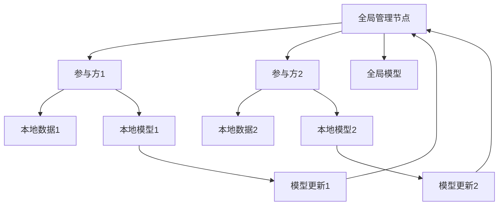

                 


# 设计基于联邦学习的跨行业信用评分系统

> 关键词：联邦学习，跨行业信用评分，数据隐私，模型协作，机器学习

> 摘要：随着数据隐私保护的日益严格和跨行业信用评估需求的增加，联邦学习作为一种新兴的技术，能够在保护数据隐私的前提下，实现跨行业的信用评分系统。本文将详细探讨如何基于联邦学习设计跨行业信用评分系统，包括其背景、核心概念、算法原理、系统架构、项目实现及未来展望。

---

## 第一章: 联邦学习与跨行业信用评分的背景

### 1.1 数据隐私与行业协作的挑战
在大数据时代，信用评分系统需要整合来自不同行业的数据，以提供更准确的信用评估结果。然而，数据隐私问题使得跨行业协作变得困难。传统的数据共享方式容易导致数据泄露，而联邦学习提供了一种在保护数据隐私的前提下进行模型训练的方法。

### 1.2 联邦学习的定义与核心思想
联邦学习（Federated Learning）是一种分布式机器学习技术，允许多个参与方在不共享原始数据的情况下，共同训练一个统一的模型。其核心思想是将模型的训练过程分散到数据源所在的本地设备或服务器，通过加密通信协议同步模型参数，最终形成一个全局模型。

### 1.3 跨行业信用评分的必要性
跨行业信用评分能够提供更全面的信用评估结果，例如整合银行、电商、社交网络等多方面的数据。然而，不同行业的数据可能分布在不同的机构中，如何在不共享数据的情况下进行联合建模，是联邦学习需要解决的核心问题。

---

## 第二章: 联邦学习的核心概念与联系

### 2.1 联邦学习的核心原理
#### 2.1.1 数据隐私保护
联邦学习通过局部加密、差分隐私等技术保护参与方的原始数据不被泄露。
#### 2.1.2 模型更新与同步
通过迭代更新模型参数，参与方仅共享模型更新的信息，而不共享原始数据。
#### 2.1.3 联邦学习的通信协议
设计高效的通信协议，确保模型更新的信息在传输过程中不被篡改或泄露。

### 2.2 联邦学习与信用评分的关系
#### 2.2.1 联邦学习如何提升信用评分的准确性
通过整合多行业的数据，联邦学习能够构建更全面的信用评估模型。
#### 2.2.2 联邦学习在信用评分中的应用场景
- 联合信用评分：整合银行、电商、社交等多行业的数据。
- 实时信用评估：通过联邦学习模型实时更新信用评分结果。

### 2.3 联邦学习的实体关系图
```mermaid
er
    actor: 参与方
    model: 联邦模型
    data: 数据集
    communication: 通信协议
    actor --> model: 提供数据
    model --> data: 加工数据
    model --> communication: 传递模型更新
```

---

## 第三章: 联邦学习的算法原理

### 3.1 联邦学习的算法流程
#### 3.1.1 数据预处理与模型初始化
- 数据清洗：去除无效数据，处理缺失值。
- 模型初始化：初始化全局模型参数。

#### 3.1.2 模型训练与更新
- 参与方本地训练：每个参与方在本地数据上训练模型，更新模型参数。
- 模型聚合：将所有参与方的模型更新聚合，得到新的全局模型。

#### 3.1.3 模型同步与评估
- 模型同步：将全局模型参数同步到所有参与方。
- 模型评估：评估全局模型的性能，如准确率、召回率等。

### 3.2 联邦学习的通信协议
#### 3.2.1 基于加密的通信
- 使用加密技术保护模型更新的传输过程。
- 使用数字签名验证数据完整性。

#### 3.2.2 基于差分隐私的模型更新
- 在模型更新过程中加入噪声，防止模型参数被逆向推断出原始数据。

### 3.3 联邦学习的数学模型

#### 3.3.1 模型更新公式
全局模型参数 $\theta$ 的更新公式为：
$$
\theta_{new} = \theta_{old} + \sum_{i=1}^{n} \Delta\theta_i
$$

其中，$\Delta\theta_i$ 是第 $i$ 个参与方的模型更新量。

#### 3.3.2 模型聚合公式
全局模型参数的聚合公式为：
$$
\theta_{global} = \frac{1}{n} \sum_{i=1}^{n} \theta_i
$$

其中，$\theta_i$ 是第 $i$ 个参与方的本地模型参数。

---

## 第四章: 跨行业信用评分系统的架构设计

### 4.1 系统功能设计
- 数据采集：从不同行业采集信用相关数据。
- 数据预处理：清洗和转换数据，确保数据一致性。
- 模型训练：基于联邦学习算法训练信用评分模型。
- 模型部署：将训练好的模型部署到实际业务场景中。

### 4.2 系统架构设计


### 4.3 系统接口设计
- `train_model()`: 初始化模型参数，启动联邦学习训练。
- `aggregate_updates()`: 聚合所有参与方的模型更新，更新全局模型。
- `evaluate_model()`: 评估全局模型的性能。

---

## 第五章: 项目实战与实现

### 5.1 环境安装
- 安装Python和必要的机器学习库（如TensorFlow、PyTorch）。
- 安装加密库（如Crypto）和差分隐私库（如dp-zoo）。

### 5.2 核心代码实现
```python
import numpy as np
from crypto import encrypt, decrypt

class FederatedLearner:
    def __init__(self, participants):
        self.participants = participants
        self.global_model = np.zeros_like(initial_model)

    def aggregate_updates(self, updates):
        return np.mean(updates, axis=0)

    def train(self, rounds):
        for _ in range(rounds):
            for participant in self.participants:
                # 每个参与方在本地训练模型
                local_update = participant.train(local_data)
                # 将模型更新加密后发送到管理节点
                encrypted_update = encrypt(local_update)
                self.global_model += encrypted_update
            # 模型聚合
            self.global_model = self.aggregate_updates(self.global_model)
```

### 5.3 代码解读与分析
- `FederatedLearner` 类负责管理全局模型和协调各参与方的训练过程。
- `train` 方法实现了联邦学习的迭代训练过程，每个参与方在本地训练模型并更新全局模型。

### 5.4 实际案例分析
假设我们有三个参与方，分别来自银行、电商和社交网络。每个参与方本地训练信用评分模型，通过加密通信协议将模型更新同步到全局模型，最终得到一个跨行业的信用评分模型。

---

## 第六章: 总结与展望

### 6.1 总结
本文详细探讨了基于联邦学习的跨行业信用评分系统的 design 和实现，介绍了联邦学习的核心概念、算法原理、系统架构和项目实战。通过联邦学习，我们可以在保护数据隐私的前提下，实现跨行业的信用评分系统。

### 6.2 未来展望
- 提高联邦学习的通信效率，减少模型更新的延迟。
- 支持更多种类的模型，如深度学习模型。
- 研究更高效的差分隐私技术，进一步保护数据隐私。

---

## 附录: 最佳实践与注意事项

- 数据隐私保护是联邦学习的核心，必须严格遵守相关法律法规。
- 在实际应用中，需要根据具体业务需求选择合适的联邦学习算法。
- 联邦学习的通信协议设计必须考虑网络延迟和带宽限制。

---

## 作者

作者：AI天才研究院/AI Genius Institute & 禅与计算机程序设计艺术 /Zen And The Art of Computer Programming

--- 

感谢您的阅读！如需进一步了解或交流，请随时联系！

