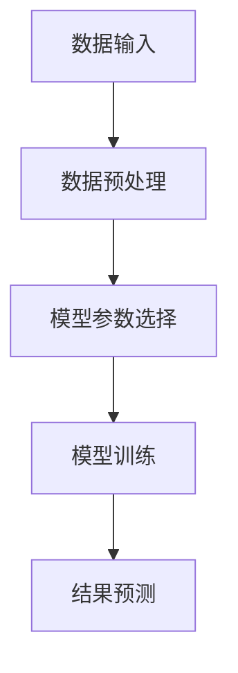
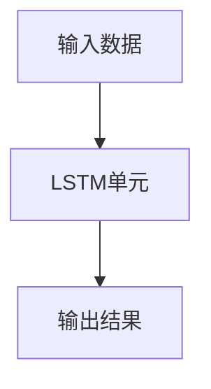
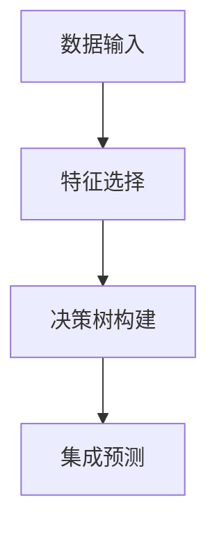
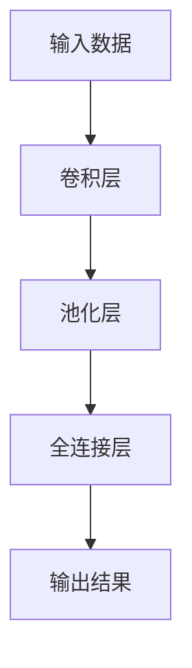
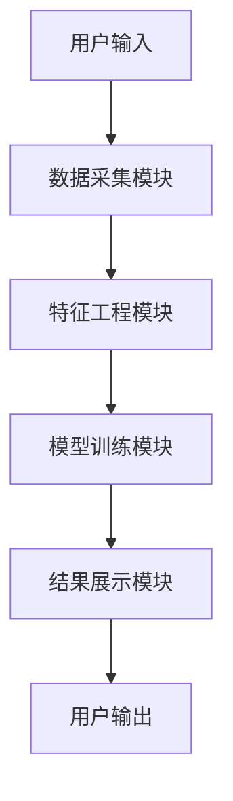

                 


# 设计智能化的企业信用违约损失率动态预测模型

**关键词**：信用违约、损失率预测、时间序列分析、机器学习、风险管理

**摘要**：本文详细探讨了设计智能化的企业信用违约损失率动态预测模型的方法和步骤。通过分析信用违约的基本概念、模型的核心原理、算法的选择与实现、系统的架构设计以及实际案例的应用，为读者提供了一套完整的解决方案。文章结合理论与实践，旨在帮助企业有效管理信用风险，提升损失率预测的准确性和及时性。

---

# 第一部分：企业信用违约损失率动态预测模型概述

## 第1章：信用违约与损失率的基本概念

### 1.1 信用违约的基本概念

#### 1.1.1 信用违约的定义
信用违约是指借款人在偿还债务过程中未能按照合同约定履行义务，导致债务违约的情况。这种违约可能涉及本金、利息或其他相关费用的拖欠。

#### 1.1.2 信用违约的类型
信用违约主要分为以下几种类型：
- **企业违约**：企业无法偿还债务。
- **个人违约**：个人借款人无法偿还贷款。
- **主权违约**：国家无法偿还国际债务。

#### 1.1.3 信用违约的影响因素
信用违约的影响因素包括：
- **经济环境**：如经济衰退、利率上升等。
- **企业财务状况**：如盈利能力下降、资产负债率高等。
- **市场风险**：如行业波动、供应链中断等。

### 1.2 损失率的定义与计算方法

#### 1.2.1 损失率的定义
损失率是指在信用违约发生时，实际损失金额与违约金额的比率。它反映了企业在违约情况下的实际损失程度。

#### 1.2.2 损失率的计算公式
损失率的计算公式如下：
$$\text{损失率} = \frac{\text{实际损失金额}}{\text{违约金额}} \times 100\%$$

#### 1.2.3 损失率的影响因素
- **违约类型**：不同类型的违约可能有不同的损失率。
- **担保情况**：担保的存在可以降低损失率。
- **回收率**：违约后通过回收抵押物或其他途径所能收回的金额。

### 1.3 信用违约损失率动态预测的背景与意义

#### 1.3.1 信用违约损失率预测的背景
随着全球经济的不确定性增加，企业面临的信用风险也在上升。及时准确地预测信用违约损失率，可以帮助企业更好地管理风险，制定应对策略。

#### 1.3.2 动态预测的意义
动态预测能够实时更新损失率的预测结果，考虑最新的市场信息和企业财务状况，提高预测的准确性和实用性。

#### 1.3.3 企业信用风险管理的重要性
有效的信用风险管理可以降低企业的财务损失，维护企业的信誉，保障企业的可持续发展。

### 1.4 本章小结
本章介绍了信用违约和损失率的基本概念，分析了信用违约的类型及其影响因素，探讨了损失率的计算方法和动态预测的背景与意义，为后续模型的设计奠定了基础。

---

## 第2章：企业信用违约损失率动态预测模型的核心概念

### 2.1 模型的核心要素

#### 2.1.1 信用风险
信用风险是指债权人因债务人违约而遭受损失的可能性。它是信用违约损失率预测的核心要素之一。

#### 2.1.2 违约概率
违约概率是指在一定时间内，债务人发生违约的可能性。它是信用风险评估的重要指标。

#### 2.1.3 损失率模型
损失率模型是根据历史数据和当前市场情况，预测未来信用违约损失率的数学模型。

### 2.2 模型的输入与输出

#### 2.2.1 输入变量
- **企业财务数据**：如收入、利润、资产负债率等。
- **市场数据**：如利率、经济指标等。
- **信用评级**：如穆迪、标普等评级机构的评级。

#### 2.2.2 输出变量
- **预测损失率**：模型输出的未来损失率预测值。
- **风险评估**：模型对企业的信用风险等级进行评估。

#### 2.2.3 模型的边界条件
- **数据范围**：模型适用的数据范围和时间跨度。
- **假设条件**：模型运行时的假设，如数据的完整性和准确性。

### 2.3 模型的核心原理

#### 2.3.1 时间序列分析
时间序列分析是一种基于历史数据预测未来趋势的方法。常用的模型包括ARIMA和LSTM。

#### 2.3.2 机器学习算法
机器学习算法通过训练数据，学习信用违约的特征，从而预测损失率。常用算法包括支持向量机（SVM）和随机森林（Random Forest）。

#### 2.3.3 统计模型
统计模型通过建立数学模型，分析变量之间的关系，预测损失率。常用模型包括线性回归和逻辑回归。

### 2.4 模型的优缺点对比

| 模型类型       | 优点                               | 缺点                               |
|----------------|------------------------------------|------------------------------------|
| 时间序列分析   | 基于历史数据，适合时间依赖性较强的数据 | 对非线性关系的捕捉能力较弱         |
| 机器学习算法   | 能够捕捉复杂非线性关系               | 对数据质量和数量要求较高           |
| 统计模型       | 解释性强，易于理解和应用             | 对复杂关系的捕捉能力有限           |

### 2.5 本章小结
本章详细阐述了模型的核心要素、输入输出、核心原理和优缺点，为后续模型的设计和实现提供了理论基础。

---

## 第3章：模型的算法原理与数学基础

### 3.1 时间序列分析方法

#### 3.1.1 ARIMA模型
ARIMA（自回归积分滑动平均模型）是一种常用的时间序列分析模型，适用于线性、平稳的时间序列数据。

##### ARIMA模型公式
$$ARIMA(p, d, q)$$
其中：
- \(p\) 表示自回归部分的阶数。
- \(d\) 表示差分的阶数。
- \(q\) 表示滑动平均部分的阶数。

##### ARIMA模型流程图


#### 3.1.2 LSTM网络
LSTM（长短期记忆网络）是一种基于循环神经网络的模型，适合处理时间序列数据中的长依赖关系。

##### LSTM网络公式
$$f(t) = \sigma(g(t))$$
其中，\(\sigma\) 是sigmoid函数，\(g(t)\) 是输入的线性变换。

##### LSTM网络流程图


### 3.2 机器学习算法

#### 3.2.1 支持向量机（SVM）
SVM通过构建超平面，将数据分成不同的类别，适用于分类和回归问题。

##### SVM回归公式
$$y = \text{sign}(w \cdot x + b)$$

#### 3.2.2 随机森林（Random Forest）
随机森林通过构建多个决策树，并集成预测结果，提高模型的准确性和鲁棒性。

##### 随机森林流程图


### 3.3 深度学习算法

#### 3.3.1 神经网络基础
神经网络通过多层感知机模拟人类大脑的神经网络，适用于复杂非线性关系的建模。

##### 神经网络公式
$$y = \sigma(w x + b)$$

#### 3.3.2 卷积神经网络（CNN）
CNN通过卷积操作提取数据的空间特征，适用于图像和时间序列数据的分析。

##### CNN流程图


### 3.4 模型的数学公式

#### 3.4.1 ARIMA模型公式
$$ARIMA(p, d, q)$$

#### 3.4.2 LSTM网络公式
$$f(t) = \sigma(g(t))$$

### 3.5 本章小结
本章详细介绍了模型的算法原理和数学基础，包括时间序列分析、机器学习算法和深度学习算法，为后续模型的实现提供了理论支持。

---

## 第4章：模型的系统分析与架构设计

### 4.1 系统功能设计

#### 4.1.1 数据采集模块
数据采集模块负责收集企业的财务数据、市场数据和信用评级等信息。

#### 4.1.2 特征工程模块
特征工程模块对采集的数据进行预处理和特征提取，为模型提供有效的输入。

#### 4.1.3 模型训练模块
模型训练模块利用训练数据，选择合适的算法，训练出预测模型。

#### 4.1.4 结果展示模块
结果展示模块将模型的预测结果以可视化的方式呈现，便于用户理解和应用。

### 4.2 系统架构设计

#### 4.2.1 分层架构
系统采用分层架构，包括数据层、业务逻辑层和表现层。

#### 4.2.2 微服务架构
系统采用微服务架构，各模块独立运行，提高系统的可扩展性和可维护性。

#### 4.2.3 数据流设计
数据流从数据源流向数据存储，经过数据处理后，进入模型训练模块，最终输出预测结果。

### 4.3 系统接口设计

#### 4.3.1 数据接口
数据接口用于数据的输入和输出，包括数据采集模块和数据存储模块。

#### 4.3.2 模型接口
模型接口用于模型的训练和预测，包括特征工程模块和模型训练模块。

#### 4.3.3 结果接口
结果接口用于结果的展示和输出，包括结果展示模块和用户界面。

### 4.4 系统交互流程图



### 4.5 本章小结
本章详细描述了系统的功能设计、架构设计和接口设计，通过流程图展示了系统的交互过程，为后续的实现提供了指导。

---

## 第5章：项目实战——企业信用违约损失率预测模型的实现

### 5.1 环境安装与配置

#### 5.1.1 安装Python
安装Python 3.8及以上版本，确保环境支持数据处理和机器学习库。

#### 5.1.2 安装依赖库
安装必要的依赖库，如Pandas、NumPy、Scikit-learn、Keras和TensorFlow。

```bash
pip install pandas numpy scikit-learn keras tensorflow
```

### 5.2 系统核心实现源代码

#### 5.2.1 数据采集模块
```python
import pandas as pd

def data_collection():
    # 从数据库中读取数据
    df = pd.read_csv('credit_data.csv')
    return df
```

#### 5.2.2 特征工程模块
```python
def feature_engineering(df):
    # 数据预处理
    df = df.dropna()
    df['违约损失率'] = df['违约损失率'].astype(float)
    return df
```

#### 5.2.3 模型训练模块
```python
from sklearn.ensemble import RandomForestRegressor
from sklearn.metrics import mean_squared_error

def model_training(df):
    # 划分训练集和测试集
    X = df.drop('违约损失率', axis=1)
    y = df['违约损失率']
    X_train, X_test, y_train, y_test = train_test_split(X, y, test_size=0.2)
    
    # 训练随机森林模型
    model = RandomForestRegressor()
    model.fit(X_train, y_train)
    
    # 模型评估
    y_pred = model.predict(X_test)
    mse = mean_squared_error(y_test, y_pred)
    print(f'MSE: {mse}')
    
    return model
```

#### 5.2.4 结果展示模块
```python
import matplotlib.pyplot as plt

def result_visualization(y_test, y_pred):
    plt.scatter(y_test, y_pred)
    plt.xlabel('真实损失率')
    plt.ylabel('预测损失率')
    plt.title('损失率预测结果')
    plt.show()
```

### 5.3 实际案例分析与详细解读

#### 5.3.1 数据来源与预处理
我们使用某企业的历史信用数据，包括财务数据、市场数据和信用评级等，进行数据清洗和特征提取。

#### 5.3.2 模型选择与训练
选择随机森林作为模型算法，利用训练数据进行模型训练，并评估模型的性能。

#### 5.3.3 结果分析与解读
通过混淆矩阵和回归系数，分析模型的预测准确性和特征的重要性，优化模型的性能。

### 5.4 本章小结
本章通过实际案例，详细介绍了模型的实现过程，包括环境配置、数据处理、模型训练和结果展示，为读者提供了实践指导。

---

## 第6章：最佳实践、小结与注意事项

### 6.1 最佳实践

#### 数据预处理
确保数据的完整性和准确性，进行特征工程，提取有用的特征。

#### 模型调优
通过交叉验证和网格搜索，优化模型的参数，提高预测性能。

#### 模型部署
将模型部署到生产环境，实时更新数据和模型，保持预测的准确性。

### 6.2 小结
本文详细介绍了企业信用违约损失率动态预测模型的设计与实现，从理论到实践，为读者提供了一套完整的解决方案。

### 6.3 注意事项

#### 数据隐私
保护企业的数据隐私，遵守相关法律法规。

#### 模型维护
定期更新模型，适应市场环境的变化，确保模型的有效性。

#### 风险控制
结合模型的预测结果，制定相应的风险控制策略，降低企业的信用风险。

### 6.4 拓展阅读
建议读者进一步阅读相关文献，如《信用风险建模与管理》和《时间序列分析与预测》。

---

## 作者

**作者：AI天才研究院/AI Genius Institute & 禅与计算机程序设计艺术 /Zen And The Art of Computer Programming**

---

以上是《设计智能化的企业信用违约损失率动态预测模型》的技术博客文章的完整内容，涵盖了从理论到实践的各个方面，为读者提供了详尽的指导和参考。

