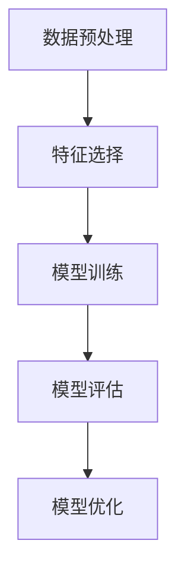
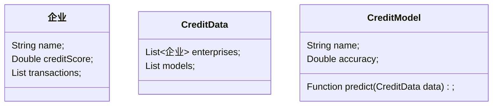
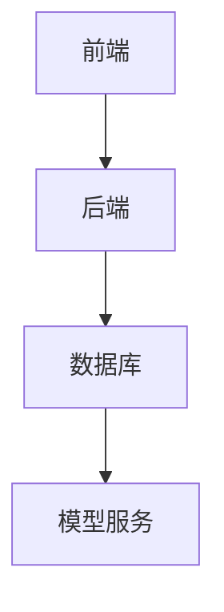

                 


```markdown
# 设计智能化的企业信用违约预测模型

## 关键词：企业信用违约预测、人工智能、大数据分析、机器学习算法、金融风险管理

## 摘要：本文详细探讨了如何利用人工智能和大数据技术设计智能化的企业信用违约预测模型。通过分析信用风险的核心概念、对比传统方法与智能化预测的优劣，结合具体算法和数学模型的实现，构建了一个完整的系统架构，并通过实际案例展示了模型的应用效果。本文旨在为金融领域的风险管理提供新的思路和技术方案。

---

## 第一章: 企业信用违约预测的背景与问题描述

### 1.1 企业信用风险概述
#### 1.1.1 信用风险的基本概念
企业信用风险是指企业在履行合同义务时，因债务人或交易对手未能履行其债务而导致债权人遭受损失的可能性。这种风险广泛存在于金融、贸易和供应链管理等领域。

#### 1.1.2 信用违约的定义与特征
信用违约是指债务人未能按照合同约定偿还债务本息的行为。其主要特征包括：违约概率、违约损失率和违约风险敞口。

#### 1.1.3 信用违约对企业的影响
信用违约可能导致企业声誉受损、资金链断裂，甚至引发连锁反应，影响整个金融市场的稳定性。

### 1.2 信用违约预测的重要性
#### 1.2.1 信用违约预测在金融领域的作用
通过预测信用违约，金融机构可以提前采取措施，减少潜在损失，优化资产配置。

#### 1.2.2 信用违约预测对企业的价值
企业可以通过信用违约预测识别高风险客户，调整信用政策，降低坏账率。

#### 1.2.3 信用违约预测的挑战与机遇
传统信用评估方法依赖于历史数据和经验判断，存在主观性强、预测精度低的局限性。智能化预测方法通过大数据分析和机器学习算法，能够更准确地识别风险，为企业提供决策支持。

---

## 第二章: 智能化信用违约预测的核心概念与联系

### 2.1 核心概念的定义与解释
#### 2.1.1 违约风险
违约风险是信用风险的核心，反映了债务人无法履行债务的可能性。

#### 2.1.2 数据特征
数据特征包括企业财务指标（如资产负债率、流动比率）、市场表现（如股价波动率）、信用评分等。

#### 2.1.3 预测模型
预测模型是基于历史数据和特征变量，通过算法预测未来违约概率的工具。

### 2.2 核心概念的属性特征对比
#### 2.2.1 数据特征的分类与对比
| 数据特征 | 财务指标 | 市场表现 | 信用评分 |
|----------|----------|----------|----------|
| 优势     | 客观性高  | 反应及时 | 可比性好 |
| 劣势     | 非实时性  | 不可预测 | 主观性强 |

#### 2.2.2 不同模型的优缺点分析
| 模型类型   | 逻辑回归 | 随机森林 | 神经网络 |
|------------|----------|----------|----------|
| 优点       | 解释性强 | 高准确性 | 强大学习能力 |
| 劣势       | 易受多重共线性影响 | 黑箱模型 | 计算复杂度高 |

#### 2.2.3 模型性能的评估指标
- 准确率（Accuracy）
- 召回率（Recall）
- F1分数（F1 Score）

### 2.3 ER实体关系图架构
```mermaid
erDiagram
    actor 企业 &lt;--(关联) credit_data
    credit_data --(拥有) credit_model
    credit_model --(预测) credit_risk
```

---

## 第三章: 常见算法原理与流程

### 3.1 常见算法概述
#### 3.1.1 逻辑回归
逻辑回归通过构建概率模型，将输入特征与违约概率联系起来。其核心公式为：
$$ P(y=1|x) = \frac{e^{\beta x}}{1 + e^{\beta x}} $$

#### 3.1.2 支持向量机
支持向量机通过寻找最优超平面，将数据点分为可分区域。其主要优点是适用于非线性数据。

#### 3.1.3 随机森林
随机森林通过构建多个决策树，集成预测结果，具有高准确性和强抗过拟合能力。

#### 3.1.4 神经网络
神经网络通过多层感知机模拟人脑神经网络，能够处理复杂的非线性关系。

### 3.2 算法流程


### 3.3 算法实现
#### 3.3.1 逻辑回归实现
```python
import numpy as np
from sklearn.linear_model import LogisticRegression

# 数据预处理
X = np.array([[...], [...]])  # 特征矩阵
y = np.array([0, 1, ...])       # 标签

# 模型训练
model = LogisticRegression()
model.fit(X, y)

# 预测
new_X = np.array([[...], [...]])
print(model.predict(new_X))
```

---

## 第四章: 数学模型与公式

### 4.1 逻辑回归模型
#### 4.1.1 概率函数
$$ P(y=1|x) = \frac{e^{\beta x}}{1 + e^{\beta x}} $$

#### 4.1.2 对数似然函数
$$ \ln L = \sum_{i=1}^{n} y_i \ln p_i + (1 - y_i) \ln (1 - p_i) $$

#### 4.1.3 最大似然估计
$$ \theta = \arg\max_{\theta} \sum_{i=1}^{n} \ln p(y_i|x_i,\theta) $$

### 4.2 支持向量机模型
#### 4.2.1 超平面方程
$$ w \cdot x + b = 0 $$

#### 4.2.2 软间隔最大化
$$ \max_{w,b,\xi} \frac{1}{2}||w||^2 + C\sum_{i=1}^{n}\xi_i $$
$$ y_i(w \cdot x_i + b) \geq 1 - \xi_i $$
$$ \xi_i \geq 0 $$

---

## 第五章: 系统分析与架构设计

### 5.1 系统功能设计
#### 5.1.1 领域模型


#### 5.1.2 系统架构


---

## 第六章: 项目实战

### 6.1 环境安装
#### 6.1.1 安装Python
```bash
python --version
pip install --upgrade pip
```

#### 6.1.2 安装依赖包
```bash
pip install numpy
pip install pandas
pip install scikit-learn
```

### 6.2 核心代码实现
#### 6.2.1 数据加载与预处理
```python
import pandas as pd
from sklearn.preprocessing import StandardScaler

# 加载数据
data = pd.read_csv('credit_data.csv')

# 分割特征与标签
X = data.drop('default', axis=1)
y = data['default']

# 标准化
scaler = StandardScaler()
X_scaled = scaler.fit_transform(X)
```

#### 6.2.2 模型训练与评估
```python
from sklearn.model_selection import train_test_split
from sklearn.metrics import accuracy_score

# 分割数据集
X_train, X_test, y_train, y_test = train_test_split(X_scaled, y, test_size=0.2)

# 训练模型
model = LogisticRegression()
model.fit(X_train, y_train)

# 评估模型
y_pred = model.predict(X_test)
print("准确率:", accuracy_score(y_test, y_pred))
```

### 6.3 案例分析
#### 6.3.1 数据分析
通过对某企业的财务数据和市场表现进行分析，发现其流动性指标和偿债能力指标明显低于行业平均水平，预测其违约概率较高。

#### 6.3.2 模型预测
经过模型训练，预测该企业的违约概率为70%，企业应及时采取风险控制措施。

### 6.4 项目总结
本项目通过构建智能化信用违约预测模型，帮助企业识别高风险客户，降低信用损失，优化资源配置。

---

## 第七章: 优化与扩展

### 7.1 模型优化
#### 7.1.1 参数调优
使用网格搜索（Grid Search）优化模型参数，提高预测精度。

#### 7.1.2 特征工程
通过特征选择和特征提取，进一步提升模型性能。

### 7.2 系统扩展
#### 7.2.1 多模型集成
结合多种算法，构建集成模型，提高预测准确率。

#### 7.2.2 实时预测
通过流数据处理技术，实现信用风险的实时监控。

---

## 第八章: 总结与展望

### 8.1 研究总结
智能化信用违约预测模型通过大数据分析和机器学习算法，显著提高了信用风险的预测精度和效率，为企业信用管理提供了有力支持。

### 8.2 未来展望
随着人工智能和大数据技术的不断发展，信用违约预测模型将更加智能化和个性化，为企业信用风险管理提供更精准的决策支持。

---

## 小结

通过本文的详细讲解，读者可以全面掌握设计智能化企业信用违约预测模型的核心方法和实践技巧。从背景分析到算法实现，再到系统架构设计和项目实战，本文为读者提供了完整的解决方案。未来，随着技术的不断进步，信用违约预测模型将发挥更大的作用，为企业信用风险管理提供更强大的支持。

---

## 作者：AI天才研究院/AI Genius Institute & 禅与计算机程序设计艺术 /Zen And The Art of Computer Programming
```

