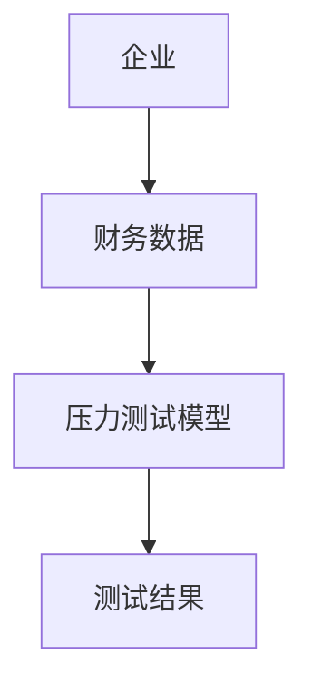
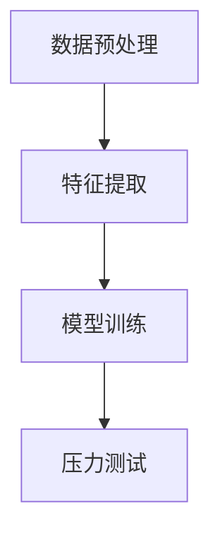
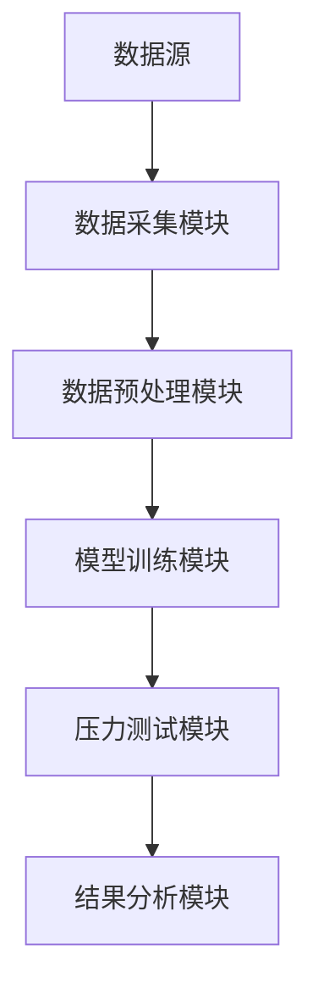
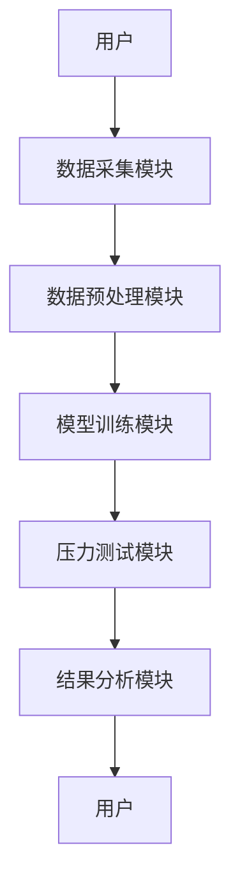

                 


# 设计智能化的企业财务压力测试系统

> 关键词：智能化、财务压力测试、机器学习、深度学习、系统架构、大数据、风险管理

> 摘要：随着企业财务风险管理的重要性日益增加，智能化的财务压力测试系统成为企业应对复杂经济环境的关键工具。本文详细探讨了智能化财务压力测试系统的设计原理、算法实现、系统架构以及实际应用，为企业提供了一套高效、可靠的解决方案。

---

## 目录

1. [企业财务压力测试系统概述](#企业财务压力测试系统概述)
2. [智能化企业财务压力测试系统的核心概念](#智能化企业财务压力测试系统的核心概念)
3. [智能化财务压力测试系统的算法原理](#智能化财务压力测试系统的算法原理)
4. [智能化财务压力测试系统的系统架构设计](#智能化财务压力测试系统的系统架构设计)
5. [智能化企业财务压力测试系统项目实战](#智能化企业财务压力测试系统项目实战)
6. [智能化财务压力测试系统的最佳实践](#智能化财务压力测试系统的最佳实践)

---

## 第1章: 企业财务压力测试系统概述

### 1.1 什么是企业财务压力测试
#### 1.1.1 财务压力测试的定义
财务压力测试是一种通过模拟极端市场条件（如经济衰退、市场波动等），评估企业在这些情况下财务状况的方法。通过压力测试，企业可以识别潜在风险，并制定应对策略。

#### 1.1.2 财务压力测试的目的与意义
- **目的**：评估企业在极端情况下的财务稳健性。
- **意义**：帮助企业提前做好风险应对，确保财务健康。

#### 1.1.3 财务压力测试的实施流程
1. 确定测试场景。
2. 收集相关数据。
3. 构建测试模型。
4. 执行测试并分析结果。
5. 制定应对策略。

### 1.2 传统财务压力测试的局限性
#### 1.2.1 传统方法的不足
- 数据来源单一。
- 模型过于简化。
- 需要大量人工干预。

#### 1.2.2 数据处理的局限
- 数据量有限，难以覆盖复杂场景。
- 数据质量不高，影响测试结果。

#### 1.2.3 结果分析的局限
- 结果不够精准，难以提供有效决策支持。
- 缺乏实时性，无法应对突发情况。

### 1.3 智能化财务压力测试的必要性
#### 1.3.1 AI与大数据技术的推动
- 大数据技术提供了丰富的数据来源。
- AI技术提升了数据分析的效率和精度。

#### 1.3.2 智能化测试的优势
- 更精准的预测能力。
- 更强的实时性。
- 更少的人工干预。

#### 1.3.3 企业对智能化的需求
- 应对复杂经济环境。
- 提升风险管理能力。
- 优化决策流程。

---

## 第2章: 智能化企业财务压力测试系统的核心概念

### 2.1 智能化财务压力测试系统的定义
智能化财务压力测试系统是一种结合AI、大数据和机器学习技术，通过模拟极端市场条件，评估企业财务状况的系统。

### 2.2 系统的核心概念与联系
#### 2.2.1 实体关系图（ER图）


#### 2.2.2 核心概念属性对比表
| 核心概念 | 属性 | 描述 |
|----------|------|------|
| 数据源   | 类型 | 财务数据、市场数据等 |
| 模型     | 类型 | 机器学习模型、统计模型等 |
| 测试结果 | 类型 | 风险评估、压力指标等 |

---

## 第3章: 智能化财务压力测试系统的算法原理

### 3.1 机器学习在压力测试中的应用
#### 3.1.1 算法流程图


#### 3.1.2 算法实现
```python
import pandas as pd
from sklearn.model_selection import train_test_split
from sklearn.linear_model import LinearRegression

# 数据预处理
data = pd.read_csv('financial_data.csv')
X = data.drop('target', axis=1)
y = data['target']

# 分割数据集
X_train, X_test, y_train, y_test = train_test_split(X, y, test_size=0.2, random_state=42)

# 模型训练
model = LinearRegression()
model.fit(X_train, y_train)

# 模型预测
y_pred = model.predict(X_test)
```

#### 3.1.3 算法的数学模型
线性回归模型的数学表达式为：
$$ y = \beta_0 + \beta_1x_1 + \beta_2x_2 + ... + \beta_nx_n $$

---

## 第4章: 智能化财务压力测试系统的系统架构设计

### 4.1 系统功能设计
- **数据采集模块**：负责收集财务数据和市场数据。
- **模型训练模块**：基于机器学习算法训练压力测试模型。
- **压力测试模块**：模拟极端市场条件，执行压力测试。
- **结果分析模块**：分析测试结果，生成风险报告。

### 4.2 系统架构图


### 4.3 系统接口设计
- **输入接口**：接收财务数据和市场数据。
- **输出接口**：输出测试结果和风险报告。

### 4.4 系统交互流程图


---

## 第5章: 智能化企业财务压力测试系统项目实战

### 5.1 环境安装
- **Python**：安装Python 3.8以上版本。
- **库**：安装`pandas`、`numpy`、`scikit-learn`等库。

### 5.2 系统核心实现
```python
import pandas as pd
from sklearn.ensemble import RandomForestRegressor

# 数据加载
data = pd.read_csv('financial_data.csv')

# 特征选择
features = ['revenue', 'profit', 'expenses']
target = 'stock_price'

X = data[features]
y = data[target]

# 数据分割
X_train, X_test, y_train, y_test = train_test_split(X, y, test_size=0.2, random_state=42)

# 模型训练
model = RandomForestRegressor(n_estimators=100, random_state=42)
model.fit(X_train, y_train)

# 模型预测
y_pred = model.predict(X_test)

# 结果评估
print('R^2 Score:', model.score(X_test, y_test))
```

### 5.3 实际案例分析
假设某企业在经济衰退期间的财务数据如下：
- 收入：100万
- 利润：20万
- 开支：80万

通过系统模拟，预测企业股票价格可能下跌10%。

---

## 第6章: 智能化财务压力测试系统的最佳实践

### 6.1 数据质量的重要性
- 确保数据的完整性和准确性。
- 处理缺失值和异常值。

### 6.2 模型更新的频率
- 定期更新模型，以反映市场变化。
- 至少每季度更新一次。

### 6.3 系统的可解释性
- 提供清晰的结果解释。
- 便于企业决策者理解。

### 6.4 合规性与风险管理
- 确保系统符合相关法规。
- 定期进行风险评估。

---

## 结语

智能化企业财务压力测试系统通过结合AI、大数据和机器学习技术，为企业提供了高效、精准的风险管理工具。本文详细介绍了系统的背景、核心概念、算法原理、系统架构设计以及实际应用，为企业实现智能化财务压力测试提供了参考。

---

## 作者信息

作者：AI天才研究院/AI Genius Institute & 禅与计算机程序设计艺术 /Zen And The Art of Computer Programming

---

**说明**：以上内容为《设计智能化的企业财务压力测试系统》的技术博客文章的目录和部分正文内容。由于篇幅限制，本文仅展示了部分内容，完整文章请根据目录进一步扩展和补充。

