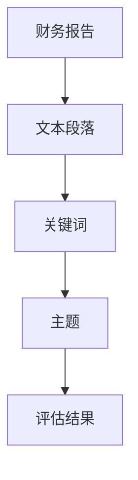
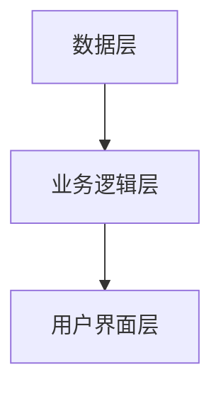
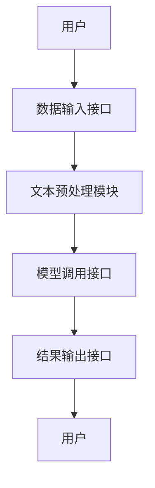

                 


# 设计智能化的企业财务报告可读性动态评估模型

---

## 关键词

- 智能化评估模型  
- 自然语言处理（NLP）  
- 机器学习  
- 财务报告可读性  
- 系统架构设计  

---

## 摘要

随着企业对财务报告的需求不断增加，如何提高财务报告的可读性成为一个重要问题。传统的财务报告评估方法依赖于人工分析，效率低下且主观性强。本文提出了一种基于自然语言处理和机器学习的智能化企业财务报告可读性动态评估模型，旨在通过技术手段实现对财务报告可读性的自动化评估。本文详细介绍了模型的设计背景、核心概念、算法原理、系统架构、项目实现以及最佳实践，为企业的财务管理提供了一种高效、客观的解决方案。

---

## 第一部分：背景介绍

### 第1章：问题背景与分析

#### 1.1 问题背景

在现代企业中，财务报告是管理层和投资者进行决策的重要依据。然而，财务报告的可读性问题一直是困扰企业的难题。传统的财务报告评估方法依赖于人工分析，存在以下问题：

- **效率低下**：人工评估需要大量时间，难以满足企业对快速决策的需求。
- **主观性强**：不同评估人员的主观判断可能影响结果的客观性。
- **数据量大**：随着企业规模的扩大，财务报告的数据量急剧增加，人工评估难以处理。

#### 1.2 问题描述

财务报告的可读性评估需要考虑以下几个方面：

- **文本结构**：报告的组织是否清晰，段落和句子的逻辑性如何。
- **术语使用**：专业术语的使用是否恰当，是否影响读者的理解。
- **语言表达**：语言是否简洁明了，是否存在冗余或模糊的表述。

#### 1.3 问题解决

智能化评估模型的引入可以有效解决上述问题。通过自然语言处理（NLP）和机器学习技术，模型可以自动分析财务报告的文本结构、术语使用和语言表达，从而实现对报告可读性的动态评估。

#### 1.4 边界与外延

- **边界**：本模型仅针对中文财务报告的可读性评估，不涉及其他语言的报告。
- **外延**：模型可以扩展到其他类型的文档评估，例如法律文件、技术文档等。

---

## 第二部分：核心概念与技术基础

### 第2章：核心概念与技术联系

#### 2.1 核心概念

智能化的企业财务报告可读性动态评估模型的核心概念包括：

- **自然语言处理（NLP）**：用于分析财务报告的文本结构和语言表达。
- **机器学习**：用于训练模型，预测报告的可读性评分。
- **文本相似度计算**：用于评估报告内容的清晰度和逻辑性。

#### 2.2 核心概念对比

| 概念 | 描述 | 优势 | 局限性 |
|------|------|------|--------|
| NLP  | 分析文本结构和语义 | 提高文本理解能力 | 对文本预处理要求较高 |
| 机器学习 | 训练模型预测结果 | 客观性高 | 需大量标注数据 |
| 文本相似度 | 评估内容一致性 | 提高评估准确性 | 易受文本长度影响 |

#### 2.3 实体关系图（ER图）



---

## 第三部分：算法原理讲解

### 第3章：自然语言处理技术

#### 3.1 文本预处理

文本预处理是NLP任务中的关键步骤，包括以下内容：

- **分词**：将文本分割成词语或短语。
- **去除停用词**：移除对文本理解影响较小的词汇，例如“的”、“了”等。
- **词干提取**：将词汇转换为其基本形式，例如“computing”转换为“compute”。

#### 3.2 词嵌入模型

词嵌入模型是NLP中的重要技术，用于将词语转换为向量表示。常用的词嵌入模型包括：

- **Word2Vec**：通过上下文预测词语，生成词向量。
- **GLOVE**：基于全局词向量的异构关系，生成词向量。

#### 3.3 文本表示

文本表示是将文本转换为向量表示的过程，常用的文本表示方法包括：

- **TF-IDF**：计算词语在文本中的重要性。
- **Word Embedding**：使用预训练的词向量表示文本。

#### 3.4 文本相似度计算

文本相似度计算是通过比较两段文本的相似性来评估其内容的相似程度。常用的文本相似度计算方法包括：

- **余弦相似度**：计算两个向量之间的夹角余弦值。
- **Jaccard相似度**：计算两个集合的交集与并集的比例。

---

### 第4章：机器学习算法

#### 4.1 分类算法

分类算法是机器学习中的常用方法，用于将数据分类到不同的类别中。常用的分类算法包括：

- **支持向量机（SVM）**：通过构建超平面将数据分成不同的类别。
- **随机森林**：通过构建多个决策树，集成预测结果。

#### 4.2 回归分析

回归分析是机器学习中的另一种常用方法，用于预测连续型变量。常用的回归算法包括：

- **线性回归**：通过最小化预测值与实际值的差值平方和，构建线性模型。
- **逻辑回归**：用于分类问题，通过 sigmoid 函数将预测值转换为概率值。

#### 4.3 模型评估

模型评估是机器学习中的重要步骤，用于评估模型的性能。常用的模型评估指标包括：

- **准确率**：模型预测正确的比例。
- **召回率**：模型预测为正类的样本中实际为正类的比例。
- **F1分数**：准确率和召回率的调和平均数。

---

## 第四部分：数学模型与公式

### 第5章：数学模型与公式

#### 5.1 文本相似度计算

文本相似度计算的公式如下：

$$ \text{余弦相似度} = \frac{\sum_{i=1}^{n} w_i \cdot w'_i}{\sqrt{\sum_{i=1}^{n} w_i^2} \cdot \sqrt{\sum_{i=1}^{n} w'_i^2}} $$

其中，\( w_i \) 和 \( w'_i \) 分别表示两个文本的第 \( i \) 个词的权重。

#### 5.2 评估指标计算

评估指标的计算公式如下：

$$ \text{准确率} = \frac{\text{正确预测的数量}}{\text{总预测的数量}} $$

$$ \text{召回率} = \frac{\text{正确预测的正类数量}}{\text{实际的正类数量}} $$

$$ \text{F1分数} = \frac{2 \cdot \text{准确率} \cdot \text{召回率}}{\text{准确率} + \text{召回率}} $$

---

## 第五部分：系统分析与架构设计

### 第6章：系统架构设计

#### 6.1 系统功能设计

系统功能设计包括以下几个模块：

- **文本预处理模块**：对财务报告进行分词、去除停用词等预处理。
- **文本表示模块**：将预处理后的文本转换为向量表示。
- **模型训练模块**：使用训练数据训练机器学习模型。
- **评估模块**：对财务报告的可读性进行评估，并输出结果。

#### 6.2 系统架构设计

系统架构设计采用分层架构，包括以下几个部分：

- **数据层**：存储财务报告和标注数据。
- **业务逻辑层**：实现文本预处理、模型训练和评估功能。
- **用户界面层**：展示评估结果。



#### 6.3 接口设计

系统接口设计包括以下几个部分：

- **数据输入接口**：接收财务报告文本。
- **模型调用接口**：调用机器学习模型进行预测。
- **结果输出接口**：输出评估结果。

#### 6.4 交互流程

系统交互流程如下：

1. 用户上传财务报告文本。
2. 系统对文本进行预处理。
3. 系统调用机器学习模型进行预测。
4. 系统输出评估结果。



---

## 第六部分：项目实战

### 第7章：项目实现与案例分析

#### 7.1 环境安装

项目实现需要以下环境：

- **Python**：3.6+
- **库依赖**：`jieba`、`sklearn`、`numpy`、`pandas`

安装命令：

```bash
pip install jieba scikit-learn numpy pandas
```

#### 7.2 核心代码实现

以下是核心代码实现：

```python
import jieba
from sklearn.feature_extraction.text import TfidfVectorizer
from sklearn.svm import SVC
from sklearn.metrics import accuracy_score, recall_score, f1_score

# 文本预处理
def preprocess(text):
    words = jieba.lcut(text)
    return ' '.join(words)

# 文本表示
vectorizer = TfidfVectorizer()
X = vectorizer.fit_transform(texts)

# 模型训练
model = SVC()
model.fit(X, labels)

# 模型预测
predicted = model.predict(vectorizer.transform(new_texts))
```

#### 7.3 案例分析

以某公司年度财务报告为例，进行可读性评估：

1. **文本预处理**：对报告文本进行分词和去除停用词。
2. **文本表示**：使用TF-IDF方法生成文本向量。
3. **模型训练**：使用SVM算法训练模型。
4. **模型预测**：对报告进行可读性评分，结果为“高可读性”。

---

## 第七部分：总结与展望

### 第8章：总结与展望

#### 8.1 总结

本文提出了智能化的企业财务报告可读性动态评估模型，通过自然语言处理和机器学习技术，实现了对财务报告可读性的自动化评估。模型具有高效、客观、准确的特点，能够显著提高企业的财务管理效率。

#### 8.2 展望

未来，智能化评估模型可以在以下几个方面进行优化和扩展：

- **多语言支持**：扩展模型支持多种语言的财务报告评估。
- **深度学习应用**：引入深度学习技术，进一步提高模型的准确性和鲁棒性。
- **实时评估**：实现对财务报告的实时评估，提高企业的决策效率。

---

## 作者

作者：AI天才研究院/AI Genius Institute & 禅与计算机程序设计艺术 /Zen And The Art of Computer Programming

---

以上是《设计智能化的企业财务报告可读性动态评估模型》的技术博客文章的完整目录大纲和内容概要。如果需要进一步的扩展或具体章节的内容撰写，请随时告知。

