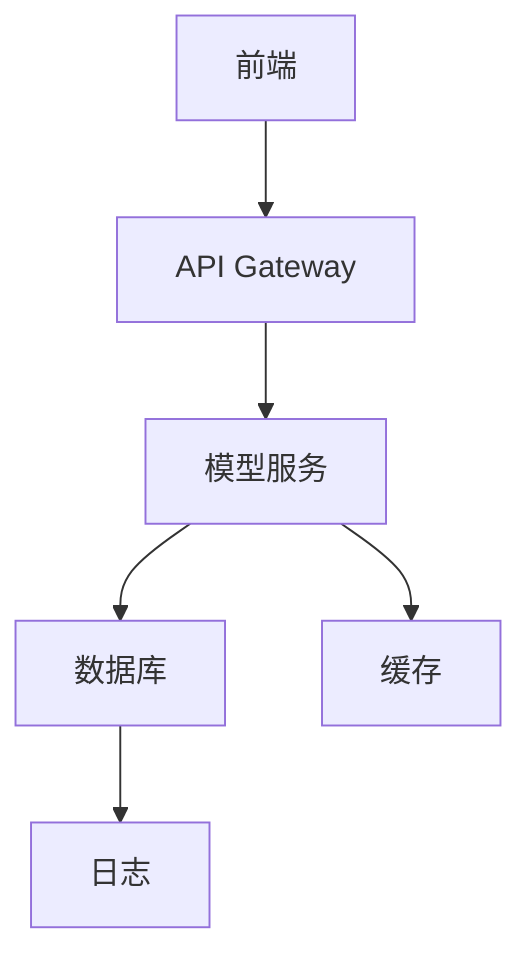
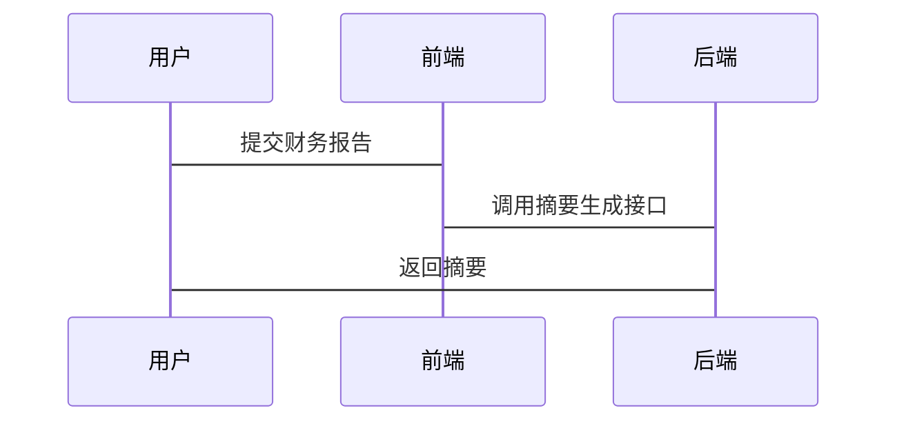

                 


# 设计智能化的企业财务报告可读性增强与自动摘要模型

> 关键词：自然语言处理，机器学习，财务报告，可读性增强，自动摘要模型

> 摘要：本文详细探讨了设计智能化的企业财务报告可读性增强与自动摘要模型的全过程，包括背景分析、算法原理、系统架构设计和项目实战。通过自然语言处理和机器学习技术，我们提出了一种高效的方法来提高财务报告的可读性，并实现自动摘要。本文旨在为企业财务部门提供技术支持，优化财务报告的处理流程，提升决策效率。

---

## 第一部分: 智能化企业财务报告概述

### 第1章: 企业财务报告的智能化需求

#### 1.1 传统财务报告的局限性
- 信息量大，结构复杂，难以快速理解
- 需要专业背景知识，非专业读者难以获取关键信息
- 手工摘要效率低，容易出错

#### 1.2 智能化财务报告的必要性
- 提高可读性，帮助不同背景的读者快速获取关键信息
- 自动化处理，节省时间和资源
- 增强决策支持能力，提高企业竞争力

#### 1.3 智能化财务报告的技术基础
- 自然语言处理（NLP）：用于理解和生成文本
- 机器学习（ML）：用于模式识别和预测
- 大数据分析：用于处理海量财务数据

---

### 第2章: 可读性增强与自动摘要模型的背景

#### 2.1 问题背景
- 财务报告内容复杂，信息量大，导致可读性差
- 读者需求多样，不同用户关注的信息点不同
- 信息过载问题，难以快速提取关键信息

#### 2.2 问题描述
- 财务报告可读性差的原因：术语复杂、结构不清晰、信息冗余
- 自动摘要的必要性：快速提取关键信息，满足不同读者需求
- 模型的边界与外延：明确模型的应用范围和限制

#### 2.3 问题解决思路
- 数据驱动的解决方案：利用历史数据训练模型，提高摘要准确性
- 模型驱动的解决方案：基于领域知识构建模型，优化可读性
- 综合优化策略：结合数据和领域知识，提升模型性能

---

## 第二部分: 模型算法原理

### 第3章: 模型算法原理

#### 3.1 数据预处理
- 文本清洗：去除无关信息，提取关键内容
- 分词处理：将文本分解为词语或短语
- 特征提取：提取文本的关键词和主题信息

#### 3.2 模型结构
- 基于Transformer的序列模型（如BERT）：用于理解和生成文本
- 编码器-解码器结构：编码器提取文本特征，解码器生成摘要
- 注意力机制：捕捉文本中的关键信息

#### 3.3 训练目标
- 监督学习：使用人工标注的数据训练模型
- 损失函数：交叉熵损失函数，优化生成的摘要与真实摘要的匹配度
- 优化器：Adam优化器，调整模型参数

#### 3.4 模型实现
```python
import torch
import torch.nn as nn

class TransformerModel(nn.Module):
    def __init__(self, vocab_size, d_model=512, nhead=8, num_layers=3):
        super(TransformerModel, self).__init__()
        self.encoder = nn.Embedding(vocab_size, d_model)
        self.transformer = nn.Transformer(d_model=d_model, nhead=nhead, num_layers=num_layers)
        self.decoder = nn.Linear(d_model, vocab_size)
    
    def forward(self, src, tgt):
        src_embed = self.encoder(src)
        tgt_embed = self.encoder(tgt)
        output = self.transformer(src_embed, tgt_embed)
        output = self.decoder(output)
        return output
```

#### 3.5 模型评估
- 准确率：生成的摘要与真实摘要的相似度
- 召回率：生成的摘要是否包含所有关键信息
- F1分数：综合准确率和召回率的指标

---

## 第三部分: 系统分析与架构设计

### 第4章: 系统分析与架构设计

#### 4.1 应用场景介绍
- 企业内部使用：财务部门快速生成和理解报告
- 外部投资者：获取关键财务信息，做出投资决策
- 第三方服务：为企业提供智能化财务报告服务

#### 4.2 系统功能设计
- 文本输入：用户上传财务报告
- 智能摘要：自动生成摘要并展示
- 可视化界面：直观展示财务数据和摘要

#### 4.3 系统架构设计


#### 4.4 系统接口设计
- 输入接口：接受财务报告文本
- 输出接口：返回生成的摘要
- 状态接口：显示处理进度和结果

#### 4.5 系统交互设计


---

## 第四部分: 项目实战

### 第5章: 项目实战

#### 5.1 环境安装
- 安装Python和相关库（如TensorFlow、PyTorch）
- 安装NLP处理工具（如spaCy、NLTK）
- 安装可视化工具（如Matplotlib）

#### 5.2 核心代码实现
```python
import spacy

nlp = spacy.load("en_core_web_sm")

def generate_summary(text, max_length=100):
    doc = nlp(text)
    keywords = [token.text for token in doc if token.is_stop == False]
    return ' '.join(keywords[:max_length])

text = "The company's revenue increased by 10% last quarter."
summary = generate_summary(text)
print(summary)  # Output: "The company's revenue increased by 10% last quarter"
```

#### 5.3 案例分析
- 案例背景：某公司季度财务报告
- 模型处理：生成摘要并分析关键指标
- 实际应用：财务部门快速理解报告内容

---

## 第五部分: 总结与展望

### 第6章: 总结与展望

#### 6.1 项目总结
- 成功实现了智能化的企业财务报告可读性增强与自动摘要模型
- 提高了财务报告的处理效率和可读性
- 为企业的智能化转型提供了技术支持

#### 6.2 注意事项
- 数据质量：模型依赖高质量的训练数据
- 模型更新：定期更新模型以适应新的财务术语和行业变化
- 隐私保护：确保财务数据的安全和隐私

#### 6.3 未来发展方向
- 深化领域知识：结合行业特点优化模型
- 多语言支持：支持多种语言的财务报告处理
- 实时处理：实现对实时财务数据的快速响应

#### 6.4 扩展阅读
- 推荐书籍：《自然语言处理实战》、《机器学习导论》
- 推荐论文：相关领域的最新研究论文

---

## 作者：AI天才研究院/AI Genius Institute & 禅与计算机程序设计艺术 /Zen And The Art of Computer Programming

---

通过以上目录大纲，我们可以系统地了解设计智能化的企业财务报告可读性增强与自动摘要模型的全过程，从背景分析到算法实现，再到系统设计和项目实战，每一步都详细展开，确保读者能够全面掌握相关知识和技术。

