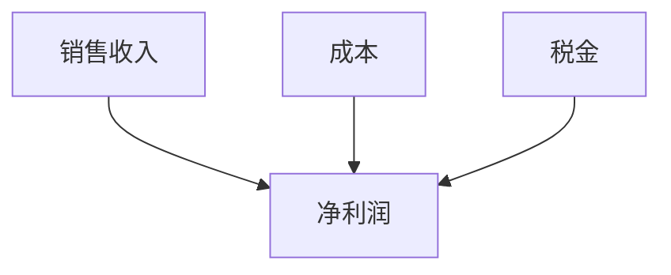
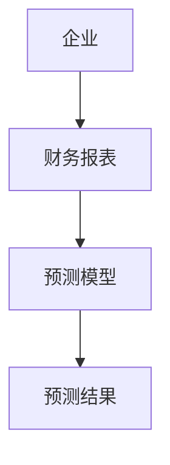
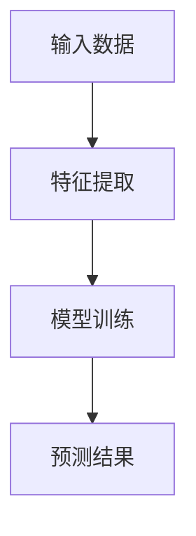
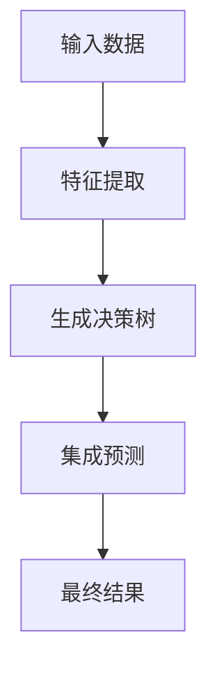
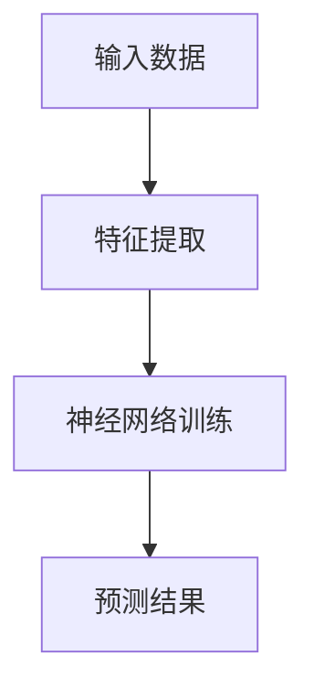
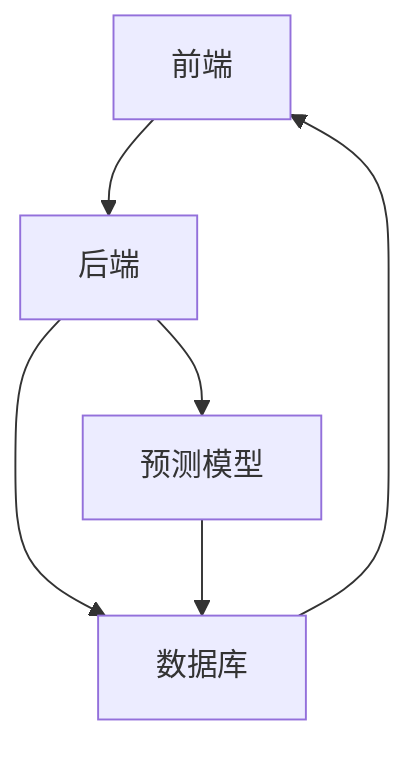

                 


# 设计智能化的企业财务报表预测模型

> 关键词：智能化财务预测，企业财务报表，人工智能，预测模型，机器学习

> 摘要：本文详细探讨了如何利用人工智能技术设计智能化的企业财务报表预测模型。通过分析财务数据的特征，结合多种机器学习算法，构建高效的预测模型，并通过系统架构设计和项目实战，展示了如何实现智能化财务预测。本文旨在为企业提供一套完整的解决方案，帮助其优化财务管理流程，提升决策效率。

---

# 第1章: 智能化财务预测的背景与重要性

## 1.1 企业财务报表预测的背景

### 1.1.1 传统财务预测的局限性

传统财务预测主要依赖于财务人员的经验和简单的统计方法，这种方法存在以下局限性：
- 数据处理能力有限：传统方法难以处理海量数据，尤其是非结构化数据。
- 预测精度不足：缺乏对复杂市场变化的敏感性，预测结果准确性较低。
- 计算效率低下：人工分析耗时较长，难以满足实时预测的需求。

### 1.1.2 数据驱动的财务预测需求

随着企业数据量的激增，数据驱动的财务预测成为必然趋势。企业需要通过分析销售、成本、利润等关键指标，预测未来的财务状况。数据驱动预测的优势在于：
- 提高预测精度：利用大数据和机器学习算法，捕捉更多潜在规律。
- 提升计算效率：自动化处理数据，缩短预测周期。
- 优化决策过程：基于实时数据，提供更精准的财务建议。

### 1.1.3 人工智能在财务预测中的应用潜力

人工智能技术，尤其是机器学习和深度学习，在财务预测中的应用潜力巨大。AI可以通过分析历史财务数据、市场趋势和外部经济指标，构建预测模型，帮助企业做出更明智的财务决策。

---

## 1.2 智能化财务预测的核心概念

### 1.2.1 智能化预测的定义与特点

智能化财务预测是指利用人工智能技术，通过分析历史财务数据和外部信息，自动构建预测模型，并生成预测结果的过程。其特点包括：
- 数据驱动：基于大量数据进行分析和建模。
- 自动化：从数据预处理到模型训练，整个过程高度自动化。
- 高精度：通过复杂的算法，提升预测的准确性。

### 1.2.2 企业财务报表预测的关键要素

企业财务报表预测的关键要素包括：
1. **预测目标**：明确预测的具体指标，如销售收入、净利润等。
2. **数据来源**：包括历史财务数据、市场数据和行业趋势。
3. **模型选择**：选择合适的机器学习算法，如线性回归、随机森林等。
4. **模型评估**：通过交叉验证等方法，评估模型的性能。

### 1.2.3 智能化预测与传统预测的对比分析

以下是智能化预测与传统预测的对比分析：

| 对比维度       | 传统预测                         | 智能化预测                     |
|----------------|----------------------------------|-------------------------------|
| 数据处理能力   | 有限，难以处理海量数据           | 强大，支持大数据分析           |
| 预测精度       | 较低，依赖人工经验               | 较高，利用复杂算法捕捉规律     |
| 计算效率       | 低，依赖人工分析                 | 高，自动化处理                |
| 决策支持       | 基于简单统计，支持有限           | 基于深度分析，支持更优化的决策 |

---

## 1.3 本章小结

本章介绍了智能化财务预测的背景、核心概念及其与传统预测的对比。智能化预测通过利用人工智能技术，显著提升了预测的精度和效率，为企业财务管理提供了更有力的支持。

---

# 第2章: 企业财务报表预测的核心概念与联系

## 2.1 财务报表预测的数学模型

### 2.1.1 财务预测的数学表达式

财务预测可以表示为一个数学模型，其基本形式为：

$$ y = \beta_0 + \beta_1x_1 + \beta_2x_2 + \dots + \beta_nx_n + \epsilon $$

其中：
- \( y \) 表示预测目标（如净利润）。
- \( x_i \) 表示输入特征（如销售收入、成本）。
- \( \beta_i \) 表示回归系数。
- \( \epsilon \) 表示误差项。

### 2.1.2 财务预测的变量关系

财务预测中的变量关系可以通过以下形式表示：



### 2.1.3 财务预测的假设条件

财务预测通常基于以下假设：
1. 历史数据具有代表性。
2. 市场环境相对稳定。
3. 模型假设与实际相符。

---

## 2.2 智能化预测的核心要素

### 2.2.1 数据特征分析

数据特征分析是智能化预测的基础，包括：
- 数据清洗：处理缺失值、异常值。
- 特征提取：从原始数据中提取有用的特征。
- 特征工程：对特征进行变换，提升模型性能。

### 2.2.2 模型选择与优化

模型选择与优化包括：
- 确定模型类型（如线性回归、随机森林）。
- 调参优化：通过网格搜索等方法，找到最佳参数组合。
- 模型评估：使用交叉验证评估模型性能。

### 2.2.3 结果解释与验证

结果解释与验证包括：
- 模型解释：分析模型的权重或特征重要性。
- 结果验证：通过实际数据验证预测结果的准确性。

---

## 2.3 实体关系图

以下是企业财务报表预测的核心要素之间的关系图：



---

## 2.4 本章小结

本章详细阐述了智能化财务预测的核心概念与联系，包括数学模型、数据特征分析和实体关系图。这些内容为后续算法实现奠定了理论基础。

---

# 第3章: 智能化财务预测算法原理

## 3.1 线性回归算法

### 3.1.1 线性回归的数学模型

线性回归是最简单的机器学习算法之一，其数学模型为：

$$ y = \beta_0 + \beta_1x + \epsilon $$

其中，\( \beta_0 \) 和 \( \beta_1 \) 是需要通过训练数据估计的参数。

### 3.1.2 线性回归的实现流程

线性回归的实现流程如下：



### 3.1.3 线性回归的优缺点

- 优点：简单易懂，计算效率高。
- 缺点：假设变量间线性关系，可能无法捕捉复杂规律。

---

## 3.2 随机森林算法

### 3.2.1 随机森林的工作原理

随机森林是一种基于决策树的集成算法，通过构建多个决策树并进行投票或平均，得到最终的预测结果。

### 3.2.2 随机森林的实现流程

随机森林的实现流程如下：



### 3.2.3 随机森林的优缺点

- 优点：能够捕捉非线性关系，鲁棒性强。
- 缺点：计算复杂度较高。

---

## 3.3 神经网络算法

### 3.3.1 神经网络的工作原理

神经网络是一种受生物神经网络启发的深度学习算法，通过多层神经元之间的连接，实现复杂模式的识别。

### 3.3.2 神经网络的实现流程

神经网络的实现流程如下：



---

## 3.4 算法选择与优化

### 3.4.1 算法选择的依据

算法选择通常基于以下因素：
- 数据类型和规模。
- 预测目标的复杂性。
- 计算资源的限制。

### 3.4.2 超参数调优

超参数调优是通过网格搜索、随机搜索等方法，找到最优的超参数组合。

---

## 3.5 本章小结

本章详细介绍了几种常用的机器学习算法，包括线性回归、随机森林和神经网络，并讨论了算法选择与优化的方法。

---

# 第4章: 智能化财务预测系统架构设计

## 4.1 系统功能设计

### 4.1.1 领域模型

以下是领域模型的设计：


### 4.1.2 系统架构图

以下是系统架构图：



### 4.1.3 系统接口设计

系统接口设计包括：
- 数据接口：从数据库读取数据。
- 模型接口：调用预测模型进行预测。
- 结果接口：返回预测结果。

---

## 4.2 系统优化与部署

### 4.2.1 系统优化

系统优化包括：
- 数据优化：提高数据预处理效率。
- 模型优化：通过超参数调优提升预测精度。

### 4.2.2 模型部署

模型部署可以通过以下步骤实现：
1. 将模型封装为API服务。
2. 部署到云服务器。
3. 提供接口供前端调用。

---

## 4.3 本章小结

本章设计了智能化财务预测系统的架构，并讨论了系统优化与部署的方法。

---

# 第5章: 项目实战

## 5.1 环境安装

### 5.1.1 安装Python

安装Python 3.8及以上版本。

### 5.1.2 安装依赖库

安装以下依赖库：

```bash
pip install numpy pandas scikit-learn mermaid4jupyter jupyter
```

---

## 5.2 系统核心实现

### 5.2.1 数据预处理

数据预处理代码如下：

```python
import pandas as pd
import numpy as np

# 读取数据
data = pd.read_csv('financial_data.csv')

# 处理缺失值
data = data.dropna()

# 标准化处理
from sklearn.preprocessing import StandardScaler

scaler = StandardScaler()
data_scaled = scaler.fit_transform(data)
```

### 5.2.2 特征工程

特征工程代码如下：

```python
from sklearn.compose import ColumnTransformer

# 特征提取
feature_names = ['收入', '成本', '税金']

# 特征变换
ct = ColumnTransformer([
    ('std_scaler', StandardScaler(), feature_names)
])
data_feature = ct.fit_transform(data)
```

### 5.2.3 模型训练

模型训练代码如下：

```python
from sklearn.linear_model import LinearRegression
from sklearn.ensemble import RandomForestRegressor
from sklearn.neural_network import MLPRegressor

# 线性回归模型
lr_model = LinearRegression()
lr_model.fit(data_feature, target)

# 随机森林模型
rf_model = RandomForestRegressor()
rf_model.fit(data_feature, target)

# 神经网络模型
mlp_model = MLPRegressor()
mlp_model.fit(data_feature, target)
```

### 5.2.4 模型调优

模型调优代码如下：

```python
from sklearn.model_selection import GridSearchCV

# 线性回归调参
param_grid = {'fit_intercept': [True, False]}
grid_search = GridSearchCV(lr_model, param_grid, cv=5)
grid_search.fit(data_feature, target)
best_model = grid_search.best_estimator_
```

### 5.2.5 模型预测与评估

模型预测与评估代码如下：

```python
from sklearn.metrics import mean_squared_error

# 预测结果
lr_pred = lr_model.predict(data_feature)

# 模型评估
mse = mean_squared_error(target, lr_pred)
print(f'均方误差: {mse}')
```

---

## 5.3 实际案例分析

以某企业为例，分析财务数据并进行预测。通过模型预测，帮助企业提前了解未来的财务状况，优化资金分配。

---

## 5.4 本章小结

本章通过项目实战，详细展示了如何利用Python和机器学习算法实现智能化财务预测模型。

---

# 第6章: 总结与展望

## 6.1 总结

本文详细探讨了智能化企业财务报表预测模型的设计与实现，包括背景分析、核心概念、算法原理、系统架构设计和项目实战。通过本文的讲解，读者可以掌握如何利用人工智能技术提升财务预测的精度和效率。

## 6.2 展望

未来，智能化财务预测将朝着以下几个方向发展：
1. **深度学习的引入**：利用深度学习模型（如图神经网络）捕捉更复杂的财务规律。
2. **实时预测**：通过流数据处理技术，实现财务数据的实时预测。
3. **多模态数据融合**：结合文本、图像等多种数据源，提升预测的准确性。

---

# 作者：AI天才研究院 & 禅与计算机程序设计艺术

