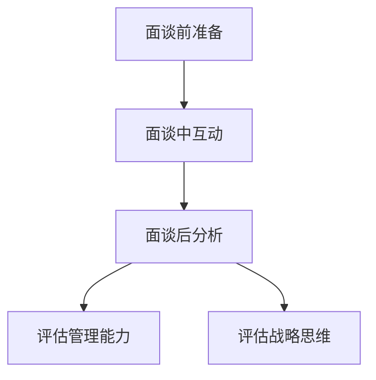
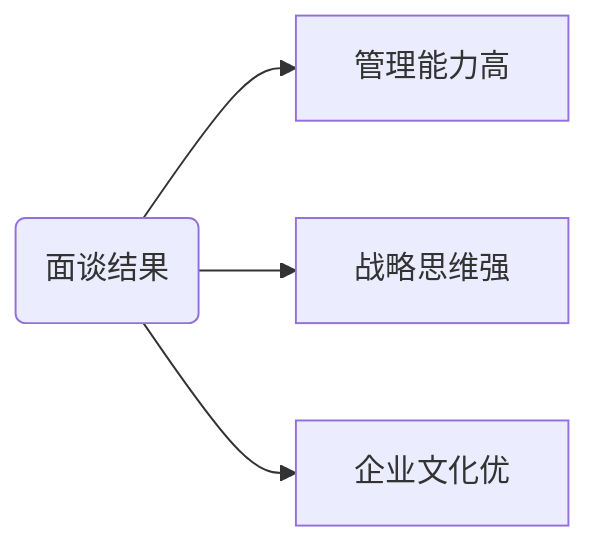
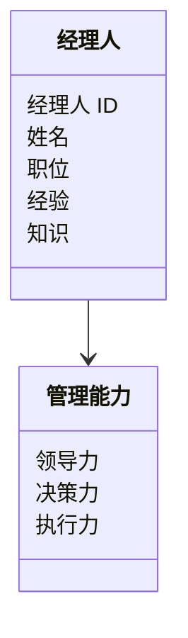
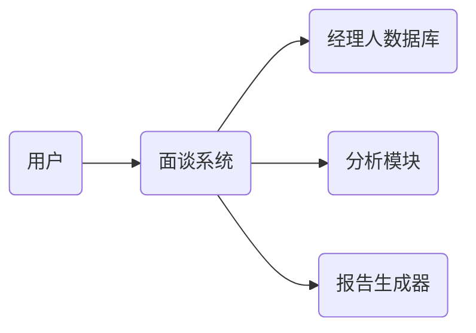
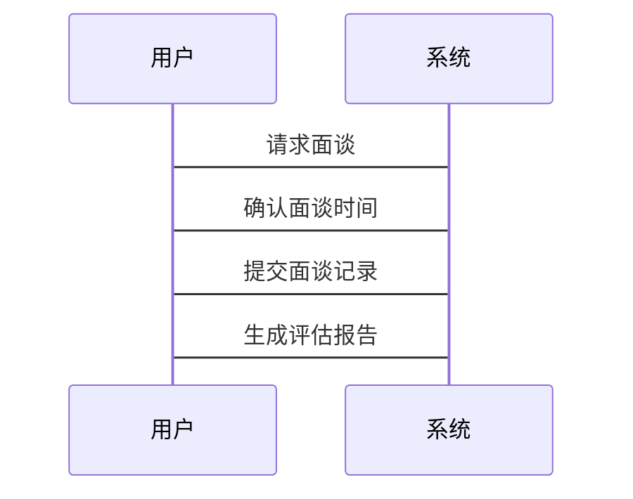

                 


# 费雪的'与经理人面谈'：深入了解公司管理层

> **关键词**：费雪，经理人面谈，公司管理层，管理能力，战略思维，企业文化  
> **摘要**：本文深入探讨了费雪的《与经理人面谈》这一经典著作的核心思想，结合现代企业管理实践，分析了如何通过与公司管理层的深入面谈，全面评估其管理能力、战略思维和企业文化。文章从背景介绍、核心概念、分析框架、系统设计到实际案例，层层递进，帮助读者全面理解公司管理层的本质特征和评估方法。

---

## 第一部分：背景介绍

### 第1章：面谈经理人的背景与重要性

#### 1.1 面谈经理人的背景

在现代企业管理中，公司管理层的决策和战略对公司的发展具有决定性影响。费雪的《与经理人面谈》通过与经理人（即公司高管）的深入交流，揭示了公司管理的核心逻辑和潜在问题。这种面谈不仅是对公司治理的全面评估，也是对经理人能力的深刻洞察。

**面谈经理人的起源与演变**  
面谈经理人的方法起源于20世纪初，随着企业规模的扩大和管理复杂性的增加，这种方法逐渐成为企业评估管理层能力的重要工具。费雪通过与经理人的面谈，不仅了解了公司的经营状况，还揭示了管理层的战略思维和管理风格。

**面谈经理人的核心概念**  
面谈经理人是指通过与公司高管的深入交流，全面了解公司治理、战略规划、管理风格和企业文化的过程。这种方法的核心在于通过对话揭示管理层的真实想法和公司运营的关键问题。

**面谈经理人的边界与外延**  
面谈经理人不仅限于对公司高管的访谈，还包括对中层管理者和关键岗位员工的了解。通过多层次的面谈，可以更全面地评估公司管理的健康状况。

#### 1.2 面谈经理人的意义

**面谈经理人的重要性**  
面谈经理人是企业管理和投资决策中的重要工具。通过与经理人的面谈，可以评估公司的管理能力、战略规划和企业文化，为投资决策提供依据。

**面谈经理人与公司治理的关系**  
公司治理的核心在于管理层的决策和执行能力。面谈经理人通过深入了解管理层的思维和行为模式，为公司治理提供了重要的评估依据。

**面谈经理人的应用场景**  
面谈经理人不仅适用于企业内部管理，还广泛应用于投资评估、战略咨询和企业并购等领域。通过面谈，可以快速识别公司管理中的潜在问题和机会。

---

### 第2章：面谈经理人的核心概念与联系

#### 2.1 核心概念原理

**面谈经理人的核心要素**  
面谈经理人涉及多个核心要素，包括管理能力、战略思维、企业文化、组织结构和员工关系。这些要素共同构成了公司管理的核心逻辑。

**面谈经理人的关键属性**  
面谈经理人的关键属性包括管理能力的评估、战略思维的深度、企业文化的影响和组织结构的合理性。这些属性通过面谈过程得以揭示。

**面谈经理人的概念结构**  
面谈经理人的概念结构是一个多层次的系统，包括面谈前的准备、面谈中的互动和面谈后的分析。这种结构确保了面谈的系统性和科学性。

#### 2.2 核心概念对比表

| **核心概念** | **管理能力** | **战略思维** | **企业文化** |
|--------------|--------------|--------------|--------------|
| **定义**     | 经理人的执行能力 | 经理人的战略规划能力 | 公司的价值观和行为准则 |
| **评估维度** | 领导力、决策力 | 战略目标、创新思维 | 企业凝聚力、员工满意度 |
| **影响因素** | 经验、知识 | 行业趋势、竞争环境 | 企业历史、管理风格 |

---

#### 2.3 实体关系图

```mermaid
erd
    经理人
    经理人 ID, 姓名, 职位, 经验, 知识
    经理人 --> 管理能力
    经理人 --> 战略思维
    经理人 --> 企业文化
```

---

## 第二部分：面谈经理人的分析框架

### 第3章：面谈经理人的分析方法

#### 3.1 面谈经理人的分析步骤

**面谈前的准备**  
面谈前需要充分准备，包括了解公司背景、行业趋势和经理人的基本信息。这一步骤是面谈成功的关键。

**面谈中的技巧**  
面谈中需要注意倾听、提问和观察。通过开放式问题和深入探讨，可以揭示经理人的核心思想和潜在问题。

**面谈后的分析**  
面谈后需要整理面谈记录，分析经理人的管理能力和战略思维。通过对比不同经理人的面谈结果，可以识别公司的管理问题。

---

#### 3.2 面谈经理人的分析模型



---

### 第4章：面谈经理人的数学模型与公式

#### 4.1 面谈经理人的评估公式

$$评估得分 = 管理能力 \times 战略思维 \times 企业文化$$

其中，管理能力、战略思维和企业文化的权重可以根据公司特点进行调整。

---

#### 4.2 面谈经理人的概率模型



---

## 第三部分：面谈经理人的系统分析与架构设计

### 第5章：面谈经理人的系统分析

#### 5.1 面谈经理人的系统功能设计



---

#### 5.2 面谈经理人的系统架构设计



---

### 第6章：面谈经理人的接口与交互设计

#### 6.1 面谈经理人的接口设计

- 面谈前的准备工作接口
- 面谈中的交互接口
- 面谈后的反馈接口

---

#### 6.2 面谈经理人的交互流程



---

## 第四部分：面谈经理人的项目实战

### 第7章：面谈经理人的项目实战

#### 7.1 项目环境安装

面谈经理人工具的安装与配置需要遵循以下步骤：

1. 下载并安装面谈经理人软件。
2. 配置面谈环境，包括面谈记录模板和分析工具。
3. 确保网络和数据安全。

---

#### 7.2 系统核心实现源代码

以下是一个简单的面谈记录管理系统的代码示例：

```python
# 面谈记录管理系统的实现

class Manager:
    def __init__(self, id, name, position):
        self.id = id
        self.name = name
        self.position = position
        self.interview_notes = []

    def add_note(self, note):
        self.interview_notes.append(note)

class InterviewSystem:
    def __init__(self):
        self.managers = []

    def add_manager(self, manager):
        self.managers.append(manager)

    def get_manager(self, id):
        for manager in self.managers:
            if manager.id == id:
                return manager
        return None

# 示例用法
system = InterviewSystem()
manager = Manager(1, "张三", "CEO")
manager.add_note("张三在面谈中表现出强烈的领导力和决策能力。")
system.add_manager(manager)
print(system.get_manager(1).name)
```

---

#### 7.3 代码应用解读与分析

上述代码实现了一个简单的面谈记录管理系统。`Manager`类表示经理人，包含面谈记录；`InterviewSystem`类表示面谈系统，管理多个经理人的面谈记录。通过这种方法，可以实现面谈记录的高效管理和分析。

---

### 第8章：面谈经理人的实际案例分析

#### 8.1 案例背景介绍

某科技公司希望通过面谈经理人来评估其高管的管理能力和战略思维。

---

#### 8.2 案例分析与解读

通过与CEO的面谈，发现公司在战略规划方面存在不足，具体表现为：

- 管理能力：CEO的决策能力和执行能力较强，但在团队协作方面存在问题。
- 战略思维：公司战略目标不够清晰，缺乏长期规划。
- 企业文化：公司文化较为松散，员工凝聚力不足。

---

#### 8.3 案例总结

通过面谈经理人，公司识别了管理中的潜在问题，并采取了以下措施：

1. 加强团队协作能力的培训。
2. 重新制定公司战略目标。
3. 改进企业文化，增强员工凝聚力。

---

## 第五部分：总结与展望

### 第9章：总结与展望

#### 9.1 小结

面谈经理人是企业管理和投资决策中的重要工具。通过与经理人的深入面谈，可以全面评估公司管理的核心要素，包括管理能力、战略思维和企业文化。

#### 9.2 注意事项

在实际应用中，面谈经理人需要注意以下几点：

- 面谈前的充分准备。
- 面谈中的倾听和观察。
- 面谈后的分析和总结。

#### 9.3 拓展阅读

推荐阅读以下书籍和文章：

- 《管理的实践》
- 《战略管理》
- 《领导力的五个维度》

---

## 作者信息

作者：AI天才研究院/AI Genius Institute & 禅与计算机程序设计艺术/Zen And The Art of Computer Programming

---

通过以上目录大纲，您可以逐步深入地理解费雪的《与经理人面谈》的核心思想，并将其应用于实际的企业管理实践中。

