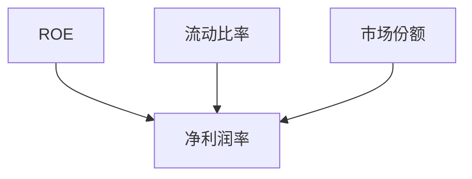
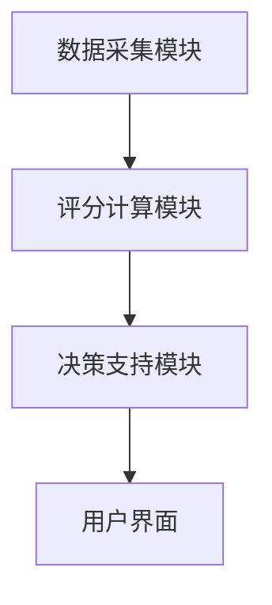

                 


# 费雪的'十五个点'在当代投资中的应用与调整

---

## 关键词：
- 费雪投资理论
- 十五个点
- 投资分析
- 现代投资策略
- 数学模型

---

## 摘要：
本文详细探讨了费雪的“十五个点”投资理论在当代投资环境中的应用与调整。首先，我们介绍了费雪的生平及其投资理论的背景，分析了“十五个点”理论的核心概念和其在现代投资中的适用性。接着，我们从数学模型和算法的角度，详细阐述了如何将这一理论转化为具体的投资决策系统，并通过实际案例展示了其应用过程。最后，我们总结了在现代投资环境下对费雪理论的调整策略，并提出了优化建议。

---

## 第一部分: 费雪的“十五个点”投资理论基础

### 第1章: 费雪投资理论的背景与核心概念

#### 1.1 费雪投资理论的起源与演变

##### 1.1.1 费雪的生平与投资理念
菲利普·费雪（Philip Fisher）是20世纪著名的投资专家，以其“成长型投资”理念闻名。他主张投资那些具有持续增长潜力的公司，并提出了“十五个点”理论，用于评估公司的投资价值。费雪的投资理念强调长期增长和公司的基本面分析，对现代投资理论产生了深远影响。

##### 1.1.2 “十五个点”理论的提出背景
“十五个点”理论是费雪在20世纪60年代提出的一种公司评估方法。该理论旨在通过分析公司的财务状况、市场地位、管理团队等因素，评估其投资价值。然而，随着市场环境的变化，传统的“十五个点”理论在当代投资中面临诸多挑战，需要进行调整和优化。

##### 1.1.3 费雪理论在现代投资中的地位
尽管时间过去了几十年，费雪的理论仍被视为投资分析的重要基础。然而，现代投资环境的变化，如技术进步、全球化和市场波动加剧，要求投资者对传统的分析方法进行创新和调整。

---

#### 1.2 “十五个点”理论的核心要素

##### 1.2.1 投资决策的关键因素
“十五个点”理论的核心在于通过多维度的分析，评估公司的投资价值。这些维度包括盈利能力、财务状况、市场地位和管理团队等方面。

##### 1.2.2 十五个点的具体内容与分类
费雪的“十五个点”可以分为以下几个类别：
- **盈利能力**：如净利润率、ROE（净资产收益率）等。
- **财务状况**：如资产负债表分析、流动比率等。
- **市场地位**：如市场份额、竞争对手分析等。
- **管理团队**：如管理者的经验和战略规划能力。

##### 1.2.3 十五个点的内在联系与逻辑结构
通过绘制**Mermaid图**，我们可以清晰地展示“十五个点”之间的逻辑关系：


---

#### 1.3 理论的适用性与局限性

##### 1.3.1 费雪理论在不同市场环境下的表现
在稳定的市场环境中，费雪理论表现出色；但在市场波动剧烈时，其表现可能不佳，需要结合其他分析方法。

##### 1.3.2 现代投资环境对理论的挑战
现代市场环境的变化，如技术进步和全球化，使得传统的分析维度需要扩展和更新。

##### 1.3.3 理论的调整与优化方向
为了适应现代投资环境，我们需要对费雪理论进行优化，例如引入更多的技术指标和市场数据。

---

## 第二部分: 十五个点的详细分析与对比

### 第2章: 十五个点的详细分析与对比

#### 2.1 十五个点的核心维度

##### 2.1.1 盈利能力
盈利能力是衡量公司财务健康的重要指标。常用的指标包括净利润率和ROE（净资产收益率）。我们可以通过以下公式计算ROE：

$$ROE = \frac{\text{净利润}}{\text{股东权益}}$$

##### 2.1.2 财务状况
财务状况分析包括资产负债表和现金流量表的分析。例如，流动比率可以衡量公司的短期偿债能力：

$$\text{流动比率} = \frac{\text{流动资产}}{\text{流动负债}}$$

##### 2.1.3 市场地位
市场地位决定了公司在行业中的竞争力。我们可以通过市场份额和竞争对手分析来评估市场地位。

##### 2.1.4 管理团队
管理团队的能力直接影响公司的长期发展。我们可以通过分析管理者的经验和战略规划能力来评估这一点。

---

#### 2.2 各个点的分析框架

##### 2.2.1 每个点的定义与衡量标准
通过对比分析，我们可以明确每个点的定义和衡量标准。例如，盈利能力可以通过ROE和净利润率来衡量。

##### 2.2.2 点与点之间的关系
通过绘制**Mermaid图**，我们可以展示点与点之间的关系：



##### 2.2.3 点的权重分配与优先级
根据市场环境的变化，我们可以调整各个点的权重。例如，在经济衰退期间，财务状况可能比市场地位更重要。

---

#### 2.3 十五个点的对比分析

##### 2.3.1 关键点与次要点的区分
通过对比分析，我们可以区分关键点和次要点。例如，ROE是一个关键点，而流动比率可能是次要点。

##### 2.3.2 各个点的优劣势分析
通过对比分析，我们可以明确各个点的优劣势。例如，ROE的优势在于衡量公司的盈利能力，但其劣势在于可能受到行业和公司规模的影响。

##### 2.3.3 点的动态调整与权重变化
根据市场环境的变化，我们需要动态调整各个点的权重。例如，在技术驱动的市场中，创新能力可能成为一个新的关键点。

---

## 第三部分: 十五个点的数学模型与算法

### 第3章: 十五个点的数学模型与算法

#### 3.1 投资评分模型的构建

##### 3.1.1 模型的输入变量
投资评分模型的输入变量包括ROE、净利润率、流动比率、市场份额和管理团队能力等因素。

##### 3.1.2 模型的输出结果
模型的输出结果是一个综合评分，用于评估公司的投资价值。

##### 3.1.3 模型的数学表达式
通过以下公式，我们可以计算综合评分：

$$\text{综合评分} = \sum (\text{各维度得分} \times \text{权重})$$

---

#### 3.2 多因素分析法的应用

##### 3.2.1 因子分析的数学公式
通过因子分析，我们可以将多个相关变量综合为几个核心因子。例如，我们可以将盈利能力分解为ROE和净利润率两个因子。

##### 3.2.2 因子权重的确定方法
因子权重可以通过主成分分析（PCA）等方法确定。例如：

$$\text{因子权重} = \frac{\text{因子方差贡献率}}{\sum \text{因子方差贡献率}}$$

##### 3.2.3 综合评分的计算流程
通过以下步骤，我们可以计算综合评分：
1. 计算每个因子的得分。
2. 确定每个因子的权重。
3. 计算综合评分。

---

#### 3.3 算法的优化与改进

##### 3.3.1 算法的改进方向
为了适应现代投资环境，我们需要对传统算法进行优化。例如，引入机器学习算法来提高预测准确性。

##### 3.3.2 新算法的数学模型
通过引入机器学习算法，我们可以构建一个更加复杂的评分模型。例如，我们可以使用随机森林算法来进行预测。

##### 3.3.3 算法的验证与测试
通过回测和实证分析，我们可以验证新算法的有效性。例如，我们可以比较传统算法和新算法在不同市场环境下的表现。

---

## 第四部分: 投资决策系统的架构设计

### 第4章: 投资决策系统的架构设计

#### 4.1 系统功能模块划分

##### 4.1.1 数据采集模块
数据采集模块负责收集公司的财务数据和市场数据。例如，我们可以从财务报表中提取ROE和净利润率等数据。

##### 4.1.2 评分计算模块
评分计算模块负责根据收集到的数据计算公司的综合评分。例如，我们可以使用前面提到的数学模型来计算评分。

##### 4.1.3 决策支持模块
决策支持模块负责根据评分结果向投资者提供投资建议。例如，我们可以推荐投资评分较高的公司。

---

#### 4.2 系统架构设计

##### 4.2.1 系统架构图
通过绘制**Mermaid图**，我们可以展示系统的架构设计：



##### 4.2.2 模块之间的交互关系
数据采集模块将数据传递给评分计算模块，评分计算模块将评分结果传递给决策支持模块，决策支持模块将投资建议传递给用户。

##### 4.2.3 系统的扩展性设计
为了适应未来的变化，我们需要设计一个具有扩展性的系统架构。例如，我们可以预留接口以方便引入新的分析方法。

---

#### 4.3 系统接口设计

##### 4.3.1 数据接口规范
数据接口需要支持多种数据格式，例如JSON和CSV。我们可以通过以下代码实现数据接口：

```python
import json

def get_data():
    data = {
        "ROE": 0.2,
        "net_profit_margin": 0.15,
        "market_share": 0.3
    }
    return json.dumps(data)
```

##### 4.3.2 用户接口设计
用户界面需要直观易用。例如，我们可以设计一个基于Web的界面，允许用户输入公司信息并查看评分结果。

##### 4.3.3 系统监控接口
系统监控接口需要实时监控系统的运行状态。例如，我们可以设计一个基于REST的接口来获取系统的运行状态。

---

## 第五部分: 项目实战

### 第5章: 系统的实现与实战案例

#### 5.1 环境搭建与工具安装

##### 5.1.1 开发环境的选择
推荐使用Python和Jupyter Notebook作为开发环境。

##### 5.1.2 数据库的安装与配置
我们可以使用MySQL或MongoDB作为数据库。以下是一个简单的配置示例：

```python
import mysql.connector

def connect_db():
    db = mysql.connector.connect(
        host="localhost",
        user="root",
        password="password",
        database="investment"
    )
    return db
```

##### 5.1.3 开发工具的安装
安装必要的开发工具，例如Pandas、NumPy和Scikit-learn。

---

#### 5.2 核心代码实现

##### 5.2.1 数据采集模块的代码
以下是数据采集模块的代码示例：

```python
import requests

def get_financial_data(ticker):
    url = f"https://api.example.com/financial_data/{ticker}"
    response = requests.get(url)
    return response.json()
```

##### 5.2.2 评分计算模块的代码
以下是评分计算模块的代码示例：

```python
def calculate_score(data):
    score = data['ROE'] * 0.4 + data['net_profit_margin'] * 0.3 + data['market_share'] * 0.2
    return score
```

##### 5.2.3 决策支持模块的代码
以下是决策支持模块的代码示例：

```python
def generate_recommendation(score):
    if score > 0.8:
        return "买入"
    elif score > 0.6:
        return "持有"
    else:
        return "卖出"
```

---

#### 5.3 实际案例分析与详细讲解

##### 5.3.1 案例背景介绍
假设我们正在分析一家科技公司的投资价值。我们需要收集其财务数据和市场数据。

##### 5.3.2 数据分析与评分计算
通过数据采集模块获取数据后，我们使用评分计算模块计算综合评分。

##### 5.3.3 投资决策建议
根据评分结果，决策支持模块将提供投资建议。

---

## 第六部分: 最佳实践、小结与注意事项

### 第6章: 最佳实践与小结

#### 6.1 最佳实践 tips
- 定期更新模型和算法，以适应市场环境的变化。
- 组合使用多种分析方法，以提高投资决策的准确性。
- 注重数据的实时性和准确性，以确保模型的有效性。

#### 6.2 小结
通过对费雪的“十五个点”理论的分析和优化，我们可以构建一个更加适应现代投资环境的投资决策系统。通过引入数学模型和算法，我们可以提高投资决策的科学性和准确性。

#### 6.3 注意事项
- 在实际应用中，需要注意数据的完整性和准确性。
- 需要定期监控和调整模型和算法，以确保其有效性。
- 在使用模型进行投资决策时，需要结合市场环境和具体情况，避免盲目跟从。

---

## 作者：AI天才研究院/AI Genius Institute & 禅与计算机程序设计艺术 /Zen And The Art of Computer Programming

---

这篇文章详细探讨了费雪的“十五个点”投资理论在当代投资中的应用与调整。通过理论分析、数学建模和系统设计，我们构建了一个更加适应现代投资环境的投资决策系统。希望本文能为投资者提供有价值的参考和启示。

