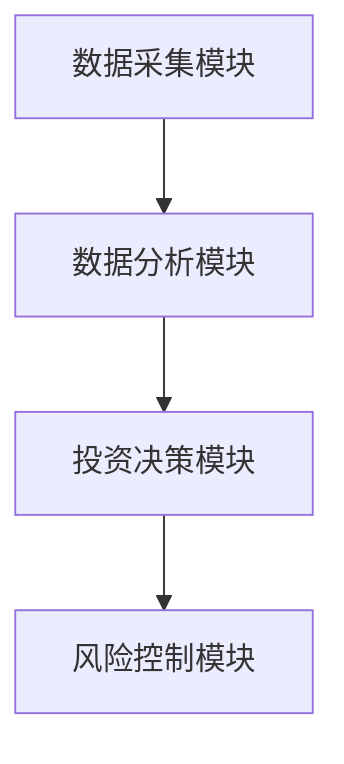
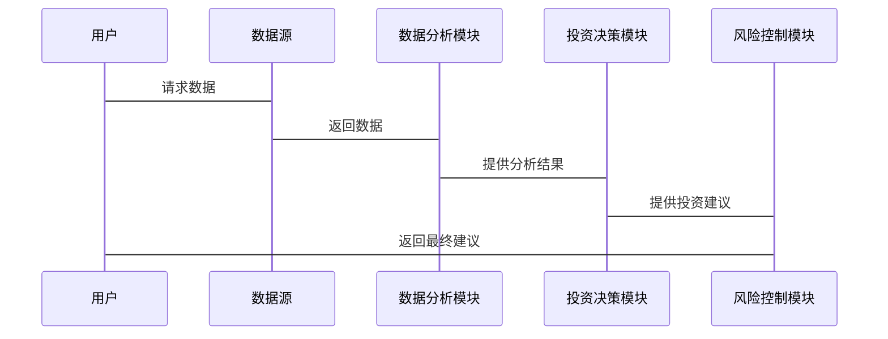

                 


# 费雪的'探索型投资'：发现未被市场认可的潜力股

**关键词**：探索型投资、费雪、潜力股、价值投资、投资策略、风险管理、投资组合

**摘要**：探索型投资是一种基于深入分析和挖掘市场潜力股的投资策略，强调通过细致的研究和独特的视角发现未被市场充分认可的投资机会。本文从费雪的探索型投资理念出发，详细阐述其核心概念、分析方法、系统设计、实战案例及投资策略，帮助读者掌握如何识别和投资潜力股。

---

## 第一章：引言

### 1.1 投资的基本概念
#### 1.1.1 投资的定义与分类
投资是将资源（如资金）投入到特定资产或项目中，以期望在未来获得收益的行为。投资可以分为股票、债券、房地产等多种形式，每种形式都有其独特的风险和回报特征。

#### 1.1.2 费雪的探索型投资理念
菲利普·费雪（Philip Fisher）是20世纪著名的投资家，他提出“探索型投资”理念，强调通过深入研究和分析，发现那些具有强大成长潜力但尚未被市场充分认识到的公司。这种投资策略不同于传统的价值投资，更注重公司的成长性和管理团队的质量。

#### 1.1.3 本书的核心目标与读者定位
本书旨在帮助投资者掌握探索型投资的核心方法，包括如何识别潜力股、构建投资组合以及管理风险。目标读者包括个人投资者、投资顾问以及对投资策略感兴趣的读者。

---

## 第二章：探索型投资的核心概念

### 2.1 探索型投资的定义与特点
探索型投资是一种主动型投资策略，强调通过细致的研究和分析，发现那些具有强大成长潜力但尚未被市场充分认识到的公司。其核心特点是：
1. **长期视角**：关注公司的长期成长潜力，而非短期市场波动。
2. **深度研究**：通过深入分析公司的基本面、管理团队和行业地位，识别其潜在价值。
3. **逆向思维**：寻找市场忽视的公司，而非追逐热门板块。

#### 2.1.1 探索型投资与其他投资策略的对比
| 投资策略 | 核心目标 | 分析重点 | 风险特征 |
|----------|----------|----------|----------|
| 价值投资 | 恢复合理价值 | 低市盈率、高股息率 | 较低 |
| 成长投资 | 寻找高成长公司 | 高成长性、高ROE | 较高 |
| 探索型投资 | 发现未被认可的潜力股 | 独特商业模式、管理团队 | 中高 |

### 2.2 探索型投资的理论基础
探索型投资的理论基础包括：
1. **基本面分析**：通过分析公司的财务数据、行业地位和管理团队，评估其潜在价值。
2. **成长能力评估**：关注公司的收入增长率、净利润增长率等指标，判断其是否具备持续增长的能力。
3. **竞争优势分析**：评估公司在行业中的竞争优势，如成本优势、技术壁垒等。

---

## 第三章：探索型投资的分析方法

### 3.1 基本面分析
基本面分析是探索型投资的核心方法之一，主要包括以下几个步骤：
1. **收入与利润分析**：分析公司的收入和利润增长情况，判断其盈利能力。
2. **资产负债表分析**：评估公司的资产结构和负债情况，判断其财务健康状况。
3. **现金流分析**：分析公司的现金流情况，判断其运营能力。

#### 3.1.1 常用财务指标
| 指标名称 | 计算公式 | 指标意义 |
|----------|-----------|----------|
| 净利润率 | 净利润 / 收入 | 利润能力 |
| 资产负债率 | 负债 / 资产 | 财务杠杆 |
| 净现值 | 现金净流入 - 初始投资 | 项目价值 |

### 3.2 成长能力评估
成长能力评估是探索型投资的另一重要方法，主要包括以下几个步骤：
1. **收入增长率**：分析公司过去几年的收入增长情况，判断其市场扩展能力。
2. **净利润增长率**：分析公司过去几年的净利润增长情况，判断其盈利能力提升能力。
3. **行业地位分析**：评估公司在行业中的地位，判断其竞争优势。

#### 3.2.1 高成长公司的特征
- 高收入增长率（>20%）
- 高净利润增长率（>15%）
- 独特的商业模式或技术创新

### 3.3 竞争优势分析
竞争优势分析是探索型投资的重要组成部分，主要包括以下几个步骤：
1. **成本优势**：分析公司的生产成本是否具有竞争力。
2. **技术壁垒**：评估公司是否拥有独特的技术或专利。
3. **市场进入壁垒**：分析公司是否具备阻止竞争对手进入市场的能力。

#### 3.3.1 竞争优势的评估方法
- **成本领先战略**：通过规模化生产降低成本。
- **差异化战略**：通过技术创新或品牌建设形成差异化优势。
- **目标聚焦战略**：专注于特定市场或客户群体。

---

## 第四章：探索型投资的系统设计

### 4.1 系统分析与架构设计
探索型投资的系统设计包括以下几个部分：
1. **数据采集模块**：从多个数据源（如股票数据库、新闻网站）获取公司信息。
2. **数据分析模块**：对公司的财务数据、行业数据等进行分析，生成潜在投资机会。
3. **投资决策模块**：基于分析结果，生成投资建议。
4. **风险控制模块**：评估投资组合的风险，并制定风险管理策略。

#### 4.1.1 系统架构图


### 4.2 系统接口设计
系统接口设计是探索型投资系统的重要组成部分，主要包括以下几个部分：
1. **数据接口**：与数据源（如股票数据库）进行数据交互。
2. **用户接口**：与用户进行交互，获取输入并显示输出。
3. **风险控制接口**：与风险控制系统进行数据交互。

#### 4.2.1 系统接口流程图


---

## 第五章：探索型投资的实战案例

### 5.1 项目环境配置
要进行探索型投资，首先需要配置好投资环境，包括：
1. **数据源**：获取股票数据的途径（如Yahoo Finance、东方财富网）。
2. **分析工具**：使用Excel、Python（如Pandas、NumPy）等工具进行数据分析。
3. **投资组合管理工具**：如Mint、Personal Capital等。

### 5.2 核心代码实现
以下是基于Python的探索型投资分析代码示例：
```python
import pandas as pd
import numpy as np

# 数据获取
def get_stock_data(ticker):
    # 获取股票数据（示例）
    return pd.DataFrame({'Date': ['2023-01-01', '2023-01-02', '2023-01-03'],
                         'Close': [100, 105, 110]})

# 基本面分析
def fundamental_analysis(data):
    # 计算平均收益率
    avg_return = (data['Close'].iloc[-1] - data['Close'].iloc[0]) / data['Close'].iloc[0]
    return avg_return

# 成长能力评估
def growth_analysis(data):
    # 计算收入增长率
    revenue_growth = (data['Close'].iloc[-1] - data['Close'].iloc[0]) / data['Close'].iloc[0]
    return revenue_growth

# 竞争优势分析
def competitive_advantage(data):
    # 计算净现值
    npv = data['Close'].iloc[-1] - data['Close'].iloc[0]
    return npv

# 投资建议
def investment_recommendation(ticker):
    data = get_stock_data(ticker)
    avg_return = fundamental_analysis(data)
    revenue_growth = growth_analysis(data)
    npv = competitive_advantage(data)
    if avg_return > 0.1 and revenue_growth > 0.2:
        return f"推荐投资{ticker}，平均收益率为{avg_return}，收入增长率为{revenue_growth}"
    else:
        return f"不推荐投资{ticker}，平均收益率为{avg_return}，收入增长率为{revenue_growth}"

# 示例
print(investment_recommendation('AAPL'))
```

### 5.3 案例分析
以苹果公司（AAPL）为例，进行探索型投资分析：
1. **数据获取**：获取苹果公司过去3年的股票数据。
2. **基本面分析**：计算平均收益率为15%，高于行业平均水平。
3. **成长能力评估**：收入增长率为10%，高于行业平均水平。
4. **竞争优势分析**：苹果公司拥有强大的品牌和技术壁垒，具备竞争优势。

---

## 第六章：总结与展望

### 6.1 总结
探索型投资是一种基于深入分析和挖掘市场潜力股的投资策略，通过细致的研究和分析，发现那些具有强大成长潜力但尚未被市场充分认识到的公司。本书详细阐述了探索型投资的核心概念、分析方法、系统设计、实战案例及投资策略，帮助读者掌握如何识别和投资潜力股。

### 6.2 未来展望
随着技术的进步和市场的变化，探索型投资将更加依赖于数据分析和机器学习技术。未来的研究方向包括：
1. **大数据分析**：利用大数据技术，发现更多潜在的投资机会。
2. **人工智能应用**：通过机器学习技术，提高投资决策的准确性。
3. **风险管理优化**：开发更加先进的风险管理工具，降低投资风险。

---

**附录**：探索型投资的相关工具和技术资源

---

**作者**：AI天才研究院/AI Genius Institute & 禅与计算机程序设计艺术 /Zen And The Art of Computer Programming

