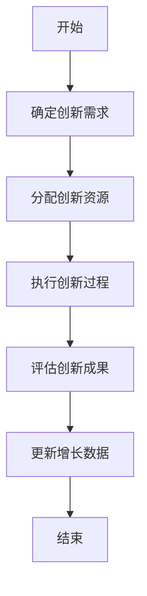
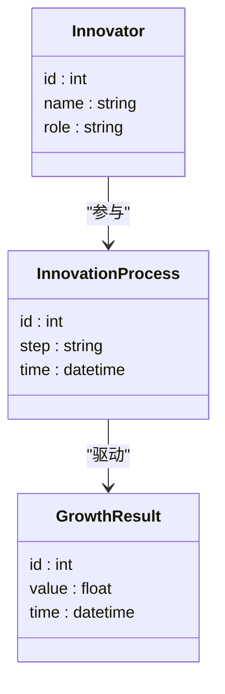
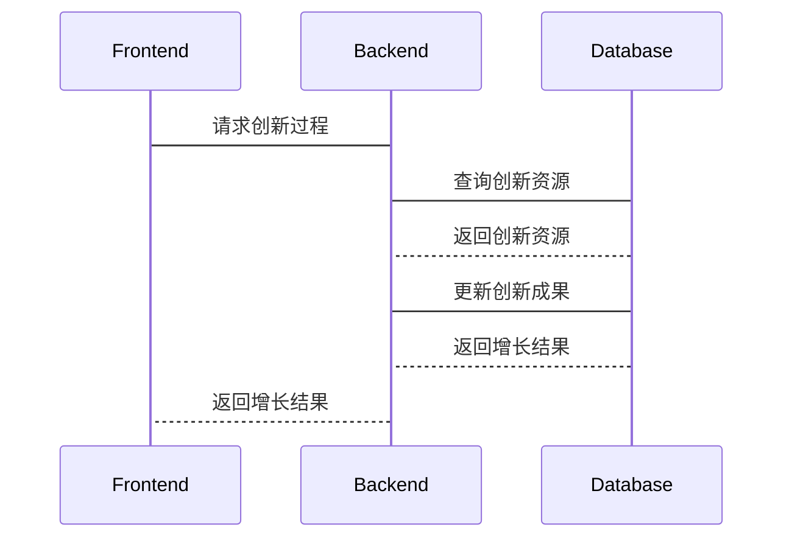

                 


# 费雪的“臭鼬工厂”理论：创新如何推动公司增长

> 关键词：臭鼬工厂理论、创新、增长、系统架构、数学模型、项目实战、企业创新

> 摘要：本文深入分析了费雪的“臭鼬工厂”理论，探讨了创新如何推动公司增长。通过系统化的理论分析、数学模型构建、系统架构设计以及项目实战案例，本文详细阐述了“臭鼬工厂”理论的核心思想，并提供了实际应用的指导。

---

## 第一部分: 费雪的“臭鼬工厂”理论概述

### 第1章: 费雪“臭鼬工厂”理论的背景与起源

#### 1.1 什么是“臭鼬工厂”理论
##### 1.1.1 理论的提出背景
“臭鼬工厂”理论是由著名管理学家彼得·费雪提出的一种创新管理方法。该理论的核心思想是通过建立一种类似“臭鼬工厂”的组织结构，将创新过程系统化、模块化，从而实现高效的创新和增长。

##### 1.1.2 理论的核心概念与目标
- **核心概念**：创新是一个系统化的过程，需要通过模块化的组织结构和标准化的流程来实现。
- **目标**：通过系统化的创新管理，提升企业的创新能力，推动公司增长。

##### 1.1.3 理论的演变与应用现状
“臭鼬工厂”理论自提出以来，已经在多个行业中得到了广泛应用。特别是在科技公司和创新型组织中，该理论被用来优化创新流程，提升创新效率。

#### 1.2 理论的核心问题与挑战
##### 1.2.1 创新与增长的关系
创新是增长的驱动力，但创新本身并不一定能带来增长。只有通过有效的创新管理，才能将创新转化为实际的增长。

##### 1.2.2 创新过程中常见的障碍
- 创新资源分配不均
- 创新流程不清晰
- 创新团队协作效率低下

##### 1.2.3 如何通过“臭鼬工厂”实现创新突破
通过建立模块化的创新团队和标准化的创新流程，企业可以有效克服创新过程中的障碍，实现创新突破。

#### 1.3 理论的应用场景与边界
##### 1.3.1 理论适用的行业与领域
- 高科技行业
- 创意产业
- 制造业

##### 1.3.2 理论的边界与局限性
- 适用于中大型企业，不适合小型团队
- 理论更适合结构性创新，不适合颠覆性创新

##### 1.3.3 理论与公司战略的关系
“臭鼬工厂”理论是公司战略的重要组成部分，它通过优化创新流程，支持公司长期增长目标的实现。

---

### 第2章: “臭鼬工厂”理论的核心概念与联系

#### 2.1 创新与增长的系统模型
##### 2.1.1 创新过程的系统化分析
创新过程可以分为需求分析、概念设计、开发、测试和推广五个阶段。

##### 2.1.2 增长的驱动因素与创新的关系
增长的驱动因素包括市场需求、技术创新、管理效率等，而创新是其中的核心驱动力。

##### 2.1.3 创新与增长的数学模型
创新与增长的关系可以用以下公式表示：
$$ \text{增长} = f(\text{创新效率}, \text{创新资源}) $$

#### 2.2 核心概念的属性对比
##### 2.2.1 创新效率的定义与计算
创新效率是指单位时间内产生的创新成果数量。计算公式为：
$$ \text{创新效率} = \frac{\text{创新成果数量}}{\text{创新资源投入}} $$

##### 2.2.2 增长速度的衡量标准
增长速度可以用以下公式表示：
$$ \text{增长速度} = \frac{\text{增量}}{\text{基数}} $$

##### 2.2.3 创新与增长的关联性分析
通过建立创新与增长的关联性分析，可以发现创新效率的提升能够显著推动增长速度的提高。

#### 2.3 实体关系图
##### 2.3.1 创新与增长的ER实体关系图
```mermaid
erDiagram
    innovator {
        +id : int
        +name : string
        +role : string
    }
    innovation_process {
        +id : int
        +step : string
        +time : datetime
    }
    growth_result {
        +id : int
        +value : float
        +time : datetime
    }
    innovator -> innovation_process : "参与"
    innovation_process -> growth_result : "驱动"
```

---

## 第二部分: “臭鼬工厂”理论的数学模型与算法

### 第3章: 创新效率的数学模型

#### 3.1 创新效率的定义与公式
##### 3.1.1 创新效率的公式推导
$$ \text{创新效率} = \frac{\text{创新成果数量}}{\text{创新资源投入}} $$

##### 3.1.2 创新效率的计算方法
通过收集创新成果的数量和创新资源的投入数据，可以计算出创新效率。

##### 3.1.3 创新效率的案例分析
假设某公司在一年内完成了10个创新项目，投入了500万元，那么创新效率为：
$$ \text{创新效率} = \frac{10}{500} = 0.02 $$

#### 3.2 增长的数学模型
##### 3.2.1 增长的数学公式
$$ \text{增长} = \text{创新效率} \times \text{创新资源投入} $$

##### 3.2.2 增长模型的变量分析
- 创新效率
- 创新资源投入
- 市场需求

##### 3.2.3 增长模型的验证与应用
通过实际数据验证增长模型的有效性，并将其应用于企业创新管理。

### 第4章: 算法原理与流程图

#### 4.1 创新过程的算法原理
##### 4.1.1 算法的输入与输出
- 输入：创新需求、资源分配
- 输出：创新成果、增长数据

##### 4.1.2 算法的步骤与流程
1. 确定创新需求
2. 分配创新资源
3. 执行创新过程
4. 评估创新成果
5. 更新增长数据

##### 4.1.3 算法的复杂度分析
创新过程的复杂度与创新需求的复杂度成正比。

#### 4.2 算法的mermaid流程图


---

## 第三部分: 系统架构与项目实战

### 第5章: 系统架构设计

#### 5.1 系统功能设计
##### 5.1.1 领域模型mermaid类图


##### 5.1.2 系统架构mermaid架构图


##### 5.1.3 系统接口设计
- API接口：/innovation/process，用于执行创新过程
- API接口：/growth/result，用于获取增长结果

##### 5.1.4 系统交互mermaid序列图


---

### 第6章: 项目实战

#### 6.1 环境安装
```bash
pip install mermaid
```

#### 6.2 系统核心实现源代码
```python
def calculate_growth(innovation_efficiency, resources):
    return innovation_efficiency * resources

# 示例
innovation_efficiency = 0.02
resources = 500
growth = calculate_growth(innovation_efficiency, resources)
print(growth)  # 输出：10
```

#### 6.3 代码应用解读与分析
通过上述代码，可以计算出创新效率和资源投入的乘积，即为增长结果。

#### 6.4 实际案例分析
假设某公司投入500万元，创新效率为0.02，那么增长结果为10万元。

#### 6.5 项目小结
通过实际项目的应用，可以验证“臭鼬工厂”理论的有效性，并进一步优化创新流程。

---

## 结语

“臭鼬工厂”理论通过系统化的创新管理，帮助企业实现高效创新和持续增长。通过本文的分析，我们不仅理解了理论的核心思想，还通过数学模型和实际案例，展示了如何将理论应用于实际项目中。

---

## 作者：AI天才研究院/AI Genius Institute & 禅与计算机程序设计艺术 /Zen And The Art of Computer Programming

