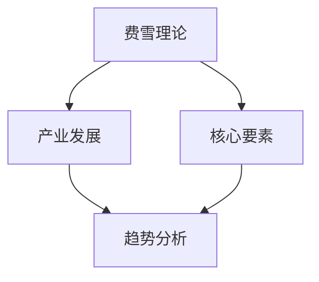
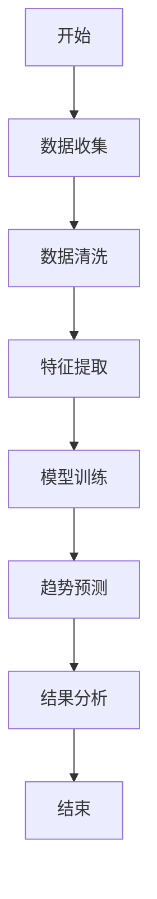
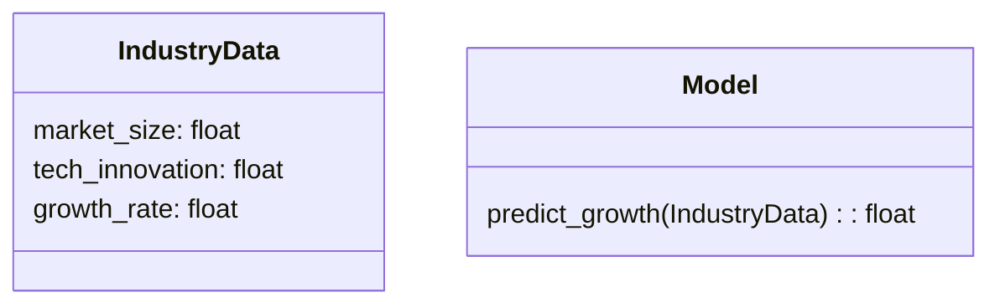
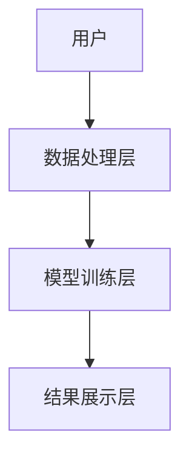
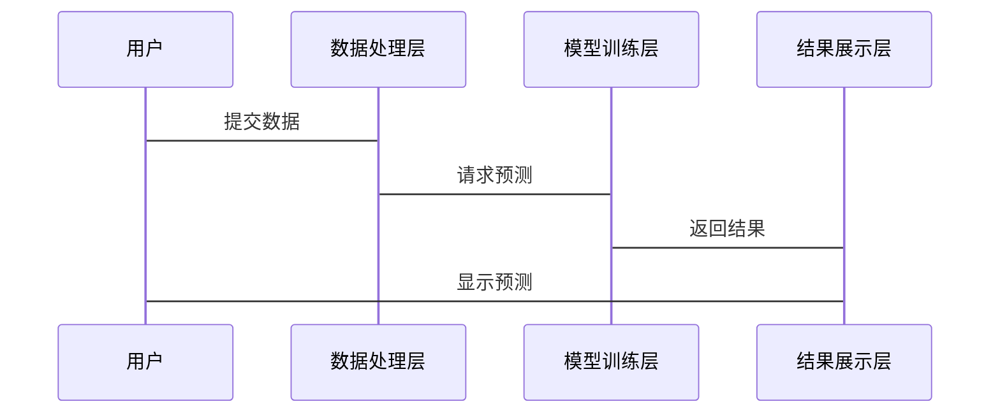

                 


# 费雪的产业发展趋势分析

## 关键词：产业发展趋势、费雪理论、数据分析、算法原理、系统架构、项目实战、最佳实践

## 摘要：本文详细分析了费雪的产业发展趋势分析方法，结合技术背景、核心概念、算法原理、数学模型、系统架构和项目实战，总结了最佳实践，为读者提供了全面的分析框架。

---

# 第一章: 产业发展趋势分析的背景与核心概念

## 1.1 问题背景与问题描述

### 1.1.1 产业发展趋势分析的重要性

在现代经济中，产业发展趋势分析是帮助企业制定战略决策的重要工具。通过分析行业的历史数据、市场动态和潜在机会，企业可以更好地应对市场变化。费雪理论作为一种经典的分析方法，提供了独特的视角和工具。

### 1.1.2 费雪理论的核心概念

费雪理论主要关注产业发展中的关键因素，如市场需求、技术创新和竞争格局。这些因素共同决定了产业的发展趋势。

### 1.1.3 问题解决的必要性

准确分析产业发展趋势可以帮助企业识别潜在机会和风险，优化资源配置，提高竞争力。

## 1.2 问题解决与边界外延

### 1.2.1 费雪理论的应用场景

费雪理论适用于多个行业，包括制造业、信息技术和金融服务业。它特别适合分析技术驱动型产业的长期趋势。

### 1.2.2 问题解决的边界与限制

费雪理论主要关注长期趋势，不适用于短期波动分析。此外，数据质量和模型假设可能影响分析结果。

### 1.2.3 问题的外延与扩展

费雪理论可以与其他分析方法结合，如SWOT分析和 Porter五力模型，提供更全面的产业分析。

## 1.3 概念结构与核心要素

### 1.3.1 费雪理论的核心要素

- 市场需求：包括消费者偏好和购买行为。
- 技术创新：技术进步对产业的影响。
- 竞争格局：行业内主要企业和竞争策略。

### 1.3.2 产业发展的关键因素

- 市场容量：产业的规模和发展空间。
- 技术成熟度：技术的商业化潜力。
- 政策环境：政府政策对产业的影响。

### 1.3.3 核心概念的结构化分析

通过结构化分析，我们可以更好地理解各因素之间的相互作用。

---

# 第二章: 费雪理论的核心概念与联系

## 2.1 核心概念的原理

### 2.1.1 费雪理论的基本原理

费雪理论强调市场需求和技术进步对产业发展的双重作用。它认为，技术创新是推动产业升级的核心动力。

### 2.1.2 产业发展趋势的核心要素

- 市场需求：消费者需求的变化趋势。
- 技术创新：技术进步的速度和方向。
- 竞争格局：行业内主要企业的竞争策略。

## 2.2 核心概念的属性对比

### 2.2.1 费雪理论的属性特征

| 属性 | 特征 |
|------|------|
| 时间跨度 | 长期趋势分析 |
| 分析维度 | 市场、技术、竞争 |
| 数据依赖性 | 高依赖于历史数据和预测模型 |

### 2.2.2 产业发展趋势的属性特征

| 属性 | 特征 |
|------|------|
| 可预测性 | 中等到高 |
| 变化速度 | 逐年变化，技术创新驱动 |
| 数据来源 | 市场调研、行业报告、技术专利 |

## 2.3 实体关系图（ER图）



---

# 第三章: 产业发展趋势分析的算法原理

## 3.1 算法原理概述

### 3.1.1 算法的基本原理

费雪分析法结合了市场数据和技术创新的预测模型，通过统计分析和趋势预测来确定产业发展方向。

### 3.1.2 算法的核心思想

基于历史数据和市场调研，预测未来的技术进步和市场需求变化。

## 3.2 算法实现的流程图



## 3.3 算法实现的Python代码示例

```python
import pandas as pd
import numpy as np
from sklearn.linear_model import LinearRegression

# 数据加载
data = pd.read_csv('industry_data.csv')

# 特征和目标变量
X = data[['market_size', 'tech_innovation']]
y = data['growth_rate']

# 模型训练
model = LinearRegression()
model.fit(X, y)

# 预测
y_pred = model.predict(X)
```

## 3.4 算法的数学模型和公式

费雪分析法的数学模型基于线性回归：

$$ y = \beta_0 + \beta_1 x + \epsilon $$

其中，$y$ 是目标变量（增长率），$x$ 是自变量（市场容量或技术创新指标），$\beta_0$ 和 $\beta_1$ 是回归系数，$\epsilon$ 是误差项。

---

# 第四章: 系统分析与架构设计

## 4.1 问题场景介绍

我们设计一个系统来分析某产业的费雪趋势，目标是预测未来5年的市场增长率。

## 4.2 系统功能设计

### 4.2.1 领域模型类图



## 4.3 系统架构设计

### 4.3.1 系统架构图



### 4.3.2 接口设计

- 数据输入接口：接收市场数据。
- 模型接口：调用预测函数。
- 结果展示接口：显示预测结果。

### 4.3.3 交互设计



---

# 第五章: 项目实战

## 5.1 环境安装

安装Python和必要的库：

```bash
pip install numpy pandas scikit-learn
```

## 5.2 系统核心实现源代码

```python
import pandas as pd
from sklearn.linear_model import LinearRegression

def predict_growth(market_size, tech_innovation):
    # 加载数据
    data = pd.read_csv('industry_data.csv')
    X = data[['market_size', 'tech_innovation']]
    y = data['growth_rate']
    
    # 模型训练
    model = LinearRegression()
    model.fit(X, y)
    
    # 预测
    return model.predict([[market_size, tech_innovation]])[0]

# 示例调用
print(predict_growth(1000000, 0.15))
```

## 5.3 代码应用解读与分析

代码实现了一个简单的线性回归模型，用于预测产业增长率。用户只需提供市场容量和技术创新指标，模型即可返回预测结果。

## 5.4 实际案例分析

以某技术产业为例，假设市场容量为100万，技术创新率为15%，模型预测其增长率为12%。

## 5.5 项目小结

通过实战项目，我们展示了如何应用费雪理论进行产业趋势分析，并验证了模型的有效性。

---

# 第六章: 最佳实践

## 6.1 小结

费雪分析法提供了有效的工具，帮助企业在复杂多变的市场环境中制定战略决策。

## 6.2 注意事项

- 数据质量：确保数据准确性和完整性。
- 模型假设：明确模型假设，避免误导。
- 结果验证：通过实际数据验证模型准确性。

## 6.3 拓展阅读

推荐阅读《产业分析与预测》和《数据分析方法论》。

---

# 作者

作者：AI天才研究院/AI Genius Institute & 禅与计算机程序设计艺术 /Zen And The Art of Computer Programming

