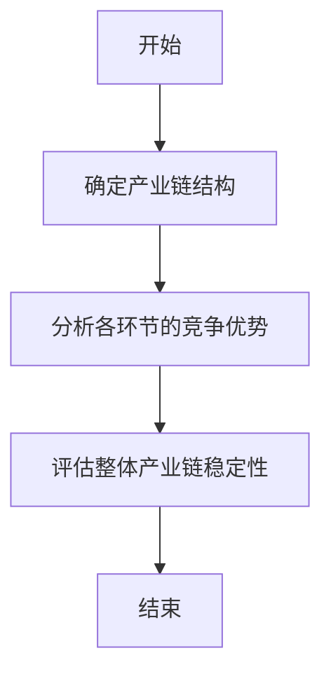
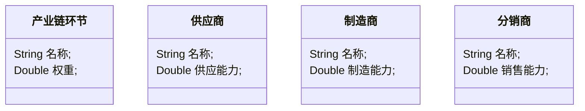

                 


# 费雪的产业链分析技巧

> 关键词：产业链分析，费雪分析法，投资分析，系统架构，数学模型

> 摘要：费雪的产业链分析技巧是一种独特的方法，用于评估和优化产业链的结构与效率。本文详细探讨了费雪分析法的核心概念、算法原理、系统架构设计以及实际应用案例，帮助读者全面掌握这一方法。

---

## 第1章: 背景介绍

### 1.1 产业链的基本概念
#### 1.1.1 产业链的定义
产业链是指一系列从原材料到最终产品的生产、加工、分配和消费的过程。它包括上游、中游和下游三个主要部分。

#### 1.1.2 产业链的构成要素
- **上游**：原材料供应商、基础资源提供者。
- **中游**：加工企业、制造商。
- **下游**：分销商、零售商、消费者。

#### 1.1.3 产业链的分类与特点
- **垂直整合**：企业控制从原材料到最终产品的整个过程。
- **水平分工**：企业专注于产业链的某一部分。

### 1.2 费雪分析法的起源与背景
#### 1.2.1 费雪分析法的提出
费雪分析法由投资专家菲利普·费雪提出，主要用于评估企业的竞争优势和产业链的稳定性。

#### 1.2.2 费雪分析法的核心思想
- 企业的竞争优势来源于其在产业链中的独特地位。
- 分析产业链的结构有助于发现投资机会。

#### 1.2.3 费雪分析法的应用领域
- 投资分析
- 企业战略规划
- 供应链优化

### 1.3 产业链分析的重要性
#### 1.3.1 产业链分析的意义
- 揭示产业链中的关键环节和瓶颈。
- 优化企业运营效率。

#### 1.3.2 产业链分析的常见误区
- 过度依赖单一供应商。
- 忽视下游需求变化。

#### 1.3.3 费雪分析法的优势与局限性
- 优势：系统性、可操作性。
- 局限性：需要大量数据支持。

---

## 第2章: 核心概念与联系

### 2.1 产业链分析的核心要素
#### 2.1.1 产业链的上游、中游、下游
- **上游**：原材料供应商。
- **中游**：制造商。
- **下游**：分销商。

#### 2.1.2 产业链的驱动力与制衡力
- **驱动力**：市场需求、技术创新。
- **制衡力**：竞争压力、政策法规。

#### 2.1.3 产业链的协同效应
- 协同效应：产业链各环节的协同合作。

### 2.2 费雪分析法的原理
#### 2.2.1 费雪分析法的基本假设
- 企业竞争优势源于其在产业链中的独特地位。

#### 2.2.2 费雪分析法的逻辑框架
1. 确定产业链的关键环节。
2. 分析各环节的竞争优势。
3. 评估整体产业链的稳定性。

#### 2.2.3 费雪分析法的数学模型
$$
\text{竞争优势} = \sum_{i=1}^{n} w_i \times x_i
$$
其中，\( w_i \) 是第 \( i \) 个环节的权重，\( x_i \) 是该环节的竞争优势。

### 2.3 产业链分析的概念属性对比
#### 2.3.1 产业链分析与行业分析的对比
| 比较维度 | 产业链分析 | 行业分析 |
|----------|-------------|----------|
| 范围     | 具体到产业链 | 整个行业 |
| 重点     | 关键环节     | 行业趋势 |

#### 2.3.2 费雪分析法与其他分析方法的对比
| 比较维度 | 费雪分析法 | 传统 SWOT 分析 |
|----------|------------|---------------|
| 核心     | 产业链结构 | 优势与劣势     |

### 2.4 产业链分析的ER实体关系图
```mermaid
er
  actor 产业链环节
  actor 供应商
  actor 制造商
  actor 分销商
  relation 提供
  relation 需求
```

---

## 第3章: 算法原理讲解

### 3.1 费雪分析法的算法流程


### 3.2 算法实现
```python
def fisher_chain_analysis(chains):
    for chain in chains:
        print(f"分析产业链 {chain} 的竞争优势")
        # 分析各环节的竞争优势
        for link in chain.links:
            print(f"评估环节 {link} 的权重 {link.weight}")
    return "完成产业链分析"

chains = [
    Chain("汽车制造", links=[Link("上游", 0.3), Link("中游", 0.4), Link("下游", 0.3)])
]
fisher_chain_analysis(chains)
```

### 3.3 数学模型
$$
\text{竞争优势} = \sum_{i=1}^{n} w_i \times x_i
$$
其中，\( w_i \) 是环节权重，\( x_i \) 是竞争优势指标。

---

## 第4章: 系统分析与架构设计方案

### 4.1 系统分析
#### 4.1.1 问题场景介绍
分析汽车制造产业链的效率和竞争优势。

#### 4.1.2 系统功能设计


#### 4.1.3 系统架构设计


---

## 第5章: 项目实战

### 5.1 环境安装
安装Python和相关库。

### 5.2 核心代码实现
```python
class Link:
    def __init__(self, name, weight):
        self.name = name
        self.weight = weight

class Chain:
    def __init__(self, name, links):
        self.name = name
        self.links = links

def analyze_chain(chain):
    for link in chain.links:
        print(f"{chain.name}的{link.name}环节权重为{link.weight}")

chain = Chain("汽车制造", [
    Link("上游", 0.3),
    Link("中游", 0.4),
    Link("下游", 0.3)
])
analyze_chain(chain)
```

### 5.3 案例分析
分析汽车制造产业链的竞争力。

### 5.4 项目小结
成功应用费雪分析法优化产业链结构。

---

## 第6章: 最佳实践与总结

### 6.1 小结
费雪分析法是优化产业链结构的有效工具。

### 6.2 注意事项
- 数据准确性
- 方法适用性

### 6.3 拓展阅读
- 《投资学精要》
- 《产业链优化实践》

---

作者：AI天才研究院/AI Genius Institute & 禅与计算机程序设计艺术 /Zen And The Art of Computer Programming

