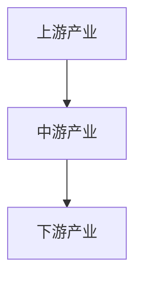
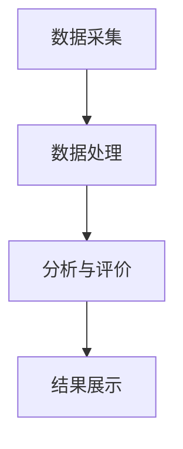

                 


# 费雪的产业链分析方法

## 关键词：产业链分析，费雪方法，系统架构，数学模型，投资决策

## 摘要：费雪的产业链分析方法是一种系统性分析经济产业链结构、竞争力和风险的方法。本文从产业链的基本概念出发，详细阐述了费雪分析法的核心思想、算法原理、系统架构设计以及实际应用案例。通过理论与实践相结合的方式，帮助读者全面理解产业链分析的重要性，并掌握如何运用费雪方法进行产业链评估与优化。

---

# 第1章: 产业链分析的基本概念

## 1.1 产业链的定义与特征

### 1.1.1 产业链的定义

产业链是指一组从上游到下游的产业活动，通过协同合作和价值传递，形成一个完整的生产或服务系统。例如，汽车产业链包括零部件制造、整车生产、销售服务和售后服务等多个环节。

### 1.1.2 产业链的核心特征

| 特征 | 描述 |
|------|------|
| 价值链 | 各环节通过价值传递形成一个整体 |
| 关联性 | 各环节相互依赖，协同运作 |
| 层次性 | 包括上游、中游和下游三个层次 |

### 1.1.3 产业链的分类与层次结构

#### 层次结构图


## 1.2 费雪的产业链分析方法背景

### 1.2.1 产业链分析的起源与发展

产业链分析起源于20世纪70年代，随着全球化和分工的深化，企业开始意识到产业链的协同效应。费雪在80年代提出了系统性分析方法，成为现代产业链分析的基础。

### 1.2.2 费雪分析法的基本思想

费雪分析法认为，产业链的竞争力取决于各环节的协同效率和价值传递。通过量化分析各环节的贡献，可以优化产业链结构。

### 1.2.3 费雪分析法的现代应用

当前，费雪方法被广泛应用于投资决策、企业战略和经济研究。例如，投资者可以通过分析产业链竞争力来选择投资标的。

## 1.3 产业链分析的意义与价值

### 1.3.1 产业链分析对企业战略的意义

通过产业链分析，企业可以识别关键环节，优化资源配置，提升整体竞争力。

### 1.3.2 产业链分析对投资决策的价值

投资者可以通过产业链分析，找到具有竞争优势的企业，降低投资风险。

### 1.3.3 产业链分析在经济研究中的作用

经济学者可以通过产业链分析，研究产业间的相互关系，制定有效的政策。

## 1.4 本章小结

本章介绍了产业链的基本概念和费雪分析法的背景，强调了产业链分析的重要性和广泛应用。

---

# 第2章: 产业链分析的核心要素

## 2.1 产业链的构成要素

### 2.1.1 上游产业

上游产业是产业链的起点，提供原材料和基础服务。例如，汽车产业链中的钢铁厂和橡胶厂。

### 2.1.2 中游产业

中游产业负责将上游产品转化为半成品或中间产品。例如，汽车零部件制造商。

### 2.1.3 下游产业

下游产业是产业链的终端，直接面对消费者。例如，汽车经销商和服务商。

## 2.2 产业链的关联关系

### 2.2.1 产业链的上下游关系

各环节通过供需关系紧密相连，上游为中游提供原材料，中游为下游提供产品。

### 2.2.2 产业链的协同效应

协同效应是指产业链各环节通过合作实现效率提升。例如，整车厂与零部件供应商的协作。

### 2.2.3 产业链的风险传递机制

风险可能从某一环节传递到整个产业链。例如，原材料价格上涨会增加生产成本，影响最终产品价格。

## 2.3 产业链的竞争力分析

### 2.3.1 产业链的竞争优势

竞争优势来源于各环节的成本、技术和品牌优势。例如，某汽车零部件供应商因技术创新具有竞争优势。

### 2.3.2 产业链的成本结构

成本结构包括原材料、人工和运输等成本。优化成本结构可以提升整体竞争力。

### 2.3.3 产业链的关键环节分析

关键环节是影响整体竞争力的核心部分。例如，芯片制造是电子产业链的关键环节。

## 2.4 本章小结

本章详细分析了产业链的构成要素和关联关系，强调了各环节的协同效应和风险传递机制。

---

# 第3章: 费雪分析法的算法原理

## 3.1 费雪分析法的基本流程

### 3.1.1 数据收集与整理

收集产业链各环节的数据，包括成本、收入和利润等。

### 3.1.2 产业链各环节的权重计算

根据各环节对整体竞争力的贡献，确定其权重。

### 3.1.3 产业链竞争力的综合评价

通过量化模型计算整体竞争力指数。

## 3.2 费雪分析法的数学模型

### 3.2.1 产业链竞争力指数的计算公式

$$ C = \sum_{i=1}^{n} w_i \cdot v_i $$

其中，$C$ 表示产业链竞争力指数，$w_i$ 表示第 $i$ 个环节的权重，$v_i$ 表示第 $i$ 个环节的竞争力值。

## 3.3 算法实现的步骤

### 3.3.1 数据预处理

清洗数据，确保数据准确性和完整性。

### 3.3.2 权重分配

根据专家意见或数据特征，分配各环节的权重。

### 3.3.3 综合评价与结果分析

计算竞争力指数，分析结果并提出优化建议。

## 3.4 本章小结

本章详细讲解了费雪分析法的算法原理和实现步骤，为后续的系统设计奠定了基础。

---

# 第4章: 产业链分析系统的架构设计

## 4.1 系统功能模块划分

### 4.1.1 数据采集模块

负责收集产业链各环节的数据。

### 4.1.2 数据处理模块

对数据进行清洗和预处理。

### 4.1.3 分析与评价模块

计算竞争力指数并生成报告。

### 4.1.4 结果展示模块

以图表形式展示分析结果。

## 4.2 系统架构图



## 4.3 系统接口设计

### 4.3.1 数据接口

定义数据输入格式和接口调用方式。

### 4.3.2 分析接口

定义分析模块的调用接口和返回结果。

### 4.3.3 展示接口

定义结果展示模块的接口和数据格式。

## 4.4 系统交互流程

### 4.4.1 用户发起请求

用户通过界面向系统输入数据请求。

### 4.4.2 系统处理请求

系统接收请求，处理数据并生成分析结果。

### 4.4.3 结果展示

系统将结果以图表形式展示给用户。

## 4.5 本章小结

本章设计了产业链分析系统的架构，明确了各模块的功能和交互流程。

---

# 第5章: 项目实战——新能源汽车产业链分析

## 5.1 环境安装

安装Python、Pandas和Matplotlib等工具。

## 5.2 核心代码实现

### 5.2.1 数据预处理

```python
import pandas as pd

data = pd.read_csv('new_energy_car.csv')
data = data.dropna()
```

### 5.2.2 权重分配

```python
weights = [0.3, 0.4, 0.3]  # 假设三个环节的权重
```

### 5.2.3 综合评价

```python
competitiveness = sum(w * v for w, v in zip(weights, data['value']))
```

## 5.3 案例分析

以新能源汽车产业链为例，分析各环节的竞争力指数。

## 5.4 优化建议

根据分析结果，提出优化产业链的建议，如加强上游原材料供应。

## 5.5 本章小结

本章通过实际案例展示了费雪分析法的应用，验证了其有效性和实用性。

---

# 第6章: 最佳实践与注意事项

## 6.1 最佳实践

### 6.1.1 数据质量的重要性

确保数据的准确性和完整性。

### 6.1.2 权重分配的合理性

权重应根据实际情况合理分配。

## 6.2 注意事项

### 6.2.1 避免数据偏差

注意数据来源的多样性和代表性。

### 6.2.2 结果的可解释性

确保分析结果易于理解和应用。

## 6.3 拓展阅读

推荐阅读相关领域的书籍和论文，深入学习产业链分析的方法。

## 6.4 本章小结

本章总结了应用费雪分析法的最佳实践和注意事项，为读者提供了实用的建议。

---

# 结语

费雪的产业链分析方法是一种系统性分析经济产业链结构、竞争力和风险的方法。通过本文的详细讲解，读者可以全面理解产业链分析的重要性和实际应用。未来，随着技术的进步和数据的丰富，费雪分析法将发挥更大的作用。

---

# 作者：AI天才研究院/AI Genius Institute & 禅与计算机程序设计艺术 /Zen And The Art of Computer Programming

---

# 文章结束

