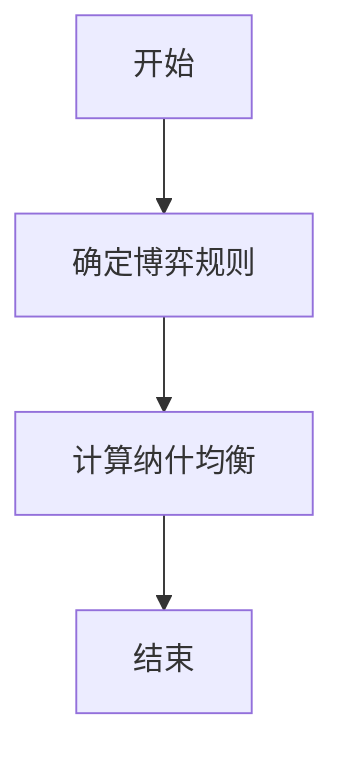
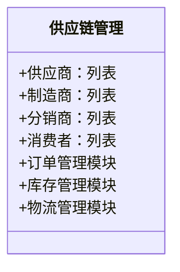
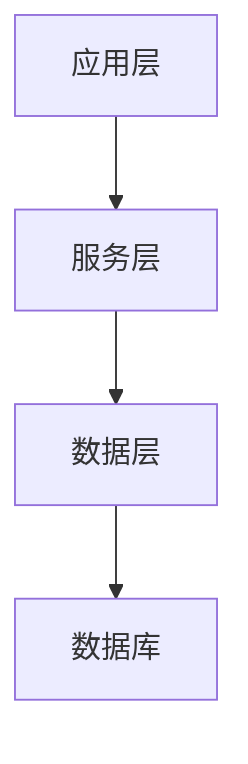
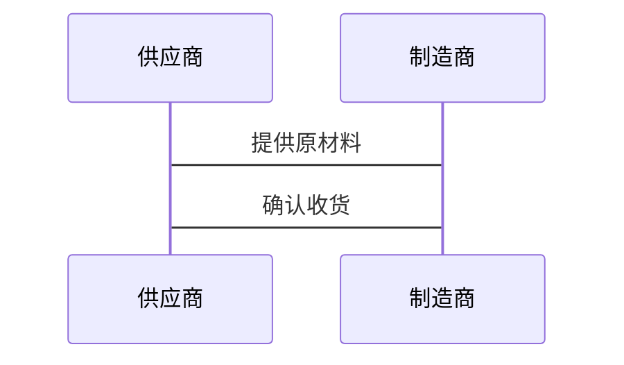

                 


# 费雪的产业链分析：全球供应链重构下的新视角

---

## 关键词  
1. 产业链分析  
2. 全球供应链重构  
3. 地缘政治影响  
4. 数字化转型  
5. 人工智能应用  

---

## 摘要  
本文从费雪的产业链分析视角，深入探讨全球供应链重构的背景、趋势和挑战。通过分析地缘政治、科技革命和全球化等多重因素对供应链的影响，结合实际案例和系统架构设计，提出应对供应链重构的有效策略。文章还探讨了数字化和绿色化对供应链的深远影响，为读者提供全面的产业链重构新视角。

---

# 第1章: 产业链分析概述

## 1.1 产业链的基本概念  
### 1.1.1 产业链的定义与结构  
- 产业链是指从原材料供应到产品最终交付的完整过程，包括上游、中游和下游环节。  
- 产业链的结构通常由供应商、制造商、分销商和消费者构成。  

### 1.1.2 产业链的重要性与作用  
- 产业链是经济活动的核心，连接生产、分配和消费的各个环节。  
- 产业链的效率直接影响企业的竞争力和经济的整体运行。  

### 1.1.3 产业链的分类与特点  
- 按行业分类：制造业、信息技术、能源等。  
- 按区域分类：全球化、区域化、本地化。  

## 1.2 全球供应链重构的背景  
### 1.2.1 全球化与产业链分工的历史演变  
- 20世纪末的全球化推动了全球产业链的形成，企业通过跨国分工降低成本。  

### 1.2.2 地缘政治对供应链的影响  
- 美国对中国科技产业的限制，俄乌冲突对能源供应链的影响。  

### 1.2.3 科技革命与产业链重构  
- 数字化转型和人工智能的应用推动了供应链的智能化。  

## 1.3 费雪产业链分析的核心要素  
### 1.3.1 产业链的关键环节与节点  
- 上游：原材料供应；中游：生产制造；下游：分销与消费。  

### 1.3.2 产业链的协同效应与风险  
- 协同效应：供应链各环节的高效配合。  
- 风险：原材料短缺、物流中断、政策变化等。  

### 1.3.3 产业链的韧性和弹性  
- 韧性：应对突发事件的能力。  
- 弹性：快速调整的能力。  

---

# 第2章: 产业链重构的驱动因素

## 2.1 全球化与逆全球化的双重影响  
### 2.1.1 全球化的历史阶段与特征  
- 从20世纪末的全球化到当前的区域化趋势。  

### 2.1.2 逆全球化趋势的表现与原因  
- 贸易保护主义抬头，企业倾向于本地化生产。  

### 2.1.3 全球化与供应链重构的关系  
- 全球化促进了供应链的分散化，逆全球化则推动了区域化重构。  

## 2.2 地缘政治对供应链的影响  
### 2.2.1 美国对中国科技产业的限制  
- 半导体行业的“芯片战”。  

### 2.2.2 俄乌冲突对能源供应链的影响  
- 欧洲能源依赖俄罗斯，冲突导致能源供应链断裂。  

### 2.2.3 区域化供应链的兴起  
- 欧盟推动“近岸化”生产，减少对外部依赖。  

## 2.3 科技革命与产业链重构  
### 2.3.1 数字化转型对供应链的影响  
- 大数据分析优化供应链管理。  

### 2.3.2 人工智能在供应链管理中的应用  
- AI预测需求、优化库存、降低物流成本。  

### 2.3.3 新兴技术对产业链结构的改变  
- 区块链技术提高供应链透明度。  

---

# 第3章: 产业链重构的趋势与挑战

## 3.1 区域化供应链的趋势  
### 3.1.1 区域化供应链的定义与特点  
- 以本地或区域为中心的供应链布局。  

### 3.1.2 区域化供应链的优势与劣势  
- 优势：减少运输成本、提高响应速度。  
- 劣势：限制规模效应、增加生产成本。  

### 3.1.3 区域化供应链的典型案例  
- 新能源汽车行业：特斯拉在美国和中国布局生产基地。  

## 3.2 数字化供应链的转型  
### 3.2.1 数字化供应链的定义与特点  
- 利用数字技术优化供应链管理。  

### 3.2.2 数字化供应链的核心技术与应用  
- 大数据分析、物联网、区块链技术。  

### 3.2.3 数字化供应链的实施挑战  
- 技术成本高、数据隐私问题。  

## 3.3 绿色供应链的发展  
### 3.3.1 绿色供应链的定义与目标  
- 通过减少碳排放实现可持续发展。  

### 3.3.2 绿色供应链的关键环节与实践  
- 绿色采购、绿色生产、绿色物流。  

### 3.3.3 绿色供应链的经济效益与社会影响  
- 提高企业形象、降低环境风险。  

---

# 第4章: 产业链重构的经济影响

## 4.1 产业链重构对全球经济的影响  
### 4.1.1 全球化与供应链重构的关系  
- 重构推动全球经济格局变化。  

### 4.1.2 区域化供应链对国际贸易的影响  
- 减少跨国贸易依赖，促进区域经济一体化。  

### 4.1.3 数字化供应链对经济效率的提升  
- 提高生产效率，降低成本。  

## 4.2 产业链重构对企业的挑战与机遇  
### 4.2.1 企业面临的挑战  
- 供应链中断风险增加。  

### 4.2.2 企业的应对策略  
- 多元化供应链布局、加强技术投入。  

---

# 第5章: 数学模型与算法分析

## 5.1 博弈论模型在供应链管理中的应用  
### 5.1.1 竞争与合作的博弈模型  
- 纳什均衡在供应链决策中的应用。  

### 5.1.2 算法原理与流程图  


### 5.1.3 数学模型  
- 纳什均衡公式：$$x_i^* = arg\,max_{x_i} \, u_i(x_i, x_{-i})$$  

## 5.2 优化算法在供应链中的应用  
### 5.2.1 线性规划模型  
- 示例问题：最优库存管理。  

### 5.2.2 Python代码实现  
```python
import numpy as np

# 线性规划问题：最小化成本
c = np.array([1, 2, 3])
A = np.array([[1, 1, 1], [0, 1, 0]])
b = np.array([4, 2])

# 使用scipy.optimize.linprog
from scipy.optimize import linprog

result = linprog(c, A_ub=A, b_ub=b, bounds=(0, None), method='highs')

print(result.x)
```

---

# 第6章: 系统分析与架构设计

## 6.1 问题场景介绍  
### 6.1.1 供应链中断的风险分析  
- 疾病、自然灾害导致供应链中断。  

## 6.2 系统功能设计  
### 6.2.1 领域模型（Mermaid类图）  


## 6.3 系统架构设计  
### 6.3.1 分层架构（Mermaid架构图）  


## 6.4 接口设计与交互序列图  
### 6.4.1 供应商与制造商的交互（Mermaid序列图）  


---

# 第7章: 项目实战与最佳实践

## 7.1 项目环境安装  
### 7.1.1 Python与相关库的安装  
- 安装scipy、numpy、pandas等库。  

## 7.2 系统核心实现  
### 7.2.1 供应链模拟代码  
```python
import numpy as np

# 供应链模拟：库存管理
def inventory_management(demand, lead_time):
    inventory = 0
    for i in range(len(demand)):
        order = max(0, demand[i] - inventory)
        inventory += order - demand[i]
    return inventory

demand = [100, 200, 150, 300]
lead_time = 5
print(inventory_management(demand, lead_time))
```

## 7.3 实际案例分析  
### 7.3.1 新能源汽车供应链分析  
- 上游：电池原材料、零部件；中游：整车制造；下游：销售与服务。  

## 7.4 项目小结  
### 7.4.1 项目成果  
- 成功模拟了供应链运行，优化了库存管理。  

## 7.5 最佳实践 tips  
### 7.5.1 关键点总结  
- 多元化供应链布局，加强技术投入。  

### 7.5.2 注意事项  
- 数据隐私、技术成本、政策风险。  

### 7.5.3 拓展阅读  
- 推荐书籍：《供应链管理：战略、规划与操作》。  

---

# 作者：AI天才研究院 & 禅与计算机程序设计艺术

