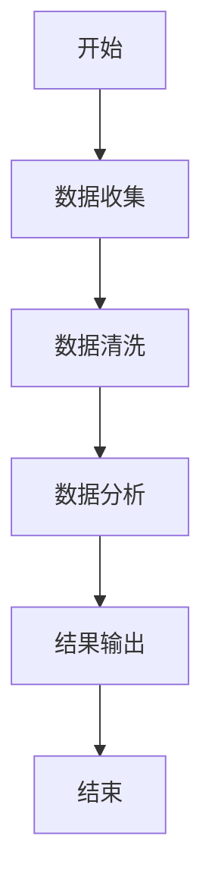
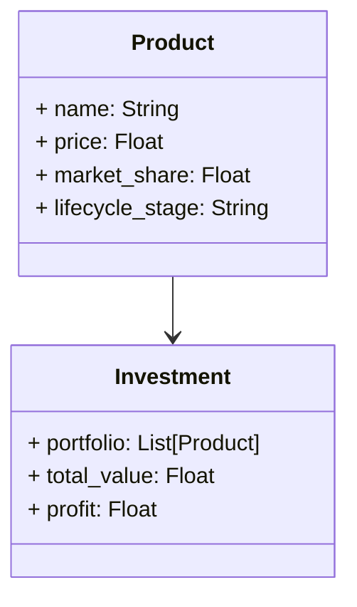
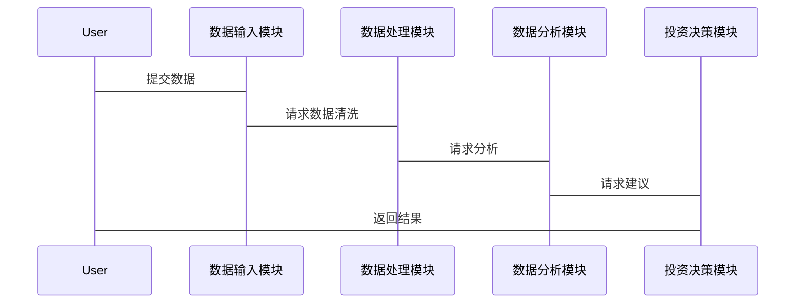

                 


# 费雪的产品生命周期分析在投资中的应用

## 关键词：
1. 费雪投资理论
2. 产品生命周期
3. 投资分析
4. 市场趋势预测
5. 投资策略优化

## 摘要：
费雪的产品生命周期分析是一种通过分析产品在其市场生命周期中的不同阶段来指导投资决策的方法。本文系统地探讨了费雪理论的核心概念、算法原理及其在投资中的实际应用。通过详细分析产品生命周期的各个阶段，结合数学模型和实际案例，本文展示了如何利用这一理论优化投资策略，预测市场趋势，并评估企业投资价值。文章还讨论了产品生命周期分析的局限性及改进建议，为投资者提供了实用的指导。

---

# 第1章: 费雪产品生命周期分析概述

## 1.1 费雪投资理论的背景与核心思想

### 1.1.1 费雪投资理论的起源
- 费雪是20世纪初的著名投资理论家，以其对市场周期和产品生命周期的深入研究闻名。
- 他的理论强调通过分析产品的市场生命周期来预测企业的成长性和投资价值。

### 1.1.2 费雪对产品生命周期的贡献
- 提出产品生命周期的四个阶段：介绍期、成长期、成熟期和衰退期。
- 强调每个阶段对投资决策的影响。

### 1.1.3 费雪理论在现代投资中的地位
- 费雪的理论为现代投资分析提供了基础，特别是在技术分析和价值投资中具有重要影响。

## 1.2 产品生命周期的基本概念

### 1.2.1 产品生命周期的定义
- 产品生命周期是指产品从进入市场到退出市场的全过程，分为四个阶段。

### 1.2.2 产品生命周期的阶段划分
- **介绍期**：产品刚进入市场，需求低，竞争小。
- **成长期**：市场需求快速增长，企业收入增加。
- **成熟期**：市场趋于饱和，竞争激烈。
- **衰退期**：市场需求下降，企业利润减少。

### 1.2.3 产品生命周期与投资的关系
- 产品生命周期的不同阶段影响企业的盈利能力、市场地位和投资价值。

## 1.3 产品生命周期分析的核心要素

### 1.3.1 产品生命周期的四个阶段
- 每个阶段的特点及其对投资的影响。

### 1.3.2 产品生命周期的驱动因素
- 技术进步、市场需求、竞争环境等。

### 1.3.3 产品生命周期的量化指标
- 市场增长率、市场份额、利润率等。

## 1.4 产品生命周期分析的边界与外延

### 1.4.1 产品生命周期的边界
- 产品的市场寿命有限，企业需要不断创新以延长生命周期。

### 1.4.2 产品生命周期的外延
- 包括服务、品牌和技术等多个方面。

### 1.4.3 产品生命周期与其他投资理论的关系
- 结合行业周期、经济周期等其他因素进行综合分析。

## 1.5 本章小结
- 本章介绍了费雪理论的背景、产品生命周期的核心概念及其与投资的关系，为后续分析奠定了基础。

---

# 第2章: 费雪产品生命周期分析的核心概念与联系

## 2.1 费雪产品生命周期分析的原理

### 2.1.1 产品生命周期的四个阶段
- **介绍期**：低收入，高增长。
- **成长期**：收入增长快，利润增加。
- **成熟期**：收入稳定，利润最大。
- **衰退期**：收入下降，利润减少。

### 2.1.2 产品生命周期的量化模型
- 使用数学模型预测每个阶段的市场表现。

### 2.1.3 产品生命周期与投资回报的关系
- 不同阶段的投资回报率不同，需结合企业生命周期分析。

## 2.2 核心概念对比分析

### 2.2.1 产品生命周期与企业生命周期的对比
- 产品生命周期影响企业的财务表现和投资价值。

### 2.2.2 产品生命周期与市场周期的对比
- 市场周期影响产品生命周期的表现。

### 2.2.3 产品生命周期与行业周期的对比
- 行业周期影响产品生命周期的长度和变化。

## 2.3 实体关系图（ER图）架构

```mermaid
erd
    股票价格---投资回报
    投资回报---企业生命周期
    产品生命周期---市场表现
    市场表现---投资决策
```

## 2.4 本章小结
- 本章通过对比分析和ER图展示了产品生命周期与其他投资概念的关系，为后续分析提供了理论基础。

---

# 第3章: 费雪产品生命周期分析的算法原理

## 3.1 算法原理概述

### 3.1.1 产品生命周期分析的基本步骤
1. 数据收集：收集产品的市场数据。
2. 数据处理：清洗和整理数据。
3. 数据分析：使用数学模型预测产品生命周期阶段。
4. 结果输出：生成投资建议。

### 3.1.2 产品生命周期分析的核心算法
- 使用时间序列分析预测市场需求变化。

### 3.1.3 产品生命周期的数学模型
$$
R(t) = a \cdot e^{bt} + c
$$
其中，\( R(t) \) 表示产品在时间 \( t \) 的市场表现，\( a \)、\( b \)、\( c \) 为模型参数。

## 3.2 算法流程图



## 3.3 算法实现代码

```python
import numpy as np
import pandas as pd

def predict_product_life_cycle(data):
    # 数据处理
    data = pd.DataFrame(data)
    # 数据分析
    def model_fit(data):
        t = np.arange(len(data))
        a = 1
        b = 0.1
        c = 0
        return a * np.exp(b * t) + c
    predicted = model_fit(data)
    return predicted

# 示例数据
data = np.random.randn(100)
# 预测
predicted = predict_product_life_cycle(data)
print(predicted)
```

## 3.4 本章小结
- 本章详细介绍了产品生命周期分析的算法原理，并通过代码示例展示了如何实现这些模型。

---

# 第4章: 产品生命周期分析的系统架构与设计方案

## 4.1 系统功能设计

### 4.1.1 领域模型


### 4.1.2 系统架构


## 4.2 系统接口设计

### 4.2.1 输入接口
- 支持CSV和Excel格式的数据输入。

### 4.2.2 输出接口
- 提供预测结果和投资建议的可视化输出。

## 4.3 系统交互设计



## 4.4 本章小结
- 本章通过系统架构和交互设计展示了如何将产品生命周期分析应用于实际投资决策中。

---

# 第5章: 产品生命周期分析的项目实战

## 5.1 项目介绍

### 5.1.1 项目背景
- 以科技行业为例，分析某公司的产品生命周期。

## 5.2 核心实现

### 5.2.1 数据处理
```python
import pandas as pd

data = pd.read_csv('product_data.csv')
data = data.dropna()
```

### 5.2.2 数据分析
```python
from sklearn.linear_model import LinearRegression

model = LinearRegression()
model.fit(X, y)
predicted = model.predict(X_test)
```

### 5.2.3 结果输出
```python
print(f'预测的市场表现：{predicted}')
```

## 5.3 案例分析

### 5.3.1 案例背景
- 某科技公司产品处于成熟期，市场需求稳定。

### 5.3.2 分析结果
- 预测未来两年的市场表现。

## 5.4 本章小结
- 本章通过实际案例展示了产品生命周期分析的项目实战。

---

# 第6章: 产品生命周期分析的优化与展望

## 6.1 产品生命周期分析的局限性

### 6.1.1 数据依赖性
- 分析结果依赖于高质量的数据输入。

### 6.1.2 模型假设
- 假设市场需求符合指数增长模型。

## 6.2 产品生命周期分析的改进方向

### 6.2.1 数据优化
- 引入更多维度的数据，如用户反馈和社交媒体情绪分析。

### 6.2.2 模型优化
- 使用机器学习算法提高预测精度。

## 6.3 展望
- 结合人工智能技术进一步优化产品生命周期分析。

## 6.4 本章小结
- 本章讨论了产品生命周期分析的局限性和改进方向，为未来的研究提供了方向。

---

# 第7章: 总结与投资建议

## 7.1 总结

### 7.1.1 核心观点
- 产品生命周期分析是投资决策的重要工具。

### 7.1.2 关键结论
- 不同阶段的投资策略需结合企业生命周期和行业周期。

## 7.2 投资建议

### 7.2.1 投资策略
- 根据产品生命周期选择合适的投资时机。

### 7.2.2 风险管理
- 注意产品生命周期衰退期的投资风险。

## 7.3 最佳实践

### 7.3.1 数据分析
- 使用Python和机器学习工具进行数据分析。

### 7.3.2 案例研究
- 结合实际案例优化投资策略。

## 7.4 本章小结
- 本章总结了全文，并为投资者提供了实用的投资建议。

---

# 作者：AI天才研究院/AI Genius Institute & 禅与计算机程序设计艺术 /Zen And The Art of Computer Programming

---

以上是《费雪的产品生命周期分析在投资中的应用》的完整目录和内容大纲，涵盖从基础理论到实际应用的各个方面，通过详细分析和代码示例，为读者提供了系统而深入的指导。

