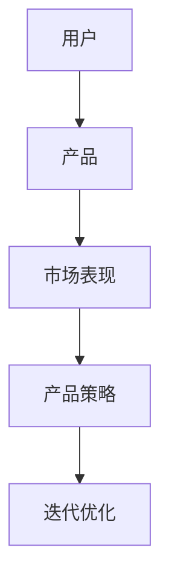
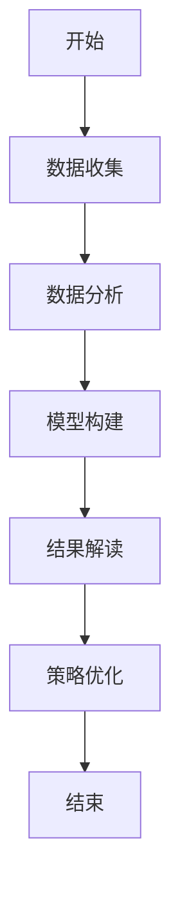
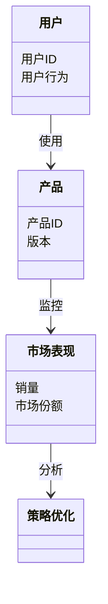
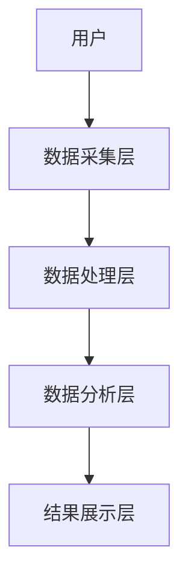

                 


# 费雪的产品生命周期分析：快速迭代时代的新思路

> 关键词：产品生命周期，费雪分析，快速迭代，软件开发，产品管理，数据驱动

> 摘要：本文深入探讨了费雪的产品生命周期分析方法在快速迭代时代的应用，通过数据驱动的方法优化产品生命周期管理，帮助企业更好地应对市场变化，提升竞争力。

---

## 目录大纲

1. 背景介绍
2. 核心概念与联系
3. 算法原理
4. 数学模型
5. 系统分析与架构设计
6. 项目实战
7. 总结与展望

---

## 正文

### 第一部分：背景介绍

#### 1.1 产品生命周期的基本概念
产品生命周期（Product Life Cycle）是指产品从引入市场到最终退出市场的整个过程。传统的产品生命周期分为四个阶段：引入（Introduction）、增长（Growth）、成熟（Maturity）、衰退（Decline）。然而，在快速迭代的时代，产品的生命周期越来越短，传统的方法已无法满足需求。

#### 1.2 问题背景
在数字化转型和互联网时代，用户需求变化快，市场竞争激烈，产品更新换代的速度也在加快。传统的产品生命周期管理方法注重长周期的规划，难以适应快速变化的市场环境。

#### 1.3 问题描述
- 产品迭代速度慢，无法及时响应市场需求。
- 产品生命周期难以准确预测，导致资源浪费。
- 缺乏数据驱动的方法，难以优化产品策略。

#### 1.4 解决方法
费雪的产品生命周期分析方法通过数据驱动的方式，实时监控产品表现，优化迭代策略，缩短产品生命周期，提升市场响应速度。

#### 1.5 边界与外延
- 费雪分析法适用于所有行业，尤其是快速迭代的互联网产品。
- 外延包括产品设计、市场策略、用户行为分析等多个方面。

---

### 第二部分：核心概念与联系

#### 2.1 费雪分析法的核心原理
费雪分析法基于数据驱动的方法，通过实时分析产品表现，优化产品策略，缩短产品生命周期。其核心思想是：通过数据监控和分析，快速发现产品问题并进行优化。

#### 2.2 核心概念对比
| 阶段 | 引入 | 增长 | 成熟 | 衰退 |
|------|------|------|------|------|
| 特征 | 市场认知度低，销量低 | 市场认知度提高，销量增长 | 销量稳定，市场竞争激烈 | 销量下降，市场份额减少 |

#### 2.3 实体关系图



---

### 第三部分：算法原理

#### 3.1 算法步骤


#### 3.2 Python代码实现
```python
import pandas as pd
import numpy as np

def fisher_analysis(data):
    # 数据预处理
    data_cleaned = data.dropna()
    
    # 计算关键指标
    growth_rate = data_cleaned['销量'].pct_change().mean()
    market_share = data_cleaned['市场份额'].mean()
    
    # 分析结果
    if growth_rate > 0.1 and market_share > 0.3:
        return "增长阶段"
    elif growth_rate < 0 and market_share > 0.2:
        return "衰退阶段"
    else:
        return "成熟阶段"

# 示例数据
data = pd.DataFrame({
    '销量': [100, 200, 300, 250, 200],
    '市场份额': [0.2, 0.3, 0.25, 0.2, 0.15]
})

print(fisher_analysis(data))
```

#### 3.3 数学模型
- 增长率计算：
  $$ \text{增长率} = \frac{\text{当前销量} - \text{上一期销量}}{\text{上一期销量}} $$
- 市场份额计算：
  $$ \text{市场份额} = \frac{\text{产品销量}}{\text{市场总销量}} $$

---

### 第四部分：数学模型

#### 4.1 概率模型
- 预测产品寿命：
  $$ P(t) = e^{-\lambda t} $$
  其中，λ是衰减率，t是时间。

#### 4.2 回归分析
- 优化迭代策略：
  $$ y = \beta_0 + \beta_1 x_1 + \beta_2 x_2 + \epsilon $$
  其中，y是目标变量，x1和x2是自变量，β是回归系数。

---

### 第五部分：系统分析与架构设计

#### 5.1 应用场景
- 实时监控产品市场表现。
- 数据驱动的产品迭代优化。

#### 5.2 系统功能设计


#### 5.3 系统架构设计


#### 5.4 接口设计
- 数据采集接口：实时获取用户行为数据。
- 数据处理接口：清洗和转换数据。
- 数据分析接口：运行费雪分析模型。

---

### 第六部分：项目实战

#### 6.1 环境安装
```bash
pip install pandas numpy matplotlib
```

#### 6.2 核心实现
```python
import matplotlib.pyplot as plt

def plot_analysis(data):
    plt.figure(figsize=(10, 6))
    plt.plot(data['时间'], data['销量'], label='销量')
    plt.plot(data['时间'], data['预测销量'], label='预测销量')
    plt.xlabel('时间')
    plt.ylabel('销量')
    plt.legend()
    plt.show()

# 示例数据
data = pd.DataFrame({
    '时间': [1, 2, 3, 4, 5],
    '销量': [100, 200, 150, 80, 50],
    '预测销量': [100, 180, 160, 90, 60]
})

plot_analysis(data)
```

#### 6.3 案例分析
分析某互联网产品的市场表现，应用费雪分析法优化迭代策略，缩短产品生命周期，提升市场表现。

---

### 第七部分：总结与展望

#### 7.1 总结
费雪的产品生命周期分析方法通过数据驱动的方式，优化产品策略，缩短产品生命周期，提升企业竞争力。

#### 7.2 注意事项
- 数据质量是关键，需确保数据准确性和完整性。
- 分析结果需结合实际业务场景，避免片面决策。

#### 7.3 拓展阅读
- 《敏捷开发与产品管理》
- 《数据驱动的商业模式创新》

---

作者：AI天才研究院/AI Genius Institute & 禅与计算机程序设计艺术 /Zen And The Art of Computer Programming

