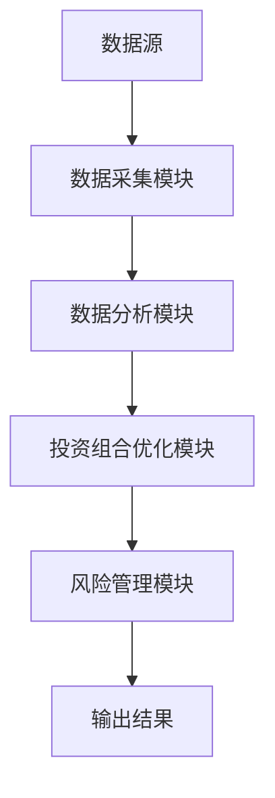
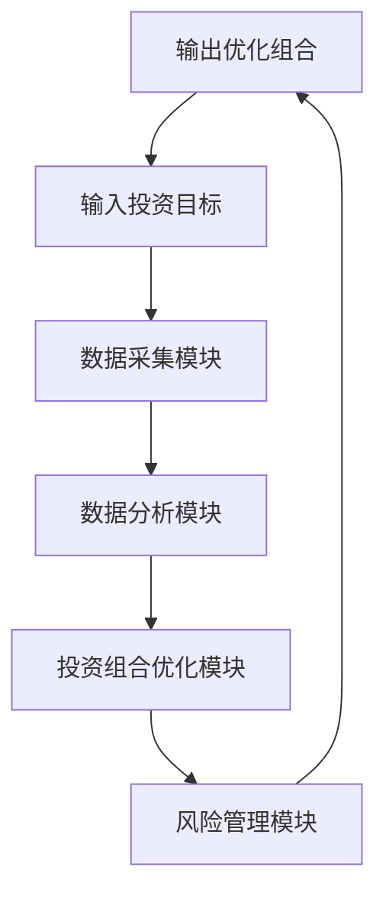

                 


# 费雪的优质成长股特征

## 关键词：费雪，成长股，复合增长率，投资策略，风险管理

## 摘要：本文系统地介绍了费雪的优质成长股投资理论，深入分析了其核心概念、数学模型和实际应用。通过详细阐述费雪的成长股筛选标准、复合增长率公式、投资组合构建方法以及风险管理策略，本文为投资者提供了理论基础和实践指导。同时，结合技术语言和逻辑推理，文章展示了如何将费雪的投资理念转化为可执行的算法和系统架构，帮助读者更好地理解和应用这些投资策略。

---

## 第1章: 费雪投资理论的背景与核心概念

### 1.1 费雪投资理论的背景

#### 1.1.1 费雪的生平简介
菲利普·费雪（Philip Fisher）是20世纪的投资大师，被誉为“成长股之父”。他于1906年进入哈佛大学，主修化学和数学，1929年开始专职投资，逐渐发展出一套独特的成长股投资理论。费雪的投资理念强调长期增长和企业质量，其理论至今仍对投资界产生深远影响。

#### 1.1.2 费雪投资理论的提出背景
在20世纪30年代的经济大萧条期间，传统的价值投资方法（如本杰明·格雷厄姆的“烟屁股”策略）强调低估值和安全边际，但往往忽略了企业的成长性。费雪意识到，仅仅关注低估值并不能确保长期收益，企业的成长性和质量才是决定投资回报的关键因素。

#### 1.1.3 费雪理论在投资界的影响
费雪的成长股理论为后来的投资者提供了全新的视角。他强调选择那些具有持续增长潜力的企业，而非仅仅追求短期收益。这一理论为现代成长股投资奠定了基础，并影响了彼得·林奇、沃伦·巴菲特等投资大师。

---

### 1.2 成长股投资的基本概念

#### 1.2.1 成长股的定义与特征
成长股是指那些营业收入和净利润能够持续以较高速度增长的公司股票。与价值股不同，成长股通常具有较高的市盈率（P/E）和较低的股息率，因为公司更倾向于将利润用于再投资以驱动增长。

#### 1.2.2 成长股与价值股的区别
| 特征      | 成长股                | 价值股                |
|-----------|----------------------|----------------------|
| 市盈率     | 高                   | 低                   |
| 股息率     | 低                   | 高                   |
| 营收增长   | 高                   | 低或负增长            |
| 市场反应    | 市场关注度高，波动大   | 市场关注度低，波动小   |

#### 1.2.3 成长股投资的目标与意义
成长股投资的目标是通过选择具有持续增长潜力的公司，实现资本的长期增值。其意义在于，投资者能够分享优质成长企业的增长成果，同时在长期投资中获得超额收益。

---

## 第2章: 费雪的成长股投资策略

### 2.1 费雪的成长股筛选标准

#### 2.1.1 营收增长率的重要性
费雪认为，营收增长率是衡量企业成长性的重要指标。他建议选择那些过去几年营收复合增长率超过行业平均水平的公司。

#### 2.1.2 净利润增长率的衡量
净利润增长率是另一个关键指标。费雪强调，净利润不仅要看绝对值，还要看其质量。例如，净利润的增长是否来源于主营业务，而非非经常性收益。

#### 2.1.3 股东权益增长率的分析
股东权益增长率反映了企业的资本增值能力。费雪认为，股东权益的持续增长表明公司能够有效利用资本，实现股东价值的最大化。

---

### 2.2 费雪的复合增长率模型

#### 2.2.1 复合增长率的定义与公式
复合增长率（CAGR）是衡量投资回报的重要指标，其公式为：
$$
CAGR = \left( \frac{E}{B} \right)^{\frac{1}{n}} - 1
$$

其中，$E$为期末价值，$B$为期初价值，$n$为时间跨度。

#### 2.2.2 复合增长率的计算方法
以某公司股票为例，假设初始投资为100元，5年后的价值为160元，其复合增长率为：
$$
CAGR = \left( \frac{160}{100} \right)^{\frac{1}{5}} - 1 \approx 0.106 \text{或} 10.6\%
$$

#### 2.2.3 复合增长率在成长股筛选中的应用
费雪建议选择那些复合增长率超过行业平均水平的公司。例如，若行业平均复合增长率为8%，则目标公司应至少达到10%以上的复合增长率。

---

## 第3章: 费雪成长股投资的核心要素

### 3.1 费雪的成长股评估体系

#### 3.1.1 营收与利润的匹配性分析
费雪认为，营收和利润的增长必须匹配。例如，如果营收增长10%，净利润也应至少增长10%或更高。

#### 3.1.2 资产负债表的健康度评估
健康的资产负债表是成长股的重要特征。费雪建议选择那些负债率低、现金流健康的公司。

#### 3.1.3 现金流状况的重要性
现金流是企业健康的核心指标。费雪强调，成长股公司必须具有稳定的正现金流。

---

### 3.2 费雪的成长股投资风险控制

#### 3.2.1 风险的定义与分类
投资风险包括市场风险、流动性风险和公司特有风险。费雪特别关注公司特有风险，认为这是可以通过研究和筛选来降低的主要风险。

#### 3.2.2 成长股投资中的主要风险
1. **估值过高风险**：成长股通常估值较高，容易受到市场波动的影响。
2. **成长减速风险**：公司可能因为竞争、管理或其他因素导致增长放缓。
3. **流动性风险**：成长股交易量可能较小，导致买卖价差较大。

#### 3.2.3 费雪的风险控制策略
1. **分散投资**：通过投资多个成长股分散风险。
2. **长期持有**：避免频繁交易，降低交易成本。
3. **严格筛选**：选择那些具有持续增长潜力的公司。

---

## 第4章: 费雪成长股投资的数学模型与算法

### 4.1 复合增长率的数学模型

#### 4.1.1 复合增长率公式
如前所述，复合增长率公式为：
$$
CAGR = \left( \frac{E}{B} \right)^{\frac{1}{n}} - 1
$$

#### 4.1.2 计算实例
假设某公司股票初始价格为100元，5年后价格为160元，计算其复合增长率为：
$$
CAGR = \left( \frac{160}{100} \right)^{\frac{1}{5}} - 1 \approx 0.106 \text{或} 10.6\%
$$

---

### 4.2 费雪投资模型的算法实现

#### 4.2.1 数据输入与处理
1. **收集数据**：包括历史股价、营收、净利润等。
2. **数据清洗**：处理缺失值和异常值。
3. **数据转换**：将数据转换为易于计算的格式。

#### 4.2.2 成长股筛选算法
```python
def fisher_growth_screen(stocks):
    selected_stocks = []
    for stock in stocks:
        # 计算复合增长率
        cagr = calculate_cagr(stock['price_history'])
        # 检查营收和利润增长率
        if cagr > 10 and stock['revenue_growth'] > 5 and stock['net_profit_growth'] > 5:
            selected_stocks.append(stock)
    return selected_stocks
```

#### 4.2.3 投资组合优化算法
```python
def optimize_portfolio(stocks, risk_tolerance=0.05):
    import numpy as np
    # 计算协方差矩阵
    cov_matrix = np.cov(stock_prices)
    # 计算最优权重
    weights = np.linalg.solve(cov_matrix, np.ones(len(stocks)))
    weights = weights / sum(weights)
    return weights
```

---

## 第5章: 费雪成长股投资的系统架构与实现

### 5.1 系统架构设计

#### 5.1.1 系统功能模块划分
1. 数据采集模块
2. 数据分析模块
3. 投资组合优化模块
4. 风险管理模块

#### 5.1.2 系统数据流图


#### 5.1.3 系统交互流程图


---

### 5.2 系统实现细节

#### 5.2.1 数据库设计
1. 表结构设计
2. 数据索引优化
3. 数据备份策略

#### 5.2.2 算法实现代码
```python
def calculate_cagr(prices):
    n = len(prices) - 1
    cagr = (prices[-1] / prices[0]) ** (1 / n) - 1
    return cagr
```

#### 5.2.3 系统测试与优化
1. 单元测试
2. 性能优化
3. 用户反馈

---

## 第6章: 费雪成长股投资的实战案例分析

### 6.1 实战案例选择

#### 6.1.1 案例背景介绍
以科技公司为例，分析其成长股特征。

#### 6.1.2 案例数据收集
收集该公司的历史股价、营收、净利润等数据。

#### 6.1.3 案例分析与解读
计算复合增长率，评估公司质量，构建投资组合。

---

### 6.2 投资策略的实施过程

#### 6.2.1 投资组合的构建
1. 筛选优质成长股
2. 计算权重
3. 分配资金

#### 6.2.2 投资过程中的风险管理
1. 定期调整组合
2. 监控市场风险
3. 应对突发事件

#### 6.2.3 投资结果的评估与总结
1. 回测结果
2. 绩效评估
3. 总结经验

---

## 第7章: 费雪成长股投资的未来展望与最佳实践

### 7.1 未来投资趋势分析

#### 7.1.1 技术进步对成长股的影响
人工智能、区块链等技术将推动新的成长股崛起。

#### 7.1.2 宏观经济环境的变化
全球经济格局的变化将影响成长股的投资机会。

#### 7.1.3 投资者行为的演变
机构化、国际化趋势将改变成长股投资的格局。

---

### 7.2 最佳投资实践总结

#### 7.2.1 投资理念的坚持
长期持有优质成长股，避免短期波动干扰。

#### 7.2.2 投资策略的灵活调整
根据市场变化和公司情况，动态优化投资组合。

#### 7.2.3 风险管理的重要
分散投资、严格筛选、定期调整是降低风险的关键。

---

## 作者：AI天才研究院/AI Genius Institute & 禅与计算机程序设计艺术 /Zen And The Art of Computer Programming

---

# 总结
费雪的优质成长股投资理论为投资者提供了丰富的理论和实践指导。通过深入分析其核心概念、数学模型和系统架构，我们可以更好地理解和应用这些投资策略。未来，随着技术的进步和市场的变化，成长股投资将面临更多机遇和挑战。投资者需要不断学习和调整，以实现长期的超额收益。

