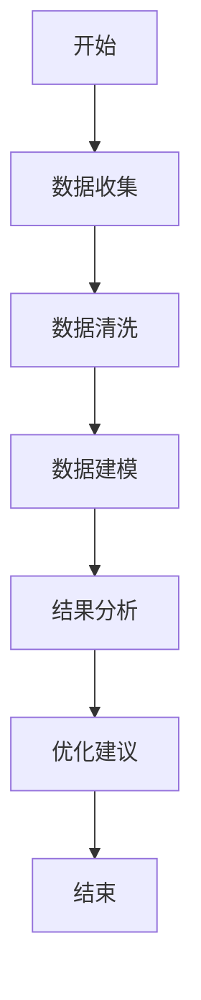
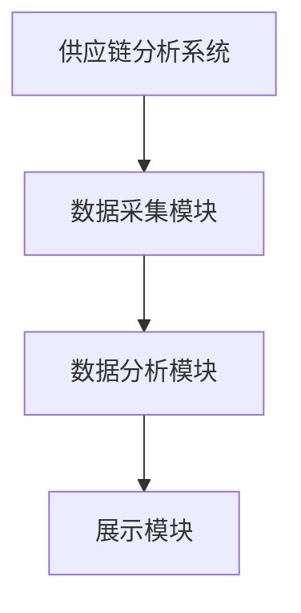

                 


# 费雪的供应链分析：了解公司在产业链中的地位

## 关键词：供应链分析，费雪分析法，产业链，公司地位，竞争力评估，系统架构，项目实战

## 摘要：  
本文深入探讨了费雪的供应链分析方法，分析了公司在产业链中的核心地位和竞争优势。通过详细阐述供应链分析的核心概念、算法原理、系统架构以及实际案例分析，本文为读者提供了从理论到实践的全面指导。通过本文，读者将能够理解如何利用费雪分析法优化供应链管理，提升公司竞争力。

---

# 目录

## 第一部分：供应链分析的背景与重要性

### 第1章：供应链分析的背景与重要性

#### 1.1 供应链分析的基本概念  
- 供应链的定义与组成  
- 供应链分析的目的与意义  
- 供应链分析的演变历程  

#### 1.2 费雪的供应链分析方法  
- 费雪分析法的核心思想  
- 费雪分析法与传统供应链分析的区别  
- 费雪分析法的应用场景  

#### 1.3 供应链分析的现状与挑战  
- 当前供应链分析的主要问题  
- 数字化与智能化对供应链分析的影响  
- 供应链分析的未来发展趋势  

#### 1.4 本章小结  

---

## 第二部分：费雪供应链分析的核心原理

### 第2章：费雪分析法的核心原理

#### 2.1 费雪分析法的理论基础  
- 产业链的结构化分析  
- 费雪分析法的数学模型  
- 费雪分析法的适用范围  

#### 2.2 费雪分析法的关键步骤  
- 数据收集与整理  
- 数据分析与建模  
- 结果解读与优化建议  

#### 2.3 费雪分析法的优劣势对比  
- 费雪分析法的优势  
- 费雪分析法的局限性  
- 如何克服分析法的局限性  

#### 2.4 本章小结  

---

## 第三部分：供应链分析的核心概念与联系

### 第3章：供应链分析的核心概念与联系

#### 3.1 核心概念原理  
- 产业链的实体关系  
- 供应链的网络结构  
- 供应链中的关键节点  

#### 3.2 核心概念属性特征对比表格  
| 概念       | 属性   | 特征                     |  
|------------|--------|--------------------------|  
| 供应商     | 能力   | 资源、技术               |  
| 生产商     | 效率   | 生产能力、成本           |  
| 分销商     | 灵活性 | 市场覆盖、库存管理       |  
| 消费者     | 需求   | 市场反馈、消费行为       |  

#### 3.3 ER实体关系图架构  
```mermaid
er
actor 供应链分析系统;
actor 供应商;
actor 生产商;
actor 分销商;
actor 消费者;
supplier 供应链分析系统 --> 供应商;
supplier 供应链分析系统 --> 生产商;
supplier 供应链分析系统 --> 分销商;
supplier 供应链分析系统 --> 消费者;
```

#### 3.4 本章小结  

---

## 第四部分：供应链分析的算法原理

### 第4章：供应链分析的算法原理

#### 4.1 数据收集与预处理  
- 数据来源  
- 数据清洗  
- 数据标准化  

#### 4.2 费雪分析法的算法流程  


#### 4.3 竞争力评估模型  
$$ \text{竞争力} = \frac{\text{成本优势} + \text{效率优势} + \text{质量优势}}{3} $$  
$$ \text{成本优势} = \frac{\text{公司成本}}{\text{行业平均成本}} $$  

#### 4.4 本章小结  

---

## 第五部分：供应链分析的系统架构设计

### 第5章：系统架构设计

#### 5.1 系统功能设计  
- 需求分析  
- 功能模块划分  

#### 5.2 领域模型设计  
```mermaid
classDiagram
class 供应链分析系统 {
    +供应商数据
    +生产商数据
    +分销商数据
    +消费者数据
}
class 数据采集模块 {
    -采集供应商信息
    -采集生产商信息
    -采集分销商信息
    -采集消费者反馈
}
class 数据分析模块 {
    -计算竞争力指数
    -生成优化建议
}
class 展示模块 {
    -显示竞争力分析结果
    -显示优化建议
}
供应链分析系统 --> 数据采集模块 --> 数据分析模块 --> 展示模块
```

#### 5.3 系统架构设计  


#### 5.4 系统接口设计  
- 数据接口：RESTful API  
- 用户界面：Web界面  

#### 5.5 本章小结  

---

## 第六部分：项目实战

### 第6章：项目实战

#### 6.1 项目背景与目标  
- 某公司供应链优化项目  

#### 6.2 环境安装与配置  
```bash
pip install numpy pandas scikit-learn
```

#### 6.3 核心代码实现  
```python
import pandas as pd
from sklearn.metrics import mean_squared_error

def calculate_competitiveness(company_data, industry_avg_cost):
    company_cost = company_data['cost']
    cost_advantage = company_cost / industry_avg_cost
    return cost_advantage

# 示例数据
data = {
    '供应商': ['供应商A', '供应商B', '供应商C'],
    '生产商': ['生产商X', '生产商Y', '生产商Z'],
    '分销商': ['分销商1', '分销商2', '分销商3'],
    '消费者': ['消费者1', '消费者2', '消费者3'],
    'cost': [10, 15, 20],
    'industry_avg_cost': 15
}
df = pd.DataFrame(data)
print(calculate_competitiveness(df, df['industry_avg_cost'].mean()))
```

#### 6.4 实际案例分析与结果解读  
- 数据分析结果  
- 优化建议  

#### 6.5 本章小结  

---

## 第七部分：最佳实践与总结

### 第7章：最佳实践与总结

#### 7.1 关键点总结  
- 数据质量的重要性  
- 模型选择的灵活性  
- 系统架构的可扩展性  

#### 7.2 小结与注意事项  
- 数据隐私与安全问题  
- 模型的实时性与动态调整  

#### 7.3 拓展阅读  
- 供应链管理的经典书籍  
- 最新的研究论文  

#### 7.4 本章小结  

---

# 结语  

通过本文的详细讲解，读者可以系统地了解费雪的供应链分析方法，并将其应用到实际的供应链优化中。从理论到实践，从算法到系统架构，本文为读者提供了一个完整的供应链分析框架。希望本文能够为企业的供应链管理提供有价值的参考。

---

# 作者  

作者：AI天才研究院/AI Genius Institute & 禅与计算机程序设计艺术 /Zen And The Art of Computer Programming  

--- 

以上是文章的完整目录和内容框架，您可以根据需要补充具体的章节内容，确保每个部分都详实且逻辑清晰。

