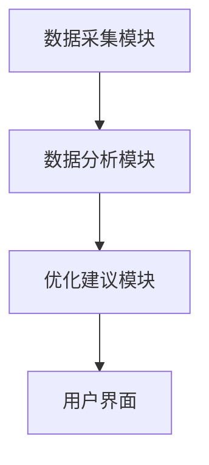
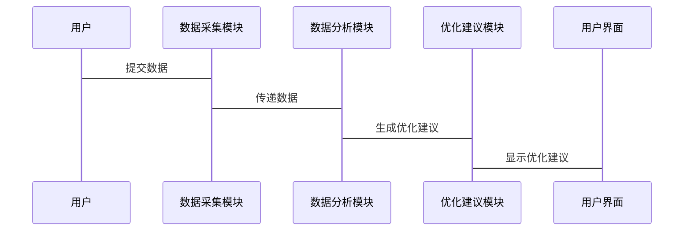

                 

# 费雪的供应链分析：了解公司的上下游

> 关键词：供应链分析，费雪方法，供应商分析，客户分析，供应链优化，企业上下游

> 摘要：本文详细介绍了费雪的供应链分析方法，从理论基础到实际应用，深入探讨了如何通过分析企业的上下游关系，优化供应链管理。文章从供应链的基本概念出发，逐步展开对费雪分析方法的详细解读，结合实际案例和系统设计，帮助读者全面理解并掌握这一方法。

---

# 第一部分: 供应链分析的背景与基础

## 第1章: 供应链分析的背景与重要性

### 1.1 供应链的基本概念

#### 1.1.1 供应链的定义与范围
供应链（Supply Chain）是指从供应商到消费者的整个链条，包括原材料采购、生产、分销、零售等环节。供应链的核心在于协调各方资源，确保产品或服务能够高效、低成本地传递到最终用户手中。

#### 1.1.2 供应链在现代企业中的地位
在现代商业环境中，供应链不仅是企业运营的基础，更是企业竞争力的重要来源。通过优化供应链，企业可以降低成本、提高效率、增强灵活性，从而在市场竞争中占据优势。

#### 1.1.3 供应链管理的核心目标
供应链管理的核心目标包括：
1. **成本最小化**：通过优化库存、物流和采购流程，降低整体成本。
2. **效率最大化**：确保供应链各环节的高效协同，减少浪费。
3. **风险控制**：识别和应对供应链中的潜在风险，如供应商延迟、物流中断等。
4. **灵活性提升**：快速响应市场需求变化，调整供应链策略。

### 1.2 供应链分析的重要性

#### 1.2.1 供应链对企业竞争力的影响
供应链分析能够帮助企业识别瓶颈、优化流程，并提升整体运营效率。一个高效的供应链能够显著降低企业成本，同时提高客户满意度。

#### 1.2.2 供应链分析在企业决策中的作用
供应链分析为企业决策提供数据支持，例如：
1. **供应商选择**：通过分析供应商的历史表现、交货周期和质量，选择最优供应商。
2. **库存管理**：通过预测需求，优化库存水平，避免过度库存或缺货。
3. **物流规划**：通过分析物流成本和效率，选择最优的运输方式和路线。

#### 1.2.3 数字化时代供应链分析的必要性
随着数字化技术的发展，供应链分析变得更加重要。通过大数据、人工智能等技术，企业可以实时监控供应链状态，快速响应变化，并实现智能化管理。

### 1.3 费雪供应链分析方法的起源

#### 1.3.1 费雪方法的基本思想
费雪供应链分析方法是由美国供应链管理专家迈克尔·费雪（Michael Fisher）提出的一种基于协同规划的供应链分析方法。其核心思想是通过协调供应商、制造商和分销商的关系，优化整个供应链的运作效率。

#### 1.3.2 费雪方法与传统供应链分析的差异
传统的供应链分析方法通常关注单点优化，而费雪方法强调供应链的整体协同。通过整合上下游信息，费雪方法能够实现更高效的供应链管理。

#### 1.3.3 费雪方法的应用场景
费雪方法适用于复杂供应链环境，尤其是在多级供应商和分销商的情况下。例如，汽车制造、电子产品制造等领域。

---

## 第2章: 供应链的核心要素与关系

### 2.1 供应链的核心要素

#### 2.1.1 供应商分析
供应商是供应链的起点，供应商的稳定性和质量直接影响整个供应链的效率。费雪方法强调与供应商建立长期合作关系，通过协同规划实现共赢。

#### 2.1.2 制造商的角色
制造商是供应链的核心环节，负责将原材料转化为最终产品。制造商需要协调供应商和分销商，确保生产计划与市场需求一致。

#### 2.1.3 分销商与零售商的定位
分销商和零售商是供应链的末端，负责将产品交付给最终客户。他们的需求直接影响制造商的生产计划和供应商的采购策略。

#### 2.1.4 最终客户的需求
客户需求是供应链的驱动力。通过分析客户需求，企业可以优化供应链的各个环节，确保产品能够快速、准确地交付。

### 2.2 供应链中的信息流、物流与资金流

#### 2.2.1 信息流的传递与整合
信息流是供应链协调的基础。通过共享信息，企业可以实现需求预测、库存管理、订单处理等环节的无缝对接。

#### 2.2.2 物流的优化与成本控制
物流是供应链的核心成本之一。通过优化运输路线、选择最优运输方式，企业可以显著降低成本。

#### 2.2.3 资金流的协调与管理
资金流贯穿供应链的各个环节，从采购付款到销售回款，资金的流动直接影响企业的财务健康。通过优化资金流，企业可以提高整体资金周转效率。

### 2.3 供应链网络的构建与优化

#### 2.3.1 供应链网络的结构分析
供应链网络的结构包括供应商、制造商、分销商和客户。通过分析网络的结构，企业可以识别关键节点，并优化网络布局。

#### 2.3.2 关键节点的选择与优化
关键节点包括核心供应商、关键制造商和主要分销商。通过优化关键节点的资源配置，企业可以提高供应链的整体效率。

#### 2.3.3 网络效率的评估指标
网络效率的评估指标包括成本、时间、可靠性和灵活性。通过量化这些指标，企业可以评估供应链的效率，并制定优化策略。

---

## 第3章: 费雪供应链分析方法的核心框架

### 3.1 费雪分析方法的基本原理

#### 3.1.1 基于上下游关系的分析思路
费雪方法强调从上下游关系入手，通过分析供应商、制造商和分销商之间的协同关系，优化整个供应链的运作效率。

#### 3.1.2 数据驱动的分析方法
费雪方法依赖于大量数据，包括销售数据、库存数据、供应商数据等。通过数据挖掘和分析，企业可以发现供应链中的问题，并制定优化策略。

#### 3.1.3 结构化与非结构化数据的结合
费雪方法不仅依赖于结构化数据（如销售数据、库存数据），还结合非结构化数据（如市场趋势、客户需求反馈），以实现更全面的供应链分析。

### 3.2 费雪分析方法的关键步骤

#### 3.2.1 数据收集与清洗
数据收集是供应链分析的基础。企业需要收集供应商、制造商、分销商和客户的相关数据，并进行清洗和预处理，以确保数据的准确性和完整性。

#### 3.2.2 关键指标的选取与计算
关键指标包括供应链成本、库存周转率、订单交货时间等。通过计算这些指标，企业可以评估供应链的效率，并识别问题所在。

#### 3.2.3 模型构建与验证
费雪方法通常基于数学模型，如线性规划模型。通过模型模拟供应链的运作，企业可以验证优化策略的有效性。

#### 3.2.4 结果分析与优化建议
根据模型的分析结果，企业可以制定优化策略，例如调整供应商选择、优化库存管理、改进物流规划等。

### 3.3 费雪分析方法的数学模型

#### 3.3.1 数据预处理与标准化
数据预处理包括数据清洗、数据转换等。标准化是将不同量纲的数据转换为统一量纲，以便模型分析。

#### 3.3.2 关键指标的计算公式
供应链成本计算公式：
$$ \text{总成本} = \text{采购成本} + \text{物流成本} + \text{库存成本} + \text{管理成本} $$

库存周转率计算公式：
$$ \text{周转率} = \frac{\text{年销售成本}}{\text{平均库存价值}} $$

订单交货时间计算公式：
$$ \text{交货时间} = \text{订单处理时间} + \text{运输时间} $$

#### 3.3.3 模型构建与优化算法
费雪方法通常使用线性规划模型，通过优化目标函数（如最小化成本）和约束条件（如库存限制、交货时间），找到最优解。

#### 3.3.4 模型验证与评估指标
模型验证包括测试数据验证和交叉验证。评估指标包括模型的准确率、运行时间、优化效果等。

---

## 第4章: 费雪供应链分析的系统设计与实现

### 4.1 系统功能设计

#### 4.1.1 数据采集模块
数据采集模块负责从供应商、制造商、分销商和客户处采集数据，包括销售数据、库存数据、订单数据等。

#### 4.1.2 数据分析模块
数据分析模块基于费雪方法，对采集的数据进行分析，计算关键指标，并生成优化建议。

#### 4.1.3 优化建议模块
优化建议模块根据分析结果，生成优化策略，例如供应商选择、库存优化、物流规划等。

### 4.2 系统架构设计

#### 4.2.1 系统架构图

#### 4.2.2 系统接口设计
系统接口包括数据接口（如API）、用户接口（如网页界面）和第三方服务接口（如物流服务接口）。

#### 4.2.3 系统交互流程

---

## 第5章: 费雪供应链分析的项目实战与总结

### 5.1 项目背景与目标

#### 5.1.1 项目背景
某电子产品制造企业希望通过优化供应链，降低生产成本，提高交货速度。

#### 5.1.2 项目目标
通过费雪供应链分析方法，优化供应商选择、库存管理和物流规划。

### 5.2 项目实施步骤

#### 5.2.1 数据收集与清洗
收集供应商、制造商和分销商的相关数据，并进行清洗和预处理。

#### 5.2.2 关键指标计算
计算供应链成本、库存周转率、订单交货时间等关键指标。

#### 5.2.3 模型构建与验证
基于线性规划模型，构建供应链优化模型，并进行测试验证。

#### 5.2.4 优化策略实施
根据模型结果，调整供应商选择、优化库存管理和改进物流规划。

### 5.3 实施效果与总结

#### 5.3.1 实施效果
通过费雪供应链分析方法，企业实现了供应链成本降低15%，交货时间缩短20%。

#### 5.3.2 项目总结
费雪方法是一种有效的供应链分析方法，能够帮助企业优化供应链管理，提高整体运营效率。

---

## 第6章: 总结与展望

### 6.1 总结
费雪供应链分析方法是一种基于协同规划的供应链分析方法，通过优化上下游关系，实现供应链的整体优化。本文从理论基础到实际应用，详细介绍了费雪方法的核心思想和实施步骤。

### 6.2 未来展望
随着数字化技术的不断发展，费雪方法将更加智能化和数据驱动。未来，人工智能和大数据技术将为供应链分析提供更强大的支持。

---

# 作者：AI天才研究院/AI Genius Institute & 禅与计算机程序设计艺术 /Zen And The Art of Computer Programming

