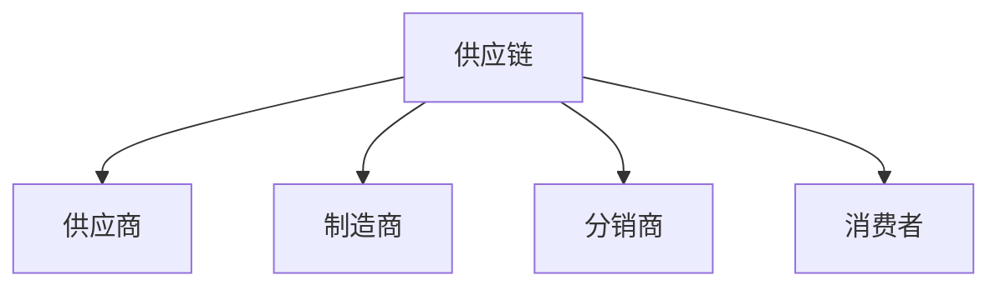
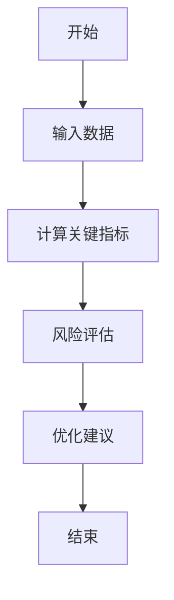
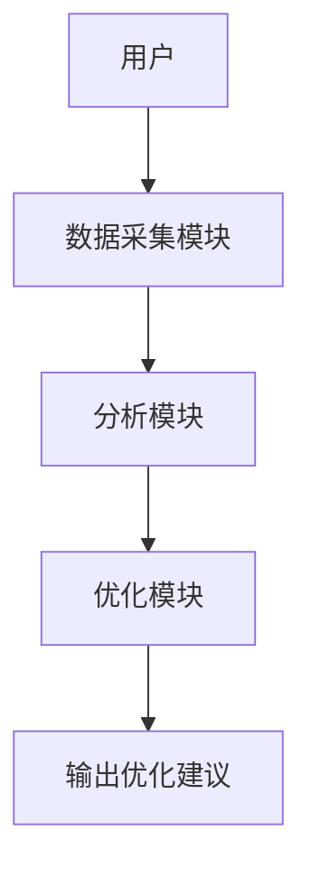
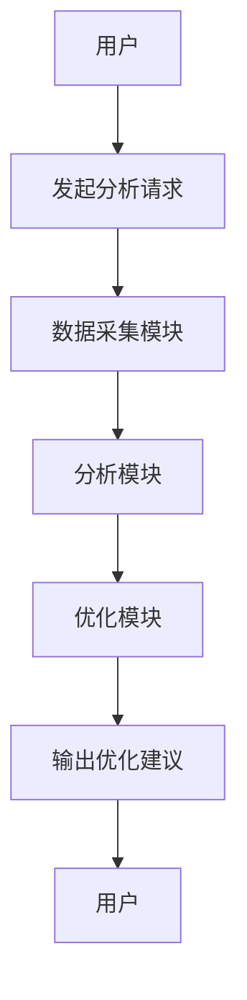

                 


# 费雪的供应链分析：全球化重构下的新思路

## 关键词
- 供应链分析
- 全球化重构
- 费雪方法
- 算法原理
- 系统架构
- 项目实战

## 摘要
本文深入探讨费雪的供应链分析方法在全球化重构背景下的应用。通过分析供应链的基本概念、全球化重构的影响，以及费雪分析方法的核心原理，结合算法实现、系统架构设计和项目实战，为读者提供全面的视角，帮助理解如何在全球化背景下优化供应链管理。

---

## 第一部分：供应链分析的背景与基础

### 第1章：供应链分析的基本概念

#### 1.1 供应链的基本概念
- **1.1.1 供应链的定义与组成**
  - 供应链是指从原材料采购到最终产品交付的整个流程，包括供应商、制造商、分销商和消费者。
  - 供应链管理的核心目标是提高效率、降低成本和确保产品交付的及时性。
- **1.1.2 供应链管理的核心目标**
  - 效率最大化：通过优化流程减少资源浪费。
  - 成本最小化：降低采购、生产和配送成本。
  - 可靠性：确保供应链的稳定性和抗风险能力。
- **1.1.3 供应链的全球化特征**
  - 全球化供应链涉及跨国采购、生产和销售，具有复杂性和多样性。

#### 1.2 全球化重构下的供应链挑战
- **1.2.1 全球化对供应链的影响**
  - 供应链的全球化使得企业能够利用不同国家的成本优势，但也带来了复杂性。
- **1.2.2 供应链重构的驱动因素**
  - 技术进步：大数据、人工智能等技术推动供应链优化。
  - 市场需求变化：消费者对个性化和快速交付的需求增加。
- **1.2.3 全球化重构中的风险与机遇**
  - 风险：全球化供应链可能面临跨国物流延迟、贸易政策变化等问题。
  - 机遇：企业可以通过全球化布局优化成本和资源利用。

#### 1.3 费雪供应链分析方法的起源
- **1.3.1 费雪供应链分析的提出背景**
  - 费雪分析方法由菲利普·费雪提出，旨在通过量化分析优化供应链管理。
- **1.3.2 费雪分析方法的核心思想**
  - 强调通过数据分析和优化模型提高供应链效率。
- **1.3.3 费雪方法与其他供应链分析方法的对比**
  - 费雪方法注重数学建模和量化分析，而其他方法可能更侧重于流程管理和经验优化。

---

## 第二部分：费雪供应链分析的核心概念与联系

### 第2章：费雪分析的核心原理

#### 2.1 费雪分析的核心原理
- **2.1.1 费雪分析的数学模型**
  - 费雪分析通过建立数学模型，量化供应链各环节的效率和成本。
  - 模型包括供应链各节点的成本、时间、质量等关键指标。
- **2.1.2 费雪分析的关键指标**
  - 效率指标：如库存周转率、订单处理时间。
  - 成本指标：如采购成本、物流成本。
  - 质量指标：如产品缺陷率、退货率。
- **2.1.3 费雪分析的步骤与流程**
  - 数据收集：收集供应链各环节的数据。
  - 指标计算：计算关键指标并进行对比分析。
  - 优化建议：根据分析结果提出优化建议。

#### 2.2 费雪分析的关键指标对比
- **2.2.1 供应链效率指标对比**
  - 表格对比不同环节的效率指标，如供应商交货时间、制造商生产效率。
- **2.2.2 成本效益分析**
  - 通过成本-效益分析，确定优化供应链的优先级。
- **2.2.3 风险评估指标**
  - 评估供应链各环节的风险，如供应商可靠性、运输风险。

#### 2.3 费雪分析的ER实体关系图


---

## 第三部分：费雪供应链分析的算法原理

### 第3章：费雪分析的算法实现

#### 3.1 费雪分析算法流程图


#### 3.2 费雪分析的Python代码实现
```python
import pandas as pd
import numpy as np

# 示例数据：供应链各环节的成本和时间
data = {
    '环节': ['供应商', '制造商', '分销商', '消费者'],
    '成本': [100, 200, 150, 0],
    '时间': [5, 10, 7, 0]
}

df = pd.DataFrame(data)

# 计算效率指标：成本/时间
df['效率'] = df['成本'] / df['时间']

# 找出效率最低的环节
min_efficiency = df['效率'].min()
lowest_efficiency = df[df['效率'] == min_efficiency]

print("效率最低的环节是：", lowest_efficiency['环节'].values[0])
print("最低效率值为：", min_efficiency)
```

#### 3.3 费雪分析的数学模型和公式
- 费雪分析的数学模型如下：
  $$ 效率 = \frac{成本}{时间} $$
  其中，成本和时间分别表示供应链各环节的总成本和所需时间。

#### 3.4 费雪分析的示例说明
- 示例：假设某供应链的供应商环节成本为100，时间为5，效率为20。
  - 制造商环节成本为200，时间为10，效率为20。
  - 分销商环节成本为150，时间为7，效率约为21.43。
  - 消费者环节无成本和时间。
  - 通过计算，发现供应商和制造商的效率相同，但分销商效率更高。

---

## 第四部分：系统分析与架构设计

### 第4章：系统分析与架构设计方案

#### 4.1 问题场景介绍
- 供应链系统需要优化库存管理、采购计划和物流配送，以应对全球化重构带来的挑战。

#### 4.2 系统功能设计
- **功能模块**：
  - 数据采集模块：收集供应链各环节的数据。
  - 分析模块：计算效率、成本和风险指标。
  - 优化模块：基于分析结果提出优化建议。

#### 4.3 系统架构设计


#### 4.4 系统接口设计
- 数据接口：与ERP系统集成，获取实时数据。
- 优化建议接口：输出优化建议到企业管理系统。

#### 4.5 系统交互设计


---

## 第五部分：项目实战

### 第5章：费雪供应链分析的项目实战

#### 5.1 环境安装
- 安装Python和相关库（如Pandas、NumPy）。
- 安装Mermaid和相关图表工具。

#### 5.2 核心代码实现
```python
import pandas as pd

# 示例数据
data = {
    '环节': ['供应商', '制造商', '分销商', '消费者'],
    '成本': [100, 200, 150, 0],
    '时间': [5, 10, 7, 0]
}

df = pd.DataFrame(data)

# 计算效率
df['效率'] = df['成本'] / df['时间']

# 可视化
import matplotlib.pyplot as plt

plt.figure(figsize=(10, 6))
plt.plot(df['环节'], df['效率'], 'o-')
plt.title('供应链各环节效率分析')
plt.xlabel('环节')
plt.ylabel('效率')
plt.show()
```

#### 5.3 案例分析
- 某制造企业的供应链分析：
  - 供应商环节效率最低，建议优化采购流程。
  - 分销商环节效率较高，但物流成本较高，建议优化配送路线。

#### 5.4 项目小结
- 通过费雪分析方法，企业能够量化供应链各环节的效率，发现瓶颈并提出优化建议。

---

## 第六部分：最佳实践与小结

### 第6章：最佳实践和小结

#### 6.1 总结
- 费雪分析方法在全球化重构背景下，为企业提供了优化供应链管理的有效工具。

#### 6.2 最佳实践
- 数据驱动：基于实时数据进行分析和优化。
- 技术支撑：利用大数据和人工智能技术提升分析效率。
- 持续改进：定期评估和优化供应链策略。

#### 6.3 注意事项
- 数据质量：确保数据的准确性和完整性。
- 模型优化：根据实际情况调整数学模型。

#### 6.4 拓展阅读
- 推荐阅读《供应链管理：流程、战略与案例》。

---

## 作者：AI天才研究院/AI Genius Institute & 禅与计算机程序设计艺术 /Zen And The Art of Computer Programming

---

通过以上结构，您可以根据实际需求进一步扩展每个部分的内容，确保文章内容的完整性和深度。

