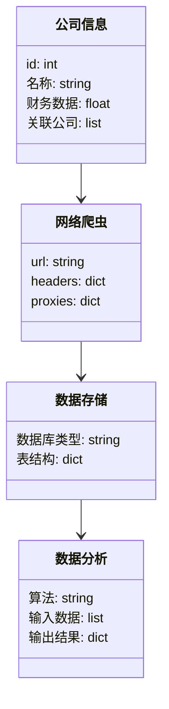
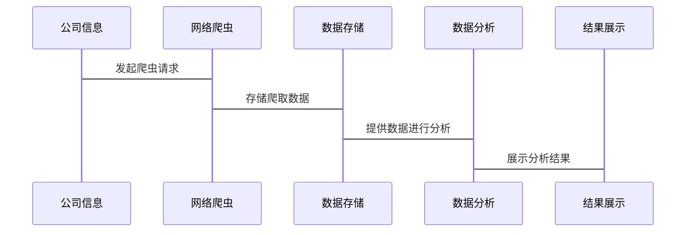

                 


# 费雪的信息网络：如何获取有价值的公司信息

> **关键词**：信息网络，公司信息，网络爬虫，文本挖掘，信息抽取，关联规则，系统架构

> **摘要**：本文详细探讨了费雪的信息网络如何帮助我们获取有价值的公司信息。通过分析信息网络的构建、核心算法、系统设计以及项目实战，本文为读者提供了从理论到实践的全面指导。文章首先介绍了信息网络的背景和重要性，然后深入讲解了信息网络的核心概念、算法原理以及系统架构设计。最后，通过一个实际案例展示了如何利用信息网络技术获取公司信息，并总结了最佳实践和注意事项。

---

# 第1章：信息网络的背景与重要性

## 1.1 信息网络的基本概念

### 1.1.1 信息网络的定义

信息网络是指通过计算机技术、互联网和数据挖掘等方法构建的，用于存储、分析和检索大量信息的网络结构。信息网络的核心在于将分散的数据通过关联关系连接起来，形成一个有机的整体。

### 1.1.2 信息网络的发展历程

信息网络的发展经历了以下几个阶段：
1. **数据存储阶段**：早期的信息网络主要用于存储和检索数据。
2. **数据关联阶段**：随着技术的进步，信息网络开始关注数据之间的关联关系。
3. **智能分析阶段**：现代信息网络结合了人工智能技术，能够自动分析和挖掘数据中的价值。

### 1.1.3 信息网络在商业中的作用

信息网络在商业中的作用不可忽视。它可以帮助企业发现潜在的商业机会、优化供应链管理、提高市场分析能力，以及提升客户服务质量。

---

## 1.2 公司信息的重要性

### 1.2.1 公司信息的分类

公司信息可以分为以下几类：
1. **公开信息**：包括公司财报、新闻报道等。
2. **内部信息**：包括公司内部文档、员工信息等。
3. **关联信息**：包括公司之间的关联关系、供应链信息等。

### 1.2.2 公司信息的来源

公司信息的主要来源包括：
1. **公开数据**：如公司官网、新闻媒体。
2. **数据库**：如公司内部数据库、政府公开数据。
3. **网络爬取**：通过网络爬虫技术获取公开可用的数据。

### 1.2.3 公司信息在商业决策中的作用

公司信息在商业决策中的作用体现在以下几个方面：
1. **市场分析**：通过分析竞争对手的信息，制定更有效的市场策略。
2. **风险评估**：通过分析公司的财务状况，评估投资风险。
3. **供应链优化**：通过分析供应链中的信息，优化物流和库存管理。

---

## 1.3 信息网络的现状与趋势

### 1.3.1 当前信息网络的发展现状

当前，信息网络技术已经得到了广泛的应用。企业通过信息网络技术，可以实时获取和分析大量的公司信息，从而提高决策效率。

### 1.3.2 信息网络的未来趋势

未来，信息网络将朝着以下几个方向发展：
1. **智能化**：结合人工智能技术，实现信息的自动分析和预测。
2. **实时化**：通过实时数据流处理技术，实现信息的实时更新和分析。
3. **全球化**：信息网络将覆盖全球，实现跨国公司的信息共享和分析。

### 1.3.3 技术进步对信息网络的影响

技术进步对信息网络的影响主要体现在以下几个方面：
1. **数据存储技术**：大数据技术的发展使得信息网络能够存储和处理海量数据。
2. **数据分析技术**：机器学习和深度学习技术的应用，使得信息网络能够更智能地分析数据。
3. **网络技术**：5G和物联网技术的发展，使得信息网络的实时性和连通性更强。

---

## 1.4 信息网络的核心要素

### 1.4.1 数据的准确性

数据的准确性是信息网络的核心要素之一。只有准确的数据才能保证分析结果的可靠性。

### 1.4.2 数据的完整性

数据的完整性是指信息网络中数据的全面性。完整性不足可能导致分析结果的偏差。

### 1.4.3 数据的实时性

数据的实时性是指信息网络能够实时更新和获取最新的数据。实时性越强，分析结果越准确。

---

## 1.5 本章小结

本章主要介绍了信息网络的背景和重要性，分析了公司信息的分类和来源，以及信息网络的现状与未来趋势。通过本章的学习，读者可以了解信息网络的基本概念和其在商业中的作用。

---

# 第2章：信息网络的核心概念

## 2.1 信息网络的组成部分

### 2.1.1 数据节点

数据节点是信息网络中的基本单元，代表具体的公司、产品或事件等信息。

### 2.1.2 关系边

关系边描述了数据节点之间的关联关系，例如“公司A与公司B是竞争对手”。

### 2.1.3 网络结构

网络结构描述了数据节点和关系边的组织方式，常见的网络结构包括树状结构、网状结构和分层结构。

---

## 2.2 信息网络的结构模型

### 2.2.1 分层结构

分层结构将信息网络分为多个层次，每一层代表不同的信息类别。

### 2.2.2 网状结构

网状结构描述了数据节点之间的复杂关联关系。

### 2.2.3 树状结构

树状结构描述了数据节点的层级关系。

---

## 2.3 信息网络的数据类型

### 2.3.1 结构化数据

结构化数据是指可以组织成表格形式的数据，例如公司财报。

### 2.3.2 非结构化数据

非结构化数据是指没有固定结构的数据，例如新闻报道。

### 2.3.3 半结构化数据

半结构化数据是指部分结构化的数据，例如JSON格式的数据。

---

## 2.4 信息网络的分析方法

### 2.4.1 数据挖掘

数据挖掘是指从大量数据中提取有价值的信息的过程。

### 2.4.2 关联规则挖掘

关联规则挖掘用于发现数据之间的关联关系，例如“购买商品A的顾客往往会购买商品B”。

### 2.4.3 社会网络分析

社会网络分析用于研究网络中的关系结构，例如公司之间的合作关系。

---

## 2.5 本章小结

本章主要介绍了信息网络的核心概念，包括信息网络的组成部分、结构模型和数据类型，以及信息网络的分析方法。通过本章的学习，读者可以了解信息网络的构成和分析方法。

---

# 第3章：信息网络的算法与实现

## 3.1 网络爬虫算法

### 3.1.1 网络爬虫的基本原理

网络爬虫是一种用于从互联网上抓取数据的自动化工具。其基本原理如下：

1. **请求页面**：向目标网站发送HTTP请求，获取页面内容。
2. **解析页面**：通过HTML解析技术，提取页面中的有用信息。
3. **存储数据**：将提取的信息存储到数据库中。
4. **处理异常**：处理爬虫过程中可能出现的异常情况，例如反爬机制。

### 3.1.2 网络爬虫的实现步骤

以下是网络爬虫的实现步骤：

1. **选择目标网站**：确定要爬取的目标网站。
2. **编写爬虫代码**：使用Python的`requests`库发送HTTP请求，获取页面内容。
3. **页面解析**：使用`BeautifulSoup`或`lxml`等工具解析页面内容，提取有用信息。
4. **数据存储**：将提取的信息存储到数据库中，例如MySQL或MongoDB。
5. **优化爬虫**：设置爬虫的频率和策略，避免被目标网站封禁。

### 3.1.3 网络爬虫的优化方法

为了提高爬虫的效率和稳定性，可以采取以下优化方法：
1. **设置爬虫间隔**：避免过于频繁地请求页面，导致被封。
2. **使用代理IP**：通过代理IP隐藏真实IP地址，避免被封。
3. **处理反爬机制**：通过模拟浏览器行为，绕过目标网站的反爬机制。

---

## 3.2 文本挖掘算法

### 3.2.1 文本预处理

文本预处理是文本挖掘的第一步，主要包括以下步骤：
1. **分词**：将文本分割成词语或短语。
2. **去停用词**：去除常见的停用词，例如“的”、“了”等。
3. **词干提取**：将词语转换为其词干形式，例如“running”转换为“run”。

### 3.2.2 文本分词

文本分词是将文本分割成词语或短语的过程。常用的分词工具包括`jieba`（中文分词）和`nltk`（英文分词）。

### 3.2.3 文本分类

文本分类是将文本划分为不同类别的过程。常用的文本分类算法包括朴素贝叶斯、支持向量机（SVM）和随机森林等。

---

## 3.3 信息抽取算法

### 3.3.1 基于规则的信息抽取

基于规则的信息抽取是通过预定义的规则，从文本中提取特定信息。例如，可以从新闻标题中提取公司名称。

### 3.3.2 基于统计的信息抽取

基于统计的信息抽取是通过统计学方法，从文本中发现模式和关联关系。例如，可以使用条件概率方法提取实体关系。

### 3.3.3 基于深度学习的信息抽取

基于深度学习的信息抽取是利用神经网络模型，例如LSTM和BERT，从文本中提取信息。这种方法具有较高的准确率，但需要大量的训练数据。

---

## 3.4 关联分析算法

### 3.4.1 频繁项集挖掘

频繁项集挖掘用于发现数据中的频繁项集，例如关联规则挖掘中的“频繁项集”。

### 3.4.2 关联规则挖掘

关联规则挖掘用于发现数据中的关联规则，例如“购买商品A的顾客往往会购买商品B”。

### 3.4.3 高效关联规则挖掘算法

高效的关联规则挖掘算法包括Apriori算法和FP-Growth算法。Apriori算法通过递归地生成频繁项集，而FP-Growth算法则通过构建Fp树来高效地挖掘频繁项集。

---

## 3.5 本章小结

本章主要介绍了信息网络的算法与实现，包括网络爬虫、文本挖掘和信息抽取等算法。通过本章的学习，读者可以了解信息网络的实现方法和技术细节。

---

# 第4章：信息网络的系统设计与实现

## 4.1 系统功能设计

### 4.1.1 领域模型

以下是信息网络系统的领域模型：



### 4.1.2 系统架构设计

以下是信息网络系统的架构设计：


### 4.1.3 系统接口设计

以下是信息网络系统的接口设计：



---

## 4.2 本章小结

本章主要介绍了信息网络的系统设计与实现，包括系统功能设计、架构设计和接口设计。通过本章的学习，读者可以了解信息网络系统的整体架构和实现流程。

---

# 第5章：信息网络的项目实战

## 5.1 项目背景与目标

### 5.1.1 项目背景

本项目旨在通过信息网络技术，构建一个公司信息爬虫系统，能够从互联网上自动获取和分析公司信息。

### 5.1.2 项目目标

项目目标包括：
1. 实现公司信息的自动爬取。
2. 提供公司信息的分析功能。
3. 展示公司信息的可视化结果。

---

## 5.2 项目实现

### 5.2.1 环境安装

以下是项目所需的环境和工具：
1. **Python**：编程语言。
2. **requests**：HTTP请求库。
3. **BeautifulSoup**：HTML解析库。
4. **MongoDB**：数据库。
5. **Jupyter Notebook**：开发环境。

### 5.2.2 核心代码实现

以下是项目的核心代码：

```python
import requests
from bs4 import BeautifulSoup
import pymongo

# 连接MongoDB数据库
client = pymongo.MongoClient("mongodb://localhost:27017/")
db = client["company_info"]
collection = db["companies"]

# 定义爬虫函数
def fetch_company_info(url):
    headers = {
        "User-Agent": "Mozilla/5.0 (Windows NT 10.0; Win64; x64) AppleWebKit/537.36 (KHTML, like Gecko) Chrome/58.0.3029.113 Safari/537.3"
    }
    response = requests.get(url, headers=headers)
    soup = BeautifulSoup(response.text, "html.parser")
    company_name = soup.find("h1").text
    return company_name

# 执行爬虫
url = "https://www.example.com/company"
company_name = fetch_company_info(url)
print(f"公司名称：{company_name}")

# 存储到数据库
collection.insert_one({"name": company_name})
```

### 5.2.3 项目案例分析

以下是项目案例分析：

假设我们爬取了以下公司的信息：
- **公司A**：名称为“公司A”，财务数据为100万。
- **公司B**：名称为“公司B”，财务数据为200万。

通过关联规则挖掘，我们发现公司A和公司B之间存在竞争关系。

---

## 5.3 项目总结

通过本项目，我们成功实现了公司信息的自动爬取和分析。项目的实现过程包括环境搭建、爬虫开发、数据存储和数据分析等步骤。通过本项目的实践，读者可以掌握信息网络技术的实现方法。

---

# 第6章：信息网络的最佳实践与注意事项

## 6.1 最佳实践

### 6.1.1 合法性与道德性

在进行信息网络技术开发时，必须遵守相关法律法规，确保数据的合法性和道德性。

### 6.1.2 数据质量管理

数据质量管理是信息网络技术的重要环节，包括数据清洗、数据验证和数据标准化等步骤。

### 6.1.3 系统优化

系统优化包括性能优化、资源优化和代码优化等，以提高系统的运行效率和稳定性。

---

## 6.2 注意事项

### 6.2.1 避免反爬机制

在进行网络爬虫开发时，必须注意避免触发目标网站的反爬机制，例如设置合理的爬虫频率和使用代理IP。

### 6.2.2 数据隐私保护

在进行数据存储和分析时，必须保护数据的隐私性和安全性，避免数据泄露和滥用。

### 6.2.3 系统维护

系统维护包括定期更新软件、修复漏洞和优化系统性能等，以确保系统的长期稳定运行。

---

## 6.3 本章小结

本章主要介绍了信息网络技术开发的最佳实践和注意事项，包括合法性与道德性、数据质量管理、系统优化等。通过本章的学习，读者可以更好地进行信息网络技术的开发和应用。

---

# 结语

信息网络技术是一项重要的技术，能够帮助我们获取和分析大量的公司信息。通过本文的学习，读者可以掌握信息网络的核心概念、算法原理和系统设计方法。同时，通过实际案例的分析，读者可以更好地理解信息网络技术的实现和应用。希望本文能够为读者在信息网络技术领域提供有价值的参考和指导。

---

**作者：AI天才研究院/AI Genius Institute & 禅与计算机程序设计艺术 /Zen And The Art of Computer Programming**

