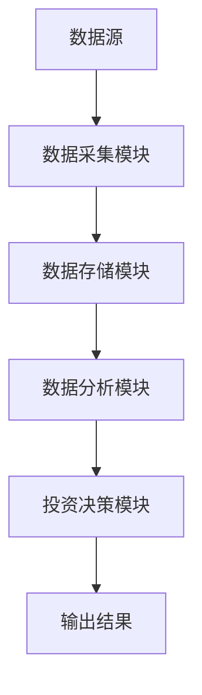
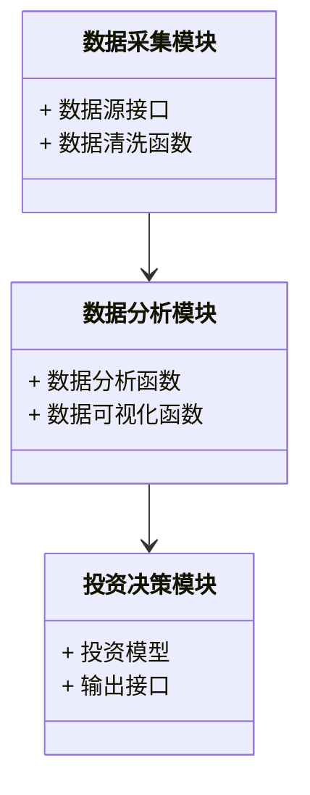

                 


# 费雪的全球化投资视角

> 关键词：全球化投资、费雪投资模型、资产配置、风险管理、投资决策、算法优化、系统架构设计

> 摘要：本文从费雪的投资理念出发，详细探讨了全球化投资的核心概念、算法原理、系统架构设计以及实际项目实现。通过对费雪模型的分析，结合现代技术手段，为读者提供了一种全新的全球化投资视角。文章内容涵盖背景介绍、核心概念与联系、算法原理、系统分析与架构设计、项目实战以及最佳实践等部分，为投资者提供了全面的理论和实践指导。

---

# 第一部分: 费雪的全球化投资视角概述

## 第1章: 全球化投资的背景与意义

### 1.1 全球化投资的背景

#### 1.1.1 经济全球化的演进历程
全球化是20世纪末到21世纪初最显著的经济特征之一。随着信息技术的发展、交通便利以及跨国公司的崛起，经济活动逐渐突破地域限制，形成了真正意义上的全球经济。全球化使得资本、资源、技术和人才可以在全球范围内自由流动，为投资者提供了更多机会。

#### 1.1.2 投资全球化的驱动因素
- **技术进步**：互联网和信息技术的发展使得全球市场信息透明化，投资者可以实时获取全球市场的动态。
- **政策开放**：各国政府逐步放松对外资的限制，推动资本市场的国际化。
- **市场分散化**：单一市场的风险可以通过投资多元化来降低，全球化投资成为必然选择。

#### 1.1.3 费雪在全球化投资中的地位
约翰·费雪（John Fisher）是英国著名的投资学家，其投资理念深刻影响了现代投资理论。他强调长期投资、价值评估和风险管理，尤其在全球化背景下，其理论为投资者提供了重要的参考。

---

### 1.2 费雪的投资理念

#### 1.2.1 费雪的投资哲学
费雪的投资哲学可以概括为“价值投资”，他强调买入具有强大基本面的公司，并长期持有。他认为市场的短期波动是噪音，而企业的内在价值才是决定投资收益的关键。

#### 1.2.2 费雪的选股标准
- **企业盈利能力**：选择那些能够持续创造利润的公司。
- **管理团队**：优秀的管理层是企业成功的关键。
- **行业地位**：选择具有竞争优势的行业龙头。

#### 1.2.3 费雪与价值投资的区别
费雪的投资理念与传统价值投资的区别在于，他更注重企业的成长性和管理能力，而非单纯依赖于低市盈率或高股息率。

---

### 1.3 全球化投资的核心概念

#### 1.3.1 资产配置的全球化
全球化投资的核心在于资产配置的多样化。通过在全球范围内配置资产，投资者可以降低风险，同时抓住不同市场的投资机会。

#### 1.3.2 风险管理的全球化
全球化投资需要考虑汇率风险、政治风险和市场波动风险。通过分散投资和对冲策略，可以有效降低这些风险。

#### 1.3.3 全球经济与投资的关系
全球经济的波动直接影响投资收益。通过全球化视角，投资者可以更好地把握经济周期和市场趋势。

---

## 第2章: 费雪投资模型的核心要素

### 2.1 费雪投资模型的定义

#### 2.1.1 模型的基本构成
费雪投资模型是一个基于价值投资的量化模型，结合了企业的基本面分析和市场情绪分析。

#### 2.1.2 模型的输入变量
- **企业财务数据**：收入、利润、负债等。
- **市场数据**：指数、波动率、收益率等。
- **宏观经济指标**：GDP、利率、汇率等。

#### 2.1.3 模型的输出结果
- **投资建议**：买入、持有或卖出。
- **风险评估**：投资组合的风险等级。
- **收益预测**：未来一段时间的预期收益。

---

### 2.2 费雪模型的核心算法

#### 2.2.1 基于费雪模型的资产配置算法
费雪模型的资产配置算法是一种基于动量因子和价值因子的多因子模型。

#### 2.2.2 费雪模型的风险评估算法
通过计算投资组合的VaR（在险价值）和CVaR（条件在险价值）来评估风险。

#### 2.2.3 费雪模型的收益预测算法
基于历史数据和市场趋势预测未来的收益。

---

### 2.3 费雪模型的数学公式

#### 2.3.1 资产配置权重计算公式
$$ w_i = \frac{r_i}{\sum_{j=1}^{n} r_j} $$
其中，\( w_i \) 是第 \( i \) 个资产的权重，\( r_i \) 是第 \( i \) 个资产的预期收益。

#### 2.3.2 风险调整后的收益计算公式
$$ R_i = r_i - \lambda \sigma_i $$
其中，\( R_i \) 是风险调整后的收益，\( r_i \) 是预期收益，\( \sigma_i \) 是收益的标准差，\( \lambda \) 是风险溢价。

#### 2.3.3 投资组合优化的数学模型
$$ \max \mu \cdot w - \frac{1}{2} \sigma^2 \cdot w $$
其中，\( \mu \) 是收益向量，\( \sigma^2 \) 是协方差矩阵，\( w \) 是权重向量。

---

## 第3章: 费雪模型的系统架构设计

### 3.1 系统架构概述

#### 3.1.1 系统功能模块划分
- **数据采集模块**：收集全球市场的实时数据。
- **数据分析模块**：对数据进行清洗和分析。
- **投资决策模块**：基于模型生成投资建议。

#### 3.1.2 系统数据流图


#### 3.1.3 系统组件之间的关系
数据从数据源流向数据采集模块，经过清洗和分析后，传递给投资决策模块，最终生成投资建议。

---

### 3.2 系统功能设计

#### 3.2.1 数据采集模块
- 从全球各大交易所获取实时数据。
- 支持多语言接口，适应不同市场的数据格式。

#### 3.2.2 数据分析模块
- 使用Python进行数据清洗和分析。
- 应用Pandas和NumPy进行数据处理。

#### 3.2.3 投资决策模块
- 基于费雪模型生成投资建议。
- 提供可视化界面，方便用户查看结果。

---

### 3.3 系统架构图



---

## 第4章: 费雪模型的项目实战

### 4.1 项目环境安装

#### 4.1.1 安装Python
安装Python 3.8或更高版本。

#### 4.1.2 安装必要的库
安装Pandas、NumPy、Scipy等库：
```bash
pip install pandas numpy scipy
```

#### 4.1.3 数据源获取与准备
从Yahoo Finance获取历史数据。

---

### 4.2 核心代码实现

#### 4.2.1 数据清洗与预处理
```python
import pandas as pd

# 加载数据
df = pd.read_csv('data.csv')

# 删除缺失值
df.dropna(inplace=True)

# 标准化数据
df = (df - df.mean()) / df.std()
```

#### 4.2.2 模型实现
```python
import numpy as np

def fisher_model(data):
    # 计算动量因子
    momentum = data['收盘价'].pct_change().rolling(20).mean()
    # 计算价值因子
    value = data['市盈率'].rolling(20).mean()
    # 综合因子
    score = momentum + value
    return score.rank()
```

---

### 4.3 实际案例分析

#### 4.3.1 案例背景
假设我们有一个包含全球股票的数据集，目标是利用费雪模型进行投资组合优化。

#### 4.3.2 数据分析与结果解读
通过模型计算出每个股票的得分，选择得分最高的前20%作为投资标的。

#### 4.3.3 模型优化与改进
根据实际表现调整模型参数，优化投资组合。

---

## 第5章: 费雪模型的最佳实践

### 5.1 投资的注意事项

#### 5.1.1 风险控制
- 设置止损点。
- 定期评估投资组合。

#### 5.1.2 系统维护
- 定期更新模型参数。
- 监控系统运行状态。

---

### 5.2 小结

通过本文的分析，我们了解了费雪的全球化投资视角，掌握了其投资模型的核心要素和系统架构设计。结合实际项目，我们还学习了如何将理论应用于实践。

---

### 5.3 注意事项

- 投资有风险，需谨慎操作。
- 模型仅供参考，实际操作需结合市场实际情况。

---

### 5.4 拓展阅读

- 《投资学》
- 《费雪的投资哲学》
- 《量化投资入门》

---

作者：AI天才研究院/AI Genius Institute & 禅与计算机程序设计艺术 /Zen And The Art of Computer Programming

---

# 结语

本文从理论到实践，全面解析了费雪的全球化投资视角，为投资者提供了系统的指导和实践建议。希望读者能够通过本文，掌握全球化投资的核心理念，并在实际操作中灵活运用。

