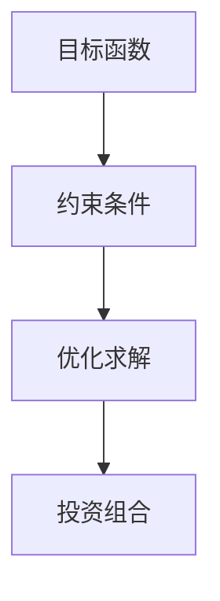

                 


# 《费雪的全球化投资视角》

**关键词：** 费雪投资理论、全球化投资、投资策略、风险管理、资产配置、数学模型

**摘要：** 本文将从费雪的经典投资理论出发，结合全球化背景，系统地分析全球化投资的核心策略、数学模型、系统架构与实际案例。通过详细讲解费雪理论的全球化视角，帮助读者掌握如何在全球化市场中进行有效的投资决策。文章内容涵盖背景介绍、核心概念、算法原理、数学模型、系统架构设计、项目实战以及最佳实践，旨在为读者提供一个全面的全球化投资视角。

---

# {{此处是文章标题}}

> 关键词：{{此处列出文章的5-7个核心关键词}}

> 摘要：{{此处给出文章的核心内容和主题思想}}

---

# 第一部分: 费雪投资理论与全球化投资视角

# 第1章: 费雪投资理论概述

## 1.1 费雪投资理论的起源与发展

### 1.1.1 费雪投资理论的背景

### 1.1.2 费雪投资理论的核心思想

### 1.1.3 全球化对投资理论的影响

## 1.2 费雪投资理论的核心概念

### 1.2.1 投资的定义与分类

### 1.2.2 费雪投资理论的核心要素

### 1.2.3 全球化投资的背景与特点

## 1.3 费雪投资理论的全球化视角

### 1.3.1 全球化投资的兴起

### 1.3.2 费雪理论在全球化背景下的应用

### 1.3.3 全球化投资的优势与挑战

## 1.4 本章小结

---

# 第2章: 全球化投资策略与分析框架

## 2.1 全球化投资的基本策略

### 2.1.1 费雪投资策略的全球化扩展

### 2.1.2 跨国市场的投资机会

### 2.1.3 全球化投资的组合优化

## 2.2 全球化投资的分析框架

### 2.2.1 宏观经济分析

### 2.2.2 行业分析与公司分析

### 2.2.3 风险管理与资产配置

## 2.3 全球化投资的案例分析

### 2.3.1 典型跨国公司的投资分析

### 2.3.2 全球化市场波动的应对策略

### 2.3.3 费雪理论在实际投资中的应用

## 2.4 本章小结

---

# 第3章: 费雪投资理论的数学模型与算法

## 3.1 投资组合优化的数学模型

### 3.1.1 投资组合优化的基本公式

$$ \text{目标函数：} \quad \min_{w} w^T \Sigma w $$
$$ \text{约束条件：} \quad \sum_{i=1}^n w_i = 1 $$

### 3.1.2 费雪投资模型的扩展

## 3.2 费雪投资模型的算法实现

### 3.2.1 投资组合优化的步骤



## 3.3 投资组合优化的数学模型

### 3.3.1 投资组合优化的数学公式

$$ \text{夏普比率} = \frac{E(r_i - r_f)}{\sigma_i} $$

### 3.3.2 费雪投资模型的数学推导

---

# 第4章: 全球化投资的系统架构与风险管理

## 4.1 投资系统的功能设计

### 4.1.1 投资系统功能模块

## 4.2 投资系统的架构设计

### 4.2.1 系统架构图


## 4.3 投资系统的风险管理

### 4.3.1 风险管理策略

### 4.3.2 系统风险管理的实现

---

# 第5章: 项目实战——费雪全球化投资模型的实现

## 5.1 项目环境安装与配置

### 5.1.1 安装必要的依赖

## 5.2 系统核心实现源代码

### 5.2.1 投资组合优化的Python代码

```python
import numpy as np

def optimize_portfolio(cov_matrix, returns):
    n = len(returns)
    # 定义目标函数
    def objective(w):
        return (w.T @ cov_matrix @ w)[0,0]
    # 定义约束条件
    constraints = ({'type': 'eq', 'fun': lambda w: np.sum(w) - 1})
    # 使用SLSQP求解
    from scipy.optimize import minimize
    result = minimize(objective, np.ones(n)/n, method='SLSQP', constraints=constraints)
    return result.x
```

## 5.3 代码应用解读与分析

### 5.3.1 代码实现的功能

### 5.3.2 代码的优化与改进

---

# 第6章: 全球化投资的系统交互与案例分析

## 6.1 系统交互设计

### 6.1.1 系统交互流程图


## 6.2 全球化投资的案例分析

### 6.2.1 案例背景介绍

### 6.2.2 投资组合优化的过程

### 6.2.3 投资结果与分析

---

# 第7章: 总结与最佳实践

## 7.1 本章总结

### 7.1.1 费雪全球化投资理论的核心要点

### 7.1.2 全球化投资的关键策略

## 7.2 最佳实践 tips

### 7.2.1 投资前的准备工作

### 7.2.2 风险管理的注意事项

### 7.2.3 长期投资的重要性

## 7.3 项目小结

### 7.3.1 项目成果

### 7.3.2 项目经验总结

---

**作者：AI天才研究院/AI Genius Institute & 禅与计算机程序设计艺术 /Zen And The Art of Computer Programming**

