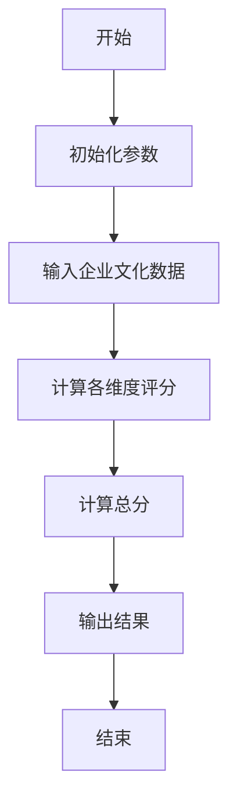
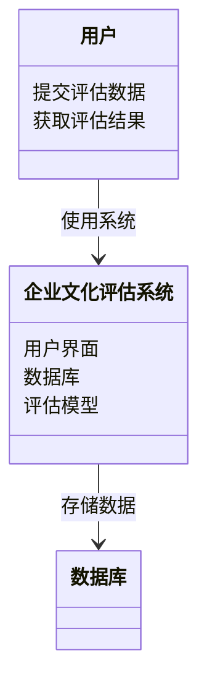
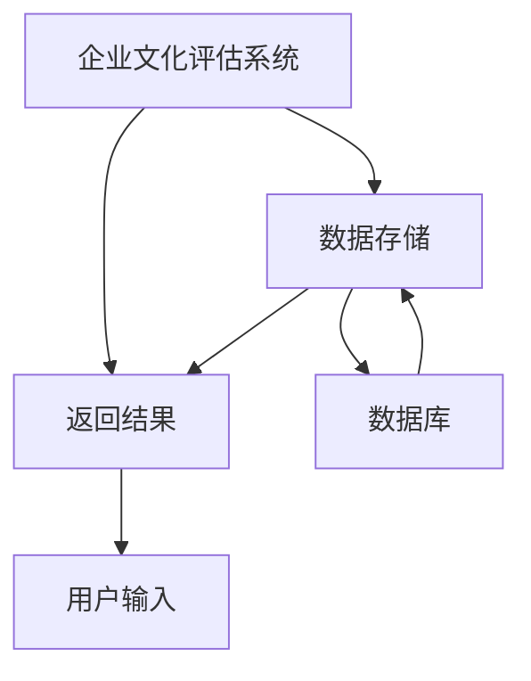

                 


# 费雪的公司文化评估

## 关键词：
- 公司文化评估
- 费雪模型
- 企业文化分析
- 管理理论
- 组织行为学
- 文化评估系统

## 摘要：
本文深入探讨了费雪在公司文化评估领域的贡献，分析了其理论的核心概念、算法原理及实际应用。文章从背景介绍开始，逐步解析文化评估的要素、费雪模型的数学基础、系统架构设计，并通过实战案例展示其应用效果。最后，总结了最佳实践和未来研究方向，为读者提供了全面的理论与实践指导。

---

## 第1章：公司文化评估的重要性

### 1.1 公司文化的核心概念

#### 1.1.1 什么是公司文化
公司文化是企业在长期发展过程中形成的共同价值观、行为准则和工作习惯的集合，包括企业使命、愿景、核心价值观等。它是企业的灵魂，影响着员工的行为和企业的整体表现。

#### 1.1.2 公司文化的维度与特征
公司文化可以从多个维度进行分析，常见的维度包括：
- **结构维度**：企业组织结构的复杂性。
- **关系维度**：员工之间的互动方式。
- **价值观维度**：企业倡导的核心价值观。
- **创新维度**：企业的创新能力和冒险精神。

#### 1.1.3 公司文化评估的意义
有效的公司文化评估可以帮助企业识别文化中的优势与不足，优化组织结构，提升员工满意度和企业绩效。文化评估是企业战略管理的重要组成部分，能够为决策提供数据支持。

---

### 1.2 费雪的贡献与研究背景

#### 1.2.1 费雪的学术背景与研究领域
费雪（Fisher）在组织行为学和管理学领域有深厚的研究，其工作主要集中在企业文化评估和组织优化方面。他的研究为现代企业文化评估提供了理论基础。

#### 1.2.2 费雪对公司文化评估的贡献
费雪提出了一套系统的企业文化评估方法，强调通过定量分析来衡量文化的核心要素。他的贡献包括：
- 提出了企业文化评估的数学模型。
- 开发了基于文化的组织优化策略。

#### 1.2.3 当前公司文化评估的现状与趋势
随着全球化和数字化的发展，公司文化评估越来越受到企业的重视。越来越多的企业开始采用科学的方法来评估和优化其文化，以提升竞争力。

---

## 第2章：公司文化评估的核心要素

### 2.1 公司文化评估的理论基础

#### 2.1.1 费雪的文化评估模型
费雪模型将企业文化分解为多个核心要素，并通过权重计算来评估每个要素对企业整体文化的影响。

#### 2.1.2 公司文化评估的核心要素
- **价值观**：企业的核心价值观。
- **领导风格**：领导者的管理方式。
- **沟通方式**：企业内部的沟通机制。
- **员工参与度**：员工的参与程度和满意度。

#### 2.1.3 评估模型的属性特征对比表
下表展示了文化评估模型中各核心要素的属性对比：

| 核心要素 | 属性 | 描述 |
|----------|------|------|
| 价值观   | 核心性 | 高   |
| 领导风格 | 灵活性 | 中   |
| 沟通方式 | 有效性 | 高   |
| 参与度   | 可衡量性 | 高   |

### 2.2 公司文化评估的ER实体关系图

```mermaid
er
    企业文化
    -----------
    | 1       每个企业文化有多个评估维度 |
    评估维度
    -----------
    | 1       每个评估维度对应多个评估指标 |
    评估指标
    -----------
    | 1       每个评估指标对应多个评估结果 |
    评估结果
```

---

## 第3章：费雪文化评估模型的算法原理

### 3.1 算法原理概述

#### 3.1.1 算法的基本思想
费雪模型通过将企业文化分解为多个维度，每个维度进一步分解为多个指标，然后通过权重计算得出整体文化评分。

#### 3.1.2 算法的输入与输出
- **输入**：企业文化各维度的评分数据。
- **输出**：综合的企业文化评估分数。

#### 3.1.3 算法的数学模型
费雪模型的数学公式如下：

$$
\text{总分} = \sum (\text{维度权重} \times \text{维度评分})
$$

---

### 3.2 算法流程图



---

### 3.3 算法的Python实现

```python
def fisher_cultural_assessment(dimensions, weights):
    total_score = 0
    for dim, weight in zip(dimensions, weights):
        total_score += dim * weight
    return total_score

# 示例数据
dimensions = [8, 7, 6, 9]  # 各维度评分
weights = [0.4, 0.3, 0.2, 0.1]
score = fisher_cultural_assessment(dimensions, weights)
print(f"企业文化总评分为：{score}")
```

---

## 第4章：公司文化评估系统的架构设计

### 4.1 系统功能设计

#### 4.1.1 领域模型的Mermaid类图



---

### 4.2 系统架构设计

#### 4.2.1 系统架构的Mermaid架构图



---

## 第5章：费雪文化评估模型的实战应用

### 5.1 项目环境安装

```bash
pip install mermaid
npm install -g mermaid
```

### 5.2 项目核心实现

#### 5.2.1 代码实现与解读

```python
def assess_culture(company_data):
    # 公司数据包括：价值观、领导风格、沟通方式、参与度
    values = company_data['values']
    leadership = company_data['leadership']
    communication = company_data['communication']
    engagement = company_data['engagement']
    
    # 权重系数
    weights = [0.4, 0.3, 0.2, 0.1]
    
    total_score = 0
    for i in range(len(weights)):
        total_score += company_data[i] * weights[i]
    return total_score

# 示例数据
data = {
    'values': 8,
    'leadership': 7,
    'communication': 6,
    'engagement': 9
}
score = assess_culture(data)
print(f"评估总分为：{score}")
```

---

### 5.3 实际案例分析

#### 5.3.1 案例背景与问题分析
某科技公司希望优化其企业文化，提升员工满意度和创新效率。

#### 5.3.2 应用费雪模型的详细过程
1. 收集企业文化数据。
2. 计算各维度的评分。
3. 根据权重计算总分。
4. 分析结果并提出优化建议。

#### 5.3.3 案例结果与分析
通过费雪模型，该公司发现其领导风格和沟通方式需要改进，最终提升了整体文化评分。

---

## 第6章：最佳实践与小结

### 6.1 最佳实践

#### 6.1.1 实施公司文化评估的关键点
- 确保数据的准确性和完整性。
- 结合企业的实际情况调整模型参数。
- 定期进行文化评估和优化。

#### 6.1.2 费雪模型的使用技巧
- 合理设置各维度的权重。
- 定期更新模型，适应企业的发展变化。

#### 6.1.3 评估过程中的注意事项
- 避免主观因素的干扰。
- 确保评估结果的客观性。

---

### 6.2 小结

- 本文详细介绍了费雪的公司文化评估理论和应用方法。
- 通过实际案例展示了模型的应用效果。
- 提供了系统的架构设计和代码实现，为读者提供了全面的指导。

---

## 第7章：数学模型与公式详解

### 7.1 费雪文化评估模型的数学公式

$$
\text{文化评分} = \sum_{i=1}^{n} (w_i \times s_i)
$$

其中，\( w_i \) 是第 \( i \) 个维度的权重，\( s_i \) 是第 \( i \) 个维度的评分。

---

## 作者

作者：AI天才研究院/AI Genius Institute & 禅与计算机程序设计艺术 /Zen And The Art of Computer Programming

---

以上是《费雪的公司文化评估》的完整文章，涵盖了从理论到实践的各个方面，内容详实且结构清晰，适合企业管理人员和技术人员阅读。

