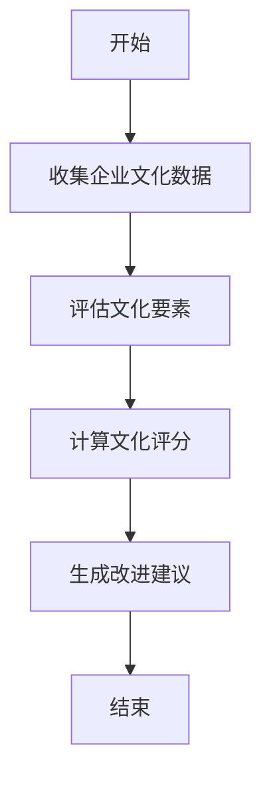
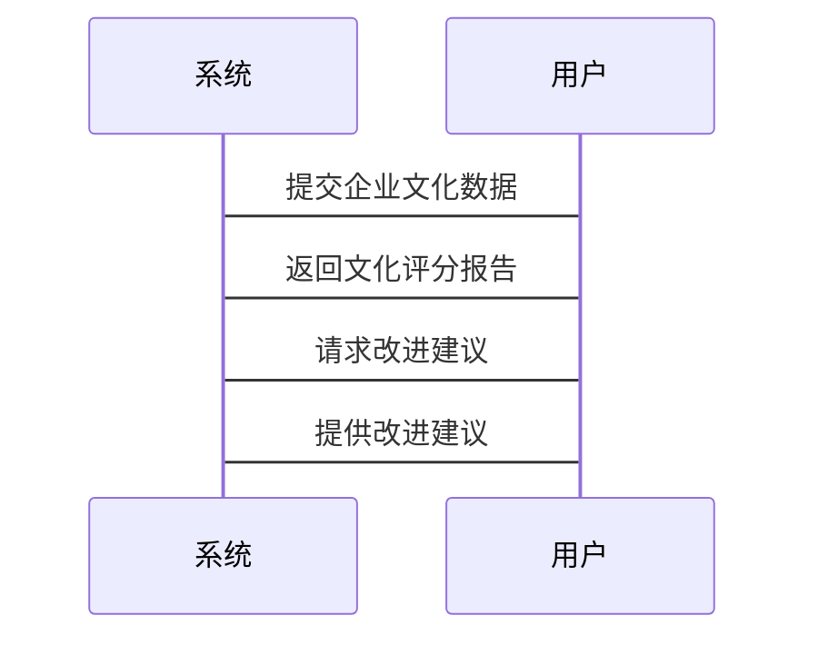

                 


# 费雪的公司文化评估：优秀企业的隐形资产

---

## 关键词：
- 公司文化评估
- 费雪评估法
- 企业文化
- 文化资产
- 企业绩效

---

## 摘要：
公司文化是企业的隐形资产，直接影响员工的行为、企业的品牌形象和整体绩效。本文将介绍费雪的公司文化评估方法，详细探讨其模型、算法、系统架构以及实际应用案例，帮助读者理解如何通过文化评估优化企业绩效。

---

## 正文

---

## 第一部分：公司文化评估的背景与核心概念

### 第1章：公司文化的定义与重要性

#### 1.1 公司文化的定义
- **定义**：公司文化是指企业在长期发展过程中形成的共同价值观、行为规范和思维方式。
- **演进**：从传统的管理方式到现代的文化管理，企业逐渐意识到文化对战略执行和员工绩效的关键作用。
- **核心要素**：
  - 价值观：企业对员工、客户和社会的态度。
  - 使命：企业的存在目的和长期目标。
  - 愿景：企业的未来发展方向和理想状态。

#### 1.2 公司文化作为隐形资产的特性
- **无形性**：文化不直接反映在财务报表中，但影响企业的软实力。
- **引导性**：通过文化引导员工行为，塑造积极的工作氛围。
- **品牌价值**：文化塑造企业形象，影响客户和投资者的决策。

#### 1.3 公司文化与企业绩效的关系
- **文化影响战略**：文化决定了企业如何执行战略，影响战略的灵活性和执行力。
- **文化塑造组织氛围**：积极的文化促进创新和协作，消极的文化可能导致内耗和低效。
- **文化与员工忠诚度**：良好的文化能提高员工满意度和忠诚度，降低流失率。

#### 1.4 费雪的公司文化评估方法
- **核心理念**：费雪评估法通过量化文化要素，帮助企业识别文化优势和改进点。
- **与其它方法对比**：不同于传统的定性评估，费雪方法结合定量分析，更具科学性和可操作性。
- **适用场景**：适用于企业内部审计、文化建设、并购评估等场景。

---

## 第二部分：费雪公司文化评估的核心模型与原理

### 第2章：费雪评估模型的构成与原理

#### 2.1 费雪评估模型的结构
- **输入**：企业文化要素，包括领导风格、员工价值观、团队协作等。
- **处理过程**：通过数据收集、分析和评分，评估文化健康度。
- **输出**：文化评分和改进建议，帮助企业优化文化结构。

#### 2.2 费雪评估模型的数学公式
- **文化评分公式**：
  $$文化评分 = \sum_{i=1}^{n} (权重_i \times 评估指标_i)$$
  其中，权重_i是各个文化要素的权重，评估指标_i是各个要素的评分（1-10分）。

- **文化改进公式**：
  $$改进优先级 = \frac{文化评分}{目标评分} \times 100$$
  该公式用于确定哪些文化要素需要优先改进。

#### 2.3 费雪评估模型的流程图


---

## 第三部分：公司文化评估的系统架构与实现

### 第3章：公司文化评估系统的架构设计

#### 3.1 系统功能模块
- **数据采集模块**：通过问卷、访谈等方式收集企业文化数据。
- **评估模块**：应用费雪模型，对文化要素进行评估和评分。
- **分析模块**：生成改进建议，帮助企业优化文化结构。
- **报告模块**：输出评估报告，展示评估结果和建议。

#### 3.2 系统架构设计
- **领域模型**：
  ```mermaid
  classDiagram
    class 企业文化要素 {
        领导风格
        员工价值观
        团队协作
        创新能力
    }
    class 费雪评估模型 {
        输入: 企业文化要素
        输出: 文化评分
    }
    class 系统 {
        数据采集模块
        评估模块
        分析模块
        报告模块
    }
    企业文化要素 --> 费雪评估模型
    费雪评估模型 --> 系统
  ```

- **系统架构图**：
  ```mermaid
  box{
    系统架构
    [数据采集模块] --> [评估模块]
    [评估模块] --> [分析模块]
    [分析模块] --> [报告模块]
  }
  ```

#### 3.3 系统接口设计
- **输入接口**：接受企业文化的各项数据，如员工满意度、领导风格评分。
- **输出接口**：生成文化评分报告和改进建议，提供给管理层参考。

#### 3.4 系统交互流程图


---

## 第四部分：项目实战与案例分析

### 第4章：项目实战：费雪评估法在科技公司的应用

#### 4.1 项目背景
- 某科技公司面临员工士气低落、创新不足的问题，希望通过文化评估找到改进方向。

#### 4.2 数据收集与分析
- **数据收集**：通过在线问卷收集员工对领导风格、团队协作、创新能力的评分。
- **数据处理**：使用费雪模型计算文化评分，识别关键问题点。

#### 4.3 代码实现
```python
import pandas as pd

# 定义费雪文化评估函数
def fisher_culture_assessment(data, weights):
    return sum(data[i] * weights[i] for i in range(len(data)))

# 示例数据
data = [8, 6, 7, 9]  # 领导风格、员工价值观、团队协作、创新能力
weights = [0.3, 0.3, 0.2, 0.2]  # 各要素的权重

# 计算文化评分
score = fisher_culture_assessment(data, weights)
print(f"文化评分：{score}/10")
```

#### 4.4 案例分析
- **评分结果**：文化评分为7.8分，低于目标评分8.5分。
- **改进建议**：加强领导与员工的沟通，提升团队协作能力。

---

## 第五部分：总结与最佳实践

### 第5章：总结与最佳实践

#### 5.1 总结
- 费雪评估法为企业提供了一种科学的文化评估方法，帮助企业识别文化优势和改进点。
- 文化评估是企业持续改进的重要工具，应定期进行。

#### 5.2 最佳实践
- **持续评估**：定期进行文化评估，及时发现问题。
- **数据驱动**：利用数据分析优化文化管理。
- **员工参与**：鼓励员工参与文化评估，增强员工归属感。

#### 5.3 注意事项
- **数据准确性**：确保数据收集的准确性和全面性。
- **模型适用性**：根据企业实际情况调整模型参数。

#### 5.4 拓展阅读
- 推荐阅读《企业文化评估的实践与创新》，了解更多文化管理的方法和案例。

---

## 作者：AI天才研究院 & 禅与计算机程序设计艺术

