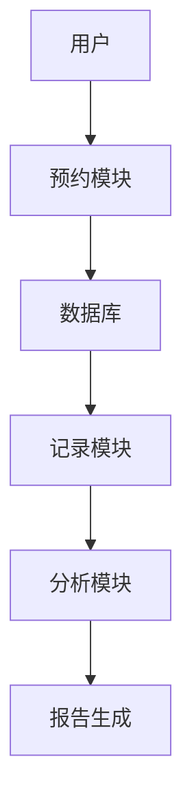
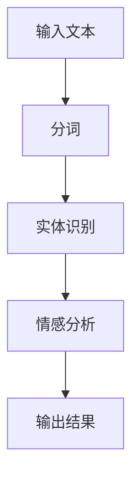

                 


# 费雪的公司访谈技巧

## 关键词：
公司访谈、沟通技巧、自然语言处理、系统架构、项目实战、最佳实践

## 摘要：
本文详细探讨了公司访谈的技巧与方法，从背景介绍到系统分析，再到项目实战，全面解析了如何有效进行公司访谈。文章结合了技术原理和实际案例，提供了丰富的技巧和实践建议，帮助读者掌握公司访谈的核心要素。

---

## 第一部分：公司访谈的背景与重要性

### 第1章：公司访谈的定义与核心要素

#### 1.1 公司访谈的定义
- 公司访谈是一种通过对话获取信息、评估候选人或分析问题的交流方式。
- 其目的是通过有效的沟通，实现信息的准确传递和问题的深入探讨。

#### 1.2 公司访谈的核心要素
- **访谈对象**：包括候选人、客户或团队成员。
- **访谈内容**：涉及技术能力、项目经验或公司文化。
- **访谈环境**：包括物理环境和心理环境，影响访谈效果。

---

## 第二部分：公司访谈的核心技巧

### 第2章：提问技巧

#### 2.1 开放式问题
| 特点 | 优点 | 应用场景 |
|------|------|----------|
| 无固定答案 | 获取详细信息 | 了解候选人的背景和经验 |
| 鼓励深入讨论 | 适合探索性问题 | 探讨项目细节或公司文化 |

#### 2.2 封闭式问题
| 特点 | 优点 | 应用场景 |
|------|------|----------|
| 需要简单回答 | 快速获取确认信息 | 核查事实或简单确认 |

#### 2.3 引导式问题
| 特点 | 优点 | 应用场景 |
|------|------|----------|
| 有引导性 | 控制讨论方向 | 引导候选人分享特定经验 |

### 第3章：倾听技巧

#### 3.1 主动倾听
- 通过反馈和确认，确保信息准确传递。
- 示例：候选人提到项目经验时，通过反馈确认具体细节。

#### 3.2 反馈技巧
- 使用澄清和鼓励反馈，提升候选人参与度。
- 示例：候选人提到困难时，反馈“请详细说明”。

### 第4章：非语言沟通技巧

#### 4.1 身体语言
- **坐姿与眼神**：开放的姿态显示专注和尊重。
- **手势与表情**：通过手势表达鼓励，表情显示理解和共鸣。

#### 4.2 语调与语气
- **语速与音量**：适中语速和音量，保持专业形象。
- **语气的表达**：通过语气传递积极态度，营造友好氛围。

---

## 第三部分：公司访谈的系统分析与架构设计

### 第5章：公司访谈的系统架构

#### 5.1 系统功能设计
- **访谈预约模块**：用户预约访谈时间。
- **访谈记录模块**：记录访谈内容。
- **数据分析模块**：分析数据，生成报告。

#### 5.2 系统架构图


### 第6章：公司访谈的算法实现

#### 6.1 自然语言处理在公司访谈中的应用


#### 6.2 访谈评分算法
```python
def score_candidate(text):
    # 计算关键词匹配度
    keywords = ['经验', '技能', '项目']
    score = 0
    for word in keywords:
        if word in text:
            score += 1
    return score
```

---

## 第四部分：项目实战

### 第7章：构建公司访谈管理系统

#### 7.1 环境安装
- 安装Python、MySQL和必要的库（如pandas、numpy）。

#### 7.2 核心代码实现
- **预约模块代码**：
```python
def schedule_interview(candidate):
    # 预约时间
    pass
```

- **数据分析模块代码**：
```python
import pandas as pd

def analyze_data(data):
    # 数据分析
    pass
```

#### 7.3 案例分析
- 某公司面试系统的实际应用，展示如何通过系统提高效率。

---

## 第五部分：最佳实践与总结

### 第8章：最佳实践与注意事项

- **小结**：公司访谈是有效沟通的关键，掌握提问、倾听和非语言沟通技巧至关重要。
- **注意事项**：在实际应用中，结合系统和算法优化流程。
- **拓展阅读**：推荐相关书籍和资源，深入学习公司访谈技巧。

---

## 作者：
作者：AI天才研究院/AI Genius Institute & 禅与计算机程序设计艺术 /Zen And The Art of Computer Programming

---

希望这篇文章能为您提供有价值的见解和实用的技巧，帮助您在公司访谈中取得成功。

