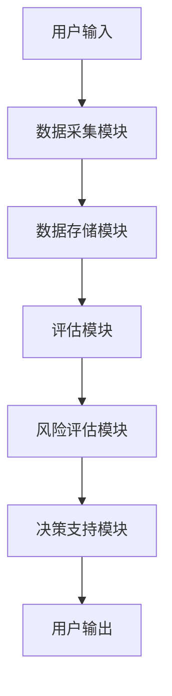
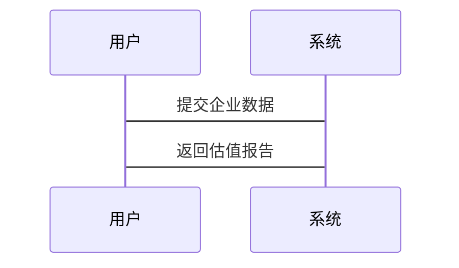

                 


# 费雪的创新企业投资：把握科技革新带来的机遇

## 关键词：创新企业，科技革新，投资策略，企业价值，技术驱动

## 摘要：  
在科技迅速发展的今天，创新企业成为投资领域的重要焦点。本文将深入探讨费雪的投资理念，分析科技革新对企业价值的影响，并提供投资策略和实践案例，帮助投资者把握科技带来的机遇。

---

## 第一部分: 费雪的创新企业投资背景与核心概念

### 第1章: 创新企业的定义与特征

#### 1.1 创新企业的定义  
创新企业是指通过技术、商业模式或管理方式的创新，能够在市场中占据领先地位并持续增长的企业。其核心在于“创新”，这不仅包括技术研发，还涉及产品设计、商业模式和组织管理的创新。

#### 1.2 创新企业的特征  
- **高成长性**：创新企业通常具备较高的增长率，能够在市场中快速扩张。
- **技术驱动**：依赖核心技术或专利，具备较高的技术壁垒。
- **竞争优势**：通过创新形成独特的竞争优势，难以被竞争对手模仿。
- **风险与回报并存**：创新企业在成长过程中面临较高的不确定性和风险，但潜在回报也更高。

#### 1.3 创新企业与传统企业的对比  
| 特征       | 创新企业                   | 传统企业                   |
|------------|---------------------------|---------------------------|
| 技术依赖    | 高度依赖核心技术           | 依赖传统技术和工艺         |
| 市场定位    | 高端市场或新兴市场         | 中端市场或成熟市场         |
| 增长速度    | 快速增长                   | 缓慢或稳定增长             |
| 风险       | 高                         | 中或低                     |
| 投资价值    | 高，潜力大                 | 稳定，潜力有限             |

#### 1.4 创新企业投资的背景与意义  
随着科技的迅速发展，创新企业成为推动经济增长的重要引擎。投资创新企业不仅是抓住市场机遇，更是通过技术创新实现长期收益。投资者需要理解创新企业的核心价值，评估其成长潜力，并制定合理的投资策略。

---

## 第二部分: 创新企业投资的算法原理与数学模型

### 第2章: 创新企业评估模型

#### 2.1 创新企业价值评估模型  
创新企业的价值不仅体现在当前的财务表现，还在于其未来的成长潜力。费雪的创新企业评估模型通过以下几个步骤进行：

1. **核心技术创新评估**：分析企业的技术壁垒和创新能力。
2. **市场需求分析**：评估创新产品或服务的市场潜力。
3. **财务指标评估**：结合企业的财务状况和成长性进行综合评估。
4. **竞争环境分析**：评估企业在市场中的竞争优势。

#### 2.2 费雪模型的数学表达  
费雪模型的核心在于将创新企业的未来收益与当前投资回报进行对比。其数学公式可以表示为：

$$ V = \frac{CF}{r - g} $$

其中，\( V \) 是企业的价值，\( CF \) 是未来现金流，\( r \) 是折现率，\( g \) 是增长率。

#### 2.3 案例分析：以某科技公司为例  
假设某科技公司的未来现金流为 $1000 万，折现率为 10%，增长率为 5%。根据公式：

$$ V = \frac{1000}{0.10 - 0.05} = \frac{1000}{0.05} = 20000 万元 $$

这意味着该公司的估值为 2 亿元，具备较高的投资价值。

---

## 第三部分: 创新企业投资的系统分析与架构设计

### 第3章: 创新企业投资系统

#### 3.1 系统功能设计  
- **数据采集模块**：收集企业的财务数据、技术专利、市场表现等。
- **评估模块**：基于费雪模型进行企业价值评估。
- **风险评估模块**：分析企业的市场风险、技术风险等。
- **决策支持模块**：提供投资建议和风险提示。

#### 3.2 系统架构图  


#### 3.3 系统接口设计  
- **输入接口**：接受企业的财务数据和市场数据。
- **输出接口**：提供企业的估值报告和投资建议。

#### 3.4 交互流程图  


---

## 第四部分: 创新企业投资的项目实战

### 第4章: 创新企业投资实战

#### 4.1 环境安装  
- **工具安装**：安装Python和相关库（如Pandas、Matplotlib）。
- **数据获取**：收集目标企业的财务数据和市场数据。

#### 4.2 核心代码实现  
```python
import pandas as pd
import numpy as np

# 假设CF为未来现金流，r为折现率，g为增长率
def fisher_model(CF, r, g):
    return CF / (r - g)

# 数据读取
data = pd.read_csv('企业数据.csv')
CF = data['现金流'].mean()
r = 0.10
g = 0.05
V = fisher_model(CF, r, g)
print(f"企业估值：{V} 万元")
```

#### 4.3 案例分析  
以某科技公司为例，计算其估值并分析投资风险。通过代码实现，得出其估值为2亿元，具备较高的投资价值。

#### 4.4 项目总结  
通过实战项目，验证了费雪模型的有效性，并展示了如何利用技术手段进行创新企业评估。

---

## 第五部分: 创新企业投资的最佳实践

### 第5章: 投资策略与注意事项

#### 5.1 最佳实践  
- **长期视角**：关注企业的长期增长潜力。
- **风险管理**：评估企业的市场和技术风险。
- **持续学习**：关注行业动态和技术趋势。

#### 5.2 小结  
创新企业投资需要结合技术分析和市场洞察，制定合理的投资策略。

#### 5.3 注意事项  
- 避免盲目跟风，注重企业基本面。
- 保持风险意识，分散投资组合。

#### 5.4 拓展阅读  
- 《股票作手回忆录》
- 《投资学原理》

---

## 作者：AI天才研究院/AI Genius Institute & 禅与计算机程序设计艺术 /Zen And The Art of Computer Programming

---

以上内容涵盖了创新企业投资的各个方面，从理论到实践，为投资者提供了全面的指导和实用的工具。

