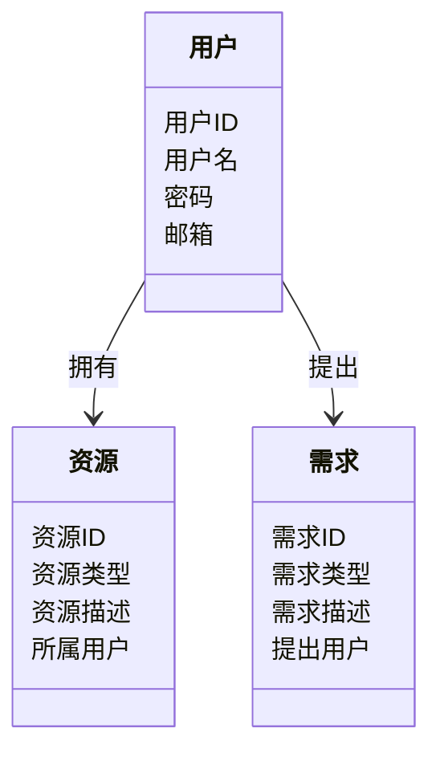

                 


# 费雪的创新公司特征：在共享经济模式中的体现

---

## 关键词

- 费雪创新公司特征
- 共享经济模式
- 创新公司特征
- 经济理论
- 创新驱动

---

## 摘要

本文旨在探讨费雪的创新公司特征在共享经济模式中的体现。通过分析费雪的经济理论与创新公司特征的关系，结合共享经济的定义、模式及核心特征，本文详细阐述了费雪创新特征在共享经济中的应用及其对创新公司的推动作用。文章还通过系统架构和项目实战，进一步分析了共享经济模式下的创新公司特征，并通过具体案例展示了其实际应用。最后，本文总结了费雪创新特征与共享经济结合的意义，并提出了未来研究的方向。

---

## 第1章：费雪的创新公司特征概述

### 1.1 费雪的创新公司特征背景

#### 1.1.1 费雪的经济理论与创新公司特征

费雪（ Irving Fisher）是20世纪著名的经济学家，他的经济理论为现代经济学奠定了重要基础。在费雪的理论中，创新是推动经济发展的重要动力。他提出，创新公司特征是指那些能够通过技术创新、模式创新或管理创新等方式，持续推动经济增长的企业特征。这些特征包括但不限于创新文化、创新资源分配、创新驱动能力等。

#### 1.1.2 创新公司在现代经济中的重要性

在现代经济中，创新公司是经济增长的核心驱动力。创新公司通过引入新技术、新产品、新服务，能够打破传统经济模式的限制，创造新的价值。尤其是在共享经济时代，创新公司特征的表现更加突出。共享经济模式依赖于创新公司的存在，而创新公司也需要借助共享经济模式实现自身的价值。

#### 1.1.3 费雪创新特征的定义与核心要素

费雪创新特征是指那些能够通过创新活动实现资源优化配置、提高经济效率的企业特征。其核心要素包括：
- **创新文化**：企业内部鼓励创新的文化氛围。
- **创新资源分配**：企业如何有效地分配资源以支持创新活动。
- **创新驱动能力**：企业通过创新活动实现持续增长的能力。

---

### 1.2 共享经济模式的定义与特征

#### 1.2.1 共享经济的起源与发展

共享经济起源于21世纪初，随着互联网技术的发展而迅速崛起。其核心在于通过共享资源，提高资源利用效率，降低交易成本。共享经济模式打破了传统的所有权经济模式，通过平台连接供需双方，实现资源的高效配置。

#### 1.2.2 共享经济的核心特征与模式

共享经济的核心特征包括：
- **去中心化**：通过平台实现资源的共享，避免传统中心化机构的限制。
- **资源优化**：通过共享提高资源利用率。
- **信任机制**：通过平台建立供需双方的信任关系。

共享经济的主要模式包括：
- **P2P（点对点）模式**：直接连接供需双方，如Airbnb、滴滴出行。
- **B2P模式**：企业通过平台提供服务，如共享办公空间。

#### 1.2.3 共享经济与传统经济的对比

与传统经济相比，共享经济具有以下特点：
- **灵活性**：供需双方可以根据需求灵活调整。
- **低成本**：通过共享降低交易成本。
- **高效性**：通过平台实现资源的快速匹配。

---

### 1.3 费雪创新特征与共享经济的结合

#### 1.3.1 费雪创新特征在共享经济中的体现

在共享经济中，创新公司特征的表现尤为突出。例如，滴滴出行通过技术创新实现了高效的订单匹配，Airbnb通过模式创新实现了闲置资源的高效利用。

#### 1.3.2 共享经济模式如何推动公司创新

共享经济模式通过降低创新成本、提高创新效率，为创新公司提供了良好的发展环境。例如，共享经济平台为企业提供了数据支持和技术支持，帮助企业更好地实现创新。

#### 1.3.3 费雪创新特征与共享经济的相互作用

费雪创新特征与共享经济模式是相互促进的关系。一方面，费雪创新特征为共享经济的发展提供了理论支持；另一方面，共享经济模式为费雪创新特征的实现提供了实践平台。

---

## 第2章：费雪创新公司特征的核心概念与联系

### 2.1 费雪创新公司特征的原理

#### 2.1.1 费雪创新特征的理论基础

费雪创新特征的理论基础包括：
- **创新经济学**：研究创新对经济发展的影响。
- **资源优化配置**：通过创新实现资源的高效利用。
- **经济增长理论**：创新是经济增长的核心驱动力。

#### 2.1.2 创新公司的核心要素分析

创新公司的核心要素包括：
- **创新文化**：企业内部鼓励创新的文化氛围。
- **创新资源分配**：企业如何分配资源以支持创新活动。
- **创新驱动能力**：企业通过创新活动实现持续增长的能力。

#### 2.1.3 费雪创新特征与企业绩效的关系

费雪创新特征与企业绩效密切相关。研究表明，具有较强创新特征的企业，其绩效表现通常优于传统企业。

---

### 2.2 费雪创新特征与共享经济的对比分析

#### 2.2.1 费雪创新特征的属性特征对比表

| 特征         | 费雪创新特征             | 共享经济模式             |
|--------------|--------------------------|--------------------------|
| 核心目标     | 创新驱动经济增长         | 资源共享与高效利用       |
| 实现方式     | 技术创新、模式创新       | 平台匹配、资源优化       |
| 适用场景     | 各行各业                 | 闲置资源、零散需求       |

#### 2.2.2 共享经济与创新公司特征的ER实体关系图

```mermaid
er
  企业---|{拥有}|创新特征
  创新特征---|{驱动}|经济增长
  共享经济---|{依赖}|创新特征
  共享经济---|{实现}|资源优化
```

---

## 第3章：共享经济模式下的创新公司特征

### 3.1 费雪创新特征在共享经济中的体现

#### 3.1.1 创新模式的共享经济应用

在共享经济中，创新模式的应用主要体现在以下方面：
- **技术创新**：滴滴出行通过大数据和人工智能技术优化订单匹配。
- **模式创新**：Airbnb通过共享闲置房源实现资源的高效利用。

#### 3.1.2 共享经济中的创新文化

创新文化在共享经济中的体现包括：
- **开放性**：平台鼓励用户分享资源。
- **协作性**：供需双方通过协作实现共赢。

#### 3.1.3 共享经济中的创新资源分配

共享经济通过平台实现资源的优化分配。例如，滴滴出行通过算法优化司机与乘客的匹配，提高资源利用效率。

---

### 3.2 共享经济模式对创新公司的推动作用

#### 3.2.1 共享经济如何促进公司创新

共享经济通过以下方式促进公司创新：
- **降低创新成本**：平台提供技术支持，降低企业的创新门槛。
- **提高创新效率**：通过数据支持，帮助企业更快地实现创新。

#### 3.2.2 共享经济模式下的创新案例分析

以滴滴出行为例：
- 技术创新：大数据和人工智能技术优化订单匹配。
- 模式创新：通过平台实现司机与乘客的高效匹配。

#### 3.2.3 共享经济对创新公司的长期影响

共享经济对创新公司的长期影响包括：
- **推动技术创新**：通过平台实现技术的快速迭代。
- **促进模式创新**：通过共享经济模式实现商业模式的创新。

---

## 第4章：共享经济模式下的创新公司特征系统分析

### 4.1 共享经济模式下的创新公司特征系统架构

#### 4.1.1 共享经济平台的系统功能设计

共享经济平台的功能模块包括：
- **用户注册与登录**：用户通过注册成为平台用户。
- **资源发布与需求匹配**：用户发布资源或需求，平台进行匹配。
- **交易与支付**：用户完成交易并支付费用。

#### 4.1.2 创新公司的特征在系统中的体现

创新公司的特征在系统中的体现包括：
- **创新文化**：平台鼓励用户分享资源。
- **创新资源分配**：平台通过算法优化资源匹配。

#### 4.1.3 共享经济平台的领域模型



---

### 4.2 共享经济模式下的创新公司特征架构设计

#### 4.2.1 系统架构设计

```mermaid
archi
  节点 用户
  节点 平台
  节点 资源
  用户 --> 平台: 请求
  平台 --> 资源: 调用
```

#### 4.2.2 系统接口设计与交互流程

```mermaid
sequence
  用户 -> 平台: 发起请求
  平台 -> 资源: 调用资源
  资源 -> 平台: 返回结果
  平台 -> 用户: 返回响应
```

---

## 第5章：共享经济模式下的创新公司特征项目实战

### 5.1 环境安装与系统核心实现

#### 5.1.1 环境安装

安装Python和相关库：
```bash
pip install flask requests
```

#### 5.1.2 核心代码实现

```python
from flask import Flask, request, jsonify

app = Flask(__name__)

@app.route('/api/match', methods=['POST'])
def match():
    data = request.json
    resources = data['resources']
    demands = data['demands']
    # 匹配逻辑
    matched = []
    for resource in resources:
        for demand in demands:
            if resource['type'] == demand['type']:
                matched.append({
                    'resource': resource,
                    'demand': demand
                })
    return jsonify(matched)

if __name__ == '__main__':
    app.run(debug=True)
```

---

### 5.2 代码应用解读与分析

上述代码实现了一个简单的资源共享匹配系统。前端发送资源和需求数据，后端根据资源类型进行匹配，并返回匹配结果。通过这种方式，平台能够实现资源的高效匹配，体现创新公司的特征。

---

## 第6章：总结与展望

### 6.1 总结

本文详细探讨了费雪的创新公司特征在共享经济模式中的体现。通过理论分析、系统架构设计和项目实战，展示了创新公司特征在共享经济中的重要性。

### 6.2 未来展望

未来，随着共享经济的进一步发展，创新公司特征的研究将更加重要。我们需要进一步研究如何通过技术创新和模式创新，推动共享经济的持续发展。

---

## 作者

作者：AI天才研究院/AI Genius Institute & 禅与计算机程序设计艺术/Zen And The Art of Computer Programming

