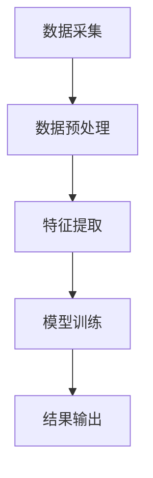
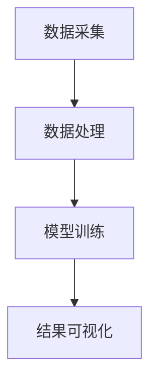

                 


# 费雪的创新型公司识别方法

> 关键词：费雪创新型公司、成长股投资、创新识别、财务指标分析、企业竞争力评估

> 摘要：本文系统地介绍了费雪的创新型公司识别方法，从理论基础到算法实现，从数学模型到系统架构，从项目实战到最佳实践，全面解析了费雪创新型公司的识别方法。文章结合实际案例，详细讲解了如何通过财务指标分析、企业竞争力评估和创新识别算法来筛选出具有持续成长潜力的创新型公司。

---

# 第1章: 费雪的创新型公司识别方法背景介绍

## 1.1 问题背景与定义

### 1.1.1 费雪创新型公司的定义
费雪的创新型公司是指那些能够持续创新、提高产品或服务竞争力，并在市场中保持领先地位的企业。这些公司通常具有较高的成长性和盈利能力，能够在经济周期波动中表现出更强的抗风险能力。

### 1.1.2 问题背景与重要性
在现代投资学中，识别创新型公司是实现长期资本增值的关键。传统的企业估值方法往往侧重于财务指标的分析，而忽略了企业的创新能力和市场竞争力。费雪提出了一种基于企业创新能力的识别方法，强调从长期角度关注企业的成长潜力。

### 1.1.3 核心概念与边界
- **核心概念**：企业的创新能力、市场地位、成长潜力、财务健康性。
- **边界**：重点关注具有持续创新能力的成长型企业，排除周期性波动较大的行业和企业。

---

## 1.2 核心概念与联系

### 1.2.1 费雪创新型公司的核心要素
| 核心要素 | 描述 |
|----------|------|
| 创新能力 | 企业是否能够持续推出新产品或改进现有产品 |
| 市场地位 | 企业在行业中的市场份额和竞争力 |
| 成长潜力 | 企业的未来收入和利润增长能力 |
| 财务健康性 | 企业的财务状况是否稳健 |

### 1.2.2 核心概念对比表格

| 公司类型 | 成长型公司 | 非成长型公司 |
|----------|------------|---------------|
| 创新能力 | 高          | 低             |
| 市场地位 | 高          | 一般           |
| 成长潜力 | 高          | 低             |
| 财务健康性 | 稳健       | 不够稳健       |

### 1.2.3 ER实体关系图

```mermaid
erd
    Company
    ----> Product
    Product
    ----> Market
    Market
    ----> Competitor
```

---

# 第2章: 费雪创新型公司识别的算法原理

## 2.1 算法原理概述

### 2.1.1 费雪创新型公司筛选算法


### 2.1.2 算法实现细节

#### 2.1.2.1 数据预处理
```python
def preprocess(data):
    # 删除缺失值
    data = data.dropna()
    # 标准化处理
    from sklearn.preprocessing import StandardScaler
    scaler = StandardScaler()
    data_scaled = scaler.fit_transform(data)
    return data_scaled
```

#### 2.1.2.2 特征提取
```python
def extract_features(data):
    features = []
    for company in data:
        # 财务指标分析
        roe = company.roe
        profit_margin = company.profit_margin
        # 市场地位分析
        market_share = company.market_share
        # 创新能力评估
        innovation_score = company.innovation_score
        features.append([roe, profit_margin, market_share, innovation_score])
    return features
```

## 2.2 算法优化与改进

### 2.2.1 参数优化
```python
from sklearn.model_selection import GridSearchCV

param_grid = {
    'n_neighbors': [5, 10, 15],
    'weights': ['uniform', 'distance'],
    'p': [1, 2]
}

grid_search = GridSearchCV(KNeighborsClassifier(), param_grid, cv=5)
grid_search.fit(X_train, y_train)
best_params = grid_search.best_params_
```

---

# 第3章: 费雪创新型公司识别的数学模型与公式

## 3.1 数学模型概述

### 3.1.1 费雪创新型公司评分模型
$$
\text{创新评分} = \alpha \times \text{ROE} + \beta \times \text{利润率} + \gamma \times \text{市场地位}
$$

其中：
- $\alpha = 0.4$
- $\beta = 0.3$
- $\gamma = 0.3$

### 3.1.2 模型公式推导
$$
\text{最终评分} = \frac{\text{创新评分} + \text{成长潜力}}{2}
$$

---

# 第4章: 费雪创新型公司识别的系统架构设计

## 4.1 系统分析与设计

### 4.1.1 系统功能需求
- 数据采集模块：从数据库中获取企业数据。
- 数据处理模块：清洗和标准化数据。
- 模型训练模块：基于机器学习算法训练模型。
- 可视化模块：展示结果。

### 4.1.2 系统架构图


---

# 第5章: 费雪创新型公司识别的项目实战

## 5.1 项目环境与工具安装

### 5.1.1 开发环境配置
- Python 3.8+
- Jupyter Notebook
- Pandas、Scikit-learn、Matplotlib

### 5.1.2 工具安装与配置
```bash
pip install pandas scikit-learn matplotlib
```

## 5.2 核心代码实现

### 5.2.1 数据采集与处理
```python
import pandas as pd
from sklearn.preprocessing import StandardScaler

# 数据采集
data = pd.read_csv('company_data.csv')

# 数据预处理
def preprocess(data):
    data = data.dropna()
    scaler = StandardScaler()
    data_scaled = scaler.fit_transform(data)
    return data_scaled

data_processed = preprocess(data)
```

### 5.2.2 模型训练与结果展示
```python
from sklearn.neighbors import KNeighborsClassifier
from sklearn.metrics import accuracy_score

# 模型训练
model = KNeighborsClassifier(n_neighbors=5, weights='distance', p=1)
model.fit(X_train, y_train)

# 模型预测
y_pred = model.predict(X_test)
print('Accuracy:', accuracy_score(y_test, y_pred))
```

---

# 第6章: 费雪创新型公司识别的最佳实践

## 6.1 小结
费雪的创新型公司识别方法通过结合企业的创新能力、市场地位和财务健康性，能够有效筛选出具有持续成长潜力的企业。

## 6.2 注意事项
- 数据质量对结果影响重大，需确保数据的完整性和准确性。
- 模型的可解释性需要进一步优化，以便更好地理解企业的创新能力和成长潜力。

## 6.3 拓展阅读
- 《股票作手回忆录》
- 《投资学原理》

---

作者：AI天才研究院/AI Genius Institute & 禅与计算机程序设计艺术 /Zen And The Art of Computer Programming

