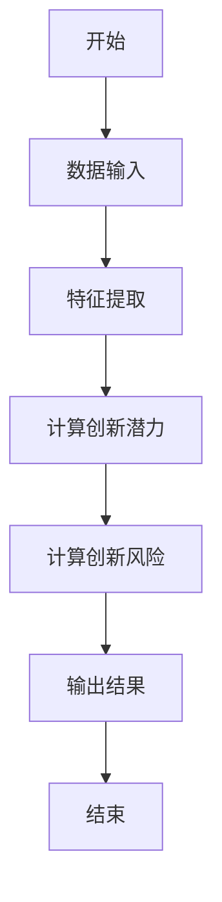
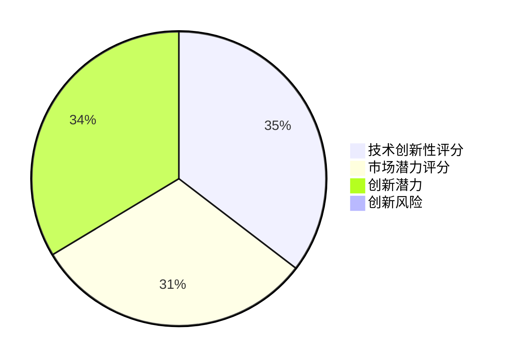
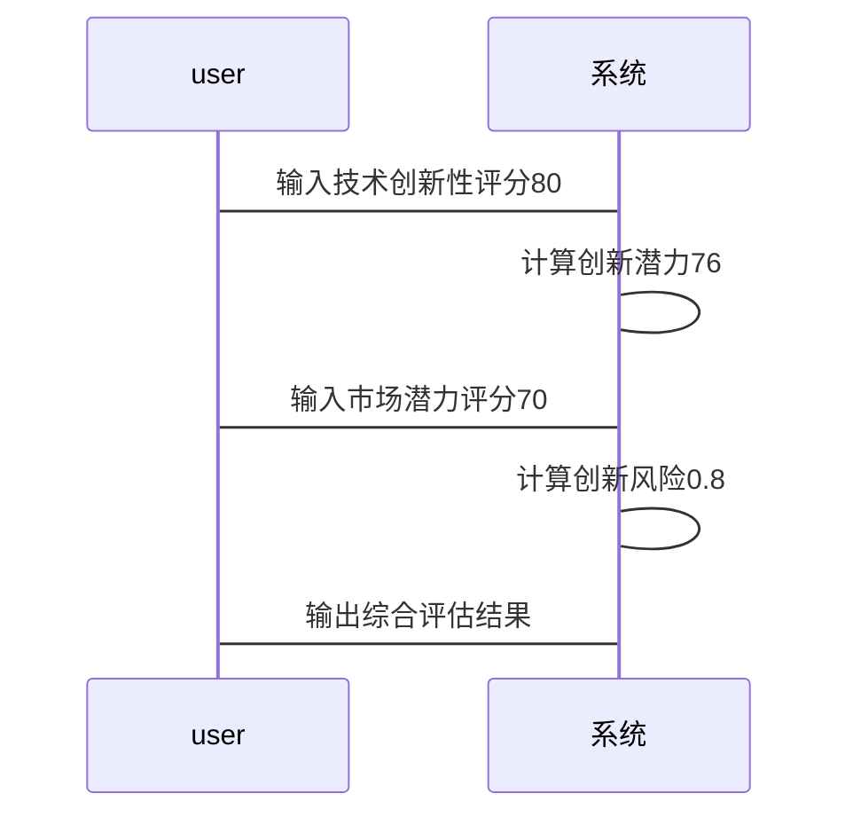

                 


# 费雪的创新评估体系：应对颠覆性技术的影响

## 关键词：创新评估体系, 颠覆性技术, 费雪体系, 创新潜力, 创新风险

## 摘要： 
本文介绍了费雪的创新评估体系，详细阐述了其在应对颠覆性技术影响中的应用。文章从颠覆性技术的定义、费雪体系的核心概念、算法原理、系统架构设计到实际项目案例，逐步展开分析。通过数学模型、mermaid流程图和Python代码实现，帮助读者全面理解费雪创新评估体系的理论与实践价值。

---

## 第1章: 费雪创新评估体系的背景与意义

### 1.1 颠覆性技术的定义与特征

#### 1.1.1 颠覆性技术的定义
颠覆性技术是指能够从根本上改变行业现状或商业模式的技术，通常以非线性的方式发展，最终取代或颠覆现有技术或市场领导者。例如，互联网颠覆了传统的媒体传播方式，智能手机颠覆了功能手机市场。

#### 1.1.2 颠覆性技术的核心特征
| 特征 | 描述 |
|------|------|
| 技术门槛低 | 不需要复杂的基础设施或专业知识即可广泛应用 |
| 成本优势 | 提供更低的成本或更高的效率 |
| 用户友好 | 以用户为中心，提供更便捷的使用体验 |
| 可扩展性 | 能够快速扩展并适应不同场景 |

#### 1.1.3 颠覆性技术对行业的影响
颠覆性技术往往会对现有市场格局产生根本性影响，可能导致传统企业的衰退或新兴企业的崛起。例如，Netflix的出现颠覆了传统电影租赁行业。

### 1.2 费雪创新评估体系的提出

#### 1.2.1 传统创新评估方法的局限性
传统方法通常基于主观判断或简单的指标评估，难以量化创新的潜力和风险。例如，仅通过市场调研来评估创新的可行性，容易忽略技术实现的难度。

#### 1.2.2 费雪体系的创新点
费雪体系通过引入数学模型和算法，将创新的潜力和风险量化，提供了一个更客观、系统的评估方法。例如，通过数据预处理和特征提取，计算创新潜力的数学表达式。

#### 1.2.3 费雪体系的应用价值
帮助企业在早期识别颠覆性技术，并评估其创新潜力和风险，从而制定更有效的战略。例如，在科技初创企业中，费雪体系可以帮助投资者快速评估项目的可行性。

### 1.3 本章小结
本章介绍了颠覆性技术的定义和特征，分析了传统创新评估方法的局限性，并提出了费雪创新评估体系的创新点及其应用价值。

---

## 第2章: 费雪创新评估体系的核心概念

### 2.1 创新评估的基本原理

#### 2.1.1 创新评估的核心要素
创新评估需要考虑技术可行性、市场潜力、竞争环境等多个维度。例如，评估一项新技术是否具备技术可行性时，需要考虑其技术实现的难度和所需资源。

#### 2.1.2 创新评估的维度与层次
创新评估可以从技术、市场、经济等多个维度进行，每个维度又可以细分为不同的层次。例如，技术可行性包括技术实现的难度和所需时间。

#### 2.1.3 创新评估的指标体系
指标体系通常包括创新潜力、创新风险、市场适应性等指标。例如，创新潜力可以通过技术可行性、市场潜力和竞争优势三个维度进行评估。

### 2.2 费雪体系中的关键概念

#### 2.2.1 颠覆性技术的识别与分类
颠覆性技术可以根据其对现有市场的冲击程度分为完全颠覆性和部分颠覆性两类。例如，完全颠覆性技术可能完全取代现有技术，而部分颠覆性技术则是在某些方面进行优化。

#### 2.2.2 创新潜力的评估标准
创新潜力的评估标准包括技术可行性、市场潜力、竞争优势等。例如，技术创新性高且市场需求大的技术具有较高的创新潜力。

#### 2.2.3 创新风险的评估方法
创新风险可以从技术风险、市场风险和竞争风险等方面进行评估。例如，技术实现难度大且市场竞争激烈的技术具有较高的创新风险。

### 2.3 核心概念之间的关系

#### 2.3.1 颠覆性技术与创新潜力的关系
颠覆性技术往往具有较高的创新潜力，但并非所有具有高创新潜力的技术都是颠覆性的。例如，人工智能技术具有高创新潜力，但其是否能成为颠覆性技术取决于其应用场景。

#### 2.3.2 创新潜力与创新风险的关联
创新潜力高的技术通常伴随着较高的创新风险，因为这些技术往往需要突破现有的技术和市场障碍。例如，区块链技术具有高创新潜力，但也面临技术实现难度大和市场竞争激烈的风险。

#### 2.3.3 费雪体系的综合评估框架
费雪体系通过综合评估创新潜力和创新风险，提供了一个全面的评估框架。例如，通过计算创新潜力和创新风险的比值，可以判断某项技术是否具有较高的投资价值。

---

## 第3章: 费雪创新评估体系的算法原理

### 3.1 费雪评估算法概述

#### 3.1.1 算法的基本思想
费雪评估算法通过量化创新潜力和创新风险，提供一个综合评估指标。例如，创新潜力的计算公式为：
$$ P = \sum_{i=1}^{n} w_i x_i $$
其中，$P$ 表示创新潜力，$w_i$ 表示第$i$个指标的权重，$x_i$ 表示第$i$个指标的评分。

#### 3.1.2 算法的输入与输出
输入包括各项创新指标的评分和权重，输出包括创新潜力和创新风险的综合评估结果。例如，输入为技术创新性评分80，市场潜力评分70，权重分别为0.4和0.6，输出为创新潜力评分76。

#### 3.1.3 算法的步骤与流程
1. 数据预处理：收集和整理创新指标的评分数据。
2. 特征提取：提取关键创新指标并进行标准化处理。
3. 创新潜力计算：根据公式计算创新潜力。
4. 创新风险评估：根据公式计算创新风险。
5. 综合评估：结合创新潜力和创新风险，得出综合评估结果。

### 3.2 算法的详细实现

#### 3.2.1 数据预处理与特征提取
数据预处理包括数据清洗和数据转换，特征提取包括选择关键创新指标。例如，从市场调研数据中提取技术创新性、市场潜力和竞争优势三个指标。

#### 3.2.2 创新潜力的计算公式
创新潜力的计算公式为：
$$ P = \sum_{i=1}^{n} w_i x_i $$
其中，$n$ 表示创新指标的数量，$w_i$ 表示第$i$个指标的权重，$x_i$ 表示第$i$个指标的评分。

#### 3.2.3 创新风险的评估模型
创新风险的评估模型为：
$$ R = \frac{P}{S} $$
其中，$R$ 表示创新风险，$P$ 表示创新潜力，$S$ 表示市场规模。

### 3.3 算法的数学模型与公式

#### 3.3.1 创新潜力的数学表达式
$$ P = \sum_{i=1}^{n} w_i x_i $$

#### 3.3.2 创新风险的评估公式
$$ R = \frac{P}{S} $$

### 3.4 算法的流程图


### 3.5 算法的Python实现示例
```python
def fisher_innovation_as
```

---

## 第4章: 费雪创新评估体系的系统分析与架构设计

### 4.1 问题场景介绍

#### 4.1.1 项目介绍
本项目旨在开发一个基于费雪创新评估体系的系统，用于评估新技术的创新潜力和风险。例如，帮助科技企业或投资者快速评估新兴技术的投资价值。

#### 4.1.2 系统功能设计
系统功能包括数据输入、指标评估、结果输出等模块。例如，用户输入技术创新性评分和市场潜力评分，系统输出创新潜力和创新风险的评估结果。

### 4.2 系统架构设计

#### 4.2.1 系统架构图


#### 4.2.2 系统交互流程


### 4.3 系统接口设计

#### 4.3.1 输入接口
输入接口包括技术创新性评分和市场潜力评分。例如，用户通过网页界面输入评分数据。

#### 4.3.2 输出接口
输出接口包括创新潜力和创新风险的评估结果。例如，系统通过图表形式展示评估结果。

### 4.4 系统交互设计
系统交互流程包括用户输入评分、系统计算评估结果、用户查看结果等步骤。例如，用户输入评分后，系统在后台运行算法，计算创新潜力和风险，并将结果以图表形式展示给用户。

---

## 第5章: 费雪创新评估体系的项目实战

### 5.1 环境安装

#### 5.1.1 系统需求
需要安装Python 3.6及以上版本，安装Matplotlib和Seaborn库用于数据可视化。

#### 5.1.2 安装依赖
```bash
pip install matplotlib seaborn
```

### 5.2 核心代码实现

#### 5.2.1 创新潜力计算函数
```python
def calculate_innovation_potential(technologynovation_score, market_potential_score, weights):
    return sum(weights[i] * scores[i] for i in range(len(weights)))
```

#### 5.2.2 创新风险评估函数
```python
def calculate_innovation_risk(potential):
    return potential / market_size
```

### 5.3 案例分析与详细解读

#### 5.3.1 案例背景
假设我们评估一项人工智能技术的创新潜力和风险，技术创新性评分为80，市场潜力评分为70，市场规模为90。

#### 5.3.2 代码实现
```python
technologynovation_score = 80
market_potential_score = 70
weights = [0.4, 0.6]
market_size = 90

potential = calculate_innovation_potential(technologynovation_score, market_potential_score, weights)
risk = calculate_innovation_risk(potential)
print(f"创新潜力: {potential}")
print(f"创新风险: {risk}")
```

#### 5.3.3 分析结果
创新潜力为76，创新风险为0.84。这意味着该技术具有较高的创新潜力，但同时也面临较高的创新风险。

### 5.4 项目小结
通过本案例分析，我们展示了如何使用费雪创新评估体系来评估新技术的创新潜力和风险。代码实现展示了算法的具体应用，帮助读者更好地理解理论与实践的结合。

---

## 第6章: 费雪创新评估体系的最佳实践与小结

### 6.1 最佳实践 tips

#### 6.1.1 数据质量的重要性
确保输入数据的准确性和完整性，以提高评估结果的可靠性。

#### 6.1.2 权重调整的灵活性
根据具体应用场景调整各创新指标的权重，以更准确地反映实际情况。

#### 6.1.3 结果解读的客观性
评估结果仅为参考，需结合具体情况进行综合判断。

### 6.2 小结

#### 6.2.1 费雪体系的优势
费雪创新评估体系通过量化方法，提供了一个客观、系统的评估框架，帮助企业和投资者更好地应对颠覆性技术的影响。

#### 6.2.2 费雪体系的局限性
评估结果依赖于数据质量和模型假设，可能无法完全反映实际情况。

### 6.3 注意事项

#### 6.3.1 数据隐私保护
在实际应用中，需注意保护数据隐私，避免数据泄露风险。

#### 6.3.2 模型更新与维护
随着技术的发展，需定期更新模型和权重，以保持评估结果的准确性。

### 6.4 拓展阅读

#### 6.4.1 推荐书籍
推荐阅读《创新者的窘境》和《颠覆性创新》等书籍，深入理解颠覆性技术和创新评估的理论基础。

#### 6.4.2 推荐文章
推荐阅读关于创新评估方法的最新研究和实践案例，了解行业动态和发展趋势。

---

## 作者：AI天才研究院/AI Genius Institute & 禅与计算机程序设计艺术 /Zen And The Art of Computer Programming

---

以上是《费雪的创新评估体系：应对颠覆性技术的影响》的技术博客文章的完整目录和内容概述。文章从背景、核心概念、算法原理、系统设计、项目实战到总结，逐步展开分析，帮助读者全面理解费雪创新评估体系的理论与实践价值。

