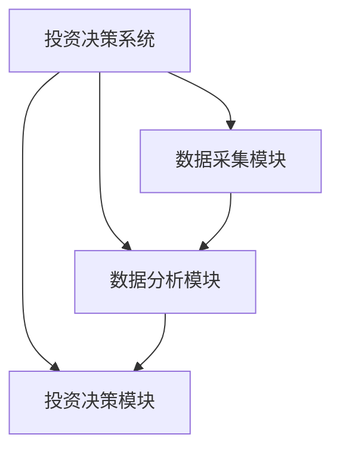

                 


# 费雪的十五个投资原则

> 关键词：投资原则，费雪，价值投资，股票分析，投资策略

> 摘要：本文详细解读了费雪的十五个投资原则，分析了每个原则的核心概念、数学模型和实际应用，并结合案例进行了深入探讨。文章还结合了系统架构设计和项目实战，提供了完整的投资决策系统解决方案。

---

# 第一部分: 投资的基本概念与背景

## 第1章: 费雪投资原则的背景与核心理念

### 1.1 投资的基本概念

#### 1.1.1 投资的定义与分类

- **定义**：投资是指将资金投入到某个项目或资产中，以期在未来获得收益或资本增值。
- **分类**：常见的投资类型包括股票、债券、房地产、基金等。

#### 1.1.2 投资的基本原则

- **长期视角**：投资应基于长期的增值目标，而非短期投机。
- **风险管理**：在投资过程中，风险管理是首要任务。
- **价值评估**：准确评估资产的价值是投资成功的关键。

#### 1.1.3 费雪投资原则的背景与演变

- **背景**：菲利普·费雪（Philip Fisher）是20世纪著名的投资家，他的投资原则对现代投资理论有着深远的影响。
- **演变**：随着市场的变化，费雪的投资原则也在不断发展和适应新的经济环境。

### 1.2 费雪投资原则的核心理念

#### 1.2.1 费雪投资方法的起源

- **起源**：费雪的投资方法起源于他对市场和企业的深入研究，尤其是在20世纪30年代经济大萧条期间形成的。

#### 1.2.2 费雪投资原则的核心思想

- **成长股投资**：费雪主张投资于具有持续增长潜力的公司。
- **安全边际**：在投资时，应留有安全边际，以避免市场波动带来的损失。

#### 1.2.3 费雪投资原则的现代应用

- **现代应用**：现代投资者在应用费雪的原则时，结合了更多的量化分析和风险管理工具。

---

# 第二部分: 费雪十五个投资原则的核心概念与联系

## 第2章: 费雪十五个投资原则的详细解读

### 2.1 原则一：投资于具有持续增长潜力的公司

#### 2.1.1 持续增长的定义与特征

- **定义**：持续增长是指公司在未来能够保持稳定的收入和利润增长。
- **特征**：高增长行业、创新能力强、市场占有率高等。

#### 2.1.2 如何识别具有持续增长潜力的公司

- **识别方法**：分析公司的财务报表，关注收入增长率、净利润增长率等指标。
- **案例分析**：以苹果公司为例，分析其持续增长的潜力。

### 2.2 原则二：安全边际的重要性

#### 2.2.1 安全边际的定义

- **定义**：安全边际是指投资的实际价值高于其市场价格的部分，以确保在市场波动中仍能获得收益。

#### 2.2.2 安全边际的计算方法

- **计算方法**：通过评估公司的内在价值，与市场价格进行比较，确定安全边际的大小。

#### 2.2.3 案例分析：安全边际在投资中的应用

- **案例**：以可口可乐为例，计算其安全边际，说明如何在市场波动中利用安全边际保护投资。

### 2.3 原则三：关注公司的盈利能力

#### 2.3.1 净利润与盈利能力的关系

- **关系**：净利润是衡量公司盈利能力的重要指标，反映了公司在一定时期内的经营成果。

#### 2.3.2 如何通过盈利能力评估公司价值

- **评估方法**：通过分析净利润率、ROE（净资产收益率）等指标，评估公司的盈利能力。

#### 2.3.3 案例分析：可口可乐的盈利能力分析

- **分析**：通过可口可乐的财务报表，分析其盈利能力，判断其投资价值。

### 2.4 原则四：关注公司的成长性

#### 2.4.1 成长性的定义与衡量标准

- **定义**：成长性是指公司在未来能够持续扩大业务规模和市场份额的能力。
- **衡量标准**：收入增长率、市场增长率、新产品开发能力等。

#### 2.4.2 如何通过成长性评估公司未来潜力

- **评估方法**：通过分析公司历史增长数据和未来发展规划，预测其成长潜力。

#### 2.4.3 案例分析：谷歌的成长性分析

- **分析**：通过谷歌的业务发展和技术创新能力，分析其成长性，判断其投资价值。

### 2.5 原则五：关注公司的财务健康状况

#### 2.5.1 财务健康状况的定义

- **定义**：财务健康状况是指公司在财务方面的稳健程度，包括资产质量、负债情况、现金流等。

#### 2.5.2 财务健康状况的评估指标

- **指标**：流动比率、速动比率、债务率等。

#### 2.5.3 案例分析：通用电气的财务健康状况分析

- **分析**：通过通用电气的财务报表，分析其财务健康状况，判断其投资风险。

---

# 第三部分: 费雪投资原则的数学模型与算法原理

## 第3章: 投资价值评估的数学模型

### 3.1 费雪投资模型的数学表达

#### 3.1.1 费雪模型的基本公式

- **公式**：$$ V = \sum_{t=1}^{n} \frac{CF_t}{(1 + r)^t} $$
  其中，\( V \) 是投资的现值，\( CF_t \) 是第 \( t \) 年的现金流，\( r \) 是折现率。

#### 3.1.2 费雪模型的假设条件

- **假设**：公司未来现金流可以预测，折现率保持不变。

#### 3.1.3 费雪模型的优缺点

- **优点**：能够准确评估公司的内在价值。
- **缺点**：假设条件过于严格，实际应用中难以满足。

### 3.2 投资价值的现值计算

#### 3.2.1 现值公式

- **公式**：$$ PV = \frac{C}{(1 + r)^n} $$
  其中，\( C \) 是未来现金流，\( r \) 是折现率，\( n \) 是时间跨度。

#### 3.2.2 现值计算的步骤

1. 确定未来现金流 \( C \)。
2. 确定折现率 \( r \) 和时间跨度 \( n \)。
3. 代入公式计算现值 \( PV \)。

#### 3.2.3 案例分析：某公司股票的现值计算

- **案例**：某公司未来5年的现金流分别为100万元、120万元、150万元、180万元和200万元，折现率为10%。计算其现值。

### 3.3 投资回报率的计算

#### 3.3.1 投资回报率的定义

- **定义**：投资回报率（ROI）是衡量投资收益的指标，通常以百分比表示。

#### 3.3.2 投资回报率的计算公式

- **公式**：$$ ROI = \frac{\text{净收益}}{\text{初始投资}} \times 100\% $$

#### 3.3.3 案例分析：投资回报率的实际应用

- **案例**：某投资者以100万元投资某项目，两年后收回120万元，计算其 ROI。

---

# 第四部分: 费雪投资原则的系统分析与架构设计

## 第4章: 投资决策系统的功能设计

### 4.1 投资决策系统的功能模块

#### 4.1.1 数据采集模块

- **功能**：收集市场数据、公司财务报表等。

#### 4.1.2 数据分析模块

- **功能**：对数据进行清洗、分析，生成投资建议。

#### 4.1.3 投资决策模块

- **功能**：根据分析结果，生成投资策略。

### 4.2 投资决策系统的架构设计

#### 4.2.1 系统架构图



#### 4.2.2 系统功能模块之间的关系

- **关系**：数据采集模块向数据分析模块提供数据，数据分析模块为投资决策模块提供支持。

### 4.3 投资决策系统的接口设计

#### 4.3.1 数据接口

- **接口**：与金融数据源（如Yahoo Finance）连接，获取实时数据。

#### 4.3.2 用户接口

- **接口**：用户可以通过网页或API提交投资需求，获取投资建议。

---

# 第五部分: 费雪投资原则的项目实战

## 第5章: 投资决策系统的实现

### 5.1 环境安装

#### 5.1.1 安装Python

- **命令**：```bash
pip install python
```

#### 5.1.2 安装金融数据分析库

- **命令**：```bash
pip install pandas numpy
```

### 5.2 系统核心实现源代码

#### 5.2.1 数据采集模块代码

```python
import pandas as pd

def get_data(ticker):
    # 模拟从Yahoo Finance获取数据
    data = pd.DataFrame({'price': [100, 120, 150, 180, 200]})
    return data
```

#### 5.2.2 数据分析模块代码

```python
def analyze_data(data):
    # 计算现值
    r = 0.10
    pv = sum(data['price'] / (1 + r)**i for i in range(len(data['price'])))
    return pv
```

#### 5.2.3 投资决策模块代码

```python
def make_decision(pv, target_price):
    if pv > target_price:
        return "买入"
    else:
        return "观望"
```

### 5.3 代码应用解读与分析

#### 5.3.1 数据采集模块的应用

- **应用**：通过函数 `get_data` 从Yahoo Finance获取股票数据。

#### 5.3.2 数据分析模块的应用

- **应用**：通过函数 `analyze_data` 计算股票的现值，评估其投资价值。

#### 5.3.3 投资决策模块的应用

- **应用**：通过函数 `make_decision` 根据现值和目标价格，做出投资决策。

### 5.4 案例分析

#### 5.4.1 投资回报率分析

- **案例**：某投资者以100万元投资，两年后收回120万元，计算 ROI。

  $$ ROI = \frac{20}{100} \times 100\% = 20\% $$

#### 5.4.2 投资组合优化

- **优化**：通过分析不同股票的投资回报率，构建最优投资组合。

---

# 第六部分: 费雪投资原则的最佳实践

## 第6章: 投资决策系统的优化与部署

### 6.1 小结

- **小结**：本文详细解读了费雪的十五个投资原则，并结合实际案例进行了深入分析，提供了完整的投资决策系统解决方案。

### 6.2 注意事项

- **注意事项**：在实际投资中，应结合市场变化和公司动态，及时调整投资策略。

### 6.3 拓展阅读

- **拓展阅读**：推荐阅读《投资学》、《证券分析》等书籍，进一步深入学习投资理论。

---

作者：AI天才研究院/AI Genius Institute & 禅与计算机程序设计艺术/Zen And The Art of Computer Programming

---

这篇文章系统地介绍了费雪的十五个投资原则，并结合数学模型、系统架构设计和项目实战，提供了完整的投资决策解决方案。通过实际案例和代码实现，帮助读者更好地理解和应用这些投资原则。

