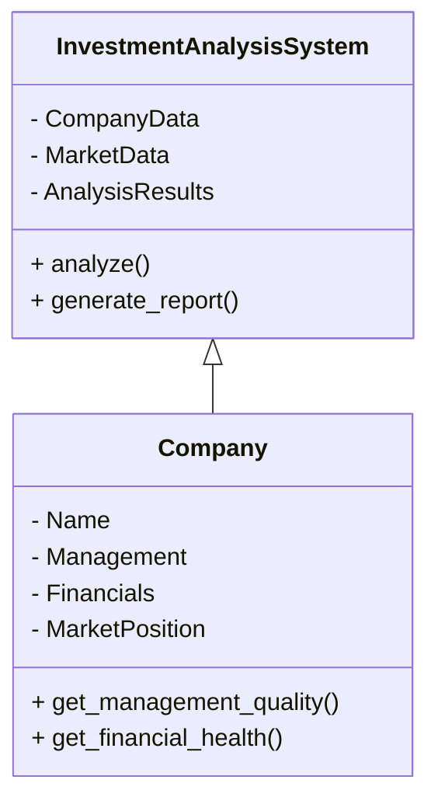
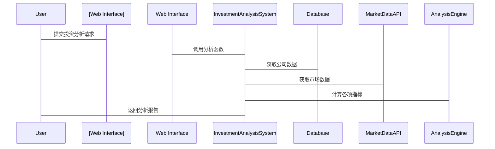

                 

# 费雪的十五个投资点及其现代应用

---

## 关键词：  
费雪投资理论, 投资策略, 投资回报, 现代应用, 管理层分析, 财务分析, 市场地位

---

## 摘要：  
本文深入探讨了费雪的十五个投资点，从理论背景到具体应用，结合现代投资环境进行了详细分析。通过数学模型、实际案例和系统架构设计，展示了费雪理论在投资决策中的核心作用及其在当代的应用价值。

---

# 第一部分: 费雪投资理论的背景与核心概念

## 第1章: 费雪投资理论的背景介绍

### 1.1 投资理论的发展历程

#### 1.1.1 传统投资理论的演进  
投资理论的发展经历了从简单到复杂的演变。早期的理论注重资产的收益率，而现代理论则更加关注风险与收益的平衡。

#### 1.1.2 费雪投资理论的提出背景  
菲利普·费雪（Philip Fisher）在20世纪提出了以基本面分析为核心的长期投资策略，强调对公司管理层、财务状况和市场地位的深入分析。

#### 1.1.3 现代投资理论与费雪理论的关联  
现代投资组合理论（MPT）与费雪理论在风险管理、资产配置等方面存在交集，但费雪更注重个股选择的深度分析。

### 1.2 费雪投资理论的核心概念

#### 1.2.1 投资的本质与目标  
投资的目的是通过优质资产的长期持有实现财富增值，而非短期价格波动。

#### 1.2.2 费雪投资理论的核心要素  
- 公司管理层的质量  
- 财务健康状况  
- 市场地位与竞争优势  
- 产品生命周期  

#### 1.2.3 理论的边界与外延  
费雪理论主要适用于股票投资，但在其他资产类别中也有借鉴意义。

### 1.3 费雪投资理论的数学模型

#### 1.3.1 投资回报的数学表达  
$$ R = \frac{P_{future}}{P_{current}} - 1 $$  

其中：  
- \( R \)：投资回报率  
- \( P_{future} \)：未来资产价值  
- \( P_{current} \)：当前资产价值  

#### 1.3.2 费雪方程式  
$$ \text{投资回报} = \text{未来价值} - \text{当前价值} $$  

---

## 第2章: 费雪的十五个投资点详解

### 2.1 投资点1——分析管理层

#### 2.1.1 管理层分析的核心要素  
- 决策能力：管理层是否具备战略眼光和执行力。  
- 诚信与道德：管理层是否值得信赖。  
- 战略规划：公司是否制定了明确的长期目标。  

#### 2.1.2 管理层分析的数学模型  
$$ \text{管理层指数} = \frac{\text{高管稳定性} \times \text{决策质量}}{\text{行业平均值}} $$  

#### 2.1.3 实际案例分析  
以苹果公司为例，分析其管理层的战略决策对投资回报的影响。

### 2.2 投资点2——分析财务状况

#### 2.2.1 财务状况分析的关键指标  
- 净利润：公司盈利能力的直接体现。  
- 负债率：衡量公司财务风险。  
- 现金流：评估公司运营效率和偿债能力。  

#### 2.2.2 财务健康度的数学模型  
$$ \text{财务健康指数} = \frac{\text{净利润} + \text{现金流}}{\text{总负债}} $$  

#### 2.2.3 实际案例分析  
以微软公司为例，分析其财务状况对投资决策的影响。

### 2.3 投资点3——分析市场地位

#### 2.3.1 市场地位的评估维度  
- 市场份额：公司在市场中的占有率。  
- 竞争优势：公司是否具备独特的竞争优势。  
- 市场进入壁垒：潜在竞争者的进入难度。  

#### 2.3.2 市场地位分析的数学模型  
$$ \text{市场地位指数} = \frac{\text{市场份额} \times \text{竞争优势}}{\text{行业平均值}} $$  

#### 2.3.3 实际案例分析  
以谷歌为例，分析其在搜索引擎市场的主导地位。

### 2.4 投资点4——分析产品生命周期

#### 2.4.1 产品生命周期的阶段划分  
- 引入期：新产品进入市场的阶段。  
- 成长期：产品销量快速增长阶段。  
- 成熟期：产品销量稳定阶段。  
- 衰退期：产品销量下降阶段。  

#### 2.4.2 产品生命周期对投资的影响  
在产品引入期和成长期，投资风险较高但潜在回报大；在成熟期和衰退期，投资风险较低但回报稳定。

#### 2.4.3 实际案例分析  
以iPhone为例，分析其生命周期对投资决策的影响。

---

## 第3章: 费雪投资理论的现代应用

### 3.1 现代投资环境下的费雪理论应用

#### 3.1.1 现代投资环境的变化  
- 技术进步：人工智能和大数据对投资的影响。  
- 全球化：跨国投资的兴起。  
- 数字化：金融市场的数字化转型。  

#### 3.1.2 费雪理论在现代投资中的调整  
- 引入量化分析方法。  
- 结合ESG（环境、社会、治理）投资理念。  
- 考虑宏观经济环境的影响。  

#### 3.1.3 现代投资中的数学模型  
$$ \text{现代投资回报} = f(\text{费雪因素}, \text{量化指标}, \text{宏观经济指标}) $$  

---

## 第4章: 系统分析与架构设计

### 4.1 投资分析系统的功能设计

#### 4.1.1 系统功能模块  
- 数据采集：收集公司财务数据、市场数据等。  
- 指标计算：计算管理层指数、财务健康指数等。  
- 投资决策：基于费雪理论生成投资建议。  

#### 4.1.2 领域模型（Mermaid类图）  

### 4.2 系统架构设计

#### 4.2.1 系统架构（Mermaid架构图）  

### 4.3 接口设计与交互流程

#### 4.3.1 系统接口设计  
- 数据接口：获取公司数据、市场数据。  
- 分析接口：计算各项指标并生成报告。  

#### 4.3.2 交互流程（Mermaid序列图）  

---

## 第5章: 实际案例分析

### 5.1 案例选择与分析

#### 5.1.1 案例选择  
选择具有代表性的公司，如苹果、谷歌、微软等，分析其投资价值。

#### 5.1.2 分析过程  
- 管理层分析：评估公司高管的决策能力和战略规划。  
- 财务分析：计算财务健康指数，评估公司财务状况。  
- 市场地位分析：评估公司在市场中的竞争地位。  
- 产品生命周期分析：判断公司产品的市场阶段。  

---

## 第6章: 总结与展望

### 6.1 本章总结  
费雪的十五个投资点为投资者提供了全面的分析框架，结合现代投资环境，可以进一步优化投资策略。

### 6.2 未来展望  
随着人工智能和大数据技术的发展，费雪理论将更加量化和智能化，投资决策将更加精准和高效。

---

## 作者：  
AI天才研究院/AI Genius Institute & 禅与计算机程序设计艺术 /Zen And The Art of Computer Programming

