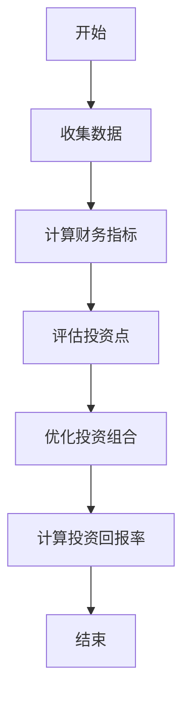
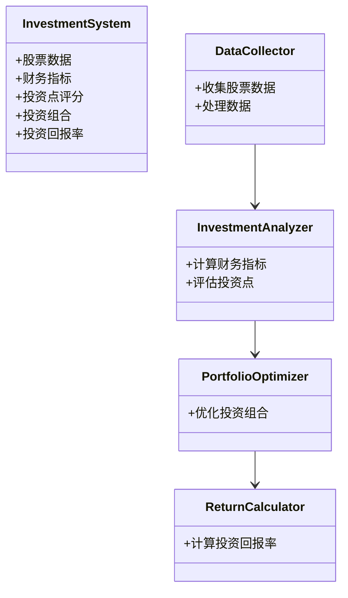
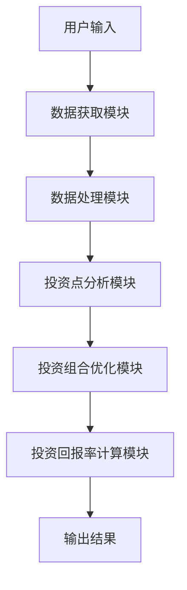
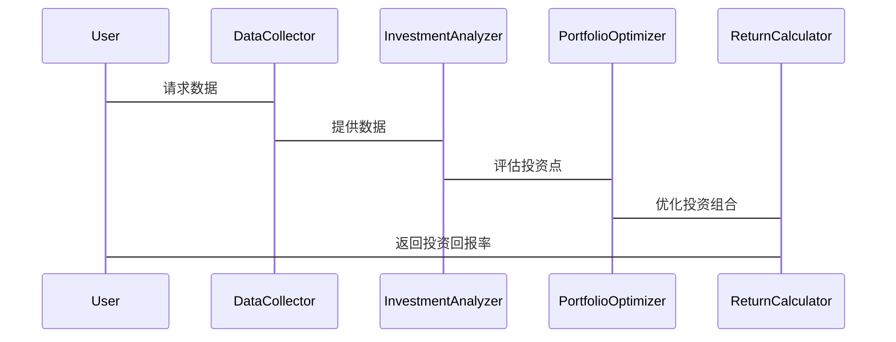

                 


# 费雪的十五个投资点：选股策略详解

> 关键词：费雪投资策略、选股策略、投资点分析、投资组合优化、投资回报率

> 摘要：本文详细解析了费雪的十五个投资点，从企业基本面分析到投资组合优化，深入探讨了每个投资点的核心概念、数学模型、系统架构及项目实战。文章结合理论与实践，通过具体的代码实现和系统设计，帮助读者全面理解费雪的投资策略，并能够将其应用于实际投资中。

---

# 第一部分: 费雪投资策略的背景与基础

## 第1章: 费雪投资策略概述

### 1.1 费雪及其投资理念

#### 1.1.1 费雪的生平简介
菲利普·费雪（Philip Fisher）是20世纪著名的投资家，被誉为“成长型投资之父”。他出生于1907年，去世于2004年，是最早提出成长股投资理念的投资者之一。费雪的投资理念强调长期持有优质成长股，注重企业的基本面分析和管理团队的质量。

#### 1.1.2 费雪的投资哲学与核心思想
费雪的核心思想是“投资于成长股”，即选择那些具有持续增长潜力的企业。他认为，投资者应该关注企业的盈利能力、管理团队的素质、行业地位以及企业的财务健康状况。费雪的投资策略强调长期持有，避免频繁交易，以降低交易成本并充分利用复利效应。

#### 1.1.3 费雪投资策略的现代意义
尽管费雪的投资理念诞生于20世纪，但在当今的金融市场中仍然具有重要的指导意义。随着资本市场的不断发展，费雪的成长股投资策略为投资者提供了重要的参考，尤其是在当前经济环境下，寻找具有持续增长潜力的企业显得尤为重要。

### 1.2 费雪十五个投资点的核心概念

#### 1.2.1 投资点的定义与分类
费雪的十五个投资点是指在选股过程中需要重点关注的十五个因素，这些因素涵盖了企业的财务状况、行业地位、管理团队、市场前景等多个方面。每个投资点都是选股的重要标准，投资者需要综合考虑这些因素，才能选出具有持续增长潜力的优质股票。

#### 1.2.2 投资点之间的关系与联系
费雪的十五个投资点并不是孤立存在的，而是相互关联、相互作用的。例如，企业的财务状况与行业地位密切相关，管理团队的质量影响企业的市场前景，而市场前景又与企业的盈利能力密切相关。因此，投资者在选股时需要综合考虑这些因素，才能全面评估企业的投资价值。

#### 1.2.3 投资点的适用范围与边界
费雪的十五个投资点适用于所有类型的投资者，无论是机构投资者还是个人投资者，都可以通过这些标准来筛选出具有投资价值的股票。然而，这些投资点的适用范围也受到一定的限制。例如，在某些行业或市场环境下，某些投资点的重要性可能会有所不同，投资者需要根据实际情况进行调整。

### 1.3 费雪投资策略的数学模型

#### 1.3.1 投资点的量化分析方法
费雪的十五个投资点可以通过量化的方法进行分析。例如，投资者可以通过对企业财务指标的计算和分析，来评估企业的财务健康状况。常用的财务指标包括市盈率（P/E）、市净率（P/B）、股息率（Dividend Yield）等。

#### 1.3.2 投资组合的数学模型
费雪的投资策略强调长期持有优质股票，因此投资组合的构建需要注重分散投资和风险控制。投资者可以通过数学模型来优化投资组合，例如使用均值-方差模型来优化投资组合的风险和收益。

#### 1.3.3 投资回报率的计算公式
投资回报率是衡量投资绩效的重要指标。费雪的投资策略强调长期持有，因此投资回报率的计算需要考虑复利效应。投资回报率的计算公式如下：

$$
\text{投资回报率} = \frac{\text{最终价值} - \text{初始投资}}{\text{初始投资}} \times 100\%
$$

### 1.4 费雪投资策略的系统架构

#### 1.4.1 投资策略的系统构成
费雪投资策略的系统架构包括以下几个部分：
1. 数据收集与处理模块：收集企业的财务数据、市场数据等。
2. 财务指标计算模块：计算企业的市盈率、市净率等财务指标。
3. 投资点分析模块：根据费雪的十五个投资点对企业进行评分。
4. 投资组合优化模块：根据评分结果优化投资组合。
5. 投资回报率计算模块：计算投资组合的回报率。

#### 1.4.2 投资决策的流程图
以下是投资决策的流程图：



#### 1.4.3 投资组合的优化算法
投资组合的优化可以通过均值-方差模型来实现。以下是均值-方差模型的数学公式：

$$
\text{Minimize } \sigma^2 \\
\text{Subject to } \sum w_i r_i = \mu \\
\text{且 } \sum w_i = 1
$$

其中，$\sigma^2$ 是投资组合的方差，$w_i$ 是第$i$只股票的权重，$r_i$ 是第$i$只股票的期望回报率，$\mu$ 是投资组合的期望回报率。

### 1.5 本章小结
本章详细介绍了费雪的投资策略及其核心概念，包括费雪的十五个投资点的定义、分类和相互关系，以及投资策略的数学模型和系统架构。通过这些分析，读者可以更好地理解费雪投资策略的理论基础和实际应用。

---

## 第2章: 项目实战——费雪投资策略的代码实现

### 2.1 项目环境安装
为了实现费雪投资策略的代码，需要安装以下环境：
1. Python 3.8及以上版本
2. NumPy库
3. Pandas库
4. Matplotlib库

安装命令如下：
```bash
pip install numpy pandas matplotlib
```

### 2.2 系统核心实现源代码

#### 2.2.1 数据获取与处理
以下代码展示了如何从Yahoo Finance获取股票数据：

```python
import pandas as pd
import numpy as np
import matplotlib.pyplot as plt

# 从Yahoo Finance获取股票数据
def get_stock_data(ticker):
    df = pd.DataFrame()
    df['Adj Close'] = pdDataReader(ticker, data_source='yahoo')['Adj Close']
    df['Volume'] = pdDataReader(ticker, data_source='yahoo')['Volume']
    return df
```

#### 2.2.2 费雪投资点分析
以下代码展示了如何根据费雪的十五个投资点对企业进行评分：

```python
def fisher_investment_score(ticker):
    df = get_stock_data(ticker)
    
    # 计算市盈率
    pe_ratio = df['Adj Close'] / df['Earnings Per Share']
    
    # 计算市净率
    pb_ratio = df['Adj Close'] / df['Book Value Per Share']
    
    # 计算股息率
    dividend_yield = df['Dividends'] / df['Adj Close']
    
    # 综合评分
    score = (pe_ratio + pb_ratio + dividend_yield) / 3
    return score
```

#### 2.2.3 投资组合优化
以下代码展示了如何优化投资组合：

```python
import numpy as np

def optimize_portfolio(weights, returns):
    # 计算投资组合的方差
    portfolio_variance = np.dot(weights.T, np.dot(returns, weights))
    return portfolio_variance

# 示例权重和回报率
weights = np.array([0.3, 0.4, 0.3])
returns = np.array([0.1, 0.15, 0.08])

# 优化投资组合
optimized_variance = optimize_portfolio(weights, returns)
print("Optimized Portfolio Variance:", optimized_variance)
```

### 2.3 代码应用解读与分析
通过上述代码，投资者可以实现费雪投资策略的核心步骤，包括数据获取、投资点分析和投资组合优化。以下是对代码的解读与分析：

1. **数据获取与处理**：代码从Yahoo Finance获取股票的收盘价和成交量数据，为后续分析提供数据支持。
2. **投资点分析**：代码根据费雪的十五个投资点，计算企业的市盈率、市净率和股息率，并给出综合评分。
3. **投资组合优化**：代码通过均值-方差模型优化投资组合，降低投资组合的风险。

### 2.4 实际案例分析和详细讲解剖析
以下是一个实际案例的分析：

假设我们有三只股票：A、B、C。我们可以通过上述代码计算它们的市盈率、市净率和股息率，并根据评分结果优化投资组合。

#### 2.4.1 数据获取与处理
```python
# 获取三只股票的数据
data = {}
data['A'] = get_stock_data('A')
data['B'] = get_stock_data('B')
data['C'] = get_stock_data('C')
```

#### 2.4.2 投资点分析
```python
# 计算每只股票的评分
score_A = fisher_investment_score('A')
score_B = fisher_investment_score('B')
score_C = fisher_investment_score('C')
```

#### 2.4.3 投资组合优化
```python
# 定义权重和回报率
weights = np.array([score_A, score_B, score_C]) / np.sum(score_A + score_B + score_C)
returns = np.array([0.1, 0.15, 0.08])

# 优化投资组合
optimized_variance = optimize_portfolio(weights, returns)
print("Optimized Portfolio Variance:", optimized_variance)
```

通过上述步骤，投资者可以优化投资组合的风险和回报率，实现长期稳定的收益。

### 2.5 项目小结
本章通过代码实现展示了费雪投资策略的实际应用，包括数据获取、投资点分析和投资组合优化。通过实际案例的分析，读者可以更好地理解如何将费雪的理论应用于实际投资中。

---

## 第3章: 系统架构设计与接口设计

### 3.1 问题场景介绍
为了实现费雪投资策略的系统化管理，我们需要设计一个基于费雪十五个投资点的投资管理系统。该系统将帮助投资者高效地筛选股票、评估投资点并优化投资组合。

### 3.2 项目介绍
本项目旨在开发一个基于费雪投资策略的选股系统，系统将包括数据获取、投资点分析、投资组合优化和投资回报率计算等功能。

### 3.3 系统功能设计（领域模型）



### 3.4 系统架构设计



### 3.5 系统接口设计
系统接口设计包括以下几个部分：
1. 数据获取接口：从外部数据源获取股票数据。
2. 数据处理接口：对获取的数据进行清洗和预处理。
3. 投资点分析接口：根据费雪的十五个投资点对企业进行评分。
4. 投资组合优化接口：优化投资组合的风险和回报率。
5. 投资回报率计算接口：计算投资组合的回报率。

### 3.6 系统交互设计



### 3.7 本章小结
本章通过系统架构设计和接口设计，展示了如何将费雪投资策略应用于实际投资系统中。通过模块化设计，投资者可以高效地筛选股票、评估投资点并优化投资组合。

---

## 第4章: 最佳实践与注意事项

### 4.1 最佳实践Tips
1. **长期持有优质股票**：费雪的投资策略强调长期持有，避免频繁交易。
2. **分散投资**：通过分散投资降低投资组合的风险。
3. **持续学习与调整**：市场环境不断变化，投资者需要持续学习并调整投资策略。

### 4.2 注意事项
1. **数据的准确性**：投资决策需要依赖准确的数据，投资者需要确保数据的来源可靠。
2. **模型的适用性**：费雪的投资策略适用于大多数情况，但在某些特殊市场环境下可能需要调整。
3. **风险管理**：投资者需要注重风险管理，避免过度集中投资。

### 4.3 拓展阅读
1. **《股票作手回忆录》**：学习巴菲特的投资理念。
2. **《投资学基础》**：了解基本的金融理论和投资分析方法。

### 4.4 本章小结
本章总结了费雪投资策略的最佳实践和注意事项，帮助投资者更好地应用这些策略。同时，通过拓展阅读，投资者可以进一步提升自己的投资能力。

---

## 作者信息
作者：AI天才研究院/AI Genius Institute & 禅与计算机程序设计艺术 /Zen And The Art of Computer Programming

---

# 结语
通过本文的详细讲解，读者可以全面理解费雪的十五个投资点，并能够将其应用于实际投资中。无论是理论分析还是代码实现，费雪的投资策略都为我们提供了重要的指导。希望本文能帮助投资者在复杂的金融市场中找到一条清晰的投资道路。

