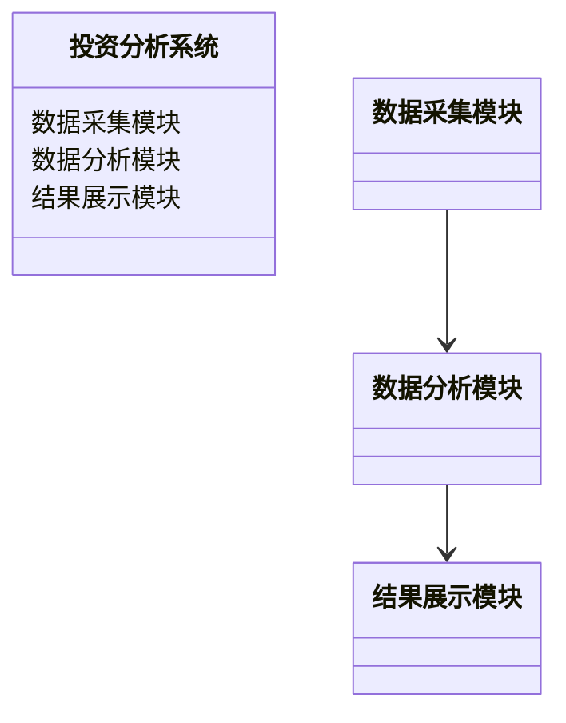

                 


# 增长型价值投资：平衡当前价值与未来潜力

---

## 关键词
- 增长型价值投资
- 费雪
- 价值投资
- 投资策略
- 投资分析
- 投资组合

---

## 摘要
费雪的增长型价值投资是一种结合当前价值与未来潜力的投资策略，旨在通过深入分析企业的成长性和内在价值，选择具有持续增长潜力的优质企业进行投资。本文将详细探讨费雪的投资理念、增长型价值投资的核心分析方法，以及如何通过系统化的方法平衡当前价值与未来潜力。通过理论与实践相结合，本文将帮助投资者更好地理解增长型价值投资的精髓，并在实际操作中应用这些方法。

---

# 第1章: 增长型价值投资的背景与基础

## 1.1 价值投资的起源与核心理念
### 1.1.1 价值投资的定义与核心思想
价值投资是一种以企业内在价值为基础的投资策略，主张以低于内在价值的价格买入优质企业，长期持有，等待其价值回归。核心思想包括：
1. 市场先生理论：市场情绪波动会导致股票价格偏离其内在价值。
2. 安全边际：买入价格低于内在价值，以降低投资风险。
3. 长期视角：关注企业的长期增长潜力，而非短期价格波动。

### 1.1.2 费雪的价值投资理论
菲利普·费雪（Philip Fisher）是价值投资领域的先驱之一，提出了“成长股”投资理念。他认为，投资的收益不仅来自股息，更重要的是企业未来增长带来的股价上涨。费雪强调：
1. 选择具有强大竞争优势的企业。
2. 关注企业的管理团队和企业文化。
3. 长期持有优质股票，避免频繁交易。

### 1.1.3 增长型投资与价值投资的区别
| 方面         | 价值投资                     | 增长型投资                 |
|--------------|-------------------------------|-----------------------------|
| 核心目标     | 以低于内在价值的价格买入     | 寻找具有高增长潜力的企业     |
| 关注点       | 当前估值与安全边际             | 未来增长率与竞争优势         |
| 适合场景     | 稳定型、成熟企业               | 高成长性企业                 |
| 投资策略     | 长期持有，等待价值回归         | 长期持有，分享企业成长收益     |

---

## 1.2 费雪的增长型投资理念
### 1.2.1 费雪的成长股筛选标准
费雪提出了一系列筛选成长股的标准，包括：
1. **销售额持续增长**：企业过去几年的收入增长率保持稳定。
2. **净利润增长**：企业利润持续增长，且净利润率不断提升。
3. **ROE（净资产收益率）**：ROE越高，表明企业利用股东资金的效率越高。
4. **管理团队**：管理层具有良好的声誉和管理能力。
5. **行业地位**：企业在行业中具有领先地位，竞争优势明显。

### 1.2.2 费雪的复合增长率概念
费雪强调，投资的回报不仅仅来自股息，更重要的是企业自身增长带来的复利效应。他提出了“复合增长率”的概念，即企业收入和利润的年均增长率。

### 1.2.3 增长型投资与传统价值投资的对比
| 方面         | 增长型投资                     | 传统价值投资                 |
|--------------|-------------------------------|-----------------------------|
| 核心目标     | 寻找高增长潜力的企业             | 以低于内在价值的价格买入     |
| 关注点       | 未来增长率与竞争优势             | 当前估值与安全边际             |
| 适合场景     | 高成长性企业                   | 稳定型、成熟企业               |
| 投资策略     | 长期持有，分享企业成长收益       | 长期持有，等待价值回归         |

---

## 1.3 增长型价值投资的基本概念
### 1.3.1 增长型投资的定义
增长型投资是一种以企业未来增长潜力为核心的投资策略，强调通过选择具有强大竞争优势和持续增长能力的企业，实现投资收益的最大化。

### 1.3.2 增长型投资的核心要素
1. **内在价值**：企业的实际价值，基于其财务状况、盈利能力、竞争优势等。
2. **成长潜力**：企业未来收入和利润的增长能力。
3. **估值**：股票价格相对于内在价值的高低。
4. **安全边际**：买入价格低于内在价值，以降低投资风险。

### 1.3.3 增长型投资与传统价值投资的对比
| 方面         | 增长型投资                     | 传统价值投资                 |
|--------------|-------------------------------|-----------------------------|
| 核心目标     | 寻找高增长潜力的企业             | 以低于内在价值的价格买入     |
| 关注点       | 未来增长率与竞争优势             | 当前估值与安全边际             |
| 适合场景     | 高成长性企业                   | 稳定型、成熟企业               |
| 投资策略     | 长期持有，分享企业成长收益       | 长期持有，等待价值回归         |

---

# 第2章: 费雪的增长型价值投资理论

## 2.1 费雪投资理论的体系
### 2.1.1 费雪的成长股筛选标准
费雪的成长股筛选标准包括：
1. **销售额持续增长**：企业过去几年的收入增长率保持稳定。
2. **净利润增长**：企业利润持续增长，且净利润率不断提升。
3. **ROE（净资产收益率）**：ROE越高，表明企业利用股东资金的效率越高。
4. **管理团队**：管理层具有良好的声誉和管理能力。
5. **行业地位**：企业在行业中具有领先地位，竞争优势明显。

### 2.1.2 费雪的内在价值评估方法
费雪提出了内在价值的评估方法，包括：
1. **现金流折现法**：通过预测企业未来现金流，计算其现值。
2. **市盈率（P/E）分析**：比较企业市盈率与行业平均水平，判断其估值是否合理。
3. **市净率（P/B）分析**：比较企业市净率与行业平均水平，判断其估值是否合理。

### 2.1.3 费雪的增长率与股价关系
费雪认为，企业增长率与股价之间存在密切关系。增长率越高，股价上涨潜力越大。他提出了“复合增长率”的概念，即企业收入和利润的年均增长率。

## 2.2 费雪的增长型投资策略
### 2.2.1 长期持有的投资理念
费雪主张长期持有优质股票，避免频繁交易，以降低交易成本和市场波动的影响。

### 2.2.2 选择具有持续增长潜力的企业
费雪强调选择具有强大竞争优势和持续增长能力的企业，重点关注企业的管理团队、行业地位和财务状况。

### 2.2.3 估值与成长性的平衡
费雪认为，投资时需要平衡企业的当前估值和未来增长潜力。买入价格应低于内在价值，同时企业应具有持续增长的能力。

## 2.3 费雪理论的局限性与改进
### 2.3.1 费雪理论的局限性
1. **过于依赖历史增长率**：过去增长率不代表未来增长潜力。
2. **忽视市场周期**：费雪理论未充分考虑经济周期对投资的影响。
3. **难以量化**：增长率和内在价值的量化存在一定难度。

### 2.3.2 现代对费雪理论的改进
1. **引入宏观经济分析**：考虑经济周期对投资的影响。
2. **动态调整模型**：结合市场环境变化，动态调整投资策略。
3. **多维度分析**：不仅关注财务指标，还考虑行业趋势、政策环境等因素。

### 2.3.3 结合市场变化的动态调整
现代投资者在应用费雪理论时，需要根据市场变化进行动态调整。例如，在经济衰退时期，注重企业盈利能力；在经济复苏时期，关注企业增长潜力。

---

# 第3章: 增长型价值投资的核心分析方法

## 3.1 增长型投资的关键指标分析
### 3.1.1 净利润增长率
净利润增长率是衡量企业盈利能力的重要指标。计算公式为：
$$ \text{净利润增长率} = \frac{\text{本期净利润} - \text{上期净利润}}{\text{上期净利润}} \times 100\% $$

### 3.1.2 营业收入增长率
营业收入增长率是衡量企业收入增长能力的指标。计算公式为：
$$ \text{营业收入增长率} = \frac{\text{本期营业收入} - \text{上期营业收入}}{\text{上期营业收入}} \times 100\% $$

### 3.1.3 资产回报率（ROA）
资产回报率（ROA）是衡量企业资产使用效率的指标。计算公式为：
$$ \text{ROA} = \frac{\text{净利润}}{\text{总资产}} $$

### 3.1.4 股东权益回报率（ROE）
股东权益回报率（ROE）是衡量企业盈利能力的指标。计算公式为：
$$ \text{ROE} = \frac{\text{净利润}}{\text{股东权益}} $$

## 3.2 企业未来增长率的预测方法
### 3.2.1 历史增长率分析
通过分析企业过去几年的收入和利润增长率，预测未来增长潜力。

### 3.2.2 行业增长率预测
结合行业发展趋势和市场需求，预测企业的未来增长率。

### 3.2.3 竞争优势分析
评估企业在行业中的竞争优势，包括成本优势、技术优势、品牌优势等。

### 3.2.4 管理层能力评估
分析企业管理层的管理能力和战略规划，判断其能否推动企业持续增长。

## 3.3 估值与成长性的平衡
### 3.3.1 市盈率（P/E）分析
市盈率（P/E）是衡量企业估值的重要指标。计算公式为：
$$ \text{P/E} = \frac{\text{股票价格}}{\text{每股净利润}} $$

### 3.3.2 市净率（P/B）分析
市净率（P/B）是衡量企业估值的另一个指标。计算公式为：
$$ \text{P/B} = \frac{\text{股票价格}}{\text{每股净资产}} $$

### 3.3.3 市销率（P/S）分析
市销率（P/S）是衡量企业估值的指标。计算公式为：
$$ \text{P/S} = \frac{\text{股票价格}}{\text{每股营业收入}} $$

---

# 第4章: 增长型价值投资的算法原理

## 4.1 增长型投资的指标计算
### 4.1.1 净利润增长率
净利润增长率的计算公式为：
$$ \text{净利润增长率} = \frac{\text{本期净利润} - \text{上期净利润}}{\text{上期净利润}} \times 100\% $$

### 4.1.2 营业收入增长率
营业收入增长率的计算公式为：
$$ \text{营业收入增长率} = \frac{\text{本期营业收入} - \text{上期营业收入}}{\text{上期营业收入}} \times 100\% $$

## 4.2 内在价值评估模型
### 4.2.1 现金流折现法
现金流折现法是评估企业内在价值的重要方法。步骤如下：
1. 预测企业未来现金流。
2. 计算现金流的现值。
3. 确定目标收益率，计算企业价值。

### 4.2.2 费雪公式
费雪公式用于计算企业的内在价值。公式为：
$$ \text{内在价值} = \text{现金流} \times \frac{1}{r} $$

其中，\( r \) 是目标收益率。

## 4.3 投资决策模型
### 4.3.1 估值与成长性的平衡
在投资决策中，需要平衡企业的当前估值和未来增长潜力。具体步骤如下：
1. 计算企业的内在价值。
2. 比较股票价格与内在价值。
3. 选择买入价格低于内在价值且具有持续增长潜力的企业。

---

# 第5章: 系统分析与架构设计方案

## 5.1 问题场景介绍
增长型价值投资需要结合多种因素进行分析，包括企业的财务状况、行业趋势、竞争优势等。为了提高分析效率，可以构建一个投资分析系统，实现自动化数据处理和分析。

## 5.2 系统功能设计
### 5.2.1 领域模型
领域模型描述了系统的功能模块，包括数据采集、分析计算、结果展示等。



### 5.2.2 系统架构
系统架构采用分层设计，包括数据层、业务逻辑层和用户界面层。


## 5.3 系统交互流程
### 5.3.1 用户登录
用户通过登录界面输入用户名和密码，验证身份后进入系统。

### 5.3.2 数据采集
系统从数据库或外部接口获取企业的财务数据和市场数据。

### 5.3.3 数据分析
系统根据预设的算法对数据进行分析，生成投资建议。

### 5.3.4 结果展示
系统将分析结果以图表或报告的形式展示给用户。

---

# 第6章: 项目实战

## 6.1 环境安装
### 6.1.1 安装Python
安装Python 3.8及以上版本，并配置环境变量。

### 6.1.2 安装依赖库
安装Pandas、NumPy、Matplotlib等数据分析库。

## 6.2 系统核心实现
### 6.2.1 数据采集模块
编写代码从数据库或外部接口获取企业的财务数据和市场数据。

### 6.2.2 数据分析模块
编写代码对数据进行清洗、处理和分析，生成投资建议。

### 6.2.3 结果展示模块
编写代码生成分析报告或图表。

## 6.3 代码实现
### 6.3.1 净利润增长率计算
```python
import pandas as pd

# 假设df是包含财务数据的DataFrame，columns包含'net_profit'列
def calculate_net_profit_growth(df):
    df['net_profit_growth'] = (df['net_profit'] - df['net_profit'].shift(1)) / df['net_profit'].shift(1) * 100
    return df

# 示例数据
data = {'net_profit': [100, 120, 150]}
df = pd.DataFrame(data)
result = calculate_net_profit_growth(df)
print(result)
```

### 6.3.2 内在价值评估
```python
import numpy as np

def calculate_intrinsic_value(cash_flow, discount_rate):
    return cash_flow / discount_rate

# 示例数据
cash_flow = 1000
discount_rate = 0.1
intrinsic_value = calculate_intrinsic_value(cash_flow, discount_rate)
print(intrinsic_value)
```

## 6.4 案例分析
### 6.4.1 案例介绍
以某科技公司为例，分析其财务数据和市场表现，评估其内在价值和增长潜力。

### 6.4.2 分析结果
通过分析，得出该公司的内在价值高于当前股价，且具有较高的增长潜力，建议买入。

---

# 第7章: 总结与展望

## 7.1 最佳实践 tips
- **长期视角**：坚持长期投资，避免短期波动影响。
- **深入分析**：对企业财务状况、行业趋势和竞争优势进行深入分析。
- **动态调整**：根据市场变化和企业情况，动态调整投资策略。

## 7.2 小结
费雪的增长型价值投资是一种结合当前价值与未来潜力的投资策略，通过深入分析企业的内在价值和增长潜力，选择具有持续增长能力的优质企业进行投资。

## 7.3 注意事项
- **风险控制**：投资有风险，需注意分散投资，降低风险。
- **持续学习**：市场环境不断变化，需持续学习和调整投资策略。

## 7.4 拓展阅读
- 《股市长线思考》
- 《投资学精要》
- 《费雪投资理论》

---

# 作者：AI天才研究院/AI Genius Institute & 禅与计算机程序设计艺术/Zen And The Art of Computer Programming

---

# 结语
费雪的增长型价值投资是一种长期有效的投资策略，通过平衡当前价值与未来潜力，帮助投资者实现财富的长期增长。希望本文能为投资者提供有价值的参考和启发。

