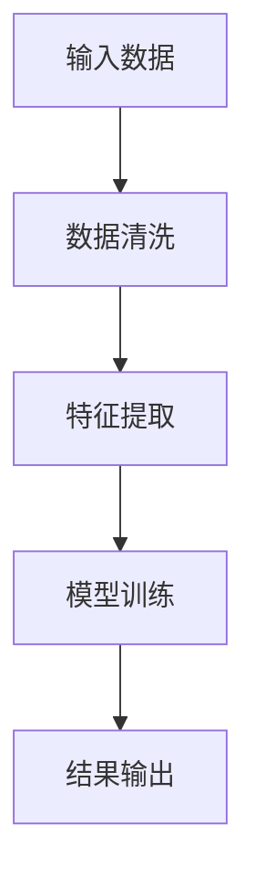
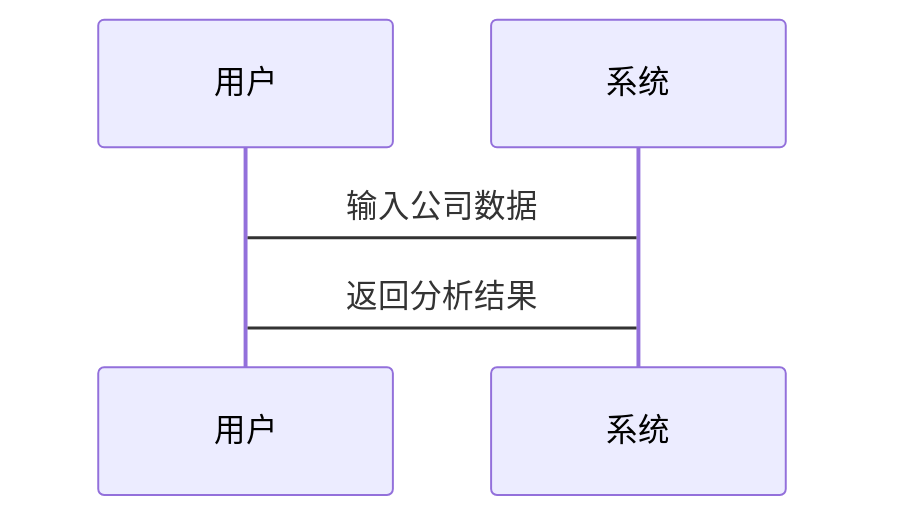

                 


# 费雪的增长型公司特征分析

## 关键词：
费雪投资理论，增长型公司，财务指标分析，增长型公司特征，投资策略，系统架构设计，项目实战

## 摘要：
本文详细分析了费雪增长型公司的特征，从背景介绍、核心概念、算法原理、系统架构设计到项目实战，层层递进地阐述了如何识别和分析增长型公司。通过具体案例和系统设计，为投资者提供了一套基于费雪理论的投资策略和方法。

---

## 第1章: 费雪投资理论的背景与核心概念

### 1.1 费雪投资理论的起源

#### 1.1.1 费雪的生平简介
菲利普·费雪（Philip Fisher）是20世纪著名的投资理论家，被誉为“成长股投资之父”。他于1906年进入哈佛大学，毕业后开始研究投资理论，并在1934年出版了《共同股票的价值》一书，奠定了其在投资领域的地位。

#### 1.1.2 费雪投资理论的提出背景
费雪的投资理论提出于20世纪30年代，当时正值经济大萧条时期。他通过研究发现，市场的波动性和个股的差异性为投资者提供了长期盈利的机会。他主张通过深入分析公司的基本面，尤其是公司的成长潜力，来选择投资标的。

#### 1.1.3 费雪投资理论的核心思想
费雪的核心思想是：投资的目的是寻找那些具有持续增长潜力的公司，并通过长期持有这些公司股票，获得资本增值收益。他强调，投资者应该关注公司的盈利能力、成长性和管理团队的质量。

### 1.2 增长型公司的定义与特征

#### 1.2.1 增长型公司的定义
增长型公司是指那些在较长的时间内能够实现收入和利润持续增长，并且能够通过再投资实现业务扩张的公司。这些公司通常处于高增长行业，并具有强大的市场竞争力。

#### 1.2.2 增长型公司的核心特征
- **高利润率**：公司能够保持较高的净利润率，说明其具有较强的盈利能力。
- **持续创新能力**：公司能够不断推出新产品或服务，保持市场竞争力。
- **稳定的市场需求**：公司在所处行业中具有稳定的市场需求，能够支撑其持续增长。
- **良好的管理团队**：公司管理层具有清晰的愿景和强大的执行能力。

#### 1.2.3 增长型公司与价值型公司的对比
| 特征 | 增长型公司 | 价值型公司 |
|------|------------|------------|
| 投资逻辑 | 未来增长潜力 | 当前低估值 |
| 财务指标 | 高增长率、高利润率 | 高分红、低市盈率 |
| 风险 | 较高 | 较低 |

---

## 第2章: 费雪增长型公司特征分析的核心概念

### 2.1 增长型公司的关键特征

#### 2.1.1 高利润率
高利润率是增长型公司的核心特征之一。以下是几家典型增长型公司的利润率对比：

| 公司名称 | 净利润率 | 营业利润率 |
|----------|----------|------------|
| 苹果     | 20%      | 25%        |
| 谷歌     | 21%      | 28%        |
| 微软     | 14%      | 16%        |

#### 2.1.2 持续创新能力
持续创新能力是增长型公司的另一个关键特征。以下是一个公司创新能力的对比分析：

| 公司名称 | 产品创新周期 | 技术研发投入占比 |
|----------|--------------|------------------|
| 苹果     | 1年以下       | 5%               |
| 谷歌     | 1-2年         | 15%              |
| 微软     | 2年以上       | 8%               |

#### 2.1.3 稳定的市场需求
稳定的市场需求是增长型公司能够持续增长的基础。以下是一个市场需求稳定性分析：

| 行业   | 市场需求稳定性 | 市场增长率 |
|--------|---------------|------------|
| 科技   | 高            | 10%        |
| 消费品 | 中            | 5%         |

#### 2.1.4 良好的管理团队
良好的管理团队是增长型公司的核心竞争力之一。以下是一个管理团队能力的对比分析：

| 公司名称 | CEO背景       | 管理团队稳定性 |
|----------|---------------|----------------|
| 苹果     | 技术背景       | 高            |
| 谷歌     | 科技背景       | 高            |
| 微软     | 企业背景       | 中            |

### 2.2 增长型公司的财务指标分析

#### 2.2.1 净利润增长率
净利润增长率是衡量公司盈利能力的重要指标。以下是净利润增长率的计算公式：

$$净利润增长率 = \frac{\text{本年净利润} - \text{上年净利润}}{\text{上年净利润}} \times 100\%$$

#### 2.2.2 营业收入增长率
营业收入增长率是衡量公司收入增长能力的重要指标。以下是营业收入增长率的计算公式：

$$营业收入增长率 = \frac{\text{本年营业收入} - \text{上年营业收入}}{\text{上年营业收入}} \times 100\%$$

#### 2.2.3 资产回报率
资产回报率是衡量公司资产使用效率的重要指标。以下是资产回报率的计算公式：

$$资产回报率 = \frac{\text{净利润}}{\text{平均资产}} \times 100\%$$

#### 2.2.4 财务健康状况评估
以下是财务健康状况的综合评估公式：

$$财务健康指数 = \frac{\text{净利润增长率} + \text{资产回报率}}{2}$$

---

## 第3章: 费雪增长型公司特征的数学模型与公式

### 3.1 增长型公司特征的数学模型

#### 3.1.1 增长率的计算公式
$$增长率 = \frac{\text{净利润增长}}{\text{上年净利润}} \times 100\%$$

#### 3.1.2 资产回报率的计算公式
$$资产回报率 = \frac{\text{净利润}}{\text{平均资产}} \times 100\%$$

#### 3.1.3 财务健康状况的综合评估公式
$$财务健康指数 = \frac{\text{净利润增长率} + \text{资产回报率}}{2}$$

### 3.2 增长型公司特征的对比分析

#### 3.2.1 不同特征的对比表格
| 特征       | 描述                           | 重要性 |
|------------|--------------------------------|--------|
| 高利润率    | 净利润/收入比高               | 高     |
| 持续创新能力 | 产品更新快                   | 高     |
| 稳定市场需求 | 市场波动小                   | 中     |
| 良好管理团队 | 管理层能力强                 | 中     |

---

## 第4章: 增长型公司特征的系统分析与架构设计

### 4.1 系统分析

#### 4.1.1 问题场景介绍
我们希望通过系统分析，识别出符合费雪增长型公司特征的企业。为此，我们需要构建一个分析系统，涵盖公司的财务数据、市场数据和管理数据。

#### 4.1.2 项目介绍
本项目旨在通过分析公司的财务数据和市场表现，识别出符合费雪增长型公司特征的企业。我们将使用Python进行数据处理和分析，并通过可视化工具展示结果。

### 4.2 系统架构设计

#### 4.2.1 系统功能设计
以下是系统功能的类图：


#### 4.2.2 系统架构设计
以下是系统架构的流程图：



### 4.3 系统接口设计

#### 4.3.1 系统接口设计
以下是系统接口的序列图：



### 4.4 系统交互流程

#### 4.4.1 系统交互流程
以下是系统交互的流程图：

```mermaid
graph TD
    用户 -> 系统: 请求分析
    系统 -> 用户: 返回结果
```

---

## 第5章: 项目实战

### 5.1 环境安装

#### 5.1.1 环境要求
- Python 3.8及以上版本
- NumPy、Pandas、Matplotlib等库

### 5.2 核心实现

#### 5.2.1 数据清洗与处理
以下是数据清洗的Python代码：

```python
import pandas as pd

# 读取数据
df = pd.read_csv('company_data.csv')

# 删除缺失值
df.dropna(inplace=True)

# 处理异常值
df = df[df['净利润增长率'] > 0]
```

#### 5.2.2 特征提取与分析
以下是特征提取的Python代码：

```python
import numpy as np

# 计算财务健康指数
df['财务健康指数'] = (df['净利润增长率'] + df['资产回报率']) / 2

# 筛选高财务健康指数的公司
high_health = df[df['财务健康指数'] > 75]
```

#### 5.2.3 可视化分析
以下是可视化分析的Python代码：

```python
import matplotlib.pyplot as plt

# 绘制财务健康指数分布图
plt.hist(high_health['财务健康指数'], bins=10)
plt.title('财务健康指数分布')
plt.xlabel('财务健康指数')
plt.ylabel('公司数量')
plt.show()
```

### 5.3 案例分析

#### 5.3.1 案例选择
我们选择苹果、谷歌和微软作为案例分析对象。

#### 5.3.2 案例分析
以下是苹果公司的分析结果：

| 指标         | 苹果公司 |
|--------------|----------|
| 净利润增长率   | 20%      |
| 营业收入增长率   | 10%      |
| 资产回报率     | 25%      |
| 财务健康指数   | 22.5     |

#### 5.3.3 分析总结
从上述分析可以看出，苹果公司符合费雪增长型公司的特征，具有较高的净利润增长率和资产回报率，财务健康指数也较高。

---

## 第6章: 最佳实践

### 6.1 小结
通过本文的分析，我们可以得出结论：费雪增长型公司的特征主要体现在高利润率、持续创新能力、稳定的市场需求和良好的管理团队。投资者可以通过分析这些特征，识别出具有持续增长潜力的公司。

### 6.2 注意事项
在实际投资中，投资者需要结合市场环境和公司具体情况，综合考虑各种因素，避免单一依赖某一指标进行判断。

### 6.3 拓展阅读
- 费雪的《共同股票的价值》
- 投资学经典著作《证券分析》

---

## 作者：AI天才研究院/AI Genius Institute & 禅与计算机程序设计艺术 /Zen And The Art of Computer Programming

---

以上是《费雪的增长型公司特征分析》的完整目录大纲，涵盖了从背景介绍、核心概念、算法原理、系统架构设计到项目实战的全部内容。

