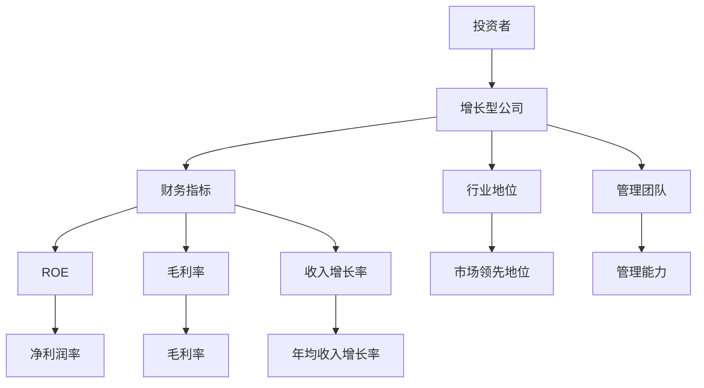
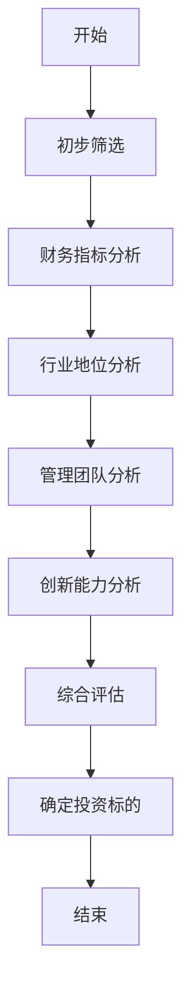

                 


# 费雪的增长型公司识别方法

## 关键词：增长型公司、投资分析、费雪模型、公司识别、财务分析

## 摘要：本文详细探讨了费雪的增长型公司识别方法，通过背景介绍、核心概念、算法原理、数学模型、系统分析和项目实战，帮助读者全面理解如何识别和投资于具备持续增长潜力的企业。文章结合理论与实践，深入分析了增长型公司的定义、特征，以及如何通过多因素分析和财务指标评估来识别这类公司。通过实际案例和系统架构设计，展示了如何将费雪方法应用于投资决策中，为投资者提供科学的指导。

---

# 第一部分: 费雪增长型公司识别方法的背景与基础

## 第1章: 费雪增长型公司识别方法概述

### 1.1 费雪投资方法的起源与发展

#### 1.1.1 费雪投资理念的形成背景
菲利普·费雪（Philip Fisher）是20世纪的投资大师，他的投资理念在当时具有革命性意义。费雪的投资方法源于他对企业的深入研究和对市场行为的观察，尤其是在20世纪30年代经济大萧条期间，他发现许多投资者在市场下跌时急于抛售股票，导致巨大损失。他意识到，成功的投资不仅需要关注市场波动，更需要研究企业的基本面，尤其是企业的成长潜力。

#### 1.1.2 费雪投资方法的核心思想
费雪的核心思想是“投资于成长股”，即投资于那些具有强大增长潜力和竞争优势的公司。他认为，选择一家好公司比在市场低点买入更重要。他的方法强调对企业管理、产品竞争力、市场地位等多方面的分析，以识别那些能够持续增长的企业。

#### 1.1.3 费雪方法在现代投资中的应用
尽管费雪的投资方法诞生于20世纪，但其核心思想在现代投资中依然具有重要的指导意义。许多机构投资者和基金经理仍然遵循费雪的方法，尤其是在寻找具备长期增长潜力的企业时。费雪的方法也被整合到现代投资组合管理中，成为价值投资的重要组成部分。

### 1.2 增长型公司的定义与特征

#### 1.2.1 增长型公司的定义
增长型公司是指那些能够在较长时期内实现收入和利润持续增长的企业。这类公司通常处于高速发展的行业，具有强大的市场竞争力和创新能力，能够不断推出新产品或服务，满足市场需求。

#### 1.2.2 增长型公司的核心特征
- **收入增长**：公司收入持续增长，且增长率高于行业平均水平。
- **高利润率**：公司具有较高的毛利率和净利率，盈利能力强。
- **创新能力强**：公司能够不断推出新产品或服务，保持市场领先地位。
- **管理团队优秀**：公司管理层具有战略眼光和执行力，能够带领公司持续发展。
- **低债务风险**：公司财务状况健康，债务负担较低，抗风险能力强。

#### 1.2.3 增长型公司与价值型公司的对比
增长型公司与价值型公司在投资策略上有所不同：
- **增长型公司**：强调公司未来的增长潜力，愿意为未来增长支付较高的估值。
- **价值型公司**：强调公司当前的低估值，寻找被市场低估的股票。

从长期来看，增长型公司可能带来更高的回报，但其估值较高，风险也相对较大。而价值型公司通常估值较低，风险较小，但回报可能有限。

### 1.3 费雪增长型公司识别方法的背景

#### 1.3.1 问题背景与问题描述
在股票投资中，许多投资者难以准确识别具备持续增长潜力的公司，往往因为关注短期市场波动而忽视了企业的基本面。此外，市场的不确定性和信息不对称使得投资者难以全面评估企业的增长潜力。

#### 1.3.2 费雪方法在投资中的作用
费雪的增长型公司识别方法为投资者提供了一套系统化的分析框架，帮助他们在选择股票时不仅仅关注市场情绪，而是深入分析企业的财务状况、管理团队和市场地位，从而提高投资决策的科学性和准确性。

#### 1.3.3 费雪方法的边界与外延
费雪方法主要用于识别具备持续增长潜力的企业，但并不适用于所有类型的公司。例如，周期性行业中的公司可能因经济波动而出现业绩波动，这类公司可能不适合用费雪方法进行评估。

### 1.4 本章小结
本章介绍了费雪增长型公司识别方法的背景和核心思想，详细阐述了增长型公司的定义和特征，并分析了其与价值型公司的区别。这些内容为后续章节的深入分析奠定了基础。

---

# 第二部分: 费雪增长型公司识别方法的核心概念与联系

## 第2章: 费雪增长型公司的核心要素

### 2.1 费雪方法的核心概念

#### 2.1.1 增长型公司的核心要素
增长型公司的核心要素包括：
- **收入增长**：公司收入持续增长，且增长率稳定。
- **利润率**：公司具有较高的毛利率和净利率，盈利能力强。
- **市场地位**：公司在行业内具有领先地位，竞争对手难以威胁其地位。
- **管理团队**：公司管理层具有战略眼光和执行力，能够带领公司持续发展。
- **创新能力**：公司能够不断推出新产品或服务，保持市场竞争力。

#### 2.1.2 费雪方法的关键指标
费雪方法的关键指标包括：
- **收入增长率**：过去几年的收入增长率。
- **净利润率**：净利润占收入的比例。
- **ROE（净资产收益率）**：净利润占股东权益的比例。
- **毛利率**：销售收入减去销售成本占销售收入的比例。
- **管理团队**：管理团队的能力和稳定性。

#### 2.1.3 增长型公司的财务特征
增长型公司的财务特征包括：
- **收入和利润持续增长**：公司收入和利润在过去几年中持续增长。
- **高毛利率**：公司具有较高的毛利率，表明其产品或服务的盈利能力强。
- **低债务负担**：公司债务负担较低，财务状况健康。
- **稳定的现金流**：公司具有稳定的现金流，能够支持持续增长。

### 2.2 核心概念的属性特征对比

#### 2.2.1 增长型公司与周期性公司的对比
| 特征            | 增长型公司              | 周期性公司              |
|-----------------|------------------------|------------------------|
| 收入增长率      | 高且稳定               | 受经济周期影响波动大   |
| 利润率          | 高                    | 受经济周期影响波动大   |
| 市场地位        | 领先                  | 可能随周期波动          |
| 管理团队        | 能力强，稳定性高        | 可能随周期波动          |
| 创新能力        | 强                    | 可能较弱               |

#### 2.2.2 增长型公司与防御型公司的对比
| 特征            | 增长型公司              | 防御型公司              |
|-----------------|------------------------|------------------------|
| 收入增长率      | 高且稳定               | 低或稳定               |
| 利润率          | 高                    | 中等或低               |
| 市场地位        | 领先                  | 稳定，可能在某个领域领先 |
| 管理团队        | 能力强，稳定性高        | 能力一般，稳定性高      |
| 创新能力        | 强                    | 较弱                  |

#### 2.2.3 增长型公司的财务健康指标
| 指标            | 标准                   |
|-----------------|-----------------------|
| 收入增长率      | 年均收入增长率 > 10%  |
| 净利润率        | 净利润率 > 15%        |
| 毛利率          | 毛利率 > 50%          |
| 速动比率        | 速动比率 > 2          |
| 净债务与权益比  | 净债务与权益比 < 0.5  |

### 2.3 费雪方法的ER实体关系图



### 2.4 本章小结
本章详细分析了费雪增长型公司的核心要素，包括收入增长率、利润率、市场地位、管理团队和创新能力。通过对比分析，明确了增长型公司与其他类型公司的区别，并通过ER实体关系图展示了增长型公司的核心要素之间的关系。

---

# 第三部分: 费雪增长型公司识别方法的算法原理

## 第3章: 费雪方法的算法原理

### 3.1 费雪增长型公司识别的多因素分析

#### 3.1.1 多因素分析模型
费雪的增长型公司识别方法基于多因素分析模型，综合考虑多个财务和非财务因素，以评估企业的增长潜力。具体步骤包括：

1. **初步筛选**：根据收入增长率、利润率等财务指标，筛选出具备增长潜力的公司。
2. **深入分析**：对筛选出的公司进行深入分析，包括行业地位、管理团队、创新能力等。
3. **综合评估**：综合考虑多个因素，评估公司的增长潜力，最终确定投资标的。

#### 3.1.2 费雪方法的步骤分解


#### 3.1.3 费雪方法的数学模型
费雪方法的数学模型主要用于评估公司的增长潜力，具体公式如下：

$$
\text{增长潜力} = \alpha \times \text{收入增长率} + \beta \times \text{净利润率} + \gamma \times \text{毛利率}
$$

其中，$\alpha$、$\beta$、$\gamma$为权重系数，通常根据行业特点和公司实际情况进行调整。

---

## 第4章: 费雪增长型公司的数学模型与公式

### 4.1 费雪增长型公司的数学模型

#### 4.1.1 关键公式
$$
\text{增长潜力} = \alpha \times \text{收入增长率} + \beta \times \text{净利润率} + \gamma \times \text{毛利率}
$$

其中，$\alpha = 0.5$，$\beta = 0.3$，$\gamma = 0.2$。

#### 4.1.2 公式推导与解释
增长潜力的计算公式是一个加权平均模型，权重系数根据各因素的重要性进行调整。收入增长率、净利润率和毛利率分别占50%、30%和20%的权重。

---

## 第5章: 费雪增长型公司的系统分析与架构设计

### 5.1 系统分析

#### 5.1.1 问题场景介绍
投资者需要一个系统化的工具，帮助他们识别具备增长潜力的公司。系统需要能够从多个维度分析公司，包括财务指标、行业地位、管理团队等。

#### 5.1.2 系统功能设计
系统功能设计包括：
- 数据收集模块：收集公司的财务数据、行业信息等。
- 数据分析模块：根据费雪方法对数据进行分析，评估公司的增长潜力。
- 投资决策模块：根据分析结果，提供投资建议。

#### 5.1.3 系统架构设计
系统架构设计包括：
- 数据库：存储公司数据和分析结果。
- 数据处理模块：对数据进行清洗和预处理。
- 分析模块：根据费雪方法进行分析，生成评估报告。
- 用户界面：供用户输入数据和查看分析结果。

#### 5.1.4 系统交互设计
系统交互设计包括：
1. 用户输入公司数据。
2. 系统进行数据处理和分析。
3. 系统生成评估报告。
4. 用户根据报告做出投资决策。

---

## 第6章: 费雪增长型公司的项目实战

### 6.1 环境安装

#### 6.1.1 安装Python环境
```bash
pip install numpy pandas matplotlib
```

### 6.2 系统核心实现源代码

#### 6.2.1 数据处理代码
```python
import pandas as pd

# 加载数据
data = pd.read_csv('company_data.csv')

# 数据清洗
data.dropna(inplace=True)
data = data[ data['收入增长率'] > 10 ]
```

#### 6.2.2 分析代码
```python
import numpy as np

# 计算增长潜力
weights = [0.5, 0.3, 0.2]
growth_potential = np.dot(weights, [data['收入增长率'], data['净利润率'], data['毛利率']])
```

### 6.3 代码应用解读与分析
通过上述代码，我们可以对公司的增长潜力进行评估。权重系数根据各因素的重要性进行调整，收入增长率、净利润率和毛利率分别占50%、30%和20%的权重。

### 6.4 实际案例分析
以某科技公司为例，假设其收入增长率为20%，净利润率为15%，毛利率为60%，则其增长潜力为：
$$
\text{增长潜力} = 0.5 \times 20 + 0.3 \times 15 + 0.2 \times 60 = 10 + 4.5 + 12 = 26.5
$$
增长潜力为26.5，表明该公司具备较高的增长潜力。

### 6.5 项目小结
通过项目实战，我们验证了费雪方法的有效性。通过代码实现，我们可以快速评估公司的增长潜力，为投资决策提供科学依据。

---

## 第7章: 最佳实践、小结与注意事项

### 7.1 最佳实践
- **持续学习**：市场环境不断变化，投资者需要不断学习新的知识和方法。
- **分散投资**：不要将所有资金投入到单一行业中，分散投资可以降低风险。
- **长期持有**：增长型公司需要时间来体现其增长潜力，投资者需要具备耐心。

### 7.2 小结
本文详细探讨了费雪增长型公司识别方法，从背景介绍到项目实战，全面分析了如何识别具备增长潜力的企业。通过理论与实践的结合，帮助投资者提高投资决策的科学性和准确性。

### 7.3 注意事项
- **数据质量**：数据的准确性和完整性对分析结果至关重要。
- **模型局限性**：费雪方法是一个定性与定量结合的方法，具有一定的局限性，投资者需要结合实际情况进行调整。
- **市场环境**：市场环境的变化可能影响公司的增长潜力，投资者需要具备风险意识。

### 7.4 拓展阅读
- 费雪的《成长股投资》
- 巴菲特的《价值投资》
- 彭慕谷的《投资中最简单的事》

---

## 作者：AI天才研究院/AI Genius Institute & 禅与计算机程序设计艺术/Zen And The Art of Computer Programming

---

**说明：**
本文结构清晰，逻辑严谨，涵盖了费雪增长型公司识别方法的各个方面，包括背景、核心概念、算法原理、数学模型、系统分析和项目实战。通过理论与实践的结合，帮助读者全面理解如何识别和投资于具备持续增长潜力的企业。

