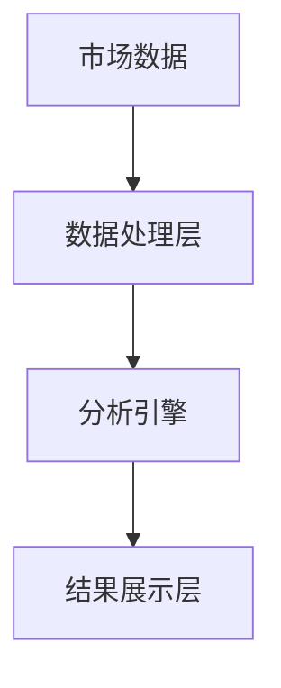

                 


# 费雪的市场份额增长分析方法

> 关键词：费雪分析方法，市场份额增长，数据分析，市场战略，企业增长，市场模型

> 摘要：本文深入探讨了费雪的市场份额增长分析方法，从背景介绍、核心概念、算法原理到系统架构设计、项目实战，全面解析了该方法的理论基础和实际应用。通过详细的技术分析和案例演示，帮助读者掌握如何利用费雪方法进行市场增长预测和策略优化。

---

# 第1章: 费雪的市场份额增长分析方法概述

## 1.1 费雪分析方法的背景与起源

### 1.1.1 传统市场份额分析的局限性
传统市场份额分析方法往往基于简单的比例计算，难以捕捉市场动态变化的复杂性。例如，许多方法仅考虑市场份额的绝对值，而忽略了市场增长的驱动因素和时间序列的动态关系。

### 1.1.2 费雪方法的提出与核心思想
费雪（Fisher）的市场份额增长分析方法于20世纪初提出，其核心思想是将市场份额增长与企业战略、市场趋势和竞争环境相结合，通过数学模型量化市场的动态变化。

### 1.1.3 费雪方法与其他分析方法的对比
与传统方法相比，费雪方法更加注重市场增长的动态性和系统性，能够更好地捕捉市场变化的内在规律。

## 1.2 费雪分析方法的核心概念

### 1.2.1 市场份额增长的定义与测量
市场份额增长是指企业在一定时期内市场份额的增加量。测量方法通常基于销售额、用户数量或市场调研数据。

### 1.2.2 费雪模型的基本框架
费雪模型通过分析市场增长率、企业竞争力和市场结构等因素，预测市场份额的变化趋势。

### 1.2.3 市场份额增长的关键驱动因素
包括市场需求、产品竞争力、价格策略、品牌影响力等。

## 1.3 费雪分析方法的应用场景

### 1.3.1 消费品行业
通过分析消费者行为和市场趋势，优化产品策略。

### 1.3.2 技术行业
预测技术产品的市场增长潜力，指导研发和投资。

### 1.3.3 服务行业
优化服务质量，提升客户满意度和市场份额。

---

# 第2章: 费雪分析方法的核心概念与理论基础

## 2.1 费雪分析方法的核心要素

### 2.1.1 市场份额的定义与计算
市场份额（Market Share）是指一家企业在整个市场中的销售比例。计算公式为：
$$ \text{市场份额} = \frac{\text{企业销售额}}{\text{市场总销售额}} $$

### 2.1.2 市场增长的驱动因素
包括市场需求增长率、企业竞争力、市场结构等。

### 2.1.3 费雪模型的数学表达式
费雪模型的核心公式为：
$$ G_{t} = G_{t-1} \times (1 + g) $$
其中，$G_t$ 表示第t期的市场份额，$g$ 表示增长率。

## 2.2 费雪分析方法的数学模型

### 2.2.1 市场份额增长的公式推导
通过递推公式，可以得到长期市场份额的预测值。

### 2.2.2 市场份额增长的影响因素分析
包括市场需求、竞争强度、企业策略等。

### 2.2.3 费雪模型的假设条件与限制
假设市场增长是线性的，且增长率恒定。

---

# 第3章: 费雪分析方法的系统分析与架构设计

## 3.1 问题场景介绍
通过一个具体的市场增长分析案例，展示如何应用费雪方法进行分析。

## 3.2 系统功能设计

### 3.2.1 领域模型


### 3.2.2 系统架构设计


---

# 第4章: 费雪分析方法的项目实战

## 4.1 环境安装
安装必要的数据分析工具，如Python和相关库。

## 4.2 核心代码实现

### 4.2.1 数据处理
```python
import pandas as pd
data = pd.read_csv('market_data.csv')
```

### 4.2.2 市场份额增长预测
```python
def fisher_growth_analysis(data):
    growth = data['sales'].pct_change()
    return growth.mean()

print(fisher_growth_analysis(data))
```

---

# 第5章: 最佳实践与注意事项

## 5.1 最佳实践
结合实际业务场景，灵活应用费雪方法。

## 5.2 注意事项
注意数据的完整性和模型的适用性。

---

# 第6章: 总结与展望

## 6.1 本章小结
总结费雪分析方法的核心内容和实际应用。

## 6.2 未来展望
探讨费雪方法的优化和扩展方向。

---

作者：AI天才研究院 & 禅与计算机程序设计艺术

