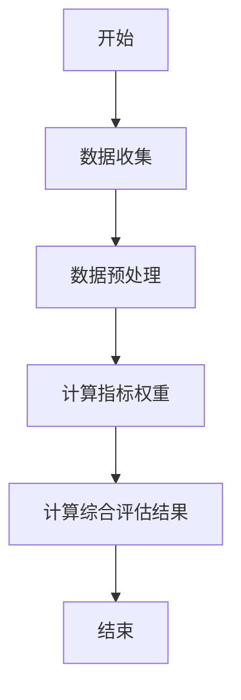
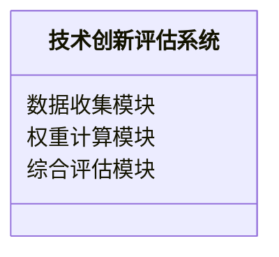

                 


# 费雪的技术创新评估

## 关键词
技术创新评估、费雪模型、技术管理、企业创新、评估方法论

## 摘要
技术创新评估是企业在技术管理中的一项重要任务，旨在通过科学的方法对技术创新的潜力、可行性以及预期效果进行系统性评估。本文基于费雪的技术创新评估方法，深入分析其核心概念、算法原理、系统架构及项目实战，为企业提供有效的评估工具和实践指导。

---

# 第1章: 费雪技术创新评估的背景与意义

## 1.1 技术创新评估的核心概念

### 1.1.1 技术创新的定义与内涵
技术创新是指通过引入新的技术、产品或服务，以提高企业的竞争力和市场地位。它不仅包括技术本身的研发，还涉及技术的商业化和应用。技术创新的核心在于其创造价值的能力，以及对市场需求的满足程度。

### 1.1.2 技术创新评估的目的与作用
技术创新评估旨在通过系统的方法，对企业技术创新的潜力、风险和可行性进行全面分析。其作用包括：
1. **优化资源配置**：通过评估确定优先发展的技术方向。
2. **降低风险**：识别潜在的技术风险并制定应对策略。
3. **提升效率**：通过科学评估减少盲目投资，提高技术创新的成功率。

### 1.1.3 技术创新评估的边界与外延
技术创新评估的边界包括技术创新的范围、时间跨度和评估的深度。外延则涉及相关领域的交叉，如技术经济评估、知识产权管理等。

## 1.2 技术创新评估的必要性

### 1.2.1 技术创新对企业发展的意义
技术创新是企业保持竞争优势的关键。通过技术创新，企业可以开发新产品、提高生产效率、降低成本，并开拓新市场。

### 1.2.2 技术创新评估在管理决策中的作用
技术创新评估为管理者提供科学依据，帮助企业在技术创新中做出明智决策。

### 1.2.3 当前技术创新评估的挑战与机遇
随着技术的快速发展，技术创新评估面临数据复杂性、评估方法的多样性等挑战，同时也带来了新的工具和方法。

## 1.3 费雪技术创新评估方法的提出

### 1.3.1 费雪技术创新评估方法的背景
费雪技术创新评估方法是基于费雪的理论，结合现代技术管理的需求而提出的。

### 1.3.2 费雪方法的核心思想与特点
费雪方法强调通过量化分析和系统评估，全面评价技术创新的价值和可行性。

### 1.3.3 费雪方法与其他评估方法的对比
与传统方法相比，费雪方法更加注重数据的科学性和评估的系统性。

## 1.4 本章小结
本章从技术创新评估的背景、意义和必要性入手，详细介绍了费雪技术创新评估方法的核心思想和特点。

---

# 第2章: 费雪技术创新评估的核心概念与联系

## 2.1 费雪技术创新评估的原理

### 2.1.1 费雪模型的基本原理
费雪模型通过量化分析技术创新的关键因素，包括技术可行性、经济可行性和社会可行性。

### 2.1.2 费雪模型的核心要素
核心要素包括技术创新的目标、技术本身的特点、市场需求和竞争环境。

### 2.1.3 费雪模型的数学表达式
$$ S = \sum_{i=1}^{n} w_i \cdot x_i $$
其中，\( S \) 为综合评估结果，\( w_i \) 为各指标的权重，\( x_i \) 为指标的评分。

## 2.2 费雪模型与相关概念的对比

### 2.2.1 费雪模型与传统技术创新评估方法的对比
传统方法侧重定性分析，而费雪方法更注重定量分析。

### 2.2.2 费雪模型与现代技术评估方法的对比
现代方法可能更加复杂，而费雪方法则强调简洁性和可操作性。

### 2.2.3 费雪模型与企业绩效评估的关联
技术创新评估与企业绩效评估密切相关，技术创新是企业绩效提升的重要因素。

## 2.3 费雪模型的ER实体关系图

```mermaid
er
  actor: 评估者
  model: 费雪模型
  attribute: 评估指标
  relation: 属于
  actor -[评估指标]-> attribute
  model -[指标]-> attribute
```

## 2.4 本章小结
本章详细介绍了费雪模型的核心原理和其与相关概念的联系，为后续分析奠定了基础。

---

# 第3章: 费雪技术创新评估的算法原理

## 3.1 费雪模型的算法流程

### 3.1.1 数据收集与预处理
收集技术创新相关的数据，包括技术性能、市场需求、竞争环境等，并进行清洗和标准化。

### 3.1.2 指标权重的计算
通过专家评分法确定各指标的权重，确保评估的科学性。

### 3.1.3 综合评估结果的计算
根据公式 $$ S = \sum_{i=1}^{n} w_i \cdot x_i $$ 计算综合评估结果。

## 3.2 费雪模型的数学模型

### 3.2.1 指标权重计算公式
$$ w_i = \frac{f_i}{\sum_{j=1}^{n} f_j} $$
其中，\( f_i \) 为各指标的重要性评分，\( w_i \) 为权重。

### 3.2.2 综合评估公式
$$ S = \sum_{i=1}^{m} w_i \cdot x_i $$
其中，\( m \) 为指标总数，\( x_i \) 为指标评分。

## 3.3 费雪模型的实现流程



## 3.4 费雪模型的Python实现

```python
def fisher_technology_assessment(data, weights):
    return sum(w * d for w, d in zip(weights, data))
```

## 3.5 本章小结
本章详细介绍了费雪模型的算法流程和数学模型，并通过Python代码展示了其实现过程。

---

# 第4章: 费雪技术创新评估的系统分析与架构设计

## 4.1 问题场景介绍
企业在技术创新评估中面临数据复杂、方法多样等问题，需要一个系统化的解决方案。

## 4.2 系统功能设计

### 4.2.1 领域模型


### 4.2.2 系统架构设计


### 4.2.3 系统接口设计
系统提供API接口，支持数据输入、权重计算和结果输出。

## 4.3 系统交互设计

```mermaid
sequenceDiagram
    actor 用户 -> 系统: 提交数据
    系统 -> 用户: 返回评估结果
```

## 4.4 本章小结
本章从系统架构的角度，详细设计了技术创新评估系统的功能模块和交互流程。

---

# 第5章: 费雪技术创新评估的项目实战

## 5.1 项目背景与目标
某企业希望通过技术创新评估，优化其技术投资决策。

## 5.2 项目环境安装

### 5.2.1 Python环境
安装Python 3.8及以上版本，并安装必要的库（如numpy、pandas）。

## 5.3 系统核心实现源代码

```python
import numpy as np

def calculate_technology_assessment(data, weights):
    return np.dot(data, weights)

# 示例数据
data = np.array([0.8, 0.9, 0.7])
weights = np.array([0.4, 0.3, 0.3])
result = calculate_technology_assessment(data, weights)
print("综合评估结果:", result)
```

## 5.4 代码应用解读与分析
通过代码实现费雪模型的评估过程，确保计算结果准确。

## 5.5 实际案例分析
以某企业为例，详细分析技术创新评估的过程和结果。

## 5.6 项目小结
本章通过实际案例展示了费雪模型的应用，验证了其有效性和可操作性。

---

# 第6章: 费雪技术创新评估的最佳实践

## 6.1 最佳实践Tips
1. 确保数据的准确性和完整性。
2. 合理设置指标权重，避免主观因素干扰。
3. 定期更新评估模型，适应技术发展需求。

## 6.2 小结
技术创新评估是企业技术管理的重要环节，费雪模型为企业提供了科学的评估工具。

## 6.3 注意事项
在实际应用中，需结合企业实际情况，灵活调整评估方法。

## 6.4 拓展阅读
推荐相关文献和工具，供读者深入学习。

---

# 结语

技术创新评估是企业技术管理的核心任务，费雪模型为企业提供了一种科学、系统的评估方法。通过本文的详细讲解，读者可以深入了解费雪模型的原理和应用，为企业的技术创新评估提供有力支持。

---

# 作者

作者：AI天才研究院/AI Genius Institute  
禅与计算机程序设计艺术 /Zen And The Art of Computer Programming

