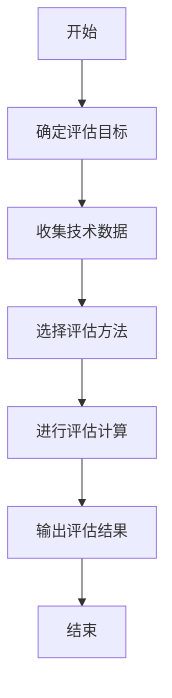

                 


# 费雪的技术创新评估在投资中的运用

## 关键词：
费雪技术创新评估、投资、技术创新、技术评估、投资策略

## 摘要：
费雪的技术创新评估是一种基于技术创新能力评估的投资策略，旨在通过分析技术的成熟度、经济性、风险等因素，为投资者提供科学的技术评估方法。本文从费雪技术创新评估的背景、核心概念、系统架构、算法原理、项目实战等多方面进行深入探讨，结合实际案例，详细阐述了技术创新评估在投资中的具体应用和实际价值。

---

# 第一部分: 费雪技术创新评估的概述

## 第1章: 费雪技术创新评估的背景与核心概念

### 1.1 费雪技术创新评估的背景

#### 1.1.1 技术创新评估的背景
技术创新是推动经济发展的重要动力，尤其是在当前数字化和智能化的浪潮中，技术创新的能力直接关系到企业的竞争力和投资回报。费雪的技术创新评估方法正是在这一背景下提出的，旨在帮助投资者更准确地识别和评估技术创新的价值。

#### 1.1.2 费雪技术创新评估的提出背景
费雪作为一位知名的技术专家和投资顾问，他提出了技术创新评估的方法，结合技术分析和市场分析，帮助投资者在技术创新领域做出更明智的投资决策。

#### 1.1.3 技术创新在投资中的重要性
技术创新不仅影响企业的短期表现，还决定了企业的长期发展潜力。通过技术创新评估，投资者可以更好地识别高潜力的技术项目，降低投资风险，提高投资回报率。

### 1.2 技术创新评估的核心概念

#### 1.2.1 技术创新的定义与特征
技术创新是指引入新的技术或改进现有技术，以提高产品或服务的性能、降低成本或满足新的市场需求。其核心特征包括创新性、实用性、可扩展性和可持续性。

#### 1.2.2 费雪技术创新评估的理论框架
费雪的技术创新评估框架包括技术生命周期分析、技术成熟度评估、技术经济性分析等核心模块，帮助投资者从多个维度评估技术创新的潜力和风险。

#### 1.2.3 技术创新与投资回报的关系
技术创新是投资回报的关键驱动因素。通过技术创新评估，投资者可以更准确地预测技术的市场表现和盈利能力，从而做出更科学的投资决策。

---

## 第2章: 技术创新评估的基本原理

### 2.1 技术创新评估的主要方法

#### 2.1.1 技术生命周期分析
技术生命周期包括引入期、成长期、成熟期和衰退期。通过分析技术所处的生命周期阶段，投资者可以更好地判断技术的市场潜力和投资风险。

#### 2.1.2 技术成熟度评估
技术成熟度评估是通过技术的开发阶段、专利数量、技术标准等因素，判断技术的成熟程度。成熟度高的技术更容易获得市场认可，投资风险较低。

#### 2.1.3 技术经济性分析
技术经济性分析包括技术的成本、收益、投资回报率等经济指标，帮助投资者评估技术的经济可行性。

### 2.2 技术创新评估的指标体系

#### 2.2.1 技术创新的核心指标
技术创新的核心指标包括技术创新的市场占有率、技术领先度、技术稳定性、技术应用前景等。

#### 2.2.2 技术创新的定量评估方法
定量评估方法包括技术成熟度指数模型、技术经济性评估公式、技术风险概率模型等。

#### 2.2.3 技术创新的定性评估方法
定性评估方法包括专家评估、市场调研、竞争分析等，帮助投资者从多个维度评估技术创新的潜力。

### 2.3 技术创新评估的工具与模型

#### 2.3.1 技术评估矩阵（Tech Assessment Matrix）
技术评估矩阵是一种常用的工具，通过将技术的核心指标进行量化，帮助投资者快速评估技术的优劣。

#### 2.3.2 技术路线图（Technology Roadmap）
技术路线图是一种可视化工具，通过展示技术的发展路径和技术关键节点，帮助投资者更好地规划投资策略。

#### 2.3.3 技术可行性分析框架
技术可行性分析框架包括技术可行性、经济可行性、市场可行性等模块，帮助投资者全面评估技术创新的可行性。

---

# 第二部分: 技术创新评估的系统分析

## 第3章: 技术创新评估的系统架构

### 3.1 技术创新评估的系统模型

#### 3.1.1 技术创新评估的系统组成
技术创新评估系统主要包括数据采集模块、数据分析模块、评估模型模块、结果输出模块等核心部分。

#### 3.1.2 系统功能模块划分
系统功能模块包括数据输入、数据处理、评估计算、结果展示等模块，每个模块都有其特定的功能和作用。

#### 3.1.3 系统输入输出分析
系统输入包括技术数据、市场数据、经济数据等，系统输出包括技术评估结果、投资建议、风险提示等。

### 3.2 技术创新评估的系统架构设计

#### 3.2.1 分层架构设计
技术创新评估系统采用分层架构，包括数据层、业务逻辑层、用户界面层等，确保系统的高效运行和功能扩展。

#### 3.2.2 模块化设计原则
模块化设计原则将系统功能划分为独立的模块，每个模块负责特定的功能，确保系统的可维护性和扩展性。

#### 3.2.3 系统交互流程图
系统交互流程图展示了系统各模块之间的交互关系，帮助开发人员更好地理解系统的设计和功能。

### 3.3 技术创新评估的系统接口设计

#### 3.3.1 系统内部接口
系统内部接口包括数据采集模块与数据分析模块的交互、评估模型模块与结果输出模块的交互等。

#### 3.3.2 系统外部接口
系统外部接口包括与外部数据库的交互、与用户界面的交互等，确保系统的数据输入和输出的顺畅。

#### 3.3.3 接口数据格式与协议
接口数据格式包括JSON、XML等，接口协议包括HTTP、WebSocket等，确保系统的数据传输和交互的高效性和安全性。

---

## 第4章: 技术创新评估的算法原理

### 4.1 技术创新评估的主要算法

#### 4.1.1 技术成熟度评估算法
技术成熟度评估算法通过技术的开发阶段、专利数量、技术标准等因素，计算技术成熟度指数。

#### 4.1.2 技术经济性评估算法
技术经济性评估算法通过技术的投入成本、预期收益、投资回报率等因素，计算技术的经济可行性。

#### 4.1.3 技术风险评估算法
技术风险评估算法通过技术的不确定性、市场风险、竞争风险等因素，计算技术的风险概率。

### 4.2 技术创新评估的数学模型

#### 4.2.1 技术成熟度指数模型
$$ \text{成熟度指数} = \frac{\text{技术成熟度}}{\text{市场成熟度}} $$

#### 4.2.2 技术经济性评估公式
$$ \text{经济性指数} = \frac{\text{收益} - \text{成本}}{\text{投入}} $$

#### 4.2.3 技术风险概率模型
$$ \text{风险概率} = \frac{\text{高风险因素}}{\text{总因素}} $$

### 4.3 技术创新评估的流程图



---

# 第三部分: 技术创新评估的项目实战

## 第5章: 技术创新评估的项目实战

### 5.1 项目环境安装

#### 5.1.1 系统环境要求
技术创新评估系统需要安装Python 3.8及以上版本、Jupyter Notebook、Pandas、NumPy等库。

#### 5.1.2 数据准备
需要准备技术数据、市场数据、经济数据等，确保数据的完整性和准确性。

#### 5.1.3 系统安装步骤
安装Python环境、安装必要的库、下载技术创新评估系统代码。

### 5.2 系统核心实现

#### 5.2.1 技术成熟度评估实现
```python
def technology_maturity(technology_data):
    maturity = technology_data['patents'] / technology_data['market_share']
    return maturity
```

#### 5.2.2 技术经济性评估实现
```python
def technology_economic(technology_data):
    economic_index = (technology_data['revenue'] - technology_data['cost']) / technology_data['investment']
    return economic_index
```

#### 5.2.3 技术风险评估实现
```python
def technology_risk(technology_data):
    risk_factors = technology_data['risk_factors']
    total_factors = len(risk_factors)
    risk_probability = sum(factor['probability'] for factor in risk_factors) / total_factors
    return risk_probability
```

### 5.3 代码应用解读与分析

#### 5.3.1 技术成熟度评估代码解读
上述代码通过技术的专利数量和市场占有率计算技术成熟度指数，帮助投资者判断技术的成熟程度。

#### 5.3.2 技术经济性评估代码解读
上述代码通过技术的收入、成本和投资计算技术的经济指数，帮助投资者评估技术的经济可行性。

#### 5.3.3 技术风险评估代码解读
上述代码通过技术的风险因素计算技术的风险概率，帮助投资者评估技术的投资风险。

### 5.4 实际案例分析

#### 5.4.1 案例背景介绍
某技术创新公司开发了一种新型人工智能算法，希望通过技术创新评估系统评估其市场潜力和投资风险。

#### 5.4.2 技术成熟度评估
根据专利数量和市场占有率计算，该技术的成熟度指数为0.85，属于较高成熟度。

#### 5.4.3 技术经济性评估
根据收入、成本和投资计算，该技术的经济指数为0.7，具有较高的经济可行性。

#### 5.4.4 技术风险评估
根据风险因素计算，该技术的风险概率为0.2，属于低风险。

### 5.5 项目小结

技术创新评估系统通过科学的方法和技术手段，帮助投资者准确评估技术创新的潜力和风险，为投资决策提供有力支持。

---

# 第四部分: 技术创新评估的总结与展望

## 第6章: 技术创新评估的总结与展望

### 6.1 技术创新评估的总结

技术创新评估是一种基于技术创新能力评估的投资策略，通过分析技术的成熟度、经济性、风险等因素，帮助投资者做出更明智的投资决策。费雪的技术创新评估方法结合了技术分析和市场分析，为投资者提供了科学的评估工具和方法。

### 6.2 技术创新评估的展望

随着技术的不断进步和市场的变化，技术创新评估方法也需要不断优化和完善。未来的研究方向包括引入更多数据源、改进评估模型、扩展应用领域等，以更好地满足投资者的需求。

---

# 作者：AI天才研究院/AI Genius Institute & 禅与计算机程序设计艺术 /Zen And The Art of Computer Programming

