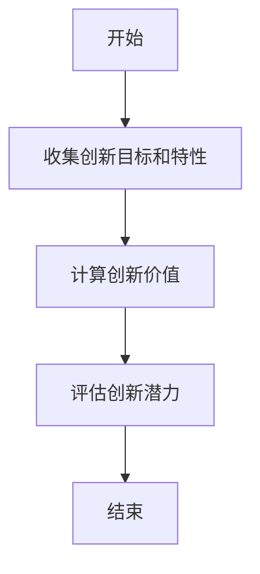

                 


# 费雪的技术创新评估：区分真正的突破

> **关键词**：技术创新评估、费雪方法、突破性创新、增量改进、系统架构、数学模型  
> **摘要**：本文详细探讨了费雪技术创新评估方法，通过系统化的分析和实例，展示了如何区分真正具有突破性的创新与 Incremental 改进。文章涵盖了方法的核心概念、算法原理、数学模型以及实际应用，为读者提供了全面的理解和应用指南。

---

## 第一部分：费雪技术创新评估的背景与核心概念

### 第1章：技术创新评估的背景与问题背景

#### 1.1 技术创新评估的背景

- **1.1.1 技术创新的定义与重要性**  
  技术创新是指引入新的技术、方法或产品，以解决现有问题或满足新的需求。它是推动科技进步和社会经济发展的重要驱动力。

- **1.1.2 技术创新评估的必要性**  
  在技术研发和产品开发中，准确评估创新的价值和潜力至关重要。然而，传统的评估方法往往过于主观或片面，难以客观衡量创新的实际价值。

- **1.1.3 费雪方法的提出背景**  
  费雪方法作为一种创新的评估工具，旨在通过系统化的分析和量化指标，帮助区分真正具有突破性的创新与 Incremental 改进。

#### 1.2 技术创新评估的核心问题

- **1.2.1 如何区分真正的突破性创新**  
  突破性创新往往具有颠覆性，能够显著改变行业格局或技术领域。而 Incremental 改进则是在现有基础上的小幅优化。

- **1.2.2 传统评估方法的局限性**  
  传统方法通常依赖主观判断，缺乏客观量化指标，难以准确评估创新的实际价值。

- **1.2.3 费雪方法的创新点**  
  费雪方法通过引入系统化的评估指标和量化模型，能够更准确地识别突破性创新，并为其提供科学的评估依据。

---

### 第2章：费雪技术创新评估的核心概念

#### 2.1 费雪技术创新评估的定义

- **2.1.1 核心概念的构成**  
  费雪方法的核心概念包括创新目标、创新特性、创新价值和创新潜力。

- **2.1.2 核心概念的属性特征对比表**  
  | **创新目标** | **创新特性** | **创新价值** | **创新潜力** |
  |--------------|--------------|--------------|--------------|
  | 解决问题的目标 | 创新的特征和属性 | 创新带来的价值 | 创新未来的潜力 |

- **2.1.3 实体关系图（ER图）的 Mermaid 流程图**  
  ```mermaid
  graph TD
    A[创新目标] --> B[创新特性]
    B --> C[创新价值]
    C --> D[创新潜力]
  ```

#### 2.2 核心概念之间的关系

- **2.2.1 关键实体的交互关系**  
  创新目标决定了创新特性，创新特性影响创新价值，而创新价值和特性共同决定了创新潜力。

- **2.2.2 费雪模型的 Mermaid 实体关系图**  
  ```mermaid
  graph TD
    A[创新目标] --> B[创新特性]
    B --> C[创新价值]
    B --> D[创新潜力]
  ```

---

## 第二部分：费雪技术创新评估的算法原理

### 第3章：算法概述

#### 3.1 算法的主要步骤

- **3.1.1 算法的输入与输出**  
  - **输入**：创新目标、创新特性、创新价值。
  - **输出**：创新潜力评估结果。

- **3.1.2 算法的主要步骤**  
  1. 收集创新目标和特性。
  2. 计算创新价值。
  3. 评估创新潜力。

#### 3.2 算法的 Mermaid 流程图



#### 3.3 算法的 Python 实现

- **核心代码片段**：
  ```python
  def fisher_innovation_assessment(innovation_target, innovation_feature):
      # 计算创新价值
      innovation_value = calculate_value(innovation_target, innovation_feature)
      # 评估创新潜力
      innovation_potential = assess_potential(innovation_value)
      return innovation_potential
  ```

---

### 第4章：数学模型与公式

#### 4.1 核心数学模型

- **4.1.1 费雪评估模型的数学表达**  
  创新潜力 = f(创新目标, 创新特性, 创新价值)

- **4.1.2 相关变量的定义与关系**  
  创新潜力（P）= f(创新目标（T），创新特性（F），创新价值（V）)

- **4.1.3 模型的推导过程**  
  通过统计分析和权重分配，创新潜力由创新目标、创新特性和创新价值共同决定。

#### 4.2 关键公式的详细解释

- **4.2.1 创新价值的计算公式**  
  $$ V = \sum_{i=1}^{n} w_i \cdot f_i $$
  其中，$$w_i$$ 是第 i 个特性的权重，$$f_i$$ 是第 i 个特性的值。

- **4.2.2 创新潜力的评估公式**  
  $$ P = \alpha \cdot V + \beta \cdot T $$
  其中，$$\alpha$$ 和 $$\beta$$ 是权重系数，$$V$$ 是创新价值，$$T$$ 是创新目标的实现程度。

---

### 第5章：系统分析与架构设计

#### 5.1 问题场景介绍

- **5.1.1 问题场景的描述**  
  在技术创新项目中，如何准确评估创新的价值和潜力。

- **5.1.2 系统的目标与范围**  
  开发一个基于费雪方法的创新评估系统，提供量化评估结果。

- **5.1.3 系统的约束条件**  
  数据输入格式统一，计算效率高。

#### 5.2 系统功能设计

- **5.2.1 领域模型的 Mermaid 类图**  
  ```mermaid
  classDiagram
    class 创新目标 {
        属性：名称、目标描述
        方法：评估目标
    }
    class 创新特性 {
        属性：特性名称、特性值
        方法：计算特性权重
    }
    class 创新价值 {
        属性：价值评分
        方法：计算创新潜力
    }
    创新目标 --> 创新特性
    创新特性 --> 创新价值
  ```

- **5.2.2 核心功能模块的设计**  
  - 创新目标管理模块
  - 创新特性评估模块
  - 创新价值计算模块
  - 创新潜力评估模块

- **5.2.3 功能模块之间的交互关系**  
  创新目标驱动创新特性评估，创新特性评估影响创新价值，最终决定创新潜力。

#### 5.3 系统架构设计

- **5.3.1 系统架构的 Mermaid 架构图**  
  ```mermaid
  architecture
    前端 --> 后端
    后端 --> 数据库
    数据库 --> 后端
  ```

- **5.3.2 架构设计的详细说明**  
  - 前端：用户输入创新目标和特性。
  - 后端：处理计算并返回结果。
  - 数据库：存储和管理数据。

---

### 第6章：项目实战与案例分析

#### 6.1 项目环境的安装与配置

- **6.1.1 开发环境的选择**  
  建议使用 Python 3.8 及以上版本，安装必要的库如 Mermaid 和 matplotlib。

- **6.1.2 必要工具的安装**  
  ```bash
  pip install mermaid-django matplotlib
  ```

#### 6.2 系统核心实现源代码

- **6.2.1 核心代码片段**  
  ```python
  import matplotlib.pyplot as plt

  def calculate_value(features, weights):
      return sum(w * f for w, f in zip(weights, features))

  def assess_potential(value, target):
      return (value / target) * 100

  # 示例数据
  features = [80, 90, 70]
  weights = [0.3, 0.4, 0.3]
  target = 250

  value = calculate_value(features, weights)
  potential = assess_potential(value, target)
  print(f"创新价值：{value}，创新潜力：{potential}%")
  ```

---

## 第三部分：小结与展望

### 第7章：最佳实践与小结

#### 7.1 小结

- 费雪技术创新评估方法通过系统化的分析和量化模型，能够准确区分突破性创新与 Incremental 改进。
- 通过实际案例分析，展示了该方法在项目中的有效应用。

#### 7.2 注意事项

- 数据的准确性和完整性对评估结果影响重大，需确保输入数据的可靠性。
- 系统设计时需考虑扩展性，以适应不同类型的创新评估需求。

#### 7.3 拓展阅读

- 推荐阅读《技术创新管理》和《系统架构设计》相关书籍，深入理解技术创新评估的理论与实践。

---

## 作者信息

**作者：AI天才研究院/AI Genius Institute & 禅与计算机程序设计艺术 /Zen And The Art of Computer Programming**

---

以上是关于费雪技术创新评估方法的完整思考过程和文章结构。通过系统化的分析和实例，展示了如何区分真正具有突破性的创新与 Incremental 改进，并为读者提供了全面的理解和应用指南。

