                 


# 费雪的技术创新评估：区块链技术的投资潜力分析

**关键词：** 区块链技术，技术创新评估，投资潜力分析，共识机制，智能合约，分布式账本，区块链项目

**摘要：** 本文旨在通过系统性分析区块链技术的核心概念、算法原理和数学模型，结合实际投资案例，评估区块链技术的投资潜力。文章结构清晰，内容详实，涵盖区块链技术的起源、核心概念、算法原理、数学模型、系统架构设计以及实际投资分析，帮助读者全面理解区块链技术及其投资价值。

---

# 第一部分: 区块链技术与技术创新评估概述

# 第1章: 区块链技术的起源与核心概念

## 1.1 区块链技术的起源

### 1.1.1 区块链的起源背景

区块链技术的起源可以追溯到2008年，当时中本聪（中本智惠）发表了一篇名为《比特币：一种点对点的电子现金系统》的论文，提出了比特币的概念。这篇论文不仅奠定了区块链技术的基础，还引发了全球范围内对去中心化技术的广泛关注。

### 1.1.2 中本聪与比特币的诞生

中本聪的比特币项目是区块链技术的第一个成功应用。比特币的设计基于去中心化的思想，通过点对点网络实现货币的发行和交易，无需依赖传统金融机构。这种创新不仅解决了传统货币交易中的信任问题，还为区块链技术的发展提供了新的方向。

### 1.1.3 区块链技术的核心理念

区块链的核心理念是通过去中心化的分布式账本，利用密码学和共识机制确保数据的安全性和不可篡改性。这种技术设计不仅提高了交易的透明度，还降低了信任成本。

## 1.2 区块链的核心特点

### 1.2.1 去中心化

区块链通过分布式账本技术实现了去中心化的数据存储和管理，避免了单点故障和数据篡改的风险。

### 1.2.2 不可篡改性

区块链中的数据通过哈希指针和Merkle树等结构实现不可篡改性，确保了数据的安全性和可靠性。

### 1.2.3 智能合约

智能合约是区块链技术的重要组成部分，它通过自动执行预定义的规则和条款，实现了无需信任的自动化交易。

### 1.2.4 网络安全性

区块链网络通过共识机制和加密算法确保了网络的安全性，防止了恶意攻击和数据篡改。

## 1.3 区块链与传统技术的区别

### 1.3.1 中心化与去中心化的对比

传统技术通常依赖于中心化的机构进行数据存储和管理，而区块链技术通过去中心化的网络实现数据的分布式存储。

### 1.3.2 数据存储方式的差异

传统技术的数据存储依赖于中心化机构，存在单点故障和数据篡改的风险。而区块链技术通过分布式账本实现了数据的安全存储。

### 1.3.3 交易验证机制的不同

传统技术依赖于中心化机构进行交易验证和确认，而区块链技术通过去中心化的共识机制实现交易的自动验证和确认。

## 1.4 区块链技术的边界与外延

### 1.4.1 区块链技术的应用场景

区块链技术可以应用于金融、供应链管理、医疗、教育等多个领域，实现数据的安全共享和高效管理。

### 1.4.2 区块链技术的局限性

区块链技术在扩展性、能源消耗、隐私保护等方面存在一定的局限性，需要通过技术创新和优化来解决。

### 1.4.3 区块链技术的未来发展方向

未来，区块链技术将朝着高效化、隐私保护、跨链 interoperability 等方向发展，进一步推动技术的广泛应用和创新。

## 1.5 本章小结

本章通过对区块链技术的起源、核心特点以及与传统技术的对比，全面介绍了区块链技术的基本概念和核心理念。通过理解区块链技术的边界与外延，读者可以更好地把握其应用潜力和未来发展方向。

---

# 第2章: 区块链技术的核心概念与联系

## 2.1 区块链技术的核心原理

### 2.1.1 分布式账本

分布式账本是区块链技术的核心数据结构，通过多个节点共同维护一个去中心化的账本，确保数据的安全性和一致性。

### 2.1.2 共识机制

共识机制是区块链技术的关键组成部分，通过特定算法实现分布式网络中节点对交易的一致性确认。

### 2.1.3 智能合约

智能合约是基于区块链的自动执行程序，通过预定义的规则和条款实现自动化交易和管理。

### 2.1.4 加密算法

加密算法是区块链技术的重要保障，通过哈希函数、数字签名等技术确保数据的安全性和隐私性。

## 2.2 核心概念的属性特征对比

### 2.2.1 区块链节点的属性对比

| 属性 | 中心化节点 | 去中心化节点 |
|------|------------|--------------|
| 权威性 | 高         | 无           |
| 可信度 | 高         | 依赖共识机制 |
| 成本 | 低         | 高           |

### 2.2.2 共识机制的特征对比

| 机制 | PoW（工作量证明） | PoS（权益证明） | BFT（拜占庭容错） |
|------|------------------|-----------------|-------------------|
| 安全性 | 高               | 中               | 高                 |
| 资源消耗 | 高（能源消耗大） | 低               | 低                 |
| 延迟 | 高               | 中               | 低                 |

### 2.2.3 加密算法的安全性对比

| 算法 | 对称加密 | 非对称加密 | 哈希函数 |
|------|----------|-----------|----------|
| 速度 | 高       | 低         | 中       |
| 安全性 | 高       | 高         | 高       |

## 2.3 ER实体关系图架构

以下是区块链技术的ER实体关系图：

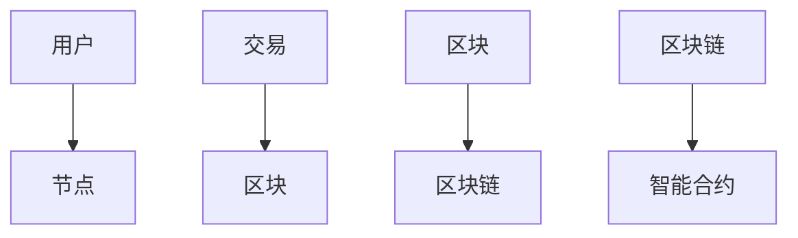

## 2.4 本章小结

本章通过详细分析区块链技术的核心原理，对比了去中心化节点、共识机制和加密算法的属性特征，并通过ER实体关系图展示了区块链系统的整体架构。这为后续的算法原理分析奠定了基础。

---

# 第3章: 区块链技术的算法原理讲解

## 3.1 共识机制的算法原理

### 3.1.1 工作量证明（PoW）

工作量证明机制通过计算哈希值的难度来确保网络安全。节点需要通过解决复杂的数学问题来获得记账权。

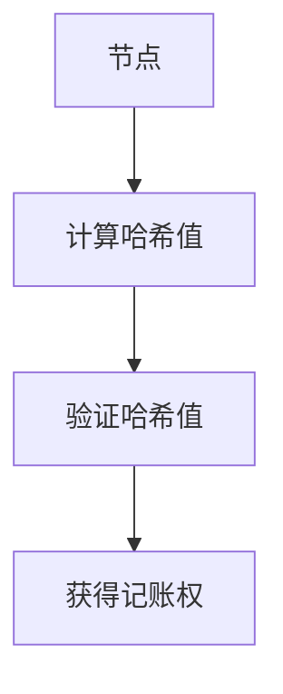

数学公式：
$$ H = hash(message) $$

### 3.1.2 权益证明（PoS）

权益证明机制通过质押代币的方式来获得记账权，降低了能源消耗。

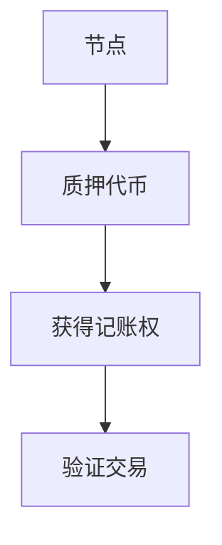

数学公式：
$$ P = \text{质押的代币数量} $$

### 3.1.3 拜占庭容错（BFT）

拜占庭容错机制通过共识算法实现网络中节点的一致性确认。

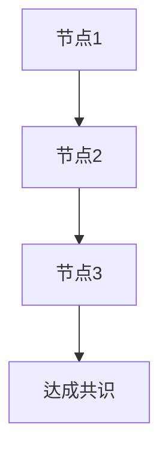

数学公式：
$$ n = 2f + 1 $$ （节点数大于等于 2f+1，其中 f 是恶意节点数）

## 3.2 智能合约的算法原理

### 3.2.1 智能合约的执行流程

智能合约通过预定义的规则自动执行交易和管理。

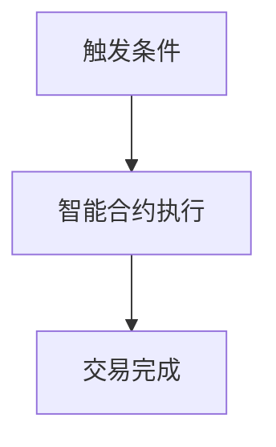

数学公式：
$$ \text{智能合约状态} = f(\text{输入参数}) $$

### 3.2.2 智能合约的编译与部署

智能合约通常通过编译语言（如Solidity）编写，然后部署在区块链网络上。

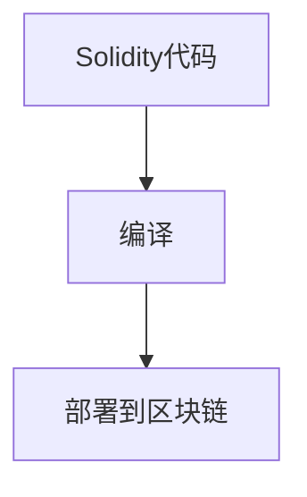

### 3.2.3 智能合约的安全性分析

智能合约的安全性依赖于代码的正确性和网络的安全性。

数学公式：
$$ \text{智能合约安全性} = f(\text{代码复杂度}, \text{网络安全性}) $$

## 3.3 区块链数据结构

### 3.3.1 区块链的基本数据结构

区块链由多个区块组成，每个区块包含交易数据和哈希指针。

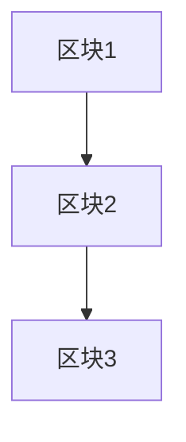

数学公式：
$$ H_i = hash(block_i) $$

### 3.3.2 区块链的哈希指针

哈希指针通过哈希值确保数据的完整性和不可篡改性。

数学公式：
$$ H = hash(\text{前一个哈希值} || \text{当前交易数据}) $$

### 3.3.3 区块链的Merkle树

Merkle树通过哈希值的层级结构实现数据的高效验证。

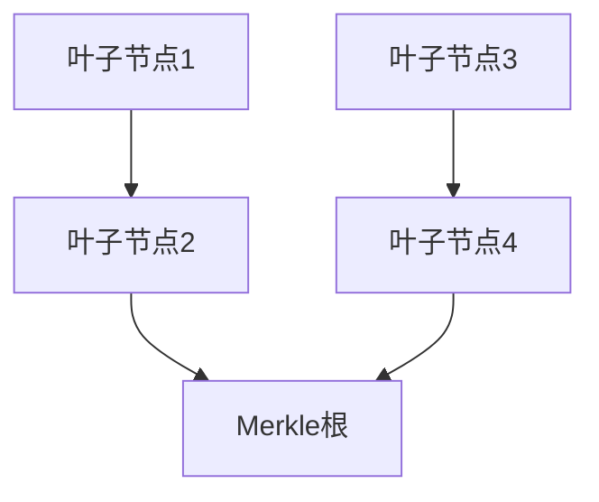

数学公式：
$$ H = hash(hash(\text{叶子节点1}) || hash(\text{叶子节点2}) || hash(\text{叶子节点3}) || hash(\text{叶子节点4})) $$

## 3.4 本章小结

本章详细讲解了区块链技术的核心算法原理，包括共识机制、智能合约和数据结构。通过数学公式和mermaid图，帮助读者理解区块链技术的实现细节和内在逻辑。

---

# 第4章: 区块链技术的数学模型与公式

## 4.1 共识机制的数学模型

### 4.1.1 工作量证明机制

工作量证明机制通过计算哈希值的难度来实现网络安全。

数学公式：
$$ D = \text{难度} = \frac{2^{256}}{L \times T} $$
其中，L是链的长度，T是期望的时间间隔。

### 4.1.2 权益证明机制

权益证明机制通过质押代币的数量来确定记账权的概率。

数学公式：
$$ P = \frac{\text{质押的代币数量}}{\text{总质押代币数量}} \times 100\% $$

### 4.1.3 拜占庭容错机制

拜占庭容错机制通过数学模型确保网络中节点的一致性。

数学公式：
$$ n = 2f + 1 $$
其中，n是节点总数，f是恶意节点数。

## 4.2 智能合约的数学模型

### 4.2.1 智能合约的状态转移

智能合约的状态通过输入参数和规则进行转移。

数学公式：
$$ S' = f(S, I) $$
其中，S是当前状态，I是输入参数。

### 4.2.2 智能合约的执行效率

智能合约的执行效率与代码复杂度和网络性能有关。

数学公式：
$$ E = f(\text{代码复杂度}, \text{网络带宽}) $$

## 4.3 区块链数据结构的数学模型

### 4.3.1 区块链的哈希指针

哈希指针通过哈希值确保数据的完整性。

数学公式：
$$ H_i = hash(\text{前一个哈希值} || \text{当前交易数据}) $$

### 4.3.2 区块链的Merkle树

Merkle树通过层级哈希实现数据的高效验证。

数学公式：
$$ H = hash(hash(\text{叶子节点1}) || hash(\text{叶子节点2}) || \cdots || hash(\text{叶子节点n})) $$

## 4.4 本章小结

本章通过数学公式和模型，详细分析了区块链技术的共识机制、智能合约和数据结构。这些数学模型为区块链技术的实现和优化提供了理论依据。

---

# 第5章: 区块链技术的系统分析与架构设计

## 5.1 系统功能设计

### 5.1.1 领域模型设计

以下是区块链系统的领域模型：

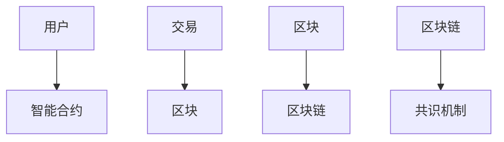

### 5.1.2 系统功能模块

1. 用户模块：负责发起交易和查询区块链状态。
2. 智能合约模块：负责自动执行预定义的规则和条款。
3. 区块链节点模块：负责维护分布式账本和交易验证。
4. 共识机制模块：负责实现网络中节点的一致性确认。

## 5.2 系统架构设计

### 5.2.1 分布式架构设计

区块链系统采用分布式架构，通过多个节点共同维护一个去中心化的账本。

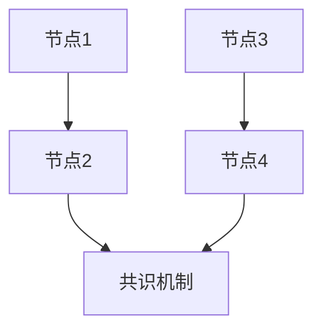

### 5.2.2 网络通信设计

区块链系统通过P2P网络实现节点之间的通信和数据同步。

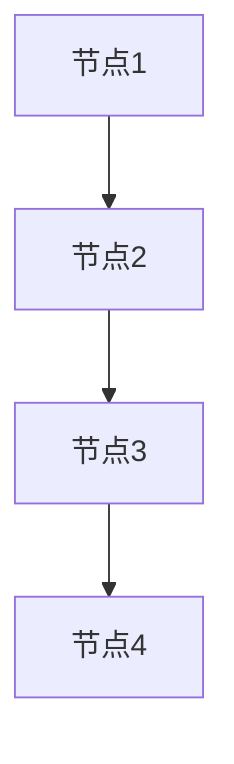

### 5.2.3 数据存储设计

区块链系统采用分布式存储技术，确保数据的安全性和可用性。

数学公式：
$$ S = \sum_{i=1}^{n} D_i $$
其中，S是总存储空间，D_i是每个节点的存储空间。

## 5.3 系统接口设计

### 5.3.1 用户接口

用户可以通过API接口发起交易和查询区块链状态。

数学公式：
$$ API = \text{交易发起} \lor \text{状态查询} $$

### 5.3.2 节点接口

节点之间通过P2P协议进行通信和数据同步。

数学公式：
$$ P2P = \text{数据传输} \lor \text{交易验证} $$

## 5.4 系统交互流程图

以下是区块链系统的交互流程图：

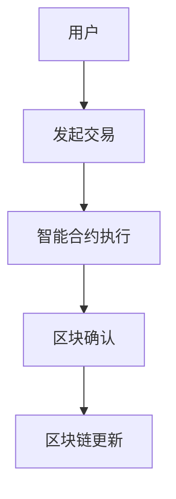

## 5.5 本章小结

本章通过系统功能设计、架构设计和接口设计，详细分析了区块链系统的整体结构和运作流程。通过mermaid图和数学公式，帮助读者理解区块链系统的实现细节和交互流程。

---

# 第6章: 区块链技术的项目实战分析

## 6.1 环境安装与配置

### 6.1.1 开发工具选择

推荐使用Solidity语言和以太坊平台进行区块链开发。

```bash
# 安装以太坊开发环境
npm install -g ethereumjs
```

### 6.1.2 区块链网络选择

可以选择公有链（如以太坊）或私有链（如Hyperledger）进行开发。

## 6.2 区块链项目核心功能实现

### 6.2.1 智能合约实现

以下是智能合约的实现代码：

```solidity
// SPDX-License-Identifier: MIT
pragma solidity ^0.8.0;

contract SimpleContract {
    function multiply(uint256 a, uint256 b) public pure returns (uint256) {
        return a * b;
    }
}
```

### 6.2.2 区块链节点实现

以下是区块链节点的实现代码：

```javascript
const Web3 = require('web3');
const web3 = new Web3('http://localhost:8545');

async function getBlockNumber() {
    const blockNumber = await web3.eth.getBlockNumber();
    console.log(blockNumber);
}

getBlockNumber();
```

### 6.2.3 交易验证实现

以下是交易验证的实现代码：

```javascript
const Web3 = require('web3');
const web3 = new Web3('http://localhost:8545');

async function verifyTransaction(txHash) {
    const receipt = await web3.eth.getTransactionReceipt(txHash);
    console.log(receipt);
}

verifyTransaction('0x123456789...');
```

## 6.3 实际案例分析

### 6.3.1 案例背景介绍

以太坊是目前最成功的区块链平台之一，支持智能合约和去中心化应用的开发。

### 6.3.2 案例分析与解读

以太坊通过Solidity语言实现智能合约，通过Geth节点实现区块链网络的维护和交易验证。

数学公式：
$$ E = \text{以太坊网络中的节点数量} $$

### 6.3.3 案例总结与启示

以太坊的成功证明了区块链技术的广泛应用潜力，但也存在一些问题，如能源消耗高、交易速度慢等。

## 6.4 本章小结

本章通过实际项目案例的分析和实现，帮助读者理解区块链技术在实际应用中的实现细节和开发流程。通过代码示例和数学公式，进一步巩固了读者对区块链技术的理解。

---

# 第7章: 区块链技术投资潜力分析与最佳实践

## 7.1 区块链技术投资潜力分析

### 7.1.1 技术成熟度评估

区块链技术已经从早期的概念阶段发展到实际应用阶段，技术成熟度较高。

### 7.1.2 市场需求分析

区块链技术在金融、供应链、医疗等多个领域展现出巨大的市场需求。

### 7.1.3 市场竞争分析

区块链市场已经形成激烈的竞争格局，技术创新是企业脱颖而出的关键。

## 7.2 投资策略与风险控制

### 7.2.1 投资策略

投资者应选择技术成熟、市场需求大、团队实力强的区块链项目进行投资。

### 7.2.2 风险控制

投资者需关注技术风险、市场风险和政策风险，制定合理的风险管理策略。

## 7.3 最佳实践与注意事项

### 7.3.1 技术创新的重要性

技术创新是区块链技术持续发展的关键，投资者应关注具有创新能力的项目。

### 7.3.2 投资分散化

投资者应分散投资，避免将所有资金投入到单一项目中，降低风险。

### 7.3.3 长期视角

区块链技术的发展需要时间和持续创新，投资者应具备长期投资的耐心。

## 7.4 本章小结

本章通过对区块链技术投资潜力的分析，提出了合理的投资策略和风险控制方法。通过最佳实践的总结，帮助投资者更好地把握区块链技术的投资机会和风险。

---

# 第8章: 区块链技术的未来发展趋势与挑战

## 8.1 区块链技术的未来发展趋势

### 8.1.1 技术创新

未来，区块链技术将朝着高效化、隐私保护和跨链 interoperability 等方向发展。

### 8.1.2 应用场景拓展

区块链技术将在更多领域得到应用，如医疗、教育、能源等。

## 8.2 区块链技术的挑战

### 8.2.1 技术挑战

区块链技术在扩展性、能源消耗和隐私保护等方面仍面临技术难题。

### 8.2.2 市场挑战

区块链市场存在过度竞争和泡沫化风险，需要通过技术创新和市场教育来解决。

### 8.2.3 政策挑战

区块链技术的监管政策尚不完善，需要政府和企业的共同努力。

## 8.3 本章小结

本章总结了区块链技术的未来发展趋势和面临的挑战，强调了技术创新和市场教育的重要性。通过合理的政策支持和技术突破，区块链技术有望实现更广泛的应用和发展。

---

# 第9章: 总结与展望

## 9.1 总结

本文系统性地分析了区块链技术的核心概念、算法原理和数学模型，并结合实际投资案例，评估了区块链技术的投资潜力。通过详细的设计和分析，帮助读者全面理解区块链技术的内在逻辑和应用价值。

## 9.2 展望

未来，区块链技术将在更多领域得到应用，技术创新和市场拓展将继续推动技术的发展。投资者应关注技术创新和市场需求，制定合理的投资策略。

## 9.3 本章小结

本章总结了全文的主要内容和结论，并对区块链技术的未来发展进行了展望。通过本文的学习，读者可以更好地把握区块链技术的投资机会和未来发展方向。

---

# 作者：AI天才研究院/AI Genius Institute & 禅与计算机程序设计艺术 /Zen And The Art of Computer Programming

---

# END

