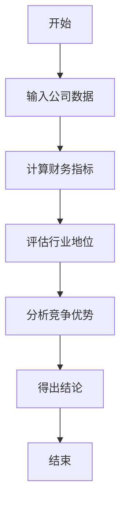
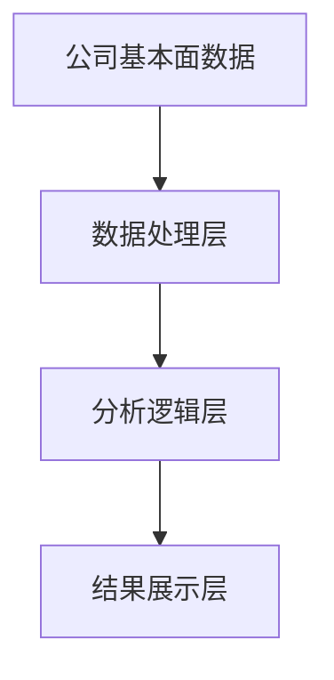
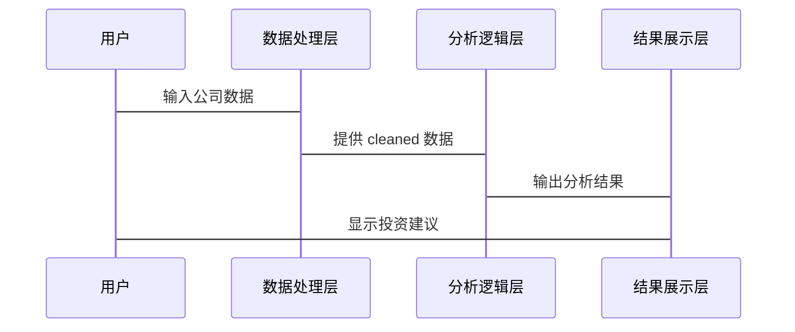

                 


# 费雪的探照灯理论：深入研究公司的方法

---

## 关键词：
- 费雪探照灯理论
- 公司基本面分析
- 投资决策
- 财务分析
- 行业地位
- 竞争优势

---

## 摘要：
费雪的探照灯理论是一种通过多维度分析公司基本面来评估其投资价值的方法。本文将从理论背景、核心分析框架、数学模型、系统设计、实际案例等多个方面详细探讨该理论，并结合技术语言和逻辑推理，帮助读者深入了解如何运用探照灯理论进行公司研究。

---

## 第一部分: 费雪的探照灯理论概述

---

### 第1章: 费雪探照灯理论的背景与意义

#### 1.1 费雪探照灯理论的起源

- **1.1.1 彼得·费雪及其投资理念**  
  彼得·费雪是价值投资领域的先驱，他提出的探照灯理论强调通过深入分析公司的基本面，找到具有长期增长潜力的企业。他的投资理念注重企业的财务健康、行业地位和竞争优势。

- **1.1.2 探照灯理论的提出背景**  
  在20世纪，随着资本主义的发展，企业竞争日益激烈。费雪意识到，仅仅依靠市场波动和短期价格变化来判断投资价值是不够的，必须从企业的基本面入手，找到真正具有成长潜力的公司。

- **1.1.3 理论在投资分析中的地位**  
  探照灯理论为投资者提供了一种系统化的分析框架，帮助他们在复杂的市场环境中筛选出优质企业。这种理论不仅适用于传统行业，也适用于科技和互联网等新兴领域。

#### 1.2 探照灯理论的核心概念

- **1.2.1 什么是探照灯理论**  
  探照灯理论是一种通过多维度分析公司基本面的方法，包括财务数据、行业地位、管理层素质和竞争优势等方面，从而评估企业的内在价值和成长潜力。

- **1.2.2 理论的核心要素与属性**  
  - **财务健康**：分析公司的收入、利润、资产负债表和现金流量表。
  - **行业地位**：评估公司在行业中的竞争地位和市场份额。
  - **管理层素质**：考察管理层的能力和决策透明度。
  - **竞争优势**：识别企业的核心竞争力和护城河。

- **1.2.3 理论的边界与外延**  
  探照灯理论主要用于企业基本面分析，其边界在于短期市场波动和宏观经济因素。外延则包括将理论应用于不同行业和市场环境。

#### 1.3 探照灯理论的应用范围

- **1.3.1 企业基本面分析**  
  通过探照灯理论，投资者可以系统地分析企业的财务状况、行业地位和竞争优势，从而做出更明智的投资决策。

- **1.3.2 投资决策中的应用**  
  在投资组合构建中，探照灯理论帮助投资者筛选出具有长期增长潜力的企业，降低投资风险。

- **1.3.3 行业与公司比较分析**  
  通过横向和纵向对比，投资者可以更清晰地评估企业的相对优势和劣势。

#### 1.4 本章小结

本章介绍了费雪探照灯理论的背景、核心概念和应用范围，为后续的深入分析奠定了基础。探照灯理论作为一种系统化的公司研究方法，为投资者提供了科学的分析框架。

---

## 第二部分: 探照灯理论的核心分析框架

---

### 第2章: 探照灯理论的多维度分析

#### 2.1 财务数据的探照灯分析

- **2.1.1 收入与利润分析**  
  通过分析公司的收入结构和利润来源，评估其盈利能力和发展潜力。

- **2.1.2 资产负债表解读**  
  分析公司的资产、负债和所有者权益，判断其财务健康状况。

- **2.1.3 现金流量表分析**  
  评估公司的现金流情况，判断其运营效率和财务稳定性。

#### 2.2 行业地位的探照灯分析

- **2.2.1 行业竞争结构分析**  
  通过分析行业集中度、竞争格局和市场进入壁垒，评估公司的行业地位。

- **2.2.2 市场地位评估**  
  考察公司在行业中的市场份额和品牌影响力。

- **2.2.3 行业发展趋势预测**  
  结合宏观经济和行业趋势，预测公司的未来发展前景。

#### 2.3 管理层的探照灯分析

- **2.3.1 管理层素质评估**  
  通过公开披露的信息和市场表现，评估管理层的能力和决策透明度。

- **2.3.2 公司治理结构分析**  
  分析公司治理结构的合理性和有效性，判断其是否能够为股东创造价值。

- **2.3.3 管理层决策透明度**  
  通过管理层的过往决策和公开声明，评估其决策的透明度和一致性。

#### 2.4 竞争优势的探照灯分析

- **2.4.1 核心竞争力识别**  
  通过分析公司的技术、产品和服务，识别其核心竞争力。

- **2.4.2 技术壁垒分析**  
  考察公司是否拥有独特的技术优势和专利保护。

- **2.4.3 市场壁垒评估**  
  通过分析市场进入壁垒和客户忠诚度，评估公司的市场地位。

#### 2.5 本章小结

本章详细探讨了探照灯理论在财务数据、行业地位、管理层和竞争优势等方面的分析框架，为投资者提供了一个全面的公司研究方法。

---

## 第三部分: 探照灯理论的数学模型与公式

---

### 第3章: 探照灯理论的数学模型

#### 3.1 探照灯分析的数学基础

- **3.1.1 财务指标的数学表达**  
  例如，市盈率（P/E）的计算公式为：  
  $$ \text{市盈率} = \frac{\text{股价}}{\text{每股收益}} $$

- **3.1.2 股价与价值的数学关系**  
  股票的内在价值可以通过未来现金流的现值来计算：  
  $$ V = \sum_{t=1}^{n} \frac{CF_t}{(1+r)^t} $$  
  其中，$CF_t$ 是第 $t$ 年的现金流，$r$ 是折现率。

- **3.1.3 市盈率与市净率的计算公式**  
  - 市盈率：$$ \text{P/E} = \frac{\text{股价}}{\text{每股收益}} $$
  - 市净率：$$ \text{P/B} = \frac{\text{股价}}{\text{每股净资产}} $$

#### 3.2 探照灯分析的核心公式

- **3.2.1 股票内在价值计算公式**  
  $$ V = \frac{E}{k} $$  
  其中，$E$ 是企业未来现金流的现值，$k$ 是折现率。

- **3.2.2 市场地位评估公式**  
  $$ S = \frac{M}{I} $$  
  其中，$M$ 是公司市场份额，$I$ 是行业总规模。

#### 3.3 探照灯分析的算法流程



#### 3.4 本章小结

本章通过数学公式和算法流程，详细解释了探照灯理论的定量分析方法，为投资者提供了一个科学的评估工具。

---

## 第四部分: 探照灯理论的系统分析与架构设计

---

### 第4章: 探照灯理论的系统分析

#### 4.1 系统分析的背景与目标

- **4.1.1 问题场景介绍**  
  在复杂的市场环境中，投资者需要一个系统化的分析框架来评估公司的基本面。

- **4.1.2 项目目标设定**  
  构建一个基于探照灯理论的公司研究系统，帮助投资者快速、准确地评估企业的投资价值。

- **4.1.3 项目范围界定**  
  限定在公司基本面分析领域，不考虑宏观经济因素和市场波动。

#### 4.2 领域模型设计


#### 4.3 系统架构设计



#### 4.4 系统接口设计

- **4.4.1 数据输入接口**  
  提供财务数据和行业数据的输入接口。

- **4.4.2 数据处理接口**  
  对输入数据进行清洗和预处理。

- **4.4.3 结果输出接口**  
  将分析结果以可视化形式展示给用户。

#### 4.5 系统交互流程



#### 4.6 本章小结

本章通过系统分析和架构设计，为探照灯理论的实施提供了一个技术实现框架，为投资者提供了一个高效、可靠的分析工具。

---

## 第五部分: 探照灯理论的项目实战与案例分析

---

### 第5章: 探照灯理论的项目实战

#### 5.1 项目实战的环境安装

- **5.1.1 系统环境要求**  
  需要安装Python、Jupyter Notebook和相关数据分析库（如Pandas、NumPy）。

- **5.1.2 安装依赖项**  
  使用以下命令安装依赖：
  ```bash
  pip install pandas numpy matplotlib
  ```

#### 5.2 系统核心实现源代码

```python
import pandas as pd
import numpy as np

# 示例数据：假设我们有一个公司的财务数据
data = {
    '收入': [100, 120, 150],
    '利润': [20, 25, 30],
    '资产': [500, 600, 700],
    '负债': [300, 350, 400],
    '所有者权益': [200, 250, 300]
}

df = pd.DataFrame(data)

# 计算市盈率
df['市盈率'] = df['收入'] / df['利润']

# 计算市净率
df['市净率'] = df['收入'] / df['所有者权益']

print(df)
```

#### 5.3 代码应用解读与分析

- **代码功能解读**  
  该代码通过Pandas库创建了一个公司的财务数据表，并计算了市盈率和市净率，帮助投资者评估公司的估值。

- **代码逻辑分析**  
  1. 导入必要的库。
  2. 创建示例数据。
  3. 计算市盈率和市净率。
  4. 输出结果。

#### 5.4 实际案例分析

- **案例背景**  
  某科技公司近年来收入增长迅速，但利润增长放缓。通过探照灯理论分析，发现其收入主要依赖于单一产品，且市场竞争激烈。

- **分析过程**  
  1. 财务数据：收入增长但利润下降，资产增长明显。
  2. 行业地位：市场份额稳定，但竞争对手增加。
  3. 竞争优势：技术优势明显，但产品线单一。

- **结论**  
  该公司具有一定的技术优势，但面临市场竞争加剧的风险，投资者需谨慎评估其长期增长潜力。

#### 5.5 本章小结

本章通过项目实战和案例分析，展示了探照灯理论在实际投资分析中的应用，帮助投资者更好地理解和应用该理论。

---

## 第六部分: 探照灯理论的总结与展望

---

### 第6章: 探照灯理论的总结与展望

#### 6.1 最佳实践 tips

- **数据收集与清洗**  
  确保数据的准确性和完整性，避免错误分析。

- **持续学习与更新**  
  市场环境不断变化，投资者需要持续学习和更新分析方法。

- **结合宏观因素**  
  尽管探照灯理论主要关注公司基本面，但结合宏观经济因素可以进一步提高分析的准确性。

#### 6.2 小结

本章总结了探照灯理论的核心要点，并提出了实际操作中的注意事项和最佳实践，帮助投资者更好地应用该理论。

#### 6.3 注意事项

- **避免过度简化**  
  探照灯理论涉及多个维度，切勿忽略任何一个关键因素。

- **关注长期价值**  
  投资者应关注企业的长期增长潜力，而非短期市场波动。

- **保持谨慎与理性**  
  投资有风险，需保持理性，避免盲目跟风。

#### 6.4 拓展阅读

- **深入学习财务分析**  
  推荐阅读《财务报表分析》。

- **研究行业趋势**  
  推荐阅读《行业分析与投资策略》。

#### 6.5 本章小结

本章总结了探照灯理论的应用要点，并提出了实际操作中的注意事项和未来研究方向。

---

## 作者信息

作者：AI天才研究院/AI Genius Institute & 禅与计算机程序设计艺术/Zen And The Art of Computer Programming

