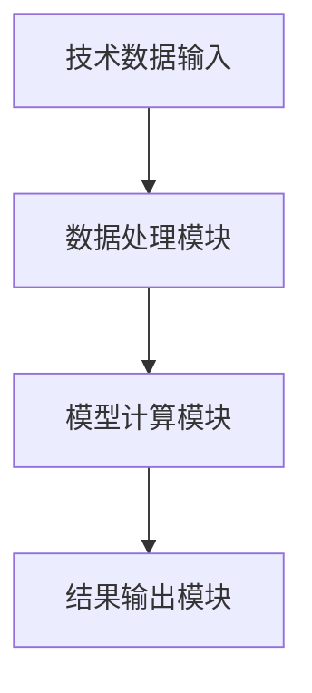

                 


# 费雪的未来增长评估：预测颠覆性技术的影响

> 关键词：费雪模型、未来增长评估、颠覆性技术、技术预测、系统架构设计、技术影响评估

> 摘要：本文探讨了费雪模型在评估公司未来增长中的应用，特别是在预测颠覆性技术影响方面的潜力。通过分析颠覆性技术的定义、特征及其对传统商业模式的冲击，本文提出了将费雪模型与技术预测模型相结合的方法，以更准确地评估新技术对公司增长的影响。文章还详细介绍了系统架构设计和项目实战，展示了如何将理论应用于实际。

---

## 第一章：费雪模型与未来增长评估

### 1.1 费雪模型的基本概念

#### 1.1.1 费雪模型的定义
费雪模型（Fisher Model）是一种用于评估公司未来增长潜力的数学模型，由 Irving Fisher 提出。该模型通过分析公司的收入、成本和投资等关键因素，预测其未来现金流的增长情况。

#### 1.1.2 费雪模型的核心要素
- **收入（Revenue）**：公司未来的收入预测。
- **成本（Cost）**：公司的运营成本和资本支出。
- **投资回报率（ROI）**：衡量公司投资的效率。

#### 1.1.3 费雪模型的应用场景
- 企业估值
- 投资决策
- 业务增长规划

### 1.2 颠覆性技术的定义与特征

#### 1.2.1 颠覆性技术的定义
颠覆性技术是指那些能够从根本上改变行业格局、商业模式或用户体验的新技术。例如，人工智能、区块链和5G通信技术等。

#### 1.2.2 颠覆性技术的核心特征
- **创新性**：引入了全新的概念或方法。
- **破坏性**：对现有市场或技术造成冲击。
- **扩散性**：能够快速被市场和用户接受。

#### 1.2.3 颠覆性技术与传统技术的区别
| 特性 | 颠覆性技术 | 传统技术 |
|------|------------|----------|
| 发展阶段 | 快速迭代 | 稳定发展 |
| 市场影响 | 根本性改变 | 局部优化 |

### 1.3 费雪模型与颠覆性技术的关联

#### 1.3.1 费雪模型在技术评估中的作用
- 通过分析技术的经济影响，预测其对市场和公司的潜在影响。

#### 1.3.2 颠覆性技术对费雪模型的挑战
- 技术的不确定性和快速变化使得传统的模型难以适用。

#### 1.3.3 费雪模型与颠覆性技术的结合
- 将技术的经济影响纳入费雪模型，提升预测的准确性。

---

## 第二章：费雪模型的数学基础

### 2.1 费雪模型的数学公式

#### 2.1.1 费雪模型的基本公式
$$ G = (1 + r)^n $$
其中，\( G \) 表示未来增长因子，\( r \) 是增长率，\( n \) 是时间。

#### 2.1.2 费雪模型的扩展公式
$$ G = (1 + r)^n \times (1 + g) $$
其中，\( g \) 是技术带来的额外增长。

#### 2.1.3 公式的详细解释
- \( r \) 是公司的平均增长率。
- \( g \) 是颠覆性技术带来的额外增长。

### 2.2 颠覆性技术的评估指标

#### 2.2.1 技术成熟度评估
- 使用技术生命周期模型（TRL）对技术的成熟度进行评估。

#### 2.2.2 市场影响评估
- 通过市场份额和市场增长率预测技术的影响力。

#### 2.2.3 经济效益评估
- 使用成本-效益分析评估技术的经济可行性。

---

## 第三章：颠覆性技术的识别与预测

### 3.1 技术识别方法

#### 3.1.1 技术生命周期分析
- 分析技术从研发到商业化的过程，识别其颠覆性潜力。

#### 3.1.2 技术趋势分析
- 使用大数据和机器学习方法，预测技术的发展趋势。

#### 3.1.3 技术颠覆性评估
- 结合技术的创新性和市场影响，评估其颠覆性潜力。

### 3.2 技术预测模型

#### 3.2.1 时间序列分析
- 使用ARIMA模型预测技术的市场 adoption curve。

#### 3.2.2 机器学习预测
- 使用深度学习模型（如LSTM）预测技术的未来发展。

#### 3.2.3 案例分析
- 以人工智能为例，分析其对传统行业的颠覆性影响。

---

## 第四章：费雪模型在技术评估中的应用

### 4.1 费雪模型的适应性调整

#### 4.1.1 模型参数的调整
- 根据技术的特点调整增长率 \( r \) 和额外增长 \( g \)。

#### 4.1.2 模型的适用性分析
- 分析模型在不同技术环境下的适用性。

#### 4.1.3 模型的局限性
- 技术的不确定性可能导致模型预测的偏差。

### 4.2 技术评估的系统架构

#### 4.2.1 系统功能设计
- 数据输入、模型计算、结果输出。

#### 4.2.2 系统架构图（Mermaid）


#### 4.2.3 接口设计与交互流程
- 使用RESTful API设计系统接口，确保模块间的高效通信。

---

## 第五章：项目实战——颠覆性技术评估系统

### 5.1 环境安装与配置

#### 5.1.1 开发环境搭建
- 使用Python和Jupyter Notebook进行开发。

#### 5.1.2 依赖库安装
- 安装numpy、pandas、scikit-learn等库。

#### 5.1.3 数据集准备
- 收集行业数据和技术趋势数据。

### 5.2 核心代码实现

#### 5.2.1 技术数据预处理
```python
import pandas as pd

data = pd.read_csv('technology.csv')
data.head()
```

#### 5.2.2 费雪模型实现
```python
def fisher_model(r, n, g=0):
    return (1 + r) ** n * (1 + g)
```

#### 5.2.3 技术预测模型实现
```python
from sklearn.linear_model import LinearRegression

model = LinearRegression()
model.fit(X, y)
```

### 5.3 案例分析

#### 5.3.1 案例背景
- 以人工智能技术为例，分析其对传统制造业的颠覆性影响。

#### 5.3.2 模型应用
- 使用费雪模型预测人工智能技术对制造业的经济增长贡献。

### 5.4 项目总结
- 通过实际案例展示了费雪模型在颠覆性技术评估中的应用价值。

---

## 第六章：总结与展望

### 6.1 最佳实践 tips
- 在使用费雪模型评估技术时，需结合实际市场情况。
- 定期更新模型参数，以适应技术的快速变化。

### 6.2 小结
- 费雪模型在预测颠覆性技术的影响方面具有独特的优势。
- 通过系统的架构设计和实际项目实战，可以进一步提升模型的预测能力。

### 6.3 注意事项
- 技术的不确定性和模型的局限性需引起重视。
- 在实际应用中，需结合其他评估方法进行综合判断。

### 6.4 拓展阅读
- 推荐阅读《技术预测与创新管理》和《费雪模型的现代应用》。

---

## 作者：AI天才研究院 & 禅与计算机程序设计艺术

通过本文，我们详细探讨了费雪模型在预测颠覆性技术影响中的应用，并结合实际案例展示了其在技术评估中的潜力。希望本文能为读者提供有价值的见解，并激发更多关于技术预测和增长评估的思考。

