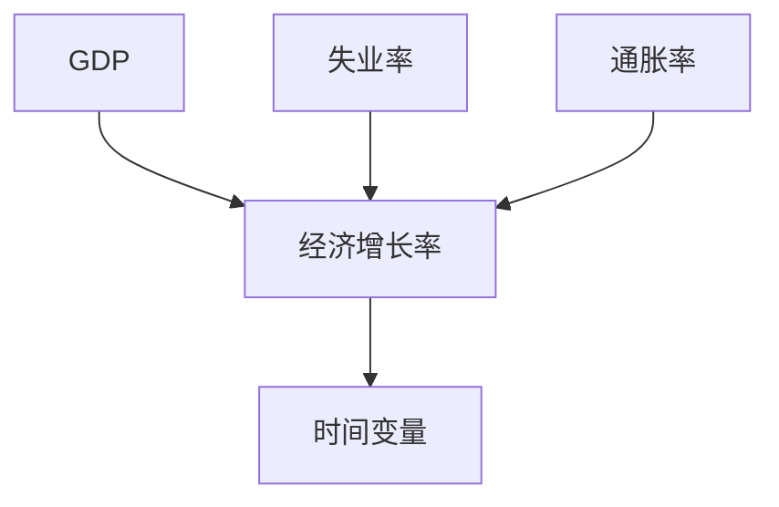
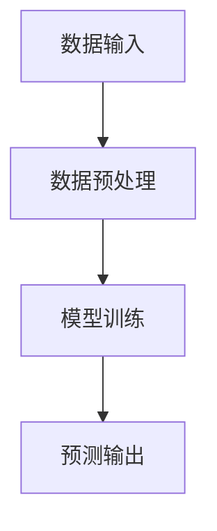

                 


# 费雪的未来增长预测模型：把握长期趋势

## 关键词：费雪模型，经济增长预测，时间序列分析，线性回归，经济指标

## 摘要：费雪未来增长预测模型是一种基于时间序列分析和线性回归的经济预测模型，旨在通过分析历史经济数据和相关指标，预测未来经济增长的趋势和潜在风险。本文将从模型的背景、核心概念、算法原理、系统架构、项目实战等多个方面，详细解析费雪未来增长预测模型的理论基础和实际应用。

---

# 第一部分：费雪未来增长预测模型基础

## 第1章：费雪未来增长预测模型概述

### 1.1 费雪未来增长预测模型的背景

#### 1.1.1 经济预测的必要性
经济预测是帮助企业、政府和投资者做出决策的重要工具。通过对经济趋势的预测，可以提前规划资源分配、制定政策或调整投资策略。然而，经济系统复杂多变，预测模型需要考虑多种因素，包括GDP、就业率、通胀率等。

#### 1.1.2 费雪模型的提出背景
菲利普斯·费雪（Philip Sydney Fisher）是20世纪著名的经济学家，他提出了多种经济预测模型。费雪未来增长预测模型是其中之一，旨在通过分析历史经济数据，预测未来经济增长的趋势。该模型基于线性回归和时间序列分析，假设经济增长与时间呈线性关系。

#### 1.1.3 模型的核心目标与意义
费雪未来增长预测模型的核心目标是通过分析经济指标的时间序列数据，预测未来经济增长的潜在趋势。该模型的意义在于它能够提供一个简单而有效的工具，帮助决策者理解经济走势并制定相应策略。

---

### 1.2 费雪模型的基本概念

#### 1.2.1 经济增长的定义与衡量
经济增长通常指一个国家或地区在一定时期内经济总量的增加。衡量经济增长的主要指标包括国内生产总值（GDP）、国民收入、就业率等。这些指标的变化可以反映经济的健康状况。

#### 1.2.2 费雪模型的核心假设
费雪模型假设经济增长与时间呈线性关系，即经济增长率与时间变量高度相关。此外，模型还假设其他经济指标（如GDP、通胀率等）与经济增长率存在一定的相关性。

#### 1.2.3 模型的适用范围与边界
费雪未来增长预测模型适用于短期经济增长预测，特别适用于数据较为稳定、经济系统相对简单的地区。然而，该模型不适用于经济系统复杂、波动较大的情况，如金融危机或经济危机期间。

---

### 1.3 费雪模型的数学基础

#### 1.3.1 时间序列分析基础
时间序列分析是研究经济指标随时间变化的方法。常见的经济指标时间序列数据包括GDP、失业率、通胀率等。

#### 1.3.2 经济指标的线性回归模型
线性回归是统计学中一种常用的方法，用于分析变量之间的关系。费雪模型通过线性回归分析，将经济增长率与时间变量建立线性关系。

#### 1.3.3 费雪模型的数学表达式
费雪模型的数学公式如下：
$$ G_t = \beta_0 + \beta_1 t + \epsilon_t $$
其中：
- $G_t$ 表示第 $t$ 期的经济增长率
- $\beta_0$ 表示模型的截距
- $\beta_1$ 表示时间变量的回归系数
- $\epsilon_t$ 表示误差项

---

## 第2章：费雪模型的核心概念与联系

### 2.1 费雪模型的核心原理

#### 2.1.1 经济增长的驱动因素
经济增长受多种因素影响，包括技术进步、劳动力投入、资本积累等。费雪模型通过线性回归分析，将这些因素与经济增长率联系起来。

#### 2.1.2 费雪模型的因果关系分析
费雪模型假设经济增长率与时间变量呈线性关系，即经济增长率随时间的推移而变化。这种假设简化了模型的复杂性，使其易于理解和应用。

#### 2.1.3 模型的动态特征
费雪模型通过时间序列分析，捕捉经济增长的动态变化。模型假设经济增长率的变化与时间变量相关，从而能够预测未来的经济增长趋势。

---

### 2.2 核心概念对比分析

#### 2.2.1 费雪模型与传统经济增长模型的对比
传统的经济增长模型（如索洛模型）通常考虑资本积累、劳动力投入和技术进步等因素。而费雪模型则通过线性回归分析，将经济增长率与时间变量直接关联。

#### 2.2.2 不同经济指标的特征对比
经济指标包括GDP、失业率、通胀率等。不同指标的变化趋势和预测难度各不相同。费雪模型假设经济增长率与时间变量呈线性关系，因此更适用于GDP等指标的预测。

#### 2.2.3 模型假设的优缺点分析
费雪模型的假设简化了模型的复杂性，使其易于应用。然而，该模型忽略了其他重要因素（如外部冲击、政策变化等），可能导致预测结果的偏差。

---

### 2.3 实体关系图（ER图）



---

## 第3章：费雪模型的算法原理

### 3.1 费雪模型的算法流程



---

### 3.2 费雪模型的Python实现

```python
import numpy as np
import pandas as pd
from sklearn.linear_model import LinearRegression

# 示例数据
data = pd.DataFrame({
    'year': [1, 2, 3, 4, 5],
    'GDP': [100, 150, 200, 250, 300]
})

# 模型训练
model = LinearRegression()
model.fit(data[['year']], data['GDP'])

# 预测
predicted_GDP = model.predict([[6]])
print(predicted_GDP)
```

---

### 3.3 模型的数学公式

费雪模型的数学表达式为：
$$ \hat{G}_t = \beta_0 + \beta_1 t + \epsilon_t $$
其中：
- $\hat{G}_t$ 表示预测的经济增长率
- $\beta_0$ 表示截距
- $\beta_1$ 表示斜率
- $t$ 表示时间
- $\epsilon_t$ 表示误差项

---

## 第4章：费雪模型的系统分析与架构设计

### 4.1 问题场景介绍

#### 4.1.1 经济预测的典型场景
经济预测是企业、政府和投资者的重要决策工具。通过对经济指标的预测，可以帮助决策者制定更有效的策略。

#### 4.1.2 费雪模型的应用场景
费雪模型适用于短期经济增长预测，特别适用于数据较为稳定、经济系统相对简单的地区。

#### 4.1.3 模型的输入输出分析
- 输入：时间序列数据（如GDP、年份）
- 输出：预测的经济增长率

---

### 4.2 系统功能设计

#### 4.2.1 系统功能模块
- 数据输入模块：接收经济指标的时间序列数据
- 数据预处理模块：对数据进行清洗和标准化
- 模型训练模块：基于线性回归训练模型
- 预测输出模块：输出预测结果

#### 4.2.2 系统架构设计


---

### 4.3 项目实战

#### 4.3.1 项目环境安装
```bash
pip install numpy pandas scikit-learn
```

#### 4.3.2 项目核心实现

```python
import numpy as np
import pandas as pd
from sklearn.linear_model import LinearRegression

# 数据加载
data = pd.read_csv('economic_data.csv')

# 数据预处理
data = data[['year', 'GDP']]
data = data.dropna()

# 模型训练
model = LinearRegression()
model.fit(data[['year']], data['GDP'])

# 预测
predicted_GDP = model.predict([[2024]])
print(f"预测的2024年GDP为：{predicted_GDP[0]:.2f}")
```

#### 4.3.3 项目小结
费雪未来增长预测模型通过线性回归分析，能够有效预测经济增长趋势。然而，该模型假设经济增长与时间呈线性关系，可能无法捕捉复杂的经济波动。

---

## 第5章：总结与展望

### 5.1 总结
费雪未来增长预测模型通过线性回归分析，能够有效预测经济增长趋势。该模型基于时间序列数据，假设经济增长与时间呈线性关系，适用于短期经济增长预测。

### 5.2 展望
随着大数据和机器学习技术的发展，未来经济增长预测模型将更加复杂和精确。结合费雪模型的简单性和其他高级模型的优势，可以开发出更强大的经济预测工具。

---

## 作者：AI天才研究院 & 禅与计算机程序设计艺术

---

感谢您的阅读！希望本文能帮助您更好地理解费雪未来增长预测模型的理论与实践。

