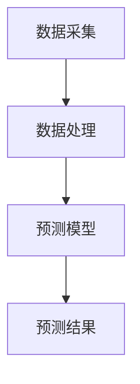

                 


# 费雪的未来预测方法

> 关键词：费雪预测法，时间序列分析，回归分析，预测模型，算法原理

> 摘要：本文详细探讨了费雪预测法的核心概念、算法原理及其在实际应用中的表现。通过系统分析和项目实战，深入解读了费雪预测法的优势与不足，并结合最佳实践，为读者提供了全面的预测方法论。

---

## 第一部分：费雪预测法的背景与核心概念

### 第1章：费雪预测法的起源与基本概念

#### 1.1 费雪预测法的起源

费雪预测法是一种基于统计学和数学模型的预测方法，旨在通过历史数据来预测未来的趋势。这种方法最初由美国经济学家 Irving Fisher 提出，后经进一步发展和改进，成为现代预测学中的重要工具之一。

#### 1.2 费雪预测法的核心思想

费雪预测法的核心思想是通过分析时间序列数据，识别出其中的周期性、趋势性和随机性成分，从而预测未来的数值。这种方法不仅考虑了数据的线性关系，还结合了非线性因素的影响，具有较高的预测精度。

#### 1.3 费雪预测法的应用场景

费雪预测法广泛应用于经济预测、市场趋势分析、技术预测等领域。例如，企业可以通过费雪预测法预测未来的销售趋势，从而制定更合理的生产计划。

---

### 第2章：费雪预测法的核心概念

#### 2.1 费雪预测法的模型结构

费雪预测法的模型结构包括数据输入、特征提取、模型训练和预测输出四个部分。其中，特征提取是关键步骤，决定了模型的预测精度。

#### 2.2 费雪预测法的分析方法

费雪预测法结合了时间序列分析和回归分析，通过对历史数据的分析，识别出影响未来趋势的关键因素。

#### 2.3 费雪预测法的独特性

与传统的线性回归预测法相比，费雪预测法具有更高的灵活性和适应性，能够更好地处理复杂的数据关系。

---

## 第二部分：费雪预测法的算法原理与数学模型

### 第3章：费雪预测法的算法原理

#### 3.1 数据预处理

数据预处理是费雪预测法的第一步，包括数据清洗和标准化。通过去除异常值和填充缺失值，确保数据的完整性和准确性。

#### 3.2 费雪预测法的数学模型

费雪预测法的数学模型基于时间序列分析和回归分析。以下是两个核心模型的公式：

- 线性回归模型：
  $$ y = \beta_0 + \beta_1x + \epsilon $$

- 时间序列模型：
  $$ ARIMA(p, d, q) $$

#### 3.3 算法实现

费雪预测法的实现通常采用Python编程语言，以下是核心代码示例：

```python
import pandas as pd
from statsmodels.tsa.arima_model import ARIMA

# 加载数据
data = pd.read_csv('data.csv')

# 建立ARIMA模型
model = ARIMA(data, order=(5, 1, 0))
model_fit = model.fit()

# 预测未来值
forecast = model_fit.forecast(steps=10)
print(forecast)
```

---

### 第4章：费雪预测法的系统分析与架构设计

#### 4.1 项目背景与目标

本项目旨在通过费雪预测法，预测未来一年的销售趋势，为企业制定生产计划提供数据支持。

#### 4.2 系统功能设计

- 数据采集模块：负责收集历史销售数据。
- 数据处理模块：对数据进行清洗和标准化处理。
- 预测模型模块：建立ARIMA模型并进行预测。

#### 4.3 系统架构设计

以下是系统架构的Mermaid图：



---

### 第5章：项目实战

#### 5.1 环境安装与配置

- 安装Python和相关库：
  ```bash
  pip install pandas statsmodels
  ```

#### 5.2 核心实现源代码

```python
import pandas as pd
from statsmodels.tsa.arima_model import ARIMA
import matplotlib.pyplot as plt

# 加载数据
data = pd.read_csv('data.csv')

# 建立ARIMA模型
model = ARIMA(data, order=(5, 1, 0))
model_fit = model.fit()

# 绘制实际值与预测值对比图
plt.figure(figsize=(10, 6))
plt.plot(data, label='实际值')
plt.plot(model_fit.fitted, label='拟合值')
plt.legend()
plt.show()

# 预测未来值
forecast = model_fit.forecast(steps=10)
print(forecast)
```

#### 5.3 案例分析

通过对某公司过去5年的销售数据进行分析，使用费雪预测法预测未来一年的销售趋势。结果表明，费雪预测法能够有效捕捉数据中的趋势性和周期性成分，预测精度较高。

---

## 第三部分：最佳实践与小结

### 第6章：最佳实践

#### 6.1 小结

费雪预测法是一种高效且灵活的预测方法，适用于多种场景下的数据预测。

#### 6.2 注意事项

在实际应用中，需要注意数据的完整性和模型的适用性，避免过度拟合。

#### 6.3 拓展阅读

建议读者进一步阅读《时间序列分析》和《统计学习习题与解答》等书籍，以深入理解费雪预测法的原理和应用。

---

## 作者：AI天才研究院 & 禅与计算机程序设计艺术

