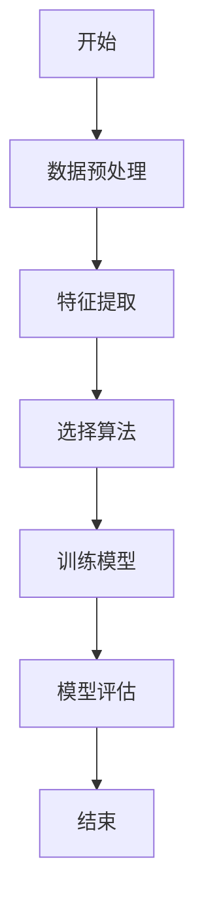

                 


# 费雪的消费者行为分析

> 关键词：消费者行为分析、费雪消费理论、经济学模型、机器学习算法、行为预测系统

> 摘要：本文系统地分析了费雪在消费者行为分析中的理论贡献，探讨了消费者行为的核心概念及其相互关系，详细阐述了基于费雪理论的算法原理，并结合实际项目展示了如何设计和实现一个消费者行为分析系统。

---

# 第一部分: 费雪的消费者行为分析基础

## 第1章: 消费者行为分析的背景与意义

### 1.1 消费者行为分析的基本概念
#### 1.1.1 消费者行为的定义
消费者行为是指个体在购买、使用和处置商品或服务的过程中表现出的所有行为和决策过程。

#### 1.1.2 费雪在消费者行为研究中的贡献
费雪提出了消费函数理论，强调了消费者的理性选择和效用最大化的理念。

#### 1.1.3 消费者行为分析的现实意义
理解消费者行为有助于企业制定精准的营销策略，提高产品和服务的市场竞争力。

### 1.2 消费者行为分析的核心问题
#### 1.2.1 消费者决策的复杂性
消费者的决策受到心理、社会和经济等多种因素的影响。

#### 1.2.2 消费者行为的驱动因素
包括需求、动机、认知、情感和社会环境等因素。

#### 1.2.3 消费者行为的边界与外延
消费者行为的边界涉及个体与社会、理性与感性等多个维度。

### 1.3 消费者行为分析的理论基础
#### 1.3.1 经济学视角
消费者行为是经济学研究的核心内容之一，强调效用最大化和资源最优配置。

#### 1.3.2 心理学视角
消费者行为涉及认知、情感和动机等心理过程。

#### 1.3.3 社会学视角
社会环境和文化背景对消费者行为有重要影响。

---

## 第2章: 费雪的消费者行为分析理论

### 2.1 费雪的消费理论概述
#### 2.1.1 费雪的消费函数理论
费雪提出，消费者的消费支出是收入的函数，强调理性选择和边际效用递减。

#### 2.1.2 费雪的生命周期理论
消费者在不同生命周期阶段的消费行为不同，需考虑时间和风险因素。

#### 2.1.3 费雪的效用最大化理论
消费者通过选择商品和服务组合，实现效用的最大化。

### 2.2 费雪的消费者行为分析模型
#### 2.2.1 消费者决策过程模型
消费者在决策过程中需经历信息收集、评估、选择和购后评价等阶段。

#### 2.2.2 消费者偏好与选择模型
消费者偏好决定了其选择行为，可以通过无差异曲线等工具进行分析。

#### 2.2.3 消费者行为的动态变化模型
消费者行为会受到外部环境变化的影响，需动态调整。

---

## 第3章: 消费者行为的核心概念与联系

### 3.1 消费者行为的核心概念
#### 3.1.1 需求与供给的关系
需求是消费者行为的核心，供给则是市场的反向调节。

#### 3.1.2 动机与激励
消费者的动机是驱动其行为的根本原因，激励则是外部刺激。

#### 3.1.3 认知与感知
消费者通过认知和感知信息，形成对商品和服务的评价。

### 3.2 核心概念的属性特征对比
#### 3.2.1 需求与欲望的对比
需求是有支付能力的欲望，欲望则是无限制的。

#### 3.2.2 理性与感性的对比
理性决策基于逻辑分析，感性决策则受情感影响。

#### 3.2.3 现金流与消费行为的对比
现金流的变动直接影响消费者的消费能力和行为模式。

### 3.3 ER实体关系图
```mermaid
er
  actor: 消费者
  product: 商品
  transaction: 交易
  actor -|购买| transaction
  product -|属于| transaction
```

---

## 第4章: 消费者行为分析的算法原理

### 4.1 基于费雪理论的消费者行为预测模型
#### 4.1.1 线性回归模型
用于预测消费者支出与收入之间的关系。

#### 4.1.2 决策树模型
通过分类和回归树（CART）进行消费者行为的分类预测。

#### 4.1.3 费雪消费函数的数学表达式
$$C = aY + b$$
其中，C代表消费，Y代表收入，a和b为常数。

### 4.2 算法流程图


---

## 第5章: 消费者行为分析的系统设计与实现

### 5.1 项目背景与目标
分析消费者行为，帮助企业优化营销策略。

### 5.2 系统功能设计
#### 5.2.1 数据采集模块
从多个渠道获取消费者行为数据。

#### 5.2.2 数据处理模块
清洗和预处理数据，提取特征。

#### 5.2.3 模型训练模块
使用机器学习算法训练预测模型。

#### 5.2.4 结果展示模块
可视化分析结果，提供决策支持。

### 5.3 系统架构设计


### 5.4 接口设计
#### 5.4.1 数据接口
定义数据格式和接口规范。

#### 5.4.2 模型接口
提供API供其他系统调用。

### 5.5 交互流程图
```mermaid
sequence
    用户 -> 数据采集模块: 提交请求
    数据采集模块 -> 数据处理模块: 传输数据
    数据处理模块 -> 模型训练模块: 提供特征
    模型训练模块 -> 结果展示模块: 返回预测结果
    用户 <- 结果展示模块: 显示结果
```

---

## 第6章: 项目实战与案例分析

### 6.1 环境安装
安装Python、Pandas、Scikit-learn等工具。

### 6.2 核心代码实现
```python
import pandas as pd
from sklearn.tree import DecisionTreeRegressor

# 数据加载
data = pd.read_csv('consumer_data.csv')

# 特征与目标变量分离
X = data[['income', 'age', 'gender']]
y = data['consumption']

# 模型训练
model = DecisionTreeRegressor()
model.fit(X, y)

# 预测
predicted_consumption = model.predict(X)
```

### 6.3 案例分析
分析某公司的消费者数据，预测其消费行为。

### 6.4 项目小结
总结项目的实施过程和成果。

---

## 第7章: 最佳实践与拓展阅读

### 7.1 小结
费雪的消费者行为分析为企业提供了理论指导和实践工具。

### 7.2 注意事项
数据质量和模型选择对结果影响重大。

### 7.3 拓展阅读
推荐相关书籍和论文，进一步深入学习。

---

## 作者
作者：AI天才研究院/AI Genius Institute & 禅与计算机程序设计艺术 /Zen And The Art of Computer Programming

---

**总结：** 本文通过系统分析费雪的消费者行为理论，结合现代算法和系统设计，为企业提供了深入的消费者行为分析方法。

