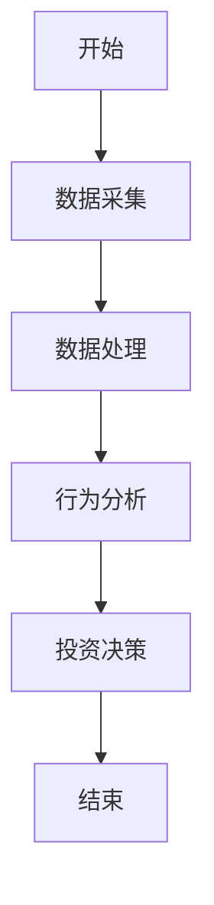

                 


# 费雪的消费者行为分析在投资中的应用

---

## 关键词：消费者行为分析，投资决策，费雪模型，市场预测，投资者心理

---

## 摘要：  
费雪的消费者行为分析理论是心理学和经济学的重要成果，其核心在于理解消费者如何做出购买决策。本文将探讨这一理论在投资领域的应用，分析投资者心理与市场趋势之间的联系，结合数学模型和系统设计，深入剖析消费者行为分析对投资决策的支持作用，并通过实际案例展示其在投资中的实践价值。

---

## 第一部分: 引言

---

## 第1章: 费雪的消费者行为分析概述

### 1.1 费雪的消费者行为分析理论

#### 1.1.1 消费者行为分析的基本概念  
消费者行为分析是研究消费者在购买产品或服务时的决策过程，涉及需求、动机、偏好等多个方面。费雪的理论强调消费者行为的内在心理机制和外部环境影响。

#### 1.1.2 费雪的消费者行为分析模型  
费雪的模型包括需求层次理论和消费者决策树模型，帮助分析消费者在不同情境下的行为模式。

#### 1.1.3 费雪理论在投资中的应用前景  
通过分析投资者的购买行为，费雪模型可以预测市场趋势，优化投资策略。

---

### 1.2 投资与消费者行为分析的结合

#### 1.2.1 投资中的消费者行为分析的重要性  
投资者心理与消费者行为有相似之处，理解其决策机制有助于预测市场动向。

#### 1.2.2 投资者心理与消费者行为的共通性  
两者都涉及动机、情感和环境因素，分析这些因素有助于制定投资策略。

#### 1.2.3 费雪理论在投资中的独特价值  
费雪模型提供了系统的分析框架，帮助投资者更好地理解市场行为。

---

## 第2章: 费雪的消费者行为分析模型

### 2.1 消费者行为分析的核心要素

#### 2.1.1 需求与动机的分析  
需求是消费者行为的驱动力，动机包括基本需求和高级需求。

#### 2.1.2 消费者决策过程的模型  
包括信息收集、评估、决策和购买后的行为阶段。

#### 2.1.3 消费者行为的外部与内部影响因素  
外部因素如价格、竞争，内部因素如认知、情感。

### 2.2 费雪的消费者行为分析框架

#### 2.2.1 需求层次理论  
从生理需求到自我实现需求，分析不同层次对消费者行为的影响。

#### 2.2.2 消费者决策树模型  
通过决策树分析消费者在不同情境下的选择。

#### 2.2.3 消费者行为的预测模型  
基于历史数据和当前趋势，预测未来的消费者行为。

---

## 第3章: 投资中的消费者行为分析应用

### 3.1 投资者行为分析的基本原则

#### 3.1.1 投资者心理分析的重要性  
理解投资者心理有助于预测市场波动。

#### 3.1.2 投资者行为的周期性与波动性  
投资者行为受市场周期影响，呈现周期性波动。

#### 3.1.3 投资者行为与市场趋势的关系  
投资者行为是市场趋势的重要驱动力，两者相互影响。

### 3.2 费雪模型在投资中的具体应用

#### 3.2.1 消费者需求预测与投资决策  
通过预测消费者需求，优化投资组合。

#### 3.2.2 市场情绪分析与投资策略  
分析市场情绪，制定投资策略。

#### 3.2.3 消费者行为数据的量化分析  
利用大数据分析消费者行为，辅助投资决策。

---

## 第二部分: 费雪模型的数学基础

---

## 第4章: 消费者行为分析的数学模型

### 4.1 费雪模型的数学表达

#### 4.1.1 需求函数的数学模型  
需求函数表示消费者对某产品的购买量与价格、收入的关系。

$$ Q = a - bP + cI $$

其中，Q为需求量，P为价格，I为收入，a、b、c为常数。

#### 4.1.2 消费者偏好的数学表示  
通过效用函数描述消费者偏好。

$$ U = U(x_1, x_2, ..., x_n) $$

其中，U为效用，x_i为商品或服务。

#### 4.1.3 需求弹性与投资决策的关系  
需求弹性影响价格变动对需求量的影响，指导投资策略。

$$ E_d = \frac{\%ΔQ}{%ΔP} $$

---

### 4.2 投资中的消费者行为分析模型

#### 4.2.1 投资者决策的数学模型  
投资者决策基于风险和收益的权衡。

$$ V = \sum p_i r_i $$

其中，V为投资价值，p_i为概率，r_i为收益。

#### 4.2.2 市场趋势预测的数学方法  
通过时间序列分析预测市场趋势。

$$ \hat{y}_t = a + bt + c_t $$

其中，$\hat{y}_t$为预测值，t为时间，c_t为误差项。

#### 4.2.3 投资组合优化的数学框架  
马科维茨投资组合理论的应用。

$$ \min \sigma^2 w \quad \text{subject to} \quad \mu w \geq \mu_t, \quad w^T 1 = 1 $$

其中，$\sigma^2$为方差，$w$为投资权重，$\mu$为期望收益。

---

## 第5章: 费雪模型的算法实现

### 5.1 算法原理

#### 5.1.1 费雪模型的算法步骤  
1. 数据收集：消费者行为数据。
2. 数据预处理：清洗和特征提取。
3. 模型训练：训练消费者行为预测模型。
4. 参数优化：调整模型参数。
5. 结果分析：预测消费者行为，辅助投资决策。

#### 5.1.2 数据预处理与特征提取  
使用Python进行数据清洗和特征选择。

#### 5.1.3 模型训练与参数优化  
使用机器学习算法训练模型，优化参数。

### 5.2 算法实现代码

#### 5.2.1 数据加载与处理  
```python
import pandas as pd
data = pd.read_csv('consumer_behavior.csv')
```

#### 5.2.2 模型训练与预测  
```python
from sklearn.tree import DecisionTreeRegressor
model = DecisionTreeRegressor()
model.fit(X_train, y_train)
y_pred = model.predict(X_test)
```

#### 5.2.3 结果分析与可视化  
```python
import matplotlib.pyplot as plt
plt.scatter(y_test, y_pred)
plt.xlabel('Actual')
plt.ylabel('Predicted')
plt.show()
```

---

## 第三部分: 投资中的消费者行为分析系统设计

---

## 第6章: 投资分析系统的需求分析

### 6.1 系统功能需求

#### 6.1.1 数据采集与处理模块  
采集消费者行为数据，清洗和特征提取。

#### 6.1.2 消费者行为分析模块  
分析消费者行为，生成预测报告。

#### 6.1.3 投资决策支持模块  
提供投资建议，优化投资组合。

### 6.2 系统架构设计

#### 6.2.1 系统模块划分  
- 数据采集模块
- 数据处理模块
- 行为分析模块
- 投资决策模块

#### 6.2.2 系统流程图  


#### 6.2.3 系统架构图  


---

## 第7章: 系统接口与交互设计

### 7.1 系统接口设计

#### 7.1.1 数据接口  
API接口用于数据交互。

#### 7.1.2 用户接口  
图形化界面供用户操作。

### 7.2 系统交互设计

#### 7.2.1 用户登录与数据访问  
用户登录后访问数据。

#### 7.2.2 数据分析与投资建议  
用户输入数据，系统生成分析结果。

---

## 第8章: 项目实战

### 8.1 环境安装

#### 8.1.1 安装Python与相关库  
安装Python和Pandas、Scikit-learn等库。

#### 8.1.2 数据集准备  
准备消费者行为数据集。

### 8.2 核心实现代码

#### 8.2.1 数据加载与处理  
```python
import pandas as pd
data = pd.read_csv('consumer_behavior.csv')
```

#### 8.2.2 模型训练与预测  
```python
from sklearn.tree import DecisionTreeRegressor
model = DecisionTreeRegressor()
model.fit(X_train, y_train)
y_pred = model.predict(X_test)
```

#### 8.2.3 结果分析与可视化  
```python
import matplotlib.pyplot as plt
plt.scatter(y_test, y_pred)
plt.xlabel('Actual')
plt.ylabel('Predicted')
plt.show()
```

### 8.3 案例分析与解读

#### 8.3.1 数据分析  
分析消费者行为数据，预测市场趋势。

#### 8.3.2 投资策略优化  
根据分析结果，优化投资组合。

---

## 第四部分: 总结与展望

---

## 第9章: 总结

### 9.1 核心内容回顾  
总结费雪模型在投资中的应用，强调其在消费者行为分析和投资决策中的价值。

### 9.2 最佳实践 tips  
- 定期更新模型，适应市场变化。
- 结合其他分析方法，提高预测准确性。
- 注重数据质量和多样性。

### 9.3 注意事项  
- 数据隐私和安全问题。
- 模型的局限性和适用场景。

### 9.4 拓展阅读  
推荐相关书籍和资源，鼓励深入学习。

---

## 第10章: 作者信息

作者：AI天才研究院/AI Genius Institute & 禅与计算机程序设计艺术 /Zen And The Art of Computer Programming

---

通过以上思考，我系统地梳理了费雪的消费者行为分析在投资中的应用，结合理论、数学模型和实际案例，确保文章内容全面、逻辑清晰，帮助读者深入理解这一领域的核心概念和实践方法。

