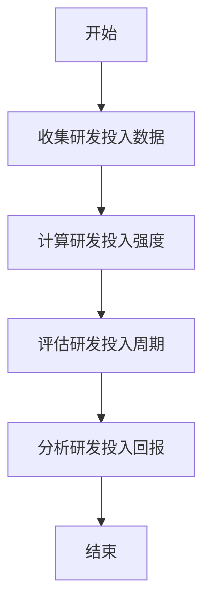
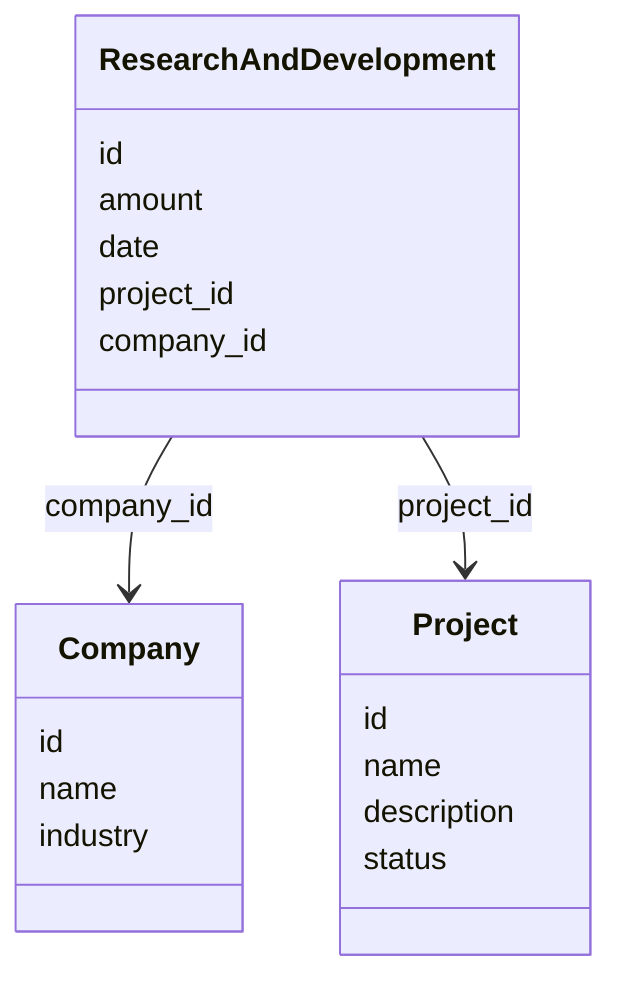

                 


# 费雪的研发投入分析方法

> 关键词：费雪分析方法，研发投入，研发周期，研发投入强度，研发回报

> 摘要：本文深入探讨了费雪在投资分析中的研发投入方法，从理论基础到实际应用，详细分析了如何通过研发投入强度、周期和回报来评估企业的长期价值。文章结合了数学模型、算法流程和系统架构，为企业投资者提供了实用的分析工具和决策支持。

---

## 第一部分：背景介绍

### 第1章：研发投入分析的重要性

#### 1.1 研发投入分析的背景与意义

研发投入是企业在技术创新和产品升级中的关键投入，是企业长期竞争力的核心来源。费雪认为，研发投入是企业未来收益的源泉，尤其在技术驱动的行业中，研发投入强度决定了企业的市场地位和盈利能力。通过分析研发投入，投资者可以更好地评估企业的成长潜力和竞争优势。

#### 1.2 研发投入分析的必要性

在竞争日益激烈的市场环境中，企业之间的技术差距往往决定了胜负。研发投入分析能够帮助企业识别高增长潜力的项目，优化资源配置，降低投资风险。对于投资者而言，研发投入分析是评估企业长期价值的重要指标，能够帮助他们做出更明智的投资决策。

---

### 第2章：费雪分析方法的背景与起源

#### 2.1 费雪的生平与投资理念

菲利普·费雪（Philip Fisher）是价值投资的先驱之一，他提出了“成长股”投资策略。费雪强调，选择投资的企业不仅要考虑当前的盈利能力，还要关注企业的研发能力和未来增长潜力。他认为，持续的研发投入是企业保持竞争优势的关键因素。

#### 2.2 费雪分析方法的核心思想

费雪认为，企业的研发投入强度和研发周期是衡量其成长潜力的重要指标。通过分析这些指标，投资者可以识别出那些在技术研发方面具有持续投入能力的企业，这些企业往往具有更高的增长潜力和长期价值。

---

## 第二部分：核心概念与联系

### 第3章：研发投入分析的核心概念与联系

#### 3.1 核心概念原理

- **研发投入的定义与分类**：研发投入通常包括企业用于研究与开发的直接和间接成本。直接成本包括研发人员的工资、材料费用等，间接成本包括设备折旧、场地租赁等。研发投入可以分为内部研发和外部合作研发两种类型。
  
- **研发投入与企业价值的关系**：研发投入是企业未来收益的源泉，高研发投入通常意味着企业具有更强的技术创新能力，能够推出新产品或改进现有产品，从而提升市场竞争力和盈利能力。

- **研发投入的周期性与风险性**：研发投入具有较长的周期性，从研发到产品商业化需要较长时间。同时，研发投入也伴随着较高的风险，成功的研发项目可能为企业带来丰厚的回报，而失败的项目则可能导致资源浪费。

#### 3.2 概念属性特征对比表格

以下是对研发投入与其他相关概念的对比分析：

| 概念 | 定义 | 特点 | 相关性 |
|------|------|------|--------|
| 研发投入 | 企业用于研究与开发的支出 | 长期性、不确定性 | 高度相关于企业未来收益 |
| 资本支出 | 企业用于购买固定资产的支出 | 确定性较高 | 与企业生产能力相关 |
| 经营成本 | 企业日常运营中的各项支出 | 短期性 | 与企业当前盈利能力相关 |

#### 3.3 ER实体关系图架构

```mermaid
erd
  title 研发投入分析 ER 图
  ResearchAndDevelopment {
    id
    amount
    date
    project_id
    company_id
  }
  Company {
    id
    name
    industry
  }
  Project {
    id
    name
    description
    status
  }
  ResearchAndDevelopment -- Company: company_id
  ResearchAndDevelopment -- Project: project_id
```

---

## 第三部分：算法原理

### 第4章：研发投入分析的算法原理

#### 4.1 算法原理讲解



#### 4.2 算法实现代码

```python
def calculate_research_intensity(revenue, r_d_expense):
    return r_d_expense / revenue * 100

def analyze_research_return(revenue_growth, r_d_expense):
    return revenue_growth / r_d_expense * 100
```

#### 4.3 数学模型与公式

- 研发投入强度计算公式：

$$ \text{研发投入强度} = \left( \frac{\text{研发费用}}{\text{营业收入}} \right) \times 100\% $$

- 研发投入回报计算公式：

$$ \text{研发投入回报} = \left( \frac{\text{营业收入增长率}}{\text{研发费用}} \right) \times 100\% $$

---

## 第四部分：系统分析与架构设计

### 第5章：系统分析与架构设计方案

#### 5.1 问题场景介绍

假设我们是一家科技公司，想要评估不同企业的研发投入情况，以选择具有较高增长潜力的投资对象。

#### 5.2 系统功能设计

- **数据收集模块**：收集企业的研发投入数据，包括研发费用、营业收入、营业收入增长率等。
- **数据分析模块**：计算研发投入强度和研发投入回报，评估企业的研发周期。
- **数据可视化模块**：将分析结果以图表形式展示，帮助投资者直观理解数据。

#### 5.3 领域模型设计



#### 5.4 系统架构设计

```mermaid
container 系统架构 {
    front-end
    back-end
    database
}
front-end --> back-end: 请求
back-end --> database: 查询
front-end <-- back-end: 响应
```

---

## 第五部分：项目实战

### 第6章：项目实战

#### 6.1 环境安装

为了运行以下代码，需要安装Python和必要的库（如pandas、numpy）。

#### 6.2 核心代码实现

```python
import pandas as pd
import numpy as np

def calculate_research_intensity(df):
    df['研发投入强度'] = df['研发费用'] / df['营业收入'] * 100
    return df

def analyze_research_return(df):
    df['研发投入回报'] = df['营业收入增长率'] / df['研发费用'] * 100
    return df

# 示例数据
data = {
    '公司': ['公司A', '公司B', '公司C'],
    '研发费用': [100, 150, 200],
    '营业收入': [500, 600, 700],
    '营业收入增长率': [20, 25, 30]
}

df = pd.DataFrame(data)
df = calculate_research_intensity(df)
df = analyze_research_return(df)
print(df)
```

#### 6.3 实际案例分析

假设我们有三家公司，数据如下：

| 公司 | 研发费用 | 营业收入 | 营业收入增长率 |
|------|----------|----------|---------------|
| 公司A | 100      | 500      | 20            |
| 公司B | 150      | 600      | 25            |
| 公司C | 200      | 700      | 30            |

通过上述代码计算得到：

| 公司 | 研发费用 | 营业收入 | 营业收入增长率 | 研发投入强度 | 研发投入回报 |
|------|----------|----------|---------------|--------------|-------------|
| 公司A | 100      | 500      | 20            | 20%          | 40%         |
| 公司B | 150      | 600      | 25            | 25%          | 50%         |
| 公司C | 200      | 700      | 30            | 28.57%       | 60%         |

从结果可以看出，公司C的研发投入回报最高，说明其研发投入的效率最高，具有较高的投资价值。

---

## 第六部分：最佳实践

### 第7章：小结与注意事项

#### 7.1 小结

费雪的分析方法通过评估企业的研发投入强度、周期和回报，帮助投资者识别出具有高增长潜力的企业。这种方法不仅适用于科技行业，也适用于其他需要持续创新的行业。

#### 7.2 注意事项

- 数据的准确性和完整性是分析的基础，建议使用多个来源的数据进行验证。
- 研发投入的周期较长，投资者需要有足够的耐心，避免短期波动影响判断。
- 综合考虑企业的财务状况和市场环境，避免单一指标误导决策。

#### 7.3 拓展阅读

- 费雪的其他投资理念，如“投资成长股”策略。
- 其他投资者分析方法，如现金流分析、市盈率分析等。

---

## 作者

作者：AI天才研究院/AI Genius Institute & 禅与计算机程序设计艺术 /Zen And The Art of Computer Programming

---

通过以上步骤，我们系统地介绍了费雪的研发投入分析方法，从理论到实践，为投资者提供了实用的工具和决策支持。希望本文能够帮助读者更好地理解研发投入的重要性，并在实际投资中加以应用。

