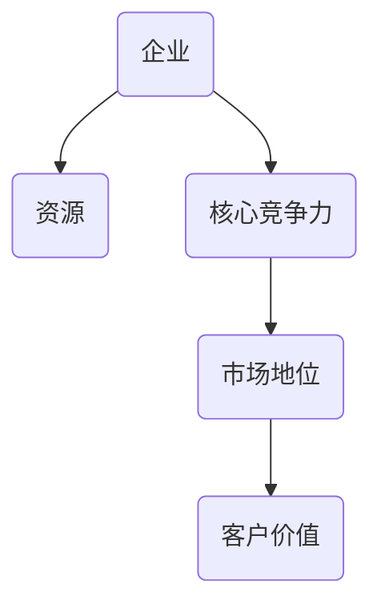
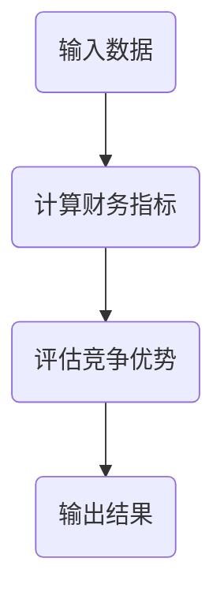
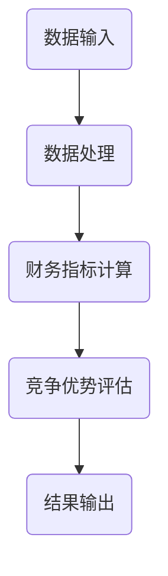

                 


# 费雪的竞争优势分析

> 关键词：费雪，竞争优势分析，投资策略，财务指标，企业分析

> 摘要：本文将从费雪的投资理念出发，系统地探讨竞争优势分析的核心概念、分析框架、算法原理、系统设计、项目实战及最佳实践。通过详细的理论分析和实际案例，帮助读者深入理解如何识别和评估企业的竞争优势，并将其应用于投资决策中。

---

## 第一部分: 费雪的竞争优势分析基础

### 第1章: 费雪的竞争优势分析概述

#### 1.1 费雪的投资理念与竞争优势分析

##### 1.1.1 费雪的成长型投资策略
彼得·费雪（Peter F. Drucker）是管理咨询领域的先驱，他提出的企业竞争优势理论对企业投资和管理具有重要影响。费雪强调，企业竞争优势的核心在于其独特的资源和能力，这些资源和能力能够使企业在市场上获得超额利润。

##### 1.1.2 企业竞争优势的定义
竞争优势是指企业在市场上相对于竞争对手的有利条件，包括成本优势、技术优势、品牌优势、客户关系等。竞争优势能够帮助企业在价格战中获胜，或者通过差异化策略吸引客户。

##### 1.1.3 费雪竞争优势分析的现实意义
在当今竞争激烈的市场环境中，竞争优势分析是企业制定战略决策的重要工具。通过对企业的竞争优势进行分析，投资者可以更好地识别具有长期增长潜力的企业。

---

#### 1.2 企业竞争优势的分类与特征

##### 1.2.1 成本优势
成本优势是企业通过更低的生产成本或运营成本，在价格上具有竞争力。例如，某制造企业通过规模化生产降低了单位产品的成本，从而在价格上具有竞争优势。

##### 1.2.2 差异化优势
差异化优势是指企业通过提供独特的产品或服务，使其在市场中与竞争对手区分开来。例如，高端品牌通过提供高品质的产品和服务，吸引愿意为溢价支付的客户。

##### 1.2.3 市场进入壁垒
市场进入壁垒是指新进入者在进入某个市场时面临的障碍。例如，专利权、品牌忠诚度、规模经济等都可以作为市场进入壁垒，保护现有企业免受竞争。

##### 1.2.4 竞争优势的动态变化
竞争优势并非一成不变，随着市场环境的变化，企业的竞争优势可能逐渐被竞争对手模仿或替代。因此，竞争优势的动态分析是企业战略管理的重要内容。

---

## 第2章: 竞争优势分析的核心概念与联系

### 2.1 竞争优势的核心要素

#### 2.1.1 企业资源分析
企业资源是竞争优势的物质基础，包括人力资源、财务资源、技术资源等。例如，拥有独特技术的企业在技术创新方面具有竞争优势。

#### 2.1.2 核心竞争力
核心竞争力是指企业在市场上难以被竞争对手模仿的独特能力。例如，某企业的研发团队具有独特的创新能力，使其在技术创新方面具有竞争优势。

#### 2.1.3 市场地位与客户价值
市场地位反映了企业在市场中的影响力，客户价值则是客户对企业产品或服务的感知价值。例如，知名品牌通过强大的市场地位和客户价值，能够在市场上获得更高的市场份额。

---

### 2.2 竞争优势的属性特征对比

#### 2.2.1 成本优势 vs. 差异化优势
| 属性 | 成本优势 | 差异化优势 |
|------|---------|------------|
| 核心 | 低成本生产 | 独特的产品或服务 |
| 适用场景 | 价格敏感型市场 | 高端市场或 niche 市场 |

#### 2.2.2 竞争优势的可持续性
竞争优势的可持续性取决于企业的资源和能力是否能够在较长的时间内保持其独特性。例如，拥有独特技术的企业在技术创新方面的竞争优势具有较高的可持续性。

#### 2.2.3 竞争优势的可衡量性
竞争优势的可衡量性是指企业能够通过定量或定性的方法对其竞争优势进行评估。例如，通过财务指标分析企业的成本优势，或通过客户调查评估品牌忠诚度。

---

### 2.3 ER实体关系图架构



---

## 第3章: 竞争优势分析的算法原理

### 3.1 竞争优势分析的数学模型

#### 3.1.1 杜邦分析法
杜邦分析法是一种常用的财务分析方法，用于评估企业的财务表现。其核心公式为：
$$ROE = \frac{Net\ Profit}{Equity} = \frac{Net\ Profit}{Sales} \times \frac{Sales}{Assets} \times \frac{Assets}{Equity}$$

#### 3.1.2 市场地位指数
市场地位指数用于衡量企业在市场中的地位，其计算公式为：
$$Market\ Position = \frac{市场份额}{行业平均市场份额}$$

---

### 3.2 竞争优势分析的算法流程



---

### 3.3 竞争优势分析的Python实现

```python
def calculate_roe(net_profit, equity):
    return net_profit / equity

# 示例数据
net_profit = 1000000  # 净利润（单位：元）
equity = 5000000      # 权益（单位：元）

roe = calculate_roe(net_profit, equity)
print(f"ROE = {roe:.2f}%")
```

---

## 第4章: 竞争优势分析的系统设计

### 4.1 竞争优势分析系统架构

#### 4.1.1 系统功能设计
- 数据输入与处理
- 财务指标计算
- 竞争优势评估
- 结果输出与可视化

#### 4.1.2 系统架构设计



---

## 第5章: 竞争优势分析的项目实战

### 5.1 项目背景与目标

#### 5.1.1 项目背景
通过分析某制造企业的竞争优势，评估其在市场中的地位。

#### 5.1.2 项目目标
识别企业的成本优势和差异化优势，制定相应的投资策略。

---

### 5.2 项目实施步骤

#### 5.2.1 环境安装
- 安装Python和相关库（如Pandas、Matplotlib）

#### 5.2.2 数据收集
- 收集企业的财务数据和市场数据

#### 5.2.3 数据分析与建模
- 计算财务指标（如ROE、ROA）
- 评估竞争优势

#### 5.2.4 结果展示
- 输出分析报告

---

## 第6章: 最佳实践与小结

### 6.1 最佳实践

#### 6.1.1 投资建议
- 选择具有可持续竞争优势的企业进行投资
- 定期评估企业的竞争优势变化

#### 6.1.2 风险管理
- 分散投资风险
- 定期监控市场环境变化

---

## 作者：AI天才研究院/AI Genius Institute & 禅与计算机程序设计艺术 /Zen And The Art of Computer Programming

